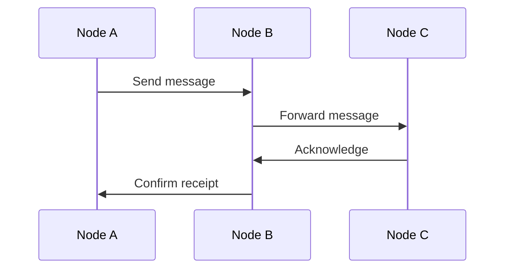

## 21.5. Testing Concurrent and Distributed Systems

Testing concurrent and distributed systems in Elixir presents unique challenges and opportunities. As expert developers, we must ensure our systems are robust, reliable, and capable of handling the complexities of concurrent operations and distributed architecture. This section will guide you through the intricacies of testing such systems using Elixir's powerful tools and techniques.

### Challenges in Testing Concurrent and Distributed Systems

Testing concurrent and distributed systems involves dealing with asynchronous behavior, timing issues, and ensuring tests are reliable and repeatable. Let's explore these challenges in detail:

1. **Asynchronous Behavior and Timing Issues:** In concurrent systems, processes run independently, leading to non-deterministic execution order. This can cause race conditions, deadlocks, and timing issues that are difficult to reproduce and test.

2. **Reliability and Repeatability:** Tests must consistently produce the same results, regardless of the system's state or external factors. Achieving this in a distributed environment requires careful control of dependencies and external interactions.

3. **Network Failures and Recovery:** Distributed systems must handle network partitions, latency, and failures gracefully. Testing these scenarios involves simulating network conditions and ensuring the system recovers correctly.

### Strategies for Testing Concurrent Systems

To effectively test concurrent systems, we need to adopt strategies that address these challenges:

#### Controlling Process Timing with Synchronous Calls

One way to manage asynchronous behavior is by using synchronous calls to control the timing of processes. This ensures that processes execute in a predictable order, reducing the likelihood of race conditions.

```elixir
defmodule MyConcurrentModule do
  def perform_task(pid) do
    send(pid, :start_task)
    receive do
      :task_completed -> :ok
    after
      5000 -> :timeout
    end
  end
end

defmodule MyConcurrentModuleTest do
  use ExUnit.Case

  test "perform_task completes successfully" do
    parent_pid = self()

    spawn(fn ->
      MyConcurrentModule.perform_task(parent_pid)
      send(parent_pid, :task_completed)
    end)

    assert_receive :task_completed, 5000
  end
end
```

In this example, we use `send` and `receive` to synchronize the execution of tasks, ensuring that the test waits for the task to complete before proceeding.

#### Using `ExUnit.CaptureLog` to Test Logged Messages

Testing log messages can be essential for verifying that the system behaves as expected. `ExUnit.CaptureLog` allows us to capture and assert on log messages.

```elixir
defmodule LoggerExample do
  require Logger

  def log_message do
    Logger.info("This is a log message")
  end
end

defmodule LoggerExampleTest do
  use ExUnit.Case
  import ExUnit.CaptureLog

  test "logs the expected message" do
    log = capture_log(fn ->
      LoggerExample.log_message()
    end)

    assert log =~ "This is a log message"
  end
end
```

By capturing logs, we can assert that specific messages are logged during execution, providing insight into the system's behavior.

### Testing Distributed Nodes

Testing distributed systems requires setting up environments with multiple nodes and simulating network conditions. Let's explore how to achieve this:

#### Setting Up Test Environments with Multiple Nodes

To test distributed systems, we need to simulate multiple nodes. Elixir's `Node` module allows us to create and manage nodes for testing purposes.

```elixir
defmodule DistributedTest do
  use ExUnit.Case

  setup do
    Node.start(:test_node, :shortnames)
    {:ok, _} = Node.connect(:another_node@localhost)
    :ok
  end

  test "nodes can communicate" do
    assert Node.list() == [:another_node@localhost]
  end
end
```

In this setup, we start a node and connect it to another node, allowing us to test communication and interactions between nodes.

#### Simulating Network Failures and Recovery

Simulating network failures is crucial for testing distributed systems. We can use tools like `:net_kernel` to simulate network partitions and test recovery mechanisms.

```elixir
defmodule NetworkFailureTest do
  use ExUnit.Case

  test "handles network partition" do
    Node.disconnect(:another_node@localhost)
    assert Node.list() == []

    Node.connect(:another_node@localhost)
    assert Node.list() == [:another_node@localhost]
  end
end
```

By disconnecting and reconnecting nodes, we can simulate network partitions and test the system's ability to recover from failures.

### Tools and Techniques

Elixir offers a variety of tools and techniques for testing concurrent and distributed systems. Let's explore some of these:

#### Using `:meck` for Mocking Erlang Modules

When testing distributed systems, we may need to mock Erlang modules to isolate dependencies and control external interactions. `:meck` is a powerful tool for creating mocks in Erlang and Elixir.

```elixir
defmodule MeckExampleTest do
  use ExUnit.Case

  setup do
    :meck.new(:erlang, [:passthrough])
    :meck.expect(:erlang, :now, fn -> {123, 456, 789} end)
    :ok
  end

  test "mocks erlang:now/0" do
    assert :erlang.now() == {123, 456, 789}
  end

  teardown do
    :meck.unload(:erlang)
  end
end
```

By mocking `:erlang.now/0`, we can control the return value and test how our system behaves with specific time values.

### Visualizing Concurrent and Distributed Systems

To better understand the flow and interactions in concurrent and distributed systems, we can use diagrams. Below is a sequence diagram illustrating communication between nodes in a distributed system.


```mermaid
sequenceDiagram
    participant A as Node A
    participant B as Node B
    participant C as Node C

    A->>B: Send message
    B->>C: Forward message
    C->>B: Acknowledge
    B->>A: Confirm receipt
```

**Figure 1:** Communication flow between nodes in a distributed system.

### Knowledge Check

Before we conclude, let's reinforce our learning with some questions and exercises:

- **Question:** What are the challenges of testing concurrent systems?
- **Exercise:** Modify the `perform_task` example to introduce a delay and test how it affects the synchronization.

### Embrace the Journey

Testing concurrent and distributed systems can be complex, but with the right strategies and tools, we can ensure our systems are robust and reliable. Remember, this is just the beginning. As you progress, you'll build more resilient systems. Keep experimenting, stay curious, and enjoy the journey!

## Quiz Time!



### What is a common challenge when testing concurrent systems?

- [x] Dealing with asynchronous behavior and timing issues.
- [ ] Ensuring the system is fast.
- [ ] Reducing code complexity.
- [ ] Improving user interface design.

> **Explanation:** Asynchronous behavior and timing issues are common challenges in concurrent systems due to non-deterministic execution order.

### Which tool can be used to capture log messages in Elixir tests?

- [x] ExUnit.CaptureLog
- [ ] Logger
- [ ] Mix
- [ ] GenServer

> **Explanation:** `ExUnit.CaptureLog` is used to capture and assert log messages in Elixir tests.

### How can you simulate network failures in distributed systems?

- [x] By disconnecting and reconnecting nodes.
- [ ] By increasing the system's load.
- [ ] By reducing the system's memory.
- [ ] By modifying the user interface.

> **Explanation:** Disconnecting and reconnecting nodes simulates network partitions and tests recovery mechanisms.

### What is a benefit of using synchronous calls in concurrent systems?

- [x] It ensures processes execute in a predictable order.
- [ ] It increases system performance.
- [ ] It reduces code complexity.
- [ ] It improves user experience.

> **Explanation:** Synchronous calls help control process timing, ensuring predictable execution order.

### Which tool can be used for mocking Erlang modules in Elixir?

- [x] :meck
- [ ] ExUnit
- [ ] Mix
- [ ] Logger

> **Explanation:** `:meck` is a tool for mocking Erlang modules, allowing control over external interactions.

### What is the purpose of setting up test environments with multiple nodes?

- [x] To simulate and test distributed system interactions.
- [ ] To improve code readability.
- [ ] To enhance system performance.
- [ ] To simplify code maintenance.

> **Explanation:** Multiple nodes simulate distributed system interactions, allowing for comprehensive testing.

### What does the `Node.connect/1` function do?

- [x] Connects the current node to another node.
- [ ] Disconnects the current node from another node.
- [ ] Starts a new node.
- [ ] Stops a running node.

> **Explanation:** `Node.connect/1` connects the current node to another node, facilitating communication.

### What is a key consideration when testing distributed systems?

- [x] Simulating network conditions and failures.
- [ ] Improving user interface design.
- [ ] Reducing code complexity.
- [ ] Enhancing system performance.

> **Explanation:** Simulating network conditions and failures is crucial for testing distributed systems' robustness.

### Which module in Elixir provides functions for managing nodes?

- [x] Node
- [ ] GenServer
- [ ] Logger
- [ ] Mix

> **Explanation:** The `Node` module provides functions for managing nodes in Elixir.

### True or False: Testing concurrent systems is straightforward and requires no special strategies.

- [ ] True
- [x] False

> **Explanation:** Testing concurrent systems involves unique challenges, requiring specific strategies and tools.


