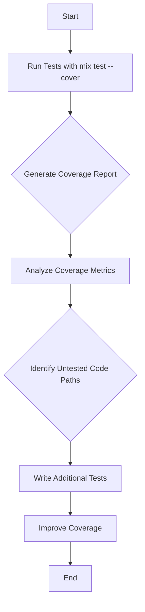

## 21.6. Code Coverage Analysis

In the realm of software development, ensuring that your code is thoroughly tested is paramount. Code coverage analysis is a critical aspect of this process, providing insights into which parts of your codebase are exercised by your tests. In this section, we will delve into the intricacies of code coverage analysis in Elixir, exploring tools, techniques, and best practices to enhance your software's reliability and maintainability.

### Measuring Test Coverage

Code coverage is a measure of how much of your code is executed when your tests run. In Elixir, the `mix` tool provides a straightforward way to assess code coverage using the `mix test.coverage` command. This tool helps you identify which parts of your code are covered by tests and which are not.

#### Using `mix test.coverage`

To get started with code coverage analysis in Elixir, follow these steps:

1. **Set Up Your Project**: Ensure your Elixir project is set up with a proper test suite using `ExUnit`.

2. **Run Coverage Analysis**: Execute the following command in your terminal:

   ```bash
   mix test --cover
   ```

   This command will run your test suite and generate a coverage report.

3. **View the Coverage Report**: After running the tests, a coverage report will be generated, typically in the `cover` directory of your project. Open the `index.html` file in a web browser to view a detailed report.

#### Understanding the Coverage Report

The coverage report provides a visual representation of your code's coverage. It highlights the lines of code that are covered by tests and those that are not. Here's a breakdown of what you might see:

- **Green Lines**: These lines are covered by tests.
- **Red Lines**: These lines are not covered by tests.
- **Coverage Percentage**: The report will also show the overall coverage percentage, indicating the proportion of your codebase that is tested.

### Interpreting Coverage Reports

Interpreting coverage reports is crucial for identifying untested code paths and understanding the effectiveness of your test suite.

#### Identifying Untested Code Paths

When analyzing a coverage report, pay attention to the red lines, which indicate untested code paths. These are areas where tests are either missing or insufficient. Focus on these sections to improve your test coverage.

#### Analyzing Coverage Metrics

Coverage reports often include various metrics, such as:

- **Line Coverage**: The percentage of lines executed by tests.
- **Function Coverage**: The percentage of functions executed by tests.
- **Branch Coverage**: The percentage of branches (e.g., `if` and `case` statements) executed by tests.

Each metric provides a different perspective on your code's coverage, helping you identify specific areas for improvement.

### Improving Coverage

Improving test coverage involves writing additional tests to cover untested code paths. Here are some strategies to enhance your coverage:

#### Writing Additional Tests

1. **Focus on Critical Paths**: Prioritize writing tests for critical code paths that are essential for your application's functionality.

2. **Test Edge Cases**: Ensure that edge cases and boundary conditions are tested, as these are often sources of bugs.

3. **Refactor for Testability**: If certain parts of your code are difficult to test, consider refactoring them to improve testability. This might involve breaking down complex functions into smaller, more manageable pieces.

#### Using Property-Based Testing

Property-based testing is a powerful technique for improving test coverage. It involves defining properties that your code should satisfy and automatically generating test cases to verify these properties. In Elixir, the `StreamData` library can be used for property-based testing.

#### Example: Property-Based Testing with StreamData

```elixir
defmodule MyModuleTest do
  use ExUnit.Case
  use ExUnitProperties

  property "reversing a list twice returns the original list" do
    check all list <- list_of(integer()) do
      assert Enum.reverse(Enum.reverse(list)) == list
    end
  end
end
```

In this example, we define a property that reversing a list twice should return the original list. The `check all` construct generates various lists of integers to test this property.

### Limitations of Code Coverage

While code coverage is a valuable metric, it's important to understand its limitations:

#### High Coverage Doesn't Guarantee Absence of Bugs

Achieving high code coverage is not synonymous with having a bug-free codebase. Coverage metrics only indicate which parts of your code are executed by tests, not whether the tests are effective in catching bugs.

#### Quality Over Quantity

Focus on the quality of your tests rather than just the quantity. Well-designed tests that cover critical paths and edge cases are more valuable than a large number of superficial tests.

### Visualizing Code Coverage

To better understand the flow of code coverage, let's visualize the process using a flowchart.



**Figure 1**: Visualizing the Code Coverage Analysis Process

### References and Links

- [Elixir Mix Tool Documentation](https://hexdocs.pm/mix/Mix.html)
- [ExUnit Testing Framework](https://hexdocs.pm/ex_unit/ExUnit.html)
- [StreamData for Property-Based Testing](https://hexdocs.pm/stream_data/StreamData.html)

### Knowledge Check

- What command is used to run code coverage analysis in Elixir?
- How can you identify untested code paths in a coverage report?
- Why is high code coverage not a guarantee of a bug-free codebase?

### Embrace the Journey

Remember, code coverage analysis is just one part of the testing and quality assurance process. As you continue to refine your skills, you'll discover more advanced techniques and tools to enhance your software's reliability. Keep experimenting, stay curious, and enjoy the journey!

## Quiz: Code Coverage Analysis



### What command is used to run code coverage analysis in Elixir?

- [x] mix test --cover
- [ ] mix test.coverage
- [ ] mix coverage
- [ ] mix analyze

> **Explanation:** The `mix test --cover` command is used to run code coverage analysis in Elixir.

### Which color in the coverage report indicates untested code?

- [ ] Green
- [x] Red
- [ ] Blue
- [ ] Yellow

> **Explanation:** Red lines in the coverage report indicate untested code paths.

### What does high code coverage indicate?

- [ ] Bug-free code
- [x] High proportion of code executed by tests
- [ ] All edge cases are tested
- [ ] Code is optimized

> **Explanation:** High code coverage indicates that a high proportion of the code is executed by tests, but it doesn't guarantee bug-free code.

### Which of the following is a limitation of code coverage?

- [x] High coverage doesn't guarantee absence of bugs
- [ ] It measures the quality of tests
- [ ] It ensures all edge cases are covered
- [ ] It provides detailed bug reports

> **Explanation:** High coverage doesn't guarantee the absence of bugs; it only shows which parts of the code are executed by tests.

### What is a strategy for improving test coverage?

- [x] Writing additional tests for uncovered areas
- [ ] Ignoring edge cases
- [ ] Reducing the number of tests
- [ ] Focusing only on line coverage

> **Explanation:** Writing additional tests for uncovered areas is a strategy to improve test coverage.

### What is the purpose of property-based testing?

- [x] To define properties and automatically generate test cases
- [ ] To manually write test cases for each property
- [ ] To focus on UI testing
- [ ] To reduce the number of tests

> **Explanation:** Property-based testing involves defining properties and automatically generating test cases to verify them.

### Which library in Elixir is used for property-based testing?

- [x] StreamData
- [ ] ExUnit
- [ ] Mix
- [ ] Phoenix

> **Explanation:** The `StreamData` library is used for property-based testing in Elixir.

### What does the `check all` construct do in property-based testing?

- [x] Generates various test cases to verify a property
- [ ] Checks all lines of code for coverage
- [ ] Ensures all functions are tested
- [ ] Verifies UI components

> **Explanation:** The `check all` construct generates various test cases to verify a property in property-based testing.

### What is the main focus when improving test coverage?

- [ ] Increasing the number of tests
- [x] Covering critical paths and edge cases
- [ ] Reducing test execution time
- [ ] Focusing on UI tests

> **Explanation:** The main focus when improving test coverage is covering critical paths and edge cases.

### True or False: Code coverage analysis guarantees a bug-free codebase.

- [ ] True
- [x] False

> **Explanation:** Code coverage analysis does not guarantee a bug-free codebase; it only indicates which parts of the code are executed by tests.


