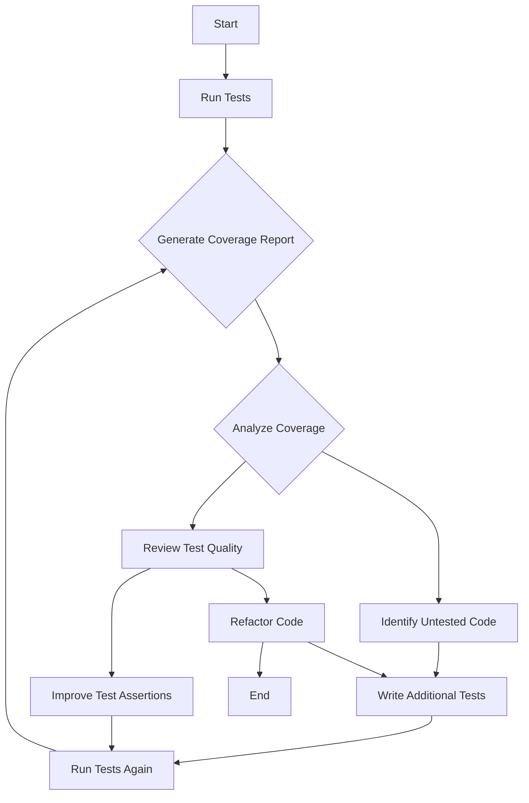

## 21.6. Code Coverage Analysis

In the realm of software development, ensuring that your code is thoroughly tested is paramount to delivering reliable and robust applications. Code coverage analysis is a critical component of this process, as it helps you understand which parts of your codebase are being tested and which are not. In this section, we will delve into the intricacies of code coverage analysis in Elixir, exploring tools, techniques, and best practices to maximize your test coverage.

### Measuring Test Coverage

Code coverage is a measure of how much of your source code is executed during testing. In Elixir, the `mix test.coverage` tool is commonly used to assess code coverage. This tool provides insights into which lines of code are executed when your test suite runs, allowing you to identify untested areas.

#### Using `mix test.coverage`

To begin measuring code coverage in your Elixir project, you need to ensure that your project is set up with a proper testing environment. Here's how you can use `mix test.coverage`:

1. **Set Up Your Project:**

   Ensure your Elixir project is initialized with `mix` and that you have a test suite in place. If not, you can create a new project with:

   ```bash
   mix new my_project --module MyProject
   ```

2. **Add Coverage Tooling:**

   In your `mix.exs` file, add the necessary dependencies for code coverage. The `excoveralls` library is a popular choice for generating coverage reports:

   ```elixir
   defp deps do
     [
       {:excoveralls, "~> 0.14", only: :test}
     ]
   end
   ```

   Run `mix deps.get` to fetch the dependencies.

3. **Run Coverage Analysis:**

   Execute the coverage tool with:

   ```bash
   mix test --cover
   ```

   This command runs your test suite and generates a coverage report, which you can view in your terminal.

4. **Generate Detailed Reports:**

   For more detailed reports, use `excoveralls` to create HTML reports:

   ```bash
   mix coveralls.html
   ```

   This command generates an HTML report in the `cover` directory, providing a visual representation of your code coverage.

#### Code Example

Here's a simple example of a test suite in Elixir:

```elixir
defmodule MyProject.Calculator do
  def add(a, b), do: a + b
  def subtract(a, b), do: a - b
end

defmodule MyProject.CalculatorTest do
  use ExUnit.Case

  test "addition" do
    assert MyProject.Calculator.add(1, 2) == 3
  end

  test "subtraction" do
    assert MyProject.Calculator.subtract(5, 3) == 2
  end
end
```

By running `mix test --cover`, you can see which lines of `Calculator` are covered by tests.

### Interpreting Coverage Reports

Once you have generated a coverage report, the next step is to interpret the results. Coverage reports typically highlight the percentage of code covered by tests and identify specific lines or functions that are not covered.

#### Identifying Untested Code Paths

Coverage reports often use color coding to indicate which lines of code are covered and which are not. Lines that are executed during tests are usually marked in green, while untested lines are marked in red. Here's how to interpret these results:

- **Green Lines:** These lines are executed during your tests. They are considered covered.
- **Red Lines:** These lines are not executed during your tests. They are considered uncovered and may require additional test cases.

##### Example Coverage Report

Consider the following simplified coverage report:

```
MyProject.Calculator
--------------------
add/2: 100% coverage
subtract/2: 50% coverage

Overall Coverage: 75%
```

In this example, the `add/2` function is fully covered, while `subtract/2` is only partially covered. This indicates that there may be edge cases or scenarios in `subtract/2` that are not tested.

### Improving Coverage

Improving code coverage involves writing additional tests to cover untested code paths. Here are some strategies to enhance your coverage:

#### Writing Additional Tests

1. **Identify Edge Cases:**

   Review your code to identify edge cases that may not be covered by existing tests. For example, consider boundary values, null inputs, and error conditions.

2. **Use Property-Based Testing:**

   Property-based testing, using libraries like `StreamData`, allows you to test a wide range of input values automatically. This can help uncover edge cases that you might not have considered.

3. **Refactor for Testability:**

   If certain parts of your code are difficult to test, consider refactoring them to improve testability. This might involve breaking down complex functions into smaller, more manageable pieces.

4. **Leverage Mocks and Stubs:**

   Use tools like `Mox` to create mocks and stubs for external dependencies. This can help you isolate the code under test and increase coverage.

#### Code Example: Adding Tests

Let's improve the coverage of the `subtract/2` function by adding additional tests:

```elixir
defmodule MyProject.CalculatorTest do
  use ExUnit.Case

  test "addition" do
    assert MyProject.Calculator.add(1, 2) == 3
  end

  test "subtraction" do
    assert MyProject.Calculator.subtract(5, 3) == 2
    assert MyProject.Calculator.subtract(0, 0) == 0
    assert MyProject.Calculator.subtract(-1, 1) == -2
  end
end
```

By adding these tests, we cover more scenarios and improve the overall coverage of the `subtract/2` function.

### Limitations of Code Coverage

While code coverage is a valuable metric, it's important to understand its limitations. High coverage does not guarantee the absence of bugs or that your tests are effective. Here are some considerations:

1. **Coverage vs. Quality:**

   Coverage measures how much code is executed, not whether the tests are meaningful. A high coverage percentage can be misleading if the tests do not assert correct behavior.

2. **False Sense of Security:**

   Relying solely on coverage can lead to a false sense of security. It's possible to have high coverage with poor test quality.

3. **Complexity and Maintainability:**

   Striving for 100% coverage can lead to complex and hard-to-maintain test suites. Focus on testing critical paths and edge cases instead.

4. **Dynamic Code:**

   Code that is dynamically generated or executed (e.g., through metaprogramming) may not be accurately reflected in coverage reports.

### Visualizing Code Coverage

To better understand code coverage, let's visualize the process using a flowchart. This diagram illustrates the steps involved in measuring and improving code coverage:


```mermaid
flowchart TD
    A[Start] --> B[Run Tests]
    B --> C{Generate Coverage Report}
    C --> D{Analyze Coverage}
    D --> E[Identify Untested Code]
    E --> F[Write Additional Tests]
    F --> G[Run Tests Again]
    G --> C
    D --> H[Review Test Quality]
    H --> I[Improve Test Assertions]
    I --> G
    H --> J[Refactor Code]
    J --> F
    J --> K[End]
```

**Figure 1:** A flowchart illustrating the process of measuring and improving code coverage in Elixir.

### References and Further Reading

- [ExCoveralls Documentation](https://github.com/parroty/excoveralls)
- [Elixir Testing with ExUnit](https://hexdocs.pm/ex_unit/ExUnit.html)
- [Property-Based Testing with StreamData](https://hexdocs.pm/stream_data/StreamData.html)

### Knowledge Check

To reinforce your understanding of code coverage analysis, consider the following questions:

1. What is the purpose of code coverage analysis in software testing?
2. How can you measure code coverage in an Elixir project?
3. What are some common limitations of code coverage as a metric?
4. How can you improve code coverage in your tests?
5. Why is it important to interpret coverage reports carefully?

### Embrace the Journey

Remember, code coverage analysis is just one tool in your testing arsenal. It's an ongoing process that requires continuous improvement and adaptation. As you progress, you'll develop more effective testing strategies and build more reliable software. Keep experimenting, stay curious, and enjoy the journey!

## Quiz Time!



### What is the primary purpose of code coverage analysis?

- [x] To measure how much of the source code is executed during testing.
- [ ] To identify syntax errors in the code.
- [ ] To optimize the performance of the code.
- [ ] To document the codebase.

> **Explanation:** Code coverage analysis measures the extent to which the source code is executed during testing, helping identify untested areas.

### Which tool is commonly used in Elixir for code coverage analysis?

- [x] mix test.coverage
- [ ] Dialyzer
- [ ] Credo
- [ ] Benchee

> **Explanation:** `mix test.coverage` is a tool used in Elixir to measure code coverage.

### What does a red line in a coverage report typically indicate?

- [x] The line is not executed during tests.
- [ ] The line contains a syntax error.
- [ ] The line is optimized for performance.
- [ ] The line is part of a deprecated feature.

> **Explanation:** In coverage reports, red lines indicate code that is not executed during tests.

### How can you improve code coverage in your tests?

- [x] Write additional tests for uncovered areas.
- [ ] Remove all existing tests.
- [ ] Focus only on performance optimization.
- [ ] Ignore edge cases.

> **Explanation:** Writing additional tests for uncovered areas helps improve code coverage.

### What is a limitation of code coverage as a metric?

- [x] High coverage does not guarantee the absence of bugs.
- [ ] It measures the performance of the code.
- [ ] It provides detailed documentation.
- [ ] It ensures the code follows best practices.

> **Explanation:** High code coverage does not necessarily mean the code is bug-free or that the tests are meaningful.

### What is the role of `excoveralls` in Elixir?

- [x] To generate detailed coverage reports.
- [ ] To optimize code performance.
- [ ] To refactor code automatically.
- [ ] To manage project dependencies.

> **Explanation:** `excoveralls` is used to generate detailed coverage reports in Elixir projects.

### Which of the following is a strategy to improve test coverage?

- [x] Identify and test edge cases.
- [ ] Focus solely on the main functionality.
- [ ] Ignore dynamic code paths.
- [ ] Avoid using mocks and stubs.

> **Explanation:** Identifying and testing edge cases is a strategy to improve test coverage.

### What does the `mix coveralls.html` command do?

- [x] It generates an HTML coverage report.
- [ ] It runs the tests in the browser.
- [ ] It optimizes the HTML files in the project.
- [ ] It compiles the project for production.

> **Explanation:** `mix coveralls.html` generates an HTML coverage report for easier visualization.

### Why is it important to review test quality in addition to coverage?

- [x] Because high coverage doesn't ensure meaningful tests.
- [ ] Because it automatically fixes bugs.
- [ ] Because it increases code execution speed.
- [ ] Because it reduces the size of the codebase.

> **Explanation:** Reviewing test quality is important because high coverage alone doesn't ensure the tests are meaningful or effective.

### True or False: Code coverage analysis can detect all bugs in the code.

- [ ] True
- [x] False

> **Explanation:** Code coverage analysis cannot detect all bugs; it only measures which parts of the code are executed during tests.


