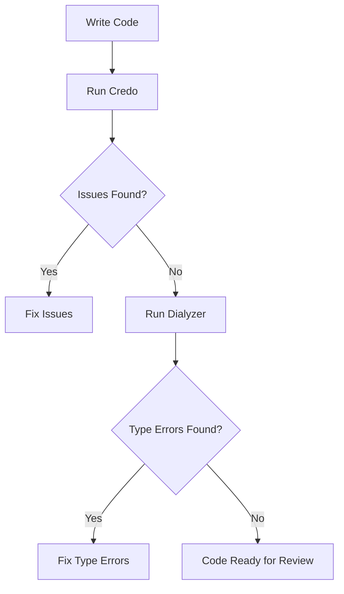

## 21.7. Static Code Analysis with Credo and Dialyzer

In the world of software development, maintaining code quality is paramount. Static code analysis tools like Credo and Dialyzer play a crucial role in ensuring that your Elixir codebase remains clean, efficient, and error-free. In this section, we'll delve into how these tools can be leveraged to enhance your Elixir projects.

### Using Credo for Linting

Credo is a static code analysis tool for the Elixir language that focuses on code consistency, readability, and potential issues. It acts as a linter, providing feedback on your code's style and structure.

#### Analyzing Code for Style Consistency and Potential Issues

Credo helps maintain a consistent coding style across your Elixir projects. It analyzes your codebase and flags issues related to:

- **Code Readability**: Ensures that your code is easy to read and understand.
- **Code Consistency**: Checks for consistent use of coding conventions.
- **Potential Bugs**: Identifies code patterns that might lead to bugs.
- **Complexity**: Highlights overly complex code that might be difficult to maintain.

Here's a simple example of how Credo can be used to analyze an Elixir project:

```elixir
# Example Elixir module with potential issues
defmodule Example do
  def calculate(a, b) do
    a + b
  end

  def unused_function do
    IO.puts("This function is never called")
  end
end
```

Running Credo on this module might flag the `unused_function` as an issue, suggesting its removal if it's not needed.

#### Configuring Rules and Priorities

Credo is highly configurable, allowing you to tailor its rules and priorities to fit your project's needs. You can create a `.credo.exs` configuration file in your project root to customize Credo's behavior.

```elixir
%{
  configs: [
    %{
      name: "default",
      files: %{
        included: ["lib/", "src/"],
        excluded: ["test/"]
      },
      checks: [
        {Credo.Check.Readability.ModuleDoc, false},
        {Credo.Check.Design.DuplicatedCode, priority: :low}
      ]
    }
  ]
}
```

In this configuration, we've disabled the `ModuleDoc` check and set the `DuplicatedCode` check to a low priority. This flexibility allows you to focus on the issues that matter most to your team.

### Type Checking with Dialyzer

Dialyzer is a static analysis tool that identifies software discrepancies such as type errors, unreachable code, and unnecessary tests in your Elixir applications. Unlike traditional type checkers, Dialyzer uses a technique called success typing, which is more permissive and less intrusive.

#### Performing Static Analysis to Find Type Errors

Dialyzer analyzes your code to find type inconsistencies and potential runtime errors. It doesn't require explicit type annotations, but it can leverage them if provided. Here's how you can use Dialyzer to analyze an Elixir module:

```elixir
defmodule Math do
  @spec add(integer, integer) :: integer
  def add(a, b) do
    a + b
  end

  @spec divide(integer, integer) :: {:ok, float} | {:error, String.t()}
  def divide(_a, 0), do: {:error, "Cannot divide by zero"}
  def divide(a, b), do: {:ok, a / b}
end
```

Running Dialyzer on this module will ensure that the function specifications (`@spec`) are consistent with the actual implementation.

#### Writing Typespecs to Aid Dialyzer's Analysis

Typespecs are annotations that describe the types of function arguments and return values. They help Dialyzer understand your code better and provide more accurate analysis. Here's an example of using typespecs in an Elixir module:

```elixir
defmodule User do
  @type t :: %User{name: String.t(), age: non_neg_integer}

  @spec new(String.t(), non_neg_integer) :: t
  def new(name, age) do
    %User{name: name, age: age}
  end
end
```

By providing typespecs, you enable Dialyzer to catch discrepancies between your function definitions and their intended use.

### Benefits of Static Code Analysis

Static code analysis with Credo and Dialyzer offers several benefits:

- **Catching Bugs Early**: Identifying potential issues before they become bugs in production.
- **Maintaining Code Quality**: Ensuring that your code adheres to best practices and coding standards.
- **Improving Readability**: Making your code easier to read and understand for current and future developers.
- **Facilitating Refactoring**: Providing confidence when making changes to the codebase.

### Visualizing the Workflow

Let's visualize the workflow of using Credo and Dialyzer in your development process:



This flowchart illustrates how Credo and Dialyzer fit into the development cycle, helping you catch issues early and maintain high code quality.

### Try It Yourself

To get hands-on experience with Credo and Dialyzer, try the following exercises:

1. **Install Credo and Dialyzer**: Add them to your Elixir project by updating your `mix.exs` file.

2. **Analyze Your Code**: Run Credo and Dialyzer on your existing projects to identify potential issues.

3. **Customize Credo**: Create a `.credo.exs` file and configure it to focus on the checks that matter most to your team.

4. **Add Typespecs**: Enhance your code with typespecs and observe how Dialyzer's analysis improves.

### Knowledge Check

- What are the primary functions of Credo and Dialyzer in an Elixir project?
- How can you customize Credo's behavior to fit your project's needs?
- What are typespecs, and how do they aid Dialyzer's analysis?
- Why is static code analysis important for maintaining code quality?

### Embrace the Journey

Remember, mastering static code analysis is a journey. As you integrate Credo and Dialyzer into your workflow, you'll gain insights into your codebase that will help you write cleaner, more maintainable code. Keep experimenting, stay curious, and enjoy the process!

## Quiz: Static Code Analysis with Credo and Dialyzer



### What is the primary purpose of Credo in Elixir projects?

- [x] To analyze code for style consistency and potential issues
- [ ] To compile Elixir code
- [ ] To manage project dependencies
- [ ] To execute unit tests

> **Explanation:** Credo is a static code analysis tool that focuses on code style and potential issues.

### How does Dialyzer differ from traditional type checkers?

- [x] It uses success typing, which is more permissive
- [ ] It requires explicit type annotations
- [ ] It only checks for syntax errors
- [ ] It compiles code faster

> **Explanation:** Dialyzer uses success typing, which is less intrusive than traditional type checking.

### What file is used to configure Credo's behavior?

- [x] .credo.exs
- [ ] mix.exs
- [ ] config.exs
- [ ] credo.config

> **Explanation:** The `.credo.exs` file is used to customize Credo's rules and priorities.

### What are typespecs used for in Elixir?

- [x] To describe the types of function arguments and return values
- [ ] To define module attributes
- [ ] To specify database schemas
- [ ] To configure application settings

> **Explanation:** Typespecs provide type information for functions, aiding Dialyzer's analysis.

### Which of the following is a benefit of using static code analysis tools like Credo and Dialyzer?

- [x] Catching bugs early in the development process
- [x] Maintaining code quality and standards
- [ ] Increasing code execution speed
- [ ] Reducing the size of the codebase

> **Explanation:** Static code analysis helps catch bugs early and maintain code quality.

### What does the flowchart in the article illustrate?

- [x] The workflow of using Credo and Dialyzer in development
- [ ] The process of compiling Elixir code
- [ ] The steps to deploy an Elixir application
- [ ] The lifecycle of an Elixir process

> **Explanation:** The flowchart shows how Credo and Dialyzer fit into the development cycle.

### What is the role of the `@spec` attribute in Elixir?

- [x] To define function typespecs
- [ ] To declare module dependencies
- [ ] To specify environment variables
- [ ] To configure logging levels

> **Explanation:** The `@spec` attribute is used to define typespecs for functions.

### How can you run Credo on an Elixir project?

- [x] By executing `mix credo` in the terminal
- [ ] By adding it to the `mix.exs` file
- [ ] By running `mix compile`
- [ ] By executing `mix test`

> **Explanation:** `mix credo` is the command used to run Credo on an Elixir project.

### What does Dialyzer check for in Elixir code?

- [x] Type errors and unreachable code
- [ ] Code style and formatting
- [ ] Database schema consistency
- [ ] Network connectivity issues

> **Explanation:** Dialyzer checks for type errors and unreachable code in Elixir applications.

### True or False: Credo can be configured to ignore certain files or directories.

- [x] True
- [ ] False

> **Explanation:** Credo can be configured to include or exclude specific files and directories.


