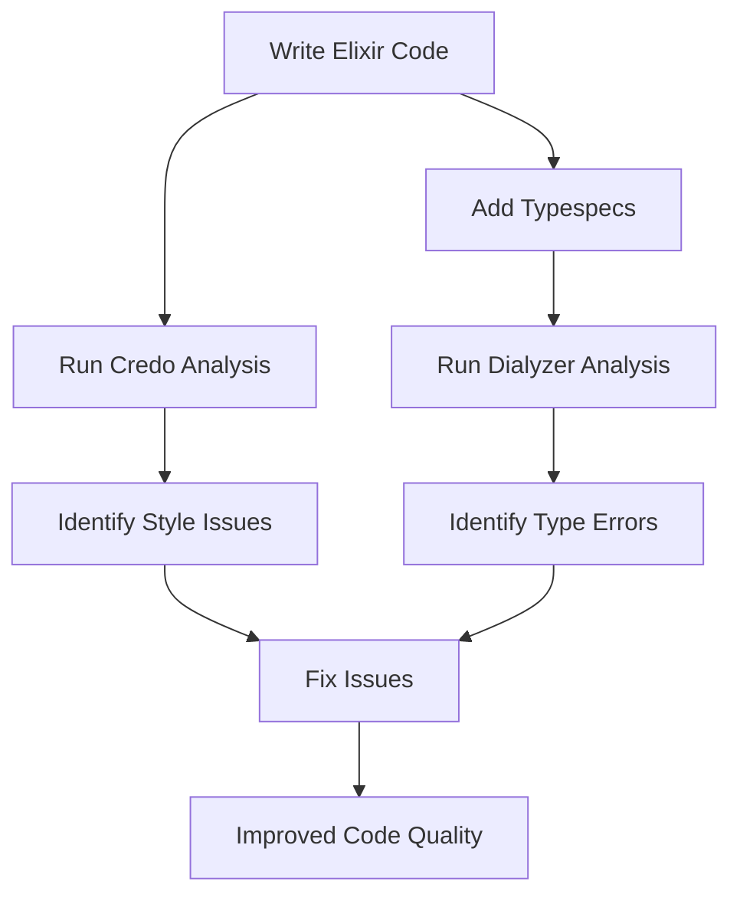

## 21.7. Static Code Analysis with Credo and Dialyzer

Static code analysis is an essential practice in modern software development, enabling developers to identify potential issues in their codebase without executing the program. In the Elixir ecosystem, two powerful tools for static analysis are Credo and Dialyzer. This section will guide you through using these tools to enhance your code quality and maintainability.

### Using Credo for Linting

Credo is a static code analysis tool that focuses on code consistency, readability, and potential issues. It acts as a linter for Elixir, helping developers maintain a clean and idiomatic codebase.

#### Analyzing Code for Style Consistency and Potential Issues

Credo analyzes your code to ensure it adheres to community standards and best practices. It checks for common issues such as:

- **Code readability**: Ensuring your code is easy to read and understand.
- **Code complexity**: Identifying complex code that may be difficult to maintain.
- **Potential bugs**: Highlighting code patterns that could lead to errors.

Here's a simple example of how Credo can be used:

```elixir
# Example Elixir code with potential issues
defmodule Example do
  def add(a, b) do
    a + b
  end

  def subtract(a, b) do
    a - b
  end

  def unused_function do
    IO.puts("This function is never called")
  end
end
```

When running Credo on this code, it might highlight the `unused_function` as an issue because it is defined but never used.

#### Configuring Rules and Priorities

Credo allows you to configure which rules it should enforce and at what priority level. You can customize these settings in the `.credo.exs` configuration file:

```elixir
# .credo.exs configuration file
%{
  configs: [
    %{
      name: "default",
      files: %{
        included: ["lib/", "src/"],
        excluded: ["test/"]
      },
      requires: [],
      strict: true,
      color: true,
      checks: [
        {Credo.Check.Readability.ModuleDoc, priority: :high},
        {Credo.Check.Refactor.Nesting, priority: :medium},
        {Credo.Check.Design.DuplicatedCode, priority: :low}
      ]
    }
  ]
}
```

In this configuration, we specify the directories to include and exclude, set the priority for different checks, and enable strict mode for more rigorous analysis.

#### Try It Yourself

Experiment with Credo by modifying the example code above. Add more functions or introduce intentional issues, and observe how Credo responds. This hands-on practice will deepen your understanding of Credo's capabilities.

### Type Checking with Dialyzer

Dialyzer is a static analysis tool that identifies type inconsistencies, unreachable code, and other discrepancies in your Elixir code. It leverages the Erlang VM's type system to perform its analysis.

#### Performing Static Analysis to Find Type Errors

Dialyzer requires that you write typespecs for your functions. These specifications help Dialyzer understand the expected types of function arguments and return values.

Here's a simple example:

```elixir
defmodule Math do
  @spec add(integer, integer) :: integer
  def add(a, b) do
    a + b
  end

  @spec subtract(integer, integer) :: integer
  def subtract(a, b) do
    a - b
  end
end
```

In this example, we've added typespecs to the `add` and `subtract` functions. Dialyzer will use these specs to check for type errors.

#### Writing Typespecs to Aid Dialyzer's Analysis

Typespecs are a way to declare the types of function arguments and return values. They are written using the `@spec` attribute, followed by the function signature and its expected types.

```elixir
@spec function_name(arg1_type, arg2_type) :: return_type
```

For example, if you have a function that takes a string and returns a boolean, the typespec would look like this:

```elixir
@spec is_valid(String.t()) :: boolean
```

#### Try It Yourself

Modify the `Math` module to include a function that intentionally mismatches types, such as returning a string instead of an integer. Run Dialyzer to see how it detects the error.

### Benefits of Static Code Analysis

Using Credo and Dialyzer in your Elixir projects offers several benefits:

- **Catching bugs early**: Static analysis helps identify potential issues before they become bugs in production.
- **Maintaining code quality**: Consistent style and adherence to best practices improve code readability and maintainability.
- **Ensuring type safety**: Dialyzer's type checking helps prevent type-related errors, leading to more robust code.

### Visualizing the Workflow

To better understand the workflow of using Credo and Dialyzer, let's visualize it using a flowchart.


```mermaid
graph TD;
    A[Write Elixir Code] --> B[Run Credo Analysis];
    B --> C[Identify Style Issues];
    A --> D[Add Typespecs];
    D --> E[Run Dialyzer Analysis];
    E --> F[Identify Type Errors];
    C --> G[Fix Issues];
    F --> G;
    G --> H[Improved Code Quality];
```

This flowchart illustrates how Credo and Dialyzer fit into the development process, highlighting their roles in improving code quality.

### Knowledge Check

Before we move on, let's reinforce what we've learned with a few questions:

- What is the primary purpose of Credo in Elixir projects?
- How does Dialyzer help in maintaining type safety?
- Can you explain how typespecs are used in Elixir?

### Embrace the Journey

Remember, mastering static code analysis is a journey. As you continue to use Credo and Dialyzer, you'll gain deeper insights into your code and improve your development practices. Keep experimenting, stay curious, and enjoy the process!

### References and Links

For further reading and resources, consider exploring:

- [Credo GitHub Repository](https://github.com/rrrene/credo)
- [Dialyzer Documentation](https://erlang.org/doc/man/dialyzer.html)
- [Elixir's Official Documentation](https://elixir-lang.org/docs.html)

## Quiz Time!



### What is the primary purpose of Credo in Elixir projects?

- [x] To analyze code for style consistency and potential issues
- [ ] To compile Elixir code
- [ ] To execute Elixir code
- [ ] To manage dependencies

> **Explanation:** Credo is used for linting, ensuring code style consistency, and identifying potential issues.

### How does Dialyzer help in maintaining type safety?

- [x] By performing static analysis to find type errors
- [ ] By executing code to find runtime errors
- [ ] By formatting code according to style guides
- [ ] By managing project dependencies

> **Explanation:** Dialyzer performs static analysis to identify type inconsistencies and other discrepancies.

### What is a typespec in Elixir?

- [x] A specification that declares the types of function arguments and return values
- [ ] A tool for formatting code
- [ ] A package manager for Elixir
- [ ] A testing framework for Elixir

> **Explanation:** Typespecs are used to declare the expected types for function arguments and return values.

### Which tool would you use to check for code readability issues?

- [x] Credo
- [ ] Dialyzer
- [ ] Mix
- [ ] ExUnit

> **Explanation:** Credo is designed to analyze code for readability, style, and potential issues.

### Can Dialyzer detect runtime errors?

- [ ] Yes
- [x] No

> **Explanation:** Dialyzer performs static analysis and cannot detect runtime errors.

### What is the role of the `.credo.exs` file?

- [x] To configure Credo's rules and priorities
- [ ] To define typespecs for Dialyzer
- [ ] To manage project dependencies
- [ ] To execute Elixir code

> **Explanation:** The `.credo.exs` file is used to configure Credo's analysis rules and priorities.

### How can you customize Credo's behavior?

- [x] By editing the `.credo.exs` configuration file
- [ ] By writing typespecs
- [ ] By using Mix tasks
- [ ] By importing external libraries

> **Explanation:** Credo's behavior is customized through the `.credo.exs` configuration file.

### What does the `@spec` attribute do in Elixir?

- [x] It declares the types of function arguments and return values
- [ ] It formats code
- [ ] It executes tests
- [ ] It manages dependencies

> **Explanation:** The `@spec` attribute is used to declare typespecs for functions.

### Which of the following is a benefit of using static code analysis?

- [x] Catching bugs early in the development process
- [ ] Increasing code execution speed
- [ ] Reducing project dependencies
- [ ] Automatically deploying applications

> **Explanation:** Static code analysis helps identify issues early, improving code quality and reducing bugs.

### Is it possible to use both Credo and Dialyzer in the same project?

- [x] True
- [ ] False

> **Explanation:** Both Credo and Dialyzer can be used together to enhance code quality and maintainability.



By mastering Credo and Dialyzer, you can significantly improve the quality and reliability of your Elixir code. Embrace these tools as part of your development process, and you'll be well on your way to writing cleaner, more maintainable code.
