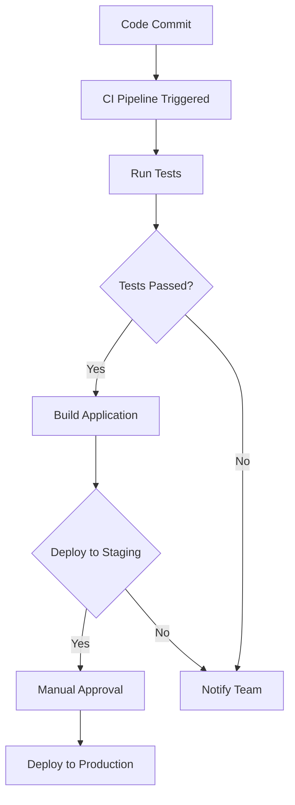

## 21.8. Continuous Integration and Deployment

Continuous Integration (CI) and Continuous Deployment (CD) are essential practices in modern software development, ensuring that code changes are automatically tested and deployed. In this section, we will explore how to set up CI/CD pipelines for Elixir applications, automate builds and tests, and implement deployment automation. We will also discuss best practices to keep your pipelines efficient and reliable.

### Setting Up CI Pipelines

Setting up a CI pipeline involves automating the process of integrating code changes from multiple contributors into a shared repository. This is crucial for maintaining code quality and ensuring that new changes do not break existing functionality.

#### Choosing a CI Tool

There are several CI tools available that can be used with Elixir applications, including:

- **Travis CI**: A popular CI service that integrates well with GitHub and offers a straightforward setup for Elixir projects.
- **GitHub Actions**: Provides a flexible way to automate workflows directly within GitHub repositories.
- **CircleCI**: Known for its speed and efficiency, CircleCI offers robust support for Elixir applications.

Let's look at how to set up a basic CI pipeline using GitHub Actions.

#### Setting Up GitHub Actions for Elixir

GitHub Actions allows you to automate your workflow directly within your GitHub repository. Here's a simple example of a GitHub Actions workflow for an Elixir project:

```yaml
name: Elixir CI

on:
  push:
    branches:
      - main
  pull_request:
    branches:
      - main

jobs:
  build:
    runs-on: ubuntu-latest

    strategy:
      matrix:
        elixir: [1.12]
        otp: [24.0]

    steps:
    - uses: actions/checkout@v2
    - name: Set up Elixir
      uses: erlef/setup-beam@v1
      with:
        elixir-version: ${{ matrix.elixir }}
        otp-version: ${{ matrix.otp }}
    - name: Install Dependencies
      run: mix deps.get
    - name: Run Tests
      run: mix test
```

**Explanation:**

- **Triggering Events**: The workflow is triggered on pushes and pull requests to the `main` branch.
- **Matrix Strategy**: This allows testing against multiple versions of Elixir and OTP.
- **Steps**: The workflow checks out the code, sets up the Elixir environment, installs dependencies, and runs tests.

### Automated Builds and Tests

Automating builds and tests is a core component of CI. It ensures that every change is validated by running a suite of tests, providing immediate feedback to developers.

#### Running the Test Suite

In Elixir, the `mix test` command is used to run tests. It's crucial to ensure that your test suite is comprehensive and covers all critical paths of your application.

**Example Test File:**

```elixir
defmodule MyApp.SampleTest do
  use ExUnit.Case
  doctest MyApp.Sample

  test "greets the world" do
    assert MyApp.Sample.hello() == :world
  end
end
```

**Key Points:**

- **Comprehensive Testing**: Ensure that your tests cover edge cases and potential failure points.
- **Fast Feedback**: Keep tests fast to provide quick feedback to developers.

### Deployment Automation

Deployment automation involves automatically deploying code changes to staging or production environments after passing all tests. This reduces the risk of human error and speeds up the release process.

#### Implementing Continuous Deployment

Continuous Deployment (CD) can be achieved by integrating deployment scripts into your CI pipeline. Here's an example of how you might set up a deployment step in GitHub Actions:

```yaml
- name: Deploy to Production
  if: github.ref == 'refs/heads/main' && github.event_name == 'push'
  run: |
    ssh user@your-server "cd /path/to/app && git pull && mix deps.get && mix compile && mix phx.server"
```

**Explanation:**

- **Conditional Deployment**: The deployment step runs only on pushes to the `main` branch.
- **Remote Execution**: The script connects to a remote server, pulls the latest code, installs dependencies, compiles the application, and starts the server.

### Best Practices

To ensure your CI/CD pipelines are efficient and reliable, consider the following best practices:

- **Keep Pipelines Fast**: Optimize your test suite and build process to minimize execution time.
- **Notify Teams**: Use notifications to alert teams of build status and failures, enabling quick responses to issues.
- **Secure Secrets**: Manage sensitive information like API keys and passwords securely within your CI/CD tool.
- **Monitor Pipeline Performance**: Regularly review pipeline performance and make adjustments to improve efficiency.

### Visualizing CI/CD Workflow

Below is a diagram illustrating a typical CI/CD workflow for an Elixir application:



**Diagram Explanation:**

- **Code Commit**: Triggers the CI pipeline.
- **Run Tests**: Executes the test suite.
- **Deploy to Staging**: Deploys the application to a staging environment if tests pass.
- **Manual Approval**: Requires manual approval before deploying to production.
- **Notify Team**: Alerts the team if tests fail or deployment issues occur.

### Try It Yourself

To get hands-on experience, try setting up a CI/CD pipeline for a sample Elixir project. Experiment with different CI tools and deployment strategies. Modify the provided GitHub Actions workflow to include additional steps, such as linting or code coverage analysis.

### Knowledge Check

1. **What are the benefits of using CI/CD in Elixir projects?**
2. **How can you optimize your test suite for faster feedback?**
3. **What security considerations should you keep in mind when setting up CI/CD pipelines?**

### Summary

In this section, we explored the essentials of setting up Continuous Integration and Deployment for Elixir applications. We covered the setup of CI pipelines using GitHub Actions, automated builds and tests, and deployment automation. By following best practices, you can ensure that your CI/CD pipelines are efficient, reliable, and secure.

Remember, mastering CI/CD is a journey. As you gain experience, you'll discover new ways to optimize and enhance your workflows. Keep experimenting, stay curious, and enjoy the process!

## Quiz: Continuous Integration and Deployment



### What is the primary goal of Continuous Integration?

- [x] To integrate code changes frequently and automatically test them
- [ ] To deploy code changes to production immediately
- [ ] To manually review code changes before integration
- [ ] To ensure code changes are only integrated once a week

> **Explanation:** Continuous Integration aims to integrate code changes frequently and automatically test them to ensure they do not break existing functionality.

### Which CI tool is integrated directly within GitHub repositories?

- [x] GitHub Actions
- [ ] Travis CI
- [ ] CircleCI
- [ ] Jenkins

> **Explanation:** GitHub Actions is a CI tool that is integrated directly within GitHub repositories, allowing for automation of workflows.

### What command is used to run tests in an Elixir project?

- [x] mix test
- [ ] mix run
- [ ] elixir test
- [ ] iex -S mix

> **Explanation:** The `mix test` command is used to run tests in an Elixir project.

### What is a key benefit of automating deployments?

- [x] Reducing the risk of human error
- [ ] Increasing manual intervention
- [ ] Slowing down the release process
- [ ] Making deployments more complex

> **Explanation:** Automating deployments reduces the risk of human error and speeds up the release process.

### What should you do if a test fails in your CI pipeline?

- [x] Notify the team and fix the issue
- [ ] Ignore the failure and proceed
- [ ] Manually deploy the code
- [ ] Disable the test

> **Explanation:** If a test fails, it's important to notify the team and fix the issue before proceeding with deployment.

### Which of the following is a best practice for CI/CD pipelines?

- [x] Keeping pipelines fast and reliable
- [ ] Running tests only once a month
- [ ] Notifying teams only for successful builds
- [ ] Storing secrets in plain text

> **Explanation:** Keeping pipelines fast and reliable is a best practice for CI/CD pipelines.

### What is the purpose of the matrix strategy in GitHub Actions?

- [x] To test against multiple versions of Elixir and OTP
- [ ] To deploy to multiple environments simultaneously
- [ ] To notify multiple teams of build status
- [ ] To run tests in parallel on the same version

> **Explanation:** The matrix strategy in GitHub Actions allows testing against multiple versions of Elixir and OTP.

### What is a common trigger for a CI pipeline?

- [x] Code commit
- [ ] Manual deployment
- [ ] Weekly schedule
- [ ] Monthly review

> **Explanation:** A code commit is a common trigger for a CI pipeline, initiating the integration and testing process.

### What is the role of manual approval in a CI/CD pipeline?

- [x] To ensure human oversight before deploying to production
- [ ] To automate the deployment process
- [ ] To speed up the release process
- [ ] To eliminate the need for testing

> **Explanation:** Manual approval ensures human oversight before deploying to production, adding an extra layer of verification.

### True or False: Continuous Deployment automatically deploys code changes to production after passing tests.

- [x] True
- [ ] False

> **Explanation:** Continuous Deployment automatically deploys code changes to production after they pass all tests, ensuring a streamlined release process.


