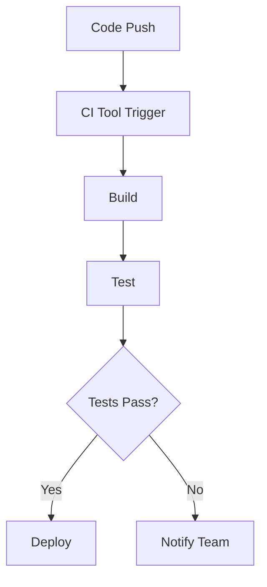
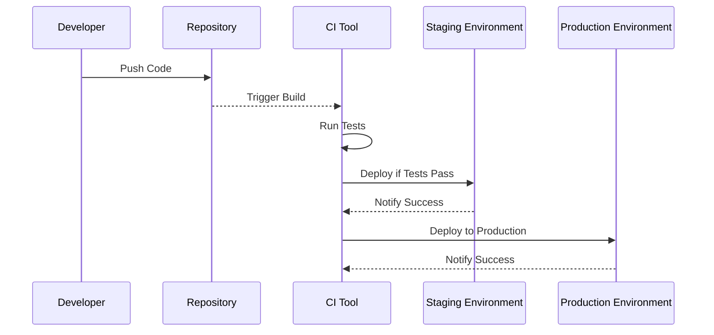

## 21.8. Continuous Integration and Deployment

In the rapidly evolving world of software development, Continuous Integration (CI) and Continuous Deployment (CD) have become essential practices for maintaining high-quality code and delivering features swiftly. In this section, we delve into the intricacies of setting up CI/CD pipelines for Elixir projects, ensuring automated testing, seamless builds, and efficient deployment processes.

### Setting Up CI Pipelines

Continuous Integration is the practice of merging all developers' working copies to a shared mainline several times a day. The key to successful CI is automation. Let's explore how to set up CI pipelines using popular tools like Travis CI, GitHub Actions, and CircleCI.

#### Automating Tests with CI Tools

**Travis CI**: A cloud-based CI service that integrates seamlessly with GitHub repositories. It automates the process of running tests and deploying applications.

**GitHub Actions**: Provides a way to automate workflows directly within GitHub. It allows you to build, test, and deploy your code right from your repository.

**CircleCI**: Known for its speed and flexibility, CircleCI offers powerful features for automating tests and deployments.

Here's a basic example of a `.travis.yml` file for an Elixir project:

```yaml
language: elixir
elixir:
  - '1.12'
otp_release:
  - '24.0'
script:
  - mix test
```

**Explanation**: This configuration specifies the Elixir version and OTP release to use. It runs the `mix test` command to execute your test suite.

#### Visualizing CI Pipeline


```mermaid
flowchart TD
    A[Code Push] --> B[CI Tool Trigger]
    B --> C[Build]
    C --> D[Test]
    D --> E{Tests Pass?}
    E -->|Yes| F[Deploy]
    E -->|No| G[Notify Team]
```

**Description**: This diagram illustrates a typical CI pipeline. Code is pushed to a repository, triggering the CI tool to build and test the application. If tests pass, the code is deployed; otherwise, the team is notified of failures.

### Automated Builds and Tests

Automated builds and tests are crucial for ensuring that new code changes do not break existing functionality. Let's explore how to implement these processes effectively.

#### Running the Test Suite on Every Code Push

By configuring your CI tool to run the test suite on every code push, you ensure that all code changes are verified immediately. This helps catch bugs early and maintain code quality.

Here's an example of a GitHub Actions workflow file:

```yaml
name: Elixir CI

on:
  push:
    branches:
      - main

jobs:
  build:
    runs-on: ubuntu-latest

    steps:
    - uses: actions/checkout@v2
    - name: Set up Elixir
      uses: actions/setup-elixir@v1
      with:
        elixir-version: '1.12'
        otp-version: '24.0'
    - name: Install dependencies
      run: mix deps.get
    - name: Run tests
      run: mix test
```

**Explanation**: This workflow triggers on pushes to the `main` branch. It checks out the code, sets up the Elixir environment, installs dependencies, and runs the test suite.

### Deployment Automation

Deployment automation is the process of automatically deploying code to staging or production environments. This ensures that new features and bug fixes reach users quickly and reliably.

#### Implementing Continuous Deployment

Continuous Deployment extends CI by automatically deploying code that passes the test suite. This can be achieved using tools like Heroku, AWS CodePipeline, or custom scripts.

Here's a basic example of a deployment script using Heroku:

```bash
#!/bin/bash

set -e

echo "Deploying to Heroku..."
git push heroku main
```

**Explanation**: This script pushes the `main` branch to Heroku, triggering a deployment.

#### Visualizing Deployment Workflow


```mermaid
sequenceDiagram
    participant Dev as Developer
    participant Repo as Repository
    participant CI as CI Tool
    participant Staging as Staging Environment
    participant Prod as Production Environment

    Dev->>Repo: Push Code
    Repo-->>CI: Trigger Build
    CI->>CI: Run Tests
    CI->>Staging: Deploy if Tests Pass
    Staging-->>CI: Notify Success
    CI->>Prod: Deploy to Production
    Prod-->>CI: Notify Success
```

**Description**: This sequence diagram shows the deployment workflow. Code is pushed to the repository, triggering the CI tool to build and test. If successful, the code is deployed to staging and then to production.

### Best Practices

To ensure your CI/CD pipelines are effective, consider the following best practices:

- **Keep Pipelines Fast and Reliable**: Optimize your build and test processes to minimize execution time. Use caching and parallelization to speed up workflows.
- **Notify Teams of Build Status and Failures**: Integrate notifications with tools like Slack or email to keep your team informed of build status and failures.
- **Secure Your Pipelines**: Protect sensitive data and credentials used in your pipelines. Use environment variables and secret management tools.
- **Monitor and Optimize**: Continuously monitor your pipelines for performance and reliability. Use metrics and logs to identify bottlenecks and areas for improvement.

### Try It Yourself

Experiment with setting up a CI/CD pipeline for an Elixir project. Modify the provided examples to suit your project's needs. Try integrating additional tools or services, such as Docker for containerization or Terraform for infrastructure as code.

### Knowledge Check

- What are the benefits of automating tests with CI tools?
- How can deployment automation improve the software delivery process?
- What are some best practices for maintaining reliable CI/CD pipelines?

### Embrace the Journey

Remember, mastering CI/CD is a journey. As you implement these practices, you'll gain insights into how to optimize and improve your workflows. Stay curious, experiment with new tools, and enjoy the process of delivering high-quality software efficiently.

## Quiz Time!



### What is the primary purpose of Continuous Integration?

- [x] To merge code changes frequently and run automated tests
- [ ] To deploy code to production environments
- [ ] To manage project dependencies
- [ ] To write documentation for the project

> **Explanation:** Continuous Integration focuses on merging code changes frequently and running automated tests to ensure code quality.

### Which CI tool integrates directly with GitHub repositories?

- [ ] CircleCI
- [x] GitHub Actions
- [ ] Jenkins
- [ ] Travis CI

> **Explanation:** GitHub Actions integrates directly with GitHub repositories, allowing you to automate workflows within GitHub.

### What command is used to run tests in an Elixir project?

- [ ] mix deps.get
- [ ] mix compile
- [x] mix test
- [ ] mix run

> **Explanation:** The `mix test` command is used to run tests in an Elixir project.

### What is a benefit of Continuous Deployment?

- [x] Faster delivery of features to users
- [ ] Manual testing of code changes
- [ ] Slower release cycles
- [ ] Increased manual intervention

> **Explanation:** Continuous Deployment allows for faster delivery of features to users by automating the deployment process.

### Which tool is commonly used for deployment automation with Heroku?

- [ ] Docker
- [x] Git
- [ ] Terraform
- [ ] Ansible

> **Explanation:** Git is commonly used to push code to Heroku, triggering deployments.

### What is a best practice for maintaining reliable CI/CD pipelines?

- [x] Keeping pipelines fast and reliable
- [ ] Running tests manually
- [ ] Avoiding notifications
- [ ] Ignoring build failures

> **Explanation:** Keeping pipelines fast and reliable is a best practice for maintaining effective CI/CD processes.

### How can teams be notified of build status and failures?

- [ ] By ignoring notifications
- [x] By integrating with tools like Slack or email
- [ ] By manually checking logs
- [ ] By disabling notifications

> **Explanation:** Integrating with tools like Slack or email helps keep teams informed of build status and failures.

### What is a key advantage of using GitHub Actions for CI?

- [ ] It requires external integration
- [x] It automates workflows directly within GitHub
- [ ] It only supports Elixir projects
- [ ] It is slower than other CI tools

> **Explanation:** GitHub Actions automates workflows directly within GitHub, providing seamless integration.

### Which command is used to install dependencies in an Elixir project?

- [ ] mix test
- [x] mix deps.get
- [ ] mix run
- [ ] mix compile

> **Explanation:** The `mix deps.get` command is used to install dependencies in an Elixir project.

### True or False: Continuous Integration and Continuous Deployment are the same.

- [ ] True
- [x] False

> **Explanation:** Continuous Integration focuses on merging code changes and running tests, while Continuous Deployment automates the deployment of code to production environments.


