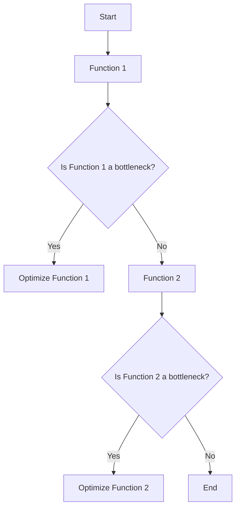

## 21.9. Performance Testing and Benchmarking with Benchee

As expert software engineers and architects, understanding and optimizing the performance of your applications is crucial. Performance testing ensures that your application meets the necessary performance requirements, providing a seamless experience for users. In this section, we will explore how to use Benchee, a powerful benchmarking tool in Elixir, to measure and improve the performance of your code.

### Importance of Performance Testing

Performance testing is vital for several reasons:

- **User Experience**: Slow applications can lead to user frustration and abandonment.
- **Scalability**: Understanding performance bottlenecks helps in scaling applications efficiently.
- **Cost Efficiency**: Optimized code can reduce resource consumption, leading to cost savings.
- **Reliability**: Performance testing helps identify potential issues that could lead to system failures under load.

### Using Benchee for Benchmarking

Benchee is a popular benchmarking library in Elixir that allows you to measure the execution time of your code, compare different implementations, and make informed decisions about optimizations.

#### Writing Benchmarks with Benchee

To get started with Benchee, you need to add it to your project's dependencies in `mix.exs`:

```elixir
defp deps do
  [
    {:benchee, "~> 1.0", only: :dev}
  ]
end
```

After adding Benchee, run `mix deps.get` to fetch the dependency. Now, let's write a simple benchmark:

```elixir
# benchmark.exs
Benchee.run(%{
  "Enum.map" => fn -> Enum.map(1..1000, &(&1 * 2)) end,
  "for comprehension" => fn -> for x <- 1..1000, do: x * 2 end
})
```

In this example, we are comparing the performance of `Enum.map` and a `for` comprehension for multiplying numbers in a range. Run the benchmark using the command:

```shell
mix run benchmark.exs
```

#### Comparing Different Implementations

Benchee provides detailed reports that include average execution time, standard deviation, and more. Here's a sample output:

```
Benchmarking Enum.map...
Benchmarking for comprehension...

Name                         ips        average  deviation         median         99th %
Enum.map                 50.12 K       19.95 μs    ±10.12%       19.00 μs       30.00 μs
for comprehension        48.76 K       20.51 μs     ±9.87%       20.00 μs       31.00 μs
```

From the output, you can see the iterations per second (ips), average execution time, and other statistics. This information helps you decide which implementation is more efficient.

### Profiling Tools

While Benchee is excellent for benchmarking, profiling tools like `:fprof` and `:eprof` provide in-depth analysis of where time is being spent in your application.

#### Using `:fprof`

`:fprof` is a built-in Erlang tool for profiling. To use it, follow these steps:

1. Start the profiler:

   ```elixir
   :fprof.start()
   :fprof.trace([:start, {:procs, self()}])
   ```

2. Run the code you want to profile.
3. Stop the profiler:

   ```elixir
   :fprof.trace(:stop)
   :fprof.profile()
   :fprof.analyse()
   ```

`:fprof` will generate a detailed report showing the time spent in each function, helping you identify bottlenecks.

#### Using `:eprof`

`:eprof` is another Erlang profiling tool that focuses on time spent in functions. Here's how to use it:

1. Start the profiler:

   ```elixir
   :eprof.start()
   :eprof.start_profiling([self()])
   ```

2. Execute the code you want to profile.
3. Stop the profiler and analyze the results:

   ```elixir
   :eprof.stop_profiling()
   :eprof.analyze()
   ```

`:eprof` provides a summary of time spent in each function, making it easier to pinpoint performance issues.

### Interpreting Results

Interpreting the results from Benchee and profiling tools is crucial for making informed optimization decisions.

#### Identifying Performance Bottlenecks

Look for functions with high execution times or high deviation in performance. These are potential bottlenecks that need optimization.

#### Making Informed Decisions on Optimizations

Once you've identified bottlenecks, consider the following optimization strategies:

- **Algorithm Optimization**: Use more efficient algorithms to improve performance.
- **Data Structures**: Choose appropriate data structures that offer better performance for your use case.
- **Concurrency**: Leverage Elixir's concurrency model to parallelize tasks and reduce execution time.

### Visualizing Performance with Diagrams

To better understand the performance characteristics of your application, you can visualize the execution flow and identify bottlenecks using diagrams.



This flowchart represents a typical process of identifying and optimizing bottlenecks in your application.

### Try It Yourself

To deepen your understanding of performance testing and benchmarking with Benchee, try modifying the code examples provided:

- Experiment with different data structures and see how they affect performance.
- Add more complex functions to the benchmark and compare their performance.
- Use `:fprof` and `:eprof` to profile different parts of your application and identify bottlenecks.

### References and Links

- [Benchee GitHub Repository](https://github.com/bencheeorg/benchee)
- [Erlang Profiling Tools](http://erlang.org/doc/man/fprof.html)
- [Elixir Documentation](https://elixir-lang.org/docs.html)

### Knowledge Check

1. What is the primary purpose of performance testing?
2. How does Benchee help in benchmarking Elixir code?
3. What are the differences between `:fprof` and `:eprof`?
4. How can you interpret the results from a Benchee benchmark?
5. What are some common optimization strategies for improving performance?

### Embrace the Journey

Remember, mastering performance testing and benchmarking is a journey. As you progress, you'll develop an intuition for identifying bottlenecks and optimizing your code. Keep experimenting, stay curious, and enjoy the process!

## Quiz Time!



### What is the primary purpose of performance testing?

- [x] Ensuring the application meets performance requirements.
- [ ] Finding bugs in the code.
- [ ] Improving code readability.
- [ ] Enhancing user interface design.

> **Explanation:** Performance testing ensures that the application meets the necessary performance requirements, providing a seamless experience for users.

### How does Benchee help in benchmarking Elixir code?

- [x] By measuring execution time and comparing different implementations.
- [ ] By providing syntax highlighting for Elixir code.
- [ ] By compiling Elixir code to machine language.
- [ ] By generating random data for testing.

> **Explanation:** Benchee measures execution time and allows for comparison between different implementations or code changes.

### What is the difference between `:fprof` and `:eprof`?

- [x] `:fprof` provides detailed reports, while `:eprof` focuses on time spent in functions.
- [ ] `:fprof` is used for syntax checking, while `:eprof` is for error logging.
- [ ] `:fprof` is a third-party tool, while `:eprof` is built into Elixir.
- [ ] `:fprof` is for testing, while `:eprof` is for deployment.

> **Explanation:** `:fprof` provides detailed profiling reports, whereas `:eprof` summarizes the time spent in functions.

### How can you interpret the results from a Benchee benchmark?

- [x] By analyzing execution time, iterations per second, and standard deviation.
- [ ] By checking for syntax errors in the code.
- [ ] By comparing the number of lines in each function.
- [ ] By evaluating the color scheme of the output.

> **Explanation:** Benchee provides detailed statistics such as execution time, iterations per second, and standard deviation to help interpret benchmark results.

### What is a common optimization strategy for improving performance?

- [x] Algorithm Optimization
- [ ] Adding more comments to the code
- [ ] Using more global variables
- [ ] Increasing the size of the codebase

> **Explanation:** Algorithm optimization involves using more efficient algorithms to improve performance.

### Which tool is built-in for profiling in Erlang?

- [x] `:fprof`
- [ ] `:benchee`
- [ ] `:exprof`
- [ ] `:profiler`

> **Explanation:** `:fprof` is a built-in Erlang tool for profiling.

### What statistic does Benchee provide to help compare implementations?

- [x] Iterations per second (ips)
- [ ] Number of lines of code
- [ ] Number of comments
- [ ] Code complexity score

> **Explanation:** Benchee provides iterations per second (ips) to help compare the performance of different implementations.

### What is the benefit of using concurrency in Elixir for performance optimization?

- [x] It allows tasks to run in parallel, reducing execution time.
- [ ] It makes the code more readable.
- [ ] It increases the number of global variables.
- [ ] It simplifies error handling.

> **Explanation:** Concurrency in Elixir allows tasks to run in parallel, which can significantly reduce execution time.

### Which of the following is NOT a profiling tool in Erlang?

- [ ] `:fprof`
- [x] `:benchee`
- [ ] `:eprof`
- [ ] `:cprof`

> **Explanation:** `:benchee` is a benchmarking tool, not a profiling tool.

### True or False: Benchee can be used to identify memory usage issues in Elixir applications.

- [ ] True
- [x] False

> **Explanation:** Benchee is primarily used for benchmarking execution time and comparing implementations, not for identifying memory usage issues.




