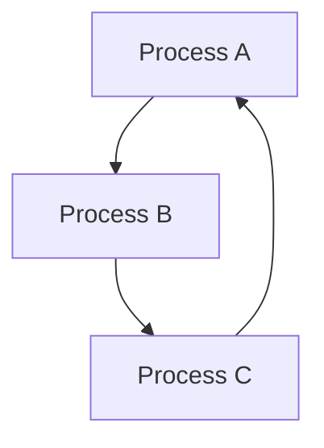

## 22.1. Profiling Tools and Techniques

In the world of software engineering, especially when working with a language like Elixir, performance optimization is crucial. Profiling is a key technique that allows developers to understand how resources are utilized within their applications. This section will delve into the importance of profiling, explore various tools available in Elixir, and provide practical examples to help you master these techniques.

### Importance of Profiling

Profiling is the process of measuring the space (memory) and time complexity of a program, identifying performance bottlenecks, and understanding resource utilization. In Elixir, profiling is particularly important due to the concurrent nature of the language and its reliance on the BEAM virtual machine.

#### Key Benefits of Profiling

- **Resource Utilization**: Understand how CPU, memory, and other resources are being used.
- **Performance Bottlenecks**: Identify slow parts of the code that need optimization.
- **Scalability**: Ensure that the application can handle increased load efficiently.
- **Cost Efficiency**: Optimize resource usage to reduce operational costs.

### Using :observer

`:observer` is a graphical tool that provides a comprehensive view of the system's performance. It is part of the Erlang/OTP suite and is available in Elixir as well.

#### Features of :observer

- **System Overview**: Visualize CPU load, memory usage, and process information.
- **Application Monitoring**: Track the performance of running applications.
- **Process Information**: Inspect individual processes, including their state and message queue length.
- **ETS Tables**: View and analyze ETS (Erlang Term Storage) tables.

#### How to Use :observer

To start `:observer`, you need to have an Elixir application running. You can launch it using the following command:

```elixir
:observer.start()
```

This command opens a window displaying various tabs, each providing different insights into the system's performance.

#### Example: Monitoring a Sample Application

Let's consider a simple Elixir application that processes a list of numbers. We will use `:observer` to monitor its performance.

```elixir
defmodule NumberProcessor do
  def process(numbers) do
    Enum.map(numbers, &(&1 * 2))
  end
end

# Start the observer
:observer.start()

# Run the process
NumberProcessor.process(1..1_000_000 |> Enum.to_list())
```

By observing the application, you can see how the CPU and memory are utilized during the execution of the `process` function.

### Command-Line Profilers

Elixir provides several command-line tools for profiling, each with its unique features and use cases.

#### :fprof

`:fprof` is a tool for profiling function calls. It provides detailed information about the time spent in each function.

##### How to Use :fprof

1. **Start Profiling**: Use `:fprof.start()` to begin profiling.
2. **Trace Function Calls**: Use `:fprof.trace([:start])` to trace function calls.
3. **Run Your Code**: Execute the code you want to profile.
4. **Stop Tracing**: Use `:fprof.trace([:stop])` to stop tracing.
5. **Analyze Results**: Use `:fprof.analyse()` to analyze the results.

##### Example: Profiling a Function

```elixir
defmodule ProfilerExample do
  def slow_function do
    :timer.sleep(1000)
    "done"
  end
end

:fprof.start()
:fprof.trace([:start])
ProfilerExample.slow_function()
:fprof.trace([:stop])
:fprof.analyse()
```

This example profiles the `slow_function`, providing insights into its execution time.

#### :eprof

`:eprof` is another profiler that focuses on time spent in each process. It is useful for identifying processes that consume the most time.

##### How to Use :eprof

1. **Start Profiling**: Use `:eprof.start()` to begin profiling.
2. **Profile Processes**: Use `:eprof.profile(Process.list())` to profile all processes.
3. **Analyze Results**: Use `:eprof.analyse()` to analyze the results.

##### Example: Profiling Processes

```elixir
defmodule ProcessExample do
  def run do
    spawn(fn -> :timer.sleep(500) end)
    spawn(fn -> :timer.sleep(1000) end)
  end
end

:eprof.start()
ProcessExample.run()
:eprof.profile(Process.list())
:eprof.analyse()
```

This example profiles all processes, helping you identify which ones are consuming the most time.

#### :recon

`:recon` is a powerful tool for diagnosing issues in production systems. It provides various utilities for inspecting processes, ETS tables, and more.

##### Features of :recon

- **Process Inspection**: Identify processes with large message queues or high memory usage.
- **ETS Inspection**: Analyze ETS tables for performance issues.
- **Network Inspection**: Monitor network connections and traffic.

##### Example: Using :recon

```elixir
# Install :recon
{:recon, "~> 2.5"}

# Inspect processes with large message queues
:recon.proc_count(:message_queue_len, 10)
```

This example uses `:recon` to find the top 10 processes with the largest message queues.

### Collecting Metrics

Collecting metrics is essential for understanding the performance of your application over time. Elixir provides several libraries for instrumenting code and collecting metrics.

#### Libraries for Collecting Metrics

- **Telemetry**: A dynamic dispatching library for metrics collection.
- **Prometheus**: A monitoring system and time series database.
- **StatsD**: A simple daemon for easy stats aggregation.

#### Example: Using Telemetry

```elixir
defmodule TelemetryExample do
  require Logger

  def start do
    :telemetry.attach("log-handler", [:example, :event], &handle_event/4, nil)
    :telemetry.execute([:example, :event], %{count: 1}, %{})
  end

  defp handle_event(_event_name, measurements, _metadata, _config) do
    Logger.info("Event occurred: #{inspect(measurements)}")
  end
end

TelemetryExample.start()
```

This example demonstrates how to use Telemetry to log events in your application.

### Visualizing Profiling Data

Visualizing profiling data can help you understand complex performance issues more easily. Tools like `Flamegraphs` and `Graphviz` can be used to create visual representations of profiling data.

#### Creating Flamegraphs

Flamegraphs are a visualization of profiled software, allowing you to see which code paths are consuming the most time.

##### Example: Generating a Flamegraph

1. **Collect Profiling Data**: Use `:fprof` to collect profiling data.
2. **Convert to Flamegraph Format**: Use a script to convert the data to a format suitable for flamegraphs.
3. **Generate Flamegraph**: Use a tool like `Flamegraph.pl` to generate the visualization.

#### Using Graphviz

Graphviz is a tool for creating diagrams from textual descriptions. It can be used to visualize process interactions and dependencies.

##### Example: Visualizing Process Interactions



This diagram represents a simple interaction between three processes.

### Try It Yourself

Experiment with the profiling tools and techniques discussed in this section. Modify the code examples to suit your application and observe the changes in performance metrics. Consider creating your own flamegraphs or process interaction diagrams to gain deeper insights into your application's performance.

### References and Links

- [Elixir Documentation](https://elixir-lang.org/docs.html)
- [Erlang Observer](http://erlang.org/doc/man/observer.html)
- [Telemetry](https://hexdocs.pm/telemetry/readme.html)
- [Prometheus](https://prometheus.io/)
- [StatsD](https://github.com/statsd/statsd)

### Knowledge Check

- What are the key benefits of profiling in Elixir?
- How can `:observer` help in monitoring system performance?
- What is the difference between `:fprof` and `:eprof`?
- How can `:recon` be used to diagnose production issues?
- Why is collecting metrics important for performance optimization?

### Embrace the Journey

Remember, profiling is just the beginning of performance optimization. As you progress, you'll uncover more complex issues and develop strategies to address them. Keep experimenting, stay curious, and enjoy the journey!

## Quiz: Profiling Tools and Techniques



### What is the primary purpose of profiling in Elixir?

- [x] To understand resource utilization and identify performance bottlenecks.
- [ ] To write more concise code.
- [ ] To enhance code readability.
- [ ] To ensure code follows best practices.

> **Explanation:** Profiling helps in understanding how resources are utilized and identifying performance bottlenecks in the application.

### Which tool provides a graphical interface for monitoring system performance in Elixir?

- [x] :observer
- [ ] :fprof
- [ ] :eprof
- [ ] :recon

> **Explanation:** `:observer` is a graphical tool that provides insights into system performance, including CPU load and memory usage.

### What is the main focus of the :fprof tool?

- [x] Profiling function calls and analyzing execution time.
- [ ] Monitoring network traffic.
- [ ] Collecting metrics over time.
- [ ] Visualizing process interactions.

> **Explanation:** `:fprof` is used for profiling function calls and analyzing the time spent in each function.

### How does :recon help in diagnosing production issues?

- [x] By providing utilities for inspecting processes and ETS tables.
- [ ] By generating flamegraphs.
- [ ] By collecting metrics for Prometheus.
- [ ] By visualizing process interactions.

> **Explanation:** `:recon` provides utilities for inspecting processes, ETS tables, and more, making it useful for diagnosing production issues.

### What is the purpose of collecting metrics in an Elixir application?

- [x] To understand performance over time and optimize resource usage.
- [ ] To generate flamegraphs.
- [ ] To visualize process interactions.
- [ ] To enhance code readability.

> **Explanation:** Collecting metrics helps in understanding the performance of an application over time and optimizing resource usage.

### Which library is commonly used for metrics collection in Elixir?

- [x] Telemetry
- [ ] :observer
- [ ] :fprof
- [ ] :recon

> **Explanation:** Telemetry is a popular library in Elixir for collecting and dispatching metrics.

### What is a flamegraph used for?

- [x] Visualizing which code paths consume the most time.
- [ ] Monitoring network traffic.
- [ ] Collecting metrics over time.
- [ ] Visualizing process interactions.

> **Explanation:** Flamegraphs are used to visualize which code paths are consuming the most time in a profiled application.

### Which tool can be used to visualize process interactions and dependencies?

- [x] Graphviz
- [ ] :observer
- [ ] :fprof
- [ ] :recon

> **Explanation:** Graphviz is a tool for creating diagrams from textual descriptions, useful for visualizing process interactions and dependencies.

### What is the benefit of using :eprof over :fprof?

- [x] :eprof focuses on time spent in each process, making it useful for identifying time-consuming processes.
- [ ] :eprof provides a graphical interface.
- [ ] :eprof collects metrics for Prometheus.
- [ ] :eprof generates flamegraphs.

> **Explanation:** `:eprof` focuses on time spent in each process, which is useful for identifying processes that consume the most time.

### True or False: Profiling is only necessary for large applications.

- [ ] True
- [x] False

> **Explanation:** Profiling is beneficial for applications of all sizes to ensure efficient resource utilization and performance optimization.


