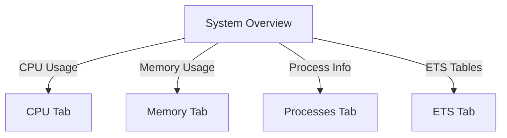

## 22.1. Profiling Tools and Techniques

In the world of software engineering, especially when dealing with high-performance applications, understanding how your application utilizes resources is crucial. Profiling is an essential practice that allows developers to gain insights into the performance characteristics of their applications. In this section, we'll explore various profiling tools and techniques available in Elixir, a language known for its concurrency and fault-tolerance capabilities.

### Importance of Profiling

Profiling is the process of measuring the space (memory) and time complexity of a program, identifying bottlenecks, and understanding resource utilization. Here are some key reasons why profiling is important:

- **Resource Optimization**: Profiling helps in identifying inefficient code paths and optimizing them for better resource utilization.
- **Performance Bottlenecks**: By pinpointing slow operations, developers can focus on optimizing critical sections of the code.
- **Scalability**: Understanding how an application performs under load is essential for designing scalable systems.
- **Cost Efficiency**: Efficient resource utilization can lead to cost savings, especially in cloud environments where resources are billed based on usage.
- **User Experience**: Faster applications lead to better user experiences, which is crucial for the success of any software product.

### Using :observer

`:observer` is a graphical tool that comes with the Erlang/OTP system, which Elixir is built upon. It provides a visual interface to monitor the performance of an Elixir application and the underlying BEAM virtual machine.

#### Features of :observer

- **System Overview**: Provides a high-level view of the system's performance, including CPU and memory usage.
- **Application Load**: Visualizes the load on different applications running on the BEAM.
- **Process Information**: Displays detailed information about processes, including memory usage, message queue length, and current state.
- **ETS Tables**: Shows information about Erlang Term Storage (ETS) tables, which are used for in-memory data storage.

#### How to Use :observer

To start the `:observer`, ensure your Elixir application is running and execute the following command in the IEx shell:

```elixir
:observer.start()
```

This will open a graphical window displaying various tabs with system information. Let's explore some of these tabs:

- **System**: This tab provides an overview of the system's performance metrics, such as CPU load and memory usage.
- **Applications**: Here, you can see all the applications running on the BEAM and their respective loads.
- **Processes**: This tab lists all the processes, allowing you to inspect each process's memory usage and message queue length.
- **ETS**: Displays information about ETS tables, including size and memory consumption.

#### Visualizing System Performance with :observer


```mermaid
graph TD;
    A[System Overview] -->|CPU Usage| B[CPU Tab]
    A -->|Memory Usage| C[Memory Tab]
    A -->|Process Info| D[Processes Tab]
    A -->|ETS Tables| E[ETS Tab]
```

In the diagram above, the `System Overview` node connects to various tabs that provide detailed insights into different aspects of the system's performance.

### Command-Line Profilers

For those who prefer command-line tools, Elixir offers several powerful profilers that provide granular insights into application performance. Let's explore some of these tools:

#### :fprof

`:fprof` is a function-level profiler that provides detailed information about function calls and their execution times. It is useful for identifying time-consuming functions in your application.

**Usage Example**

To profile a function using `:fprof`, follow these steps:

1. Start the profiler:

   ```elixir
   :fprof.start()
   ```

2. Trace the function you want to profile:

   ```elixir
   :fprof.trace([:start, {:procs, self()}])
   ```

3. Execute the function:

   ```elixir
   my_function()
   ```

4. Stop the profiler and analyze the results:

   ```elixir
   :fprof.stop()
   :fprof.analyse()
   ```

The analysis will provide a detailed report of function calls and their execution times.

#### :eprof

`:eprof` is a time profiler that measures the time spent in each function. It is suitable for identifying which functions consume the most time during execution.

**Usage Example**

To use `:eprof`, follow these steps:

1. Start the profiler:

   ```elixir
   :eprof.start()
   ```

2. Profile the function:

   ```elixir
   :eprof.profile(my_function())
   ```

3. Analyze the results:

   ```elixir
   :eprof.analyse()
   ```

The analysis will show a breakdown of time spent in each function, helping you identify bottlenecks.

#### :recon

`:recon` is a library that provides various utilities for inspecting and diagnosing running systems. It is particularly useful for live systems where you need to gather insights without stopping the application.

**Usage Example**

To use `:recon` for process inspection, you can execute the following:

```elixir
:recon.proc_count(:memory, 10)
```

This command will list the top 10 processes consuming the most memory.

### Collecting Metrics

Instrumenting your code to collect metrics is another effective way to gain insights into application performance. By gathering data on key performance indicators, you can make informed decisions about optimizations.

#### Using Telemetry

Telemetry is a dynamic dispatching library for metrics and instrumentation in Elixir. It allows you to define and emit events that can be consumed by different handlers.

**Example of Telemetry Usage**

1. Define an event in your application:

   ```elixir
   defmodule MyApp do
     def execute_task do
       start_time = :os.system_time(:millisecond)
       
       # Task execution
       
       duration = :os.system_time(:millisecond) - start_time
       :telemetry.execute([:my_app, :task, :execute], %{duration: duration}, %{})
     end
   end
   ```

2. Attach a handler to the event:

   ```elixir
   :telemetry.attach("log-task-execution", [:my_app, :task, :execute], fn _event_name, measurements, _metadata, _config ->
     IO.inspect(measurements)
   end, nil)
   ```

This setup will log the duration of the `execute_task` function every time it is called.

### Try It Yourself

To gain hands-on experience with these profiling tools and techniques, try the following exercises:

- Use `:observer` to monitor a running Elixir application and identify the process with the highest memory usage.
- Profile a computationally intensive function using `:fprof` and optimize it based on the profiling results.
- Instrument a function with Telemetry to collect execution time metrics and log them to the console.

### Knowledge Check

- What is the primary purpose of profiling in software development?
- How can `:observer` be used to monitor system performance in Elixir?
- What is the difference between `:fprof` and `:eprof`?
- How does Telemetry help in collecting performance metrics?

### Embrace the Journey

Remember, profiling is an ongoing process that helps you understand and optimize your application's performance. As you explore these tools and techniques, you'll become more adept at identifying bottlenecks and improving resource utilization. Keep experimenting, stay curious, and enjoy the journey of mastering Elixir performance optimization!

## Quiz Time!



### What is the primary purpose of profiling in software development?

- [x] To understand resource utilization and identify performance bottlenecks
- [ ] To add more features to the application
- [ ] To improve the user interface of the application
- [ ] To refactor code for readability

> **Explanation:** Profiling helps in understanding resource utilization and identifying performance bottlenecks, which is crucial for optimizing applications.

### Which tool provides a graphical interface for monitoring Elixir applications?

- [x] :observer
- [ ] :fprof
- [ ] :eprof
- [ ] :recon

> **Explanation:** `:observer` is a graphical tool that provides a visual interface to monitor the performance of Elixir applications.

### What is the primary difference between :fprof and :eprof?

- [x] :fprof provides function-level profiling, while :eprof measures time spent in each function
- [ ] :fprof is for memory profiling, while :eprof is for CPU profiling
- [ ] :fprof is a graphical tool, while :eprof is command-line based
- [ ] :fprof is used for live systems, while :eprof is for offline analysis

> **Explanation:** `:fprof` provides detailed function-level profiling, while `:eprof` measures the time spent in each function.

### How does Telemetry help in performance optimization?

- [x] By allowing dynamic dispatching of metrics and instrumentation
- [ ] By providing a graphical interface for monitoring
- [ ] By replacing the need for command-line profilers
- [ ] By automatically optimizing code

> **Explanation:** Telemetry allows developers to define and emit events for metrics and instrumentation, which can be consumed by different handlers for performance analysis.

### Which command lists the top memory-consuming processes using :recon?

- [x] :recon.proc_count(:memory, 10)
- [ ] :recon.memory_top(10)
- [ ] :recon.top_memory(10)
- [ ] :recon.memory_usage(10)

> **Explanation:** The command `:recon.proc_count(:memory, 10)` lists the top 10 processes consuming the most memory.

### What is the role of :observer in Elixir?

- [x] To provide a graphical interface for system monitoring
- [ ] To replace command-line profilers
- [ ] To automatically optimize code
- [ ] To generate code documentation

> **Explanation:** `:observer` provides a graphical interface for monitoring system performance, including CPU and memory usage.

### How can :fprof be started in an Elixir application?

- [x] :fprof.start()
- [ ] :fprof.init()
- [ ] :fprof.begin()
- [ ] :fprof.run()

> **Explanation:** The `:fprof.start()` command is used to start the `:fprof` profiler in an Elixir application.

### What does :eprof measure in an Elixir application?

- [x] Time spent in each function
- [ ] Memory usage of each process
- [ ] CPU load of the application
- [ ] Network latency

> **Explanation:** `:eprof` measures the time spent in each function, helping identify time-consuming operations.

### Which tool is particularly useful for live systems?

- [x] :recon
- [ ] :observer
- [ ] :fprof
- [ ] :eprof

> **Explanation:** `:recon` is particularly useful for live systems as it provides utilities for inspecting and diagnosing running systems without stopping them.

### Profiling is an ongoing process that helps in understanding and optimizing an application's performance.

- [x] True
- [ ] False

> **Explanation:** Profiling is indeed an ongoing process that helps developers understand and optimize the performance of their applications.


