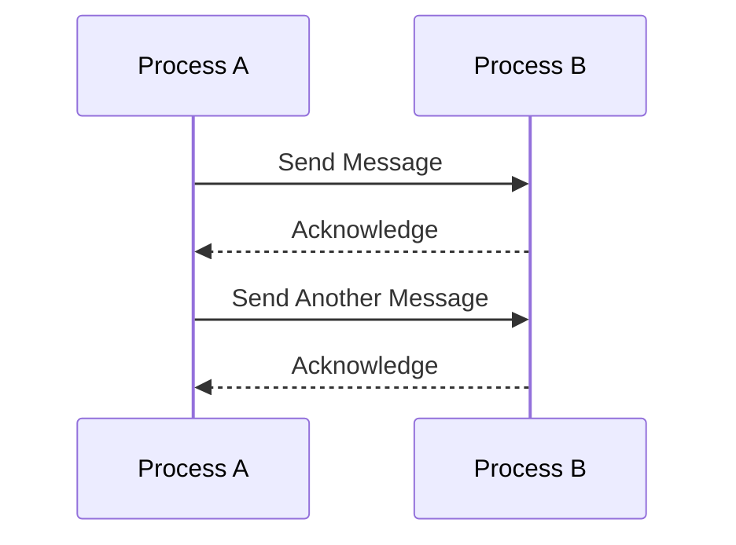

## 22.10. Performance Considerations in Concurrency

Concurrency is a cornerstone of Elixir's design, enabling developers to build highly scalable and fault-tolerant applications. However, achieving optimal performance in concurrent systems requires careful consideration of several factors. In this section, we will delve into the key performance considerations in concurrency, focusing on process overhead, message passing, synchronization, and monitoring. By understanding these concepts, you can harness the full power of Elixir's concurrency model to build efficient and responsive applications.

### Process Overhead

In Elixir, processes are lightweight and designed to be numerous. However, there is still overhead associated with creating and managing processes. Balancing the number of processes is crucial for maintaining performance.

#### Balancing the Number of Processes

Creating too many processes can lead to increased memory usage and context-switching overhead. Conversely, too few processes may result in underutilization of system resources. To strike the right balance:

- **Analyze Workload**: Understand the nature of tasks and their execution time. Short-lived tasks may benefit from more processes, while long-running tasks may require fewer.
- **Use Process Pools**: Implement process pools to manage a fixed number of worker processes, reducing the overhead of frequent process creation and termination.
- **Leverage Supervision Trees**: Organize processes hierarchically using supervision trees to manage their lifecycle efficiently.

```elixir
defmodule WorkerPool do
  use GenServer

  def start_link(size) do
    GenServer.start_link(__MODULE__, size, name: __MODULE__)
  end

  def init(size) do
    workers = for _ <- 1..size, do: spawn_link(fn -> worker_loop() end)
    {:ok, workers}
  end

  defp worker_loop do
    receive do
      :work -> 
        # Perform work
        worker_loop()
    end
  end
end
```

### Message Passing

Efficient communication between processes is vital for performance. Elixir uses message passing as the primary means of inter-process communication.

#### Ensuring Efficient Communication

- **Minimize Message Size**: Large messages can increase latency. Consider breaking down large data into smaller chunks.
- **Avoid Message Buildup**: Monitor mailbox sizes to prevent bottlenecks. Use flow control mechanisms to manage message rates.
- **Use Asynchronous Communication**: Whenever possible, use asynchronous message passing to avoid blocking processes.

```elixir
defmodule MessageHandler do
  def send_message(pid, message) do
    send(pid, {:msg, message})
  end

  def handle_messages do
    receive do
      {:msg, message} -> 
        IO.puts("Received: #{message}")
        handle_messages()
    end
  end
end
```

### Synchronization

Synchronization is necessary when processes need to coordinate access to shared resources. However, excessive synchronization can lead to contention and reduced performance.

#### Avoiding Locks and Contention

- **Use Message Passing for Coordination**: Instead of locks, use message passing to coordinate between processes, reducing contention.
- **Leverage ETS for Shared Data**: Use Erlang Term Storage (ETS) for concurrent read access to shared data without locks.
- **Design for Immutability**: Embrace immutability to minimize the need for synchronization.

```elixir
defmodule SharedData do
  def start_link do
    :ets.new(:data, [:named_table, :public, read_concurrency: true])
  end

  def write(key, value) do
    :ets.insert(:data, {key, value})
  end

  def read(key) do
    case :ets.lookup(:data, key) do
      [{^key, value}] -> {:ok, value}
      [] -> :error
    end
  end
end
```

### Monitoring

Monitoring is essential to ensure that your concurrent system is performing optimally. Keeping an eye on process count, queue lengths, and system metrics can help identify bottlenecks and inefficiencies.

#### Keeping an Eye on the Process Count and Queue Lengths

- **Use Observer**: Leverage the Observer tool to visualize process information and system metrics.
- **Implement Custom Monitoring**: Use libraries like Telemetry to gather custom metrics and monitor application performance.
- **Set Alerts for Anomalies**: Configure alerts for unusual patterns, such as sudden spikes in process count or message queue lengths.

```elixir
defmodule Monitor do
  def start_monitoring do
    :telemetry.attach("process-monitor", [:vm, :process_count], &handle_event/4, nil)
  end

  defp handle_event(_event_name, measurements, _metadata, _config) do
    IO.inspect(measurements, label: "Process Count")
  end
end
```

### Visualizing Concurrency in Elixir

To better understand the flow of concurrency in Elixir, let's visualize a simple process communication model using Mermaid.js:



This diagram illustrates the basic message-passing mechanism between two processes, highlighting the asynchronous nature of communication in Elixir.

### Try It Yourself

Experiment with the code examples provided by modifying the number of processes in the worker pool or the size of messages being passed. Observe how these changes affect performance and resource utilization.

### References and Further Reading

- [Elixir Concurrency](https://elixir-lang.org/getting-started/processes.html)
- [Erlang Term Storage (ETS)](https://erlang.org/doc/man/ets.html)
- [Telemetry for Monitoring](https://hexdocs.pm/telemetry/readme.html)

### Knowledge Check

- What are the potential downsides of creating too many processes in an Elixir application?
- How can message size impact the performance of a concurrent system?
- Why is it beneficial to use ETS for shared data access in Elixir?

### Embrace the Journey

Remember, optimizing concurrency in Elixir is an ongoing process. As you gain experience, you'll develop a deeper understanding of how to balance processes, manage message passing, and monitor system performance. Keep experimenting, stay curious, and enjoy the journey!

## Quiz: Performance Considerations in Concurrency



### What is a potential downside of creating too many processes in Elixir?

- [x] Increased memory usage and context-switching overhead
- [ ] Improved performance and resource utilization
- [ ] Reduced system complexity
- [ ] Enhanced fault tolerance

> **Explanation:** Creating too many processes can lead to increased memory usage and context-switching overhead, which can degrade performance.

### How can message size impact performance in a concurrent system?

- [x] Large messages can increase latency
- [ ] Large messages improve throughput
- [ ] Small messages cause bottlenecks
- [ ] Message size has no impact on performance

> **Explanation:** Large messages can increase latency as they take longer to transmit and process, impacting overall system performance.

### What is a benefit of using ETS for shared data access?

- [x] Concurrent read access without locks
- [ ] Simplified data structure management
- [ ] Reduced memory usage
- [ ] Improved write performance

> **Explanation:** ETS allows concurrent read access to shared data without the need for locks, enhancing performance in concurrent applications.

### Why should you avoid excessive synchronization in Elixir?

- [x] It can lead to contention and reduced performance
- [ ] It simplifies process communication
- [ ] It enhances fault tolerance
- [ ] It improves code readability

> **Explanation:** Excessive synchronization can lead to contention and reduced performance, as processes may block waiting for access to shared resources.

### What tool can be used to visualize process information and system metrics in Elixir?

- [x] Observer
- [ ] Telemetry
- [ ] Logger
- [ ] Mix

> **Explanation:** Observer is a tool that provides a graphical interface to visualize process information and system metrics in Elixir.

### How can you manage the number of processes in an Elixir application?

- [x] Implement process pools
- [ ] Increase process priority
- [ ] Use global variables
- [ ] Disable garbage collection

> **Explanation:** Implementing process pools allows you to manage a fixed number of worker processes, reducing the overhead of frequent process creation and termination.

### What is a key advantage of using asynchronous message passing?

- [x] Avoids blocking processes
- [ ] Simplifies error handling
- [ ] Reduces message size
- [ ] Enhances data security

> **Explanation:** Asynchronous message passing avoids blocking processes, allowing them to continue executing while waiting for a response.

### What is the role of supervision trees in Elixir?

- [x] Organize processes hierarchically to manage their lifecycle
- [ ] Enhance message passing efficiency
- [ ] Simplify code structure
- [ ] Improve data serialization

> **Explanation:** Supervision trees organize processes hierarchically, managing their lifecycle efficiently and enhancing fault tolerance.

### How can you prevent message buildup in process mailboxes?

- [x] Use flow control mechanisms
- [ ] Increase message priority
- [ ] Disable message logging
- [ ] Reduce process count

> **Explanation:** Using flow control mechanisms helps manage message rates and prevent buildup in process mailboxes, avoiding bottlenecks.

### True or False: Immutability in Elixir minimizes the need for synchronization.

- [x] True
- [ ] False

> **Explanation:** Immutability in Elixir minimizes the need for synchronization because data cannot be modified once created, reducing contention for shared resources.


