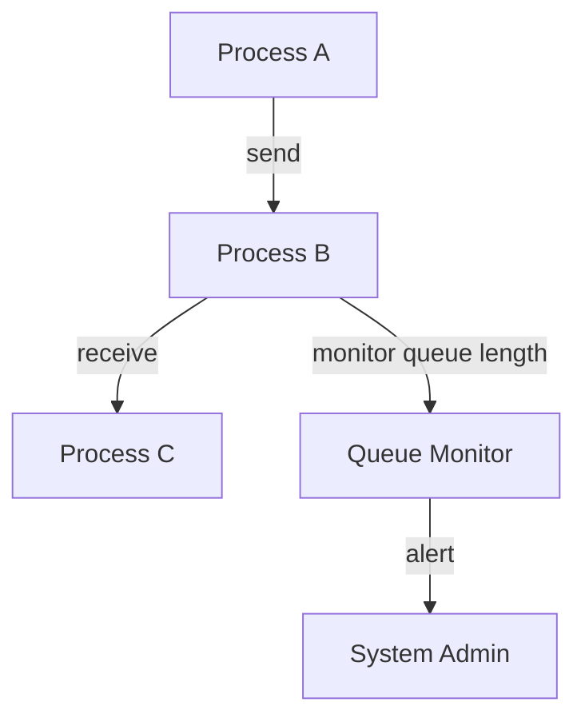
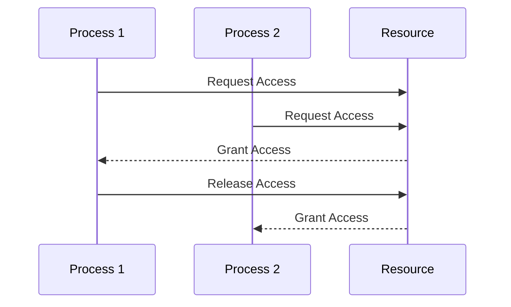

## 22.10. Performance Considerations in Concurrency

Concurrency is a cornerstone of Elixir's design, allowing developers to build highly scalable and fault-tolerant systems. However, achieving optimal performance in concurrent applications requires careful consideration of several factors. In this section, we will explore key performance considerations in concurrency, including process overhead, message passing, synchronization, and monitoring. We will provide practical insights, code examples, and visualizations to help you master these concepts.

### Process Overhead

In Elixir, processes are lightweight and designed to be numerous, but there is still an overhead associated with creating and managing them. Understanding how to balance the number of processes is crucial for efficient concurrency.

#### Balancing the Number of Processes

Creating too many processes can lead to increased memory usage and scheduling overhead, while too few processes can result in underutilization of system resources. The key is to find the right balance based on your application's needs.

**Example: Process Creation and Management**

```elixir
defmodule Worker do
  def start_link do
    Task.start_link(fn -> perform_task() end)
  end

  defp perform_task do
    # Simulate a task
    :timer.sleep(1000)
    IO.puts("Task completed")
  end
end

# Creating multiple worker processes
for _ <- 1..10 do
  Worker.start_link()
end
```

In this example, we create ten worker processes using `Task.start_link`. While this is manageable for small numbers, consider using process pools or limiting the number of concurrent processes for larger applications.

#### Process Pools

Using process pools can help manage resources efficiently by reusing a fixed number of processes for tasks.

**Example: Using Poolboy for Process Pooling**

```elixir
defmodule MyApp.Pool do
  use Poolboy

  def start_link do
    :poolboy.start_link(poolboy_config(), [], [])
  end

  defp poolboy_config do
    [
      {:name, {:local, :worker_pool}},
      {:worker_module, Worker},
      {:size, 5},
      {:max_overflow, 10}
    ]
  end
end
```

In this example, we configure a process pool with `Poolboy`, setting a pool size of 5 and allowing up to 10 additional processes in overflow.

### Message Passing

Efficient message passing is critical for performance in concurrent systems. Elixir processes communicate via message passing, which is safe and avoids shared state but can become a bottleneck if not managed properly.

#### Ensuring Efficient Communication

To ensure efficient message passing, minimize the size and frequency of messages and avoid unnecessary message duplication.

**Example: Message Passing Between Processes**

```elixir
defmodule Sender do
  def send_message(pid, message) do
    send(pid, {:msg, message})
  end
end

defmodule Receiver do
  def start_link do
    Task.start_link(fn -> listen() end)
  end

  defp listen do
    receive do
      {:msg, message} ->
        IO.puts("Received message: #{message}")
        listen()
    end
  end
end

# Usage
{:ok, receiver_pid} = Receiver.start_link()
Sender.send_message(receiver_pid, "Hello, World!")
```

In this example, the `Sender` module sends messages to a `Receiver` process. Ensure messages are concise and relevant to avoid clogging the message queue.

#### Avoiding Message Queue Overload

Monitor the length of message queues to prevent overload, which can lead to increased latency and decreased throughput.

**Visualization: Message Queue Monitoring**


```mermaid
graph TD;
    A[Process A] -->|send| B[Process B];
    B -->|receive| C[Process C];
    B -->|monitor queue length| D[Queue Monitor];
    D -->|alert| E[System Admin];
```

This diagram illustrates a simple message-passing system with queue monitoring. The `Queue Monitor` observes the message queue length and alerts the system administrator if it exceeds a threshold.

### Synchronization

Synchronization is essential in concurrent systems to ensure data consistency and avoid race conditions. However, improper synchronization can lead to performance issues such as deadlocks and contention.

#### Avoiding Locks and Contention

In Elixir, avoid using locks whenever possible. Instead, rely on message passing and immutability to synchronize data.

**Example: Avoiding Locks with Message Passing**

```elixir
defmodule Counter do
  def start_link(initial_value) do
    Agent.start_link(fn -> initial_value end, name: __MODULE__)
  end

  def increment do
    Agent.update(__MODULE__, &(&1 + 1))
  end

  def get_value do
    Agent.get(__MODULE__, & &1)
  end
end

# Usage
Counter.start_link(0)
Counter.increment()
IO.puts("Counter value: #{Counter.get_value()}")
```

In this example, we use an `Agent` to manage a counter without explicit locks. The `Agent` ensures data consistency through message passing.

#### Handling Contention

Contention occurs when multiple processes attempt to access the same resource simultaneously. Minimize contention by distributing work evenly across processes.

**Visualization: Contention Management**


```mermaid
sequenceDiagram
    participant P1 as Process 1
    participant P2 as Process 2
    participant R as Resource
    P1->>R: Request Access
    P2->>R: Request Access
    R-->>P1: Grant Access
    P1->>R: Release Access
    R-->>P2: Grant Access
```

This sequence diagram shows how processes can contend for a resource. Proper management ensures that processes access resources without unnecessary delays.

### Monitoring

Monitoring is crucial for maintaining performance in concurrent systems. Keep an eye on process counts, queue lengths, and system metrics to identify and address bottlenecks.

#### Keeping an Eye on Process Count

Monitor the total number of processes to ensure they do not exceed system limits and to identify potential leaks.

**Example: Monitoring Process Count**

```elixir
defmodule ProcessMonitor do
  def check_process_count do
    :erlang.system_info(:process_count)
  end
end

# Usage
IO.puts("Current process count: #{ProcessMonitor.check_process_count()}")
```

In this example, we use `:erlang.system_info/1` to retrieve the current process count, which helps in monitoring system load.

#### Monitoring Queue Lengths

Keep track of message queue lengths to ensure they remain within acceptable limits and to prevent bottlenecks.

**Visualization: Queue Length Monitoring**


```mermaid
graph LR;
    A[Queue] -->|length| B[Monitor];
    B -->|alert if threshold exceeded| C[Admin];
```

This diagram illustrates a monitoring system that tracks queue lengths and alerts administrators if they exceed a predefined threshold.

#### System Metrics and Alerts

Use system metrics and alerts to proactively manage performance issues. Tools like `Observer` and `Telemetry` can provide valuable insights into system behavior.

**Example: Using Telemetry for Monitoring**

```elixir
defmodule MyApp.Telemetry do
  use Supervisor

  def start_link(_) do
    Supervisor.start_link(__MODULE__, :ok, name: __MODULE__)
  end

  def init(:ok) do
    children = [
      {Telemetry.Metrics, metrics: metrics()}
    ]

    Supervisor.init(children, strategy: :one_for_one)
  end

  defp metrics do
    [
      counter("my_app.request.count"),
      summary("my_app.request.duration")
    ]
  end
end
```

In this example, we set up a Telemetry supervisor to monitor request counts and durations, providing insights into application performance.

### Try It Yourself

Experiment with the provided code examples by modifying the number of processes, message sizes, and synchronization techniques. Observe how these changes affect performance and identify potential bottlenecks.

### Key Takeaways

- **Balance Process Count**: Find the right balance in the number of processes to optimize resource utilization.
- **Efficient Message Passing**: Minimize message sizes and frequencies to avoid queue overload.
- **Avoid Locks**: Use message passing and immutability to synchronize data and avoid contention.
- **Monitor System Metrics**: Keep an eye on process counts, queue lengths, and other metrics to proactively manage performance.

### Additional Resources

- [Elixir Lang Documentation](https://elixir-lang.org/docs.html)
- [Erlang Efficiency Guide](https://erlang.org/doc/efficiency_guide/introduction.html)
- [Telemetry Documentation](https://hexdocs.pm/telemetry/)

## Quiz Time!



### What is a key consideration when balancing the number of processes in Elixir?

- [x] Avoiding memory and scheduling overhead
- [ ] Ensuring each process has a unique name
- [ ] Using locks for synchronization
- [ ] Increasing process count for better performance

> **Explanation:** Balancing the number of processes helps avoid memory and scheduling overhead, ensuring efficient resource utilization.

### How can you ensure efficient message passing in Elixir?

- [x] Minimize message sizes and frequencies
- [ ] Use locks for synchronization
- [ ] Increase the number of processes
- [ ] Avoid using message passing

> **Explanation:** Efficient message passing involves minimizing message sizes and frequencies to prevent queue overload.

### What is the recommended way to synchronize data in Elixir?

- [x] Use message passing and immutability
- [ ] Use locks and mutexes
- [ ] Increase the number of processes
- [ ] Avoid synchronization

> **Explanation:** Elixir encourages using message passing and immutability for data synchronization to avoid contention and locks.

### What tool can be used to monitor system metrics in Elixir?

- [x] Telemetry
- [ ] Poolboy
- [ ] GenServer
- [ ] Task

> **Explanation:** Telemetry is a tool used to monitor system metrics and gain insights into application performance.

### Which of the following is a benefit of avoiding locks in Elixir?

- [x] Reduced contention and improved performance
- [ ] Increased memory usage
- [ ] Simplified code structure
- [ ] More complex synchronization

> **Explanation:** Avoiding locks reduces contention and improves performance by relying on message passing and immutability.

### How can message queue overload be prevented?

- [x] Minimize message sizes and frequencies
- [ ] Increase the number of processes
- [ ] Use locks for synchronization
- [ ] Avoid message passing

> **Explanation:** Prevent message queue overload by minimizing message sizes and frequencies to ensure efficient communication.

### What is a potential consequence of too many processes in Elixir?

- [x] Increased memory usage and scheduling overhead
- [ ] Improved performance and scalability
- [ ] Simplified code structure
- [ ] Reduced contention

> **Explanation:** Too many processes can lead to increased memory usage and scheduling overhead, affecting performance.

### What is the role of a process pool in Elixir?

- [x] Reusing a fixed number of processes for tasks
- [ ] Increasing the number of processes
- [ ] Simplifying code structure
- [ ] Avoiding message passing

> **Explanation:** A process pool helps manage resources efficiently by reusing a fixed number of processes for tasks.

### Which diagram best illustrates message passing between processes?

- [x] A sequence diagram showing send and receive actions
- [ ] A class diagram showing process relationships
- [ ] A flowchart showing process creation
- [ ] A bar chart showing process counts

> **Explanation:** A sequence diagram is best suited to illustrate message passing between processes, showing send and receive actions.

### True or False: Monitoring queue lengths is unnecessary in Elixir.

- [ ] True
- [x] False

> **Explanation:** Monitoring queue lengths is essential in Elixir to prevent bottlenecks and ensure efficient message passing.



Remember, this is just the beginning. As you progress, you'll build more complex and interactive systems. Keep experimenting, stay curious, and enjoy the journey!
