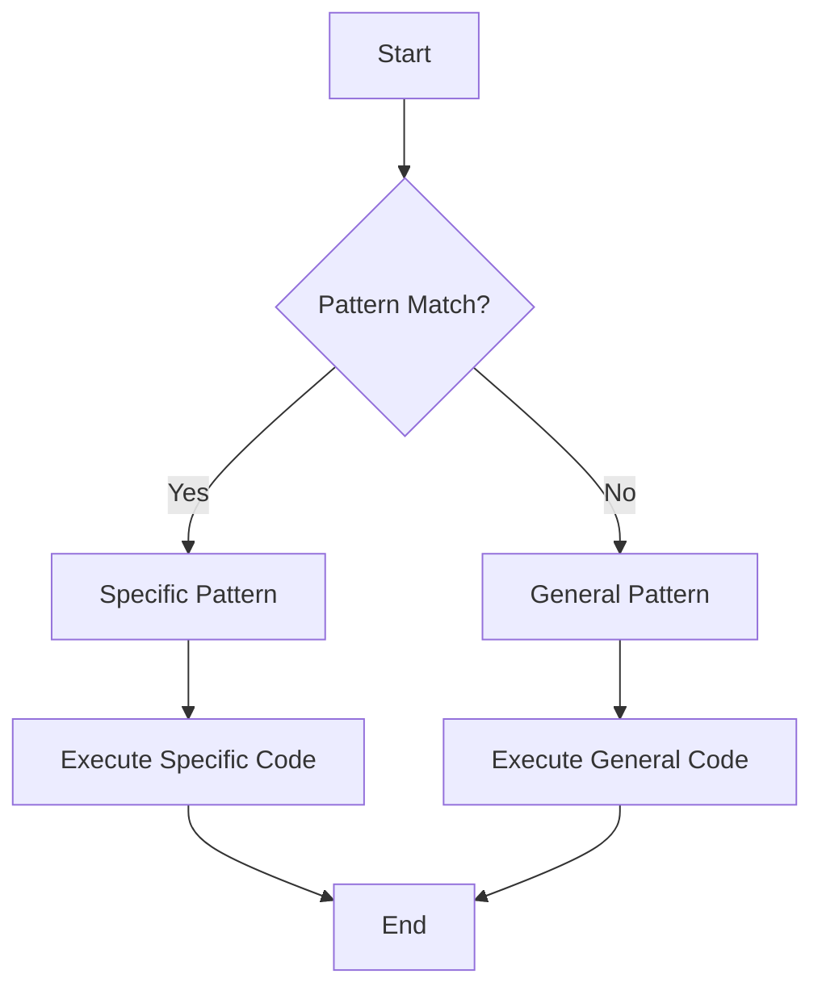

## 22.11. Optimizing Pattern Matching

Pattern matching is a powerful feature in Elixir that allows developers to destructure data and control the flow of their programs in a concise and expressive manner. However, as with any powerful tool, it must be used judiciously to ensure optimal performance. In this section, we will explore strategies for optimizing pattern matching in Elixir, focusing on the order of clauses, avoiding performance hits, and leveraging compile-time optimizations.

### Order of Clauses

One of the most critical aspects of optimizing pattern matching is the order in which you define your clauses. Elixir evaluates pattern matches from top to bottom, so placing more specific patterns before general ones can significantly impact performance.

#### Specific Before General

When writing functions with multiple clauses, always place the most specific patterns first. This approach reduces the number of checks the runtime needs to perform before finding a match.

```elixir
defmodule PatternExample do
  def process_data({:ok, data}) do
    # Handle successful data
    IO.puts("Data processed: #{data}")
  end

  def process_data({:error, reason}) do
    # Handle error
    IO.puts("Error encountered: #{reason}")
  end

  def process_data(_other) do
    # Handle any other case
    IO.puts("Unhandled case")
  end
end
```

In this example, the `{:ok, data}` and `{:error, reason}` patterns are more specific than the `_other` pattern. By placing them first, we ensure that the most common cases are handled quickly, improving performance.

#### Pattern Matching with Guards

Guards can further refine pattern matching by adding additional conditions. When using guards, ensure they are as specific as possible and placed before more general patterns.

```elixir
defmodule GuardExample do
  def check_number(x) when is_integer(x) and x > 0 do
    "Positive integer"
  end

  def check_number(x) when is_integer(x) and x < 0 do
    "Negative integer"
  end

  def check_number(_x) do
    "Not an integer"
  end
end
```

### Avoiding Performance Hits

While pattern matching is efficient, certain practices can lead to performance degradation. Here are some tips to avoid common pitfalls:

#### Keep Patterns Simple

Complex patterns can slow down your code. Aim to keep pattern matches simple and clear. Avoid deeply nested patterns unless absolutely necessary.

```elixir
# Complex pattern
def complex_pattern({:ok, %{data: %{value: value}}}) do
  value
end

# Simplified pattern
def simple_pattern({:ok, data}) do
  data[:value]
end
```

#### Avoid Redundant Matches

Redundant pattern matches can lead to unnecessary computations. Ensure that each pattern match serves a purpose and is not repeated elsewhere in your code.

```elixir
# Redundant pattern match
def redundant_match({:ok, data}) do
  case data do
    %{value: value} -> value
    _ -> nil
  end
end

# Optimized pattern match
def optimized_match({:ok, %{value: value}}) do
  value
end
```

### Compile-Time Optimizations

Elixir's compiler is capable of optimizing pattern matches at compile time. By structuring your code to take advantage of these optimizations, you can achieve significant performance gains.

#### Use Pattern Matching in Function Heads

Whenever possible, use pattern matching directly in function heads rather than within the function body. This allows the compiler to optimize the match more effectively.

```elixir
# Pattern matching in function head
defmodule FunctionHeadExample do
  def process({:ok, data}), do: {:success, data}
  def process({:error, reason}), do: {:failure, reason}
end
```

#### Leverage Pattern Matching for Control Flow

Pattern matching can be used to control the flow of your program, reducing the need for conditional statements and improving readability.

```elixir
defmodule ControlFlowExample do
  def handle_input(input) do
    case input do
      {:ok, result} -> {:success, result}
      {:error, reason} -> {:failure, reason}
      _ -> :unknown
    end
  end
end
```

### Examples: Refactoring for Performance

Let's explore some examples of refactoring complex functions to improve pattern match performance.

#### Example 1: Simplifying Nested Patterns

Consider a function that processes a deeply nested data structure. By simplifying the pattern match, we can improve performance.

```elixir
# Original function with nested pattern
defmodule NestedPattern do
  def process({:ok, %{data: %{value: value}}}) do
    value
  end
end

# Refactored function with simplified pattern
defmodule SimplifiedPattern do
  def process({:ok, data}) do
    data[:value]
  end
end
```

#### Example 2: Using Guards for Specificity

Guards can be used to add specificity to pattern matches, reducing the need for complex patterns.

```elixir
# Original function with complex pattern
defmodule ComplexGuard do
  def check({:ok, %{value: value}}) when is_integer(value) and value > 0 do
    "Positive integer"
  end
end

# Refactored function with simplified pattern and guard
defmodule SimplifiedGuard do
  def check({:ok, %{value: value}}) when is_integer(value) do
    if value > 0, do: "Positive integer", else: "Non-positive integer"
  end
end
```

### Visualizing Pattern Matching Optimization

To better understand the flow of pattern matching optimization, let's visualize the process using a flowchart.



**Figure 1: Flowchart of Pattern Matching Optimization**

This flowchart illustrates the decision-making process in pattern matching. By placing specific patterns before general ones, we ensure that the most relevant code is executed first, optimizing performance.

### Try It Yourself

Experiment with the code examples provided in this section. Try modifying the patterns and guards to see how they affect performance. Consider the following challenges:

- Refactor a function with multiple pattern matches to improve performance.
- Use guards to add specificity to a pattern match.
- Simplify a complex pattern match by breaking it into smaller, more manageable parts.

### References and Further Reading

- [Elixir's Pattern Matching Guide](https://elixir-lang.org/getting-started/pattern-matching.html)
- [Elixir's Official Documentation](https://hexdocs.pm/elixir/Kernel.html#match?/2)
- [Functional Programming in Elixir](https://pragprog.com/titles/elixir16/programming-elixir-1-6/)

### Knowledge Check

Before moving on, let's reinforce what we've learned with a few questions:

1. Why is it important to place specific patterns before general ones?
2. How can guards be used to optimize pattern matching?
3. What are some common pitfalls to avoid when using pattern matching?

### Embrace the Journey

Remember, optimizing pattern matching is just one aspect of writing efficient Elixir code. As you continue to explore the language, you'll discover new ways to enhance performance and readability. Keep experimenting, stay curious, and enjoy the journey!

## Quiz: Optimizing Pattern Matching



### Why should specific patterns be placed before general ones in Elixir?

- [x] To reduce the number of checks the runtime needs to perform
- [ ] To make the code look cleaner
- [ ] To increase the complexity of the code
- [ ] To ensure all patterns are checked

> **Explanation:** Placing specific patterns before general ones reduces the number of checks the runtime needs to perform, improving performance.

### What is a common pitfall when using pattern matching?

- [ ] Using too many specific patterns
- [x] Creating complex and deeply nested patterns
- [ ] Using pattern matching in function heads
- [ ] Avoiding the use of guards

> **Explanation:** Complex and deeply nested patterns can slow down your code and should be avoided.

### How can guards be used in pattern matching?

- [x] To add additional conditions to a pattern match
- [ ] To replace pattern matching entirely
- [ ] To make patterns more general
- [ ] To avoid using pattern matching

> **Explanation:** Guards add additional conditions to a pattern match, making it more specific and efficient.

### What is the benefit of using pattern matching in function heads?

- [x] It allows the compiler to optimize the match more effectively
- [ ] It makes the code harder to read
- [ ] It increases the number of patterns needed
- [ ] It avoids the use of guards

> **Explanation:** Using pattern matching in function heads allows the compiler to optimize the match more effectively.

### How can pattern matching control the flow of a program?

- [x] By reducing the need for conditional statements
- [ ] By increasing the number of conditional statements
- [ ] By making the code more complex
- [ ] By avoiding the use of function heads

> **Explanation:** Pattern matching can control the flow of a program by reducing the need for conditional statements, improving readability.

### What is a benefit of simplifying pattern matches?

- [x] It improves performance by reducing complexity
- [ ] It makes the code harder to understand
- [ ] It increases the number of patterns needed
- [ ] It avoids the use of guards

> **Explanation:** Simplifying pattern matches improves performance by reducing complexity and making the code easier to understand.

### What should be avoided when using pattern matching?

- [x] Redundant pattern matches
- [ ] Using pattern matching in function heads
- [ ] Using guards
- [ ] Simplifying patterns

> **Explanation:** Redundant pattern matches can lead to unnecessary computations and should be avoided.

### How can pattern matching be optimized at compile time?

- [x] By using pattern matching in function heads
- [ ] By creating complex patterns
- [ ] By avoiding the use of guards
- [ ] By using pattern matching in the function body

> **Explanation:** Using pattern matching in function heads allows the compiler to optimize the match at compile time.

### What is the purpose of using guards in pattern matching?

- [x] To add specificity and improve performance
- [ ] To replace pattern matching
- [ ] To make patterns more general
- [ ] To avoid using pattern matching

> **Explanation:** Guards add specificity to pattern matching, improving performance and making the code more efficient.

### True or False: Pattern matching can be used to destructure data and control the flow of a program.

- [x] True
- [ ] False

> **Explanation:** Pattern matching can indeed be used to destructure data and control the flow of a program, making it a powerful tool in Elixir.




