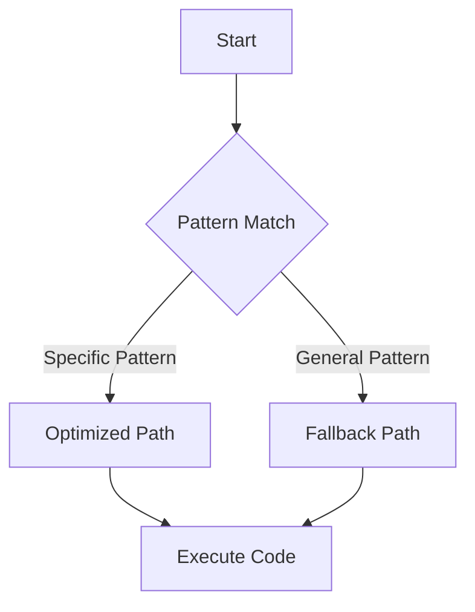

## 22.11. Optimizing Pattern Matching

Pattern matching is a powerful feature in Elixir, enabling developers to write clear, concise, and expressive code. However, as with any powerful tool, it requires careful use to ensure optimal performance. In this section, we'll explore advanced techniques for optimizing pattern matching in Elixir, focusing on the order of clauses, avoiding performance hits, and leveraging compile-time optimizations.

### Understanding Pattern Matching in Elixir

Before diving into optimization techniques, let's briefly recap what pattern matching is and how it works in Elixir. Pattern matching allows you to compare complex data structures and extract values from them in a declarative way. It's a fundamental part of Elixir's functional programming paradigm.

```elixir
# Basic pattern matching example
{status, result} = {:ok, "Success"}
IO.puts(result) # Outputs: Success
```

In the example above, the tuple `{:ok, "Success"}` is matched against the pattern `{status, result}`, binding `status` to `:ok` and `result` to `"Success"`.

### Order of Clauses

One of the key aspects of optimizing pattern matching is the order in which clauses are evaluated. Elixir evaluates pattern matches in the order they are defined, which means placing more specific patterns before general ones can lead to performance improvements.

#### Placing More Specific Patterns First

When writing functions with multiple clauses, always place the most specific patterns first. This allows Elixir to quickly eliminate non-matching cases, reducing the number of comparisons needed.

```elixir
# Example of ordering clauses for optimal pattern matching
defmodule Example do
  def process({:error, _reason}), do: "Handle error"
  def process({:ok, result}), do: "Process result: #{result}"
  def process(_), do: "Unknown response"
end
```

In the `process/1` function, the `{:error, _reason}` pattern is more specific than the `{:ok, result}` pattern, and both are more specific than the catch-all pattern `_`. By ordering them this way, we ensure that the most likely matches are evaluated first, improving performance.

#### Visualizing Clause Order

Let's visualize how the order of clauses affects performance using a flowchart:

```mermaid
flowchart TD
    A[Start] --> B{Pattern Match}
    B -->|{:error, _reason}| C[Handle Error]
    B -->|{:ok, result}| D[Process Result]
    B -->|_| E[Unknown Response]
    C --> F[End]
    D --> F
    E --> F
```

**Figure 1:** This flowchart illustrates how pattern matching proceeds from specific to general clauses.

### Avoiding Performance Hits

While pattern matching is powerful, it can also lead to performance hits if not used carefully. Here are some strategies to avoid common pitfalls.

#### Keeping Pattern Matches Simple and Clear

Complex pattern matches can be difficult for both the compiler and developers to process. Keep your patterns simple and clear to avoid unnecessary overhead.

```elixir
# Avoid complex patterns
defmodule ComplexPattern do
  def match(%{key: %{subkey: value}} = map) do
    IO.inspect(map)
    "Value: #{value}"
  end
end
```

In the example above, the pattern `%{key: %{subkey: value}}` is complex and may lead to performance issues if used extensively. Consider breaking down complex patterns into simpler components.

#### Using Guards for Additional Checks

Guards can be used to perform additional checks in pattern matching, allowing you to keep patterns simple while still enforcing constraints.

```elixir
# Using guards to simplify pattern matching
defmodule GuardExample do
  def check(value) when is_integer(value) and value > 0 do
    "Positive integer"
  end
  def check(_), do: "Not a positive integer"
end
```

By using guards, we can separate the pattern matching logic from the conditions, leading to clearer and more maintainable code.

### Compile-Time Optimizations

Elixir's compiler is capable of performing several optimizations on pattern matching code. By understanding how these optimizations work, you can write code that takes full advantage of them.

#### Leveraging the Compiler's Ability to Optimize Patterns

The Elixir compiler can optimize pattern matching by rearranging clauses and simplifying patterns. To leverage these optimizations, write patterns that are easy for the compiler to analyze.

```elixir
# Example of compiler-optimized pattern matching
defmodule CompilerOptimized do
  def match({:ok, _} = result), do: IO.inspect(result)
  def match({:error, reason}), do: IO.puts("Error: #{reason}")
end
```

In this example, the compiler can optimize the `match/1` function by recognizing that the `{:ok, _}` pattern is a subset of all possible tuples, allowing it to rearrange clauses for better performance.

#### Refactoring Complex Functions for Better Pattern Match Performance

Complex functions with multiple pattern matches can often be refactored to improve performance. Consider breaking down large functions into smaller, more focused ones.

```elixir
# Refactoring complex functions
defmodule RefactorExample do
  def process(data) do
    case data do
      {:ok, result} -> handle_success(result)
      {:error, reason} -> handle_error(reason)
      _ -> handle_unknown(data)
    end
  end

  defp handle_success(result), do: "Success: #{result}"
  defp handle_error(reason), do: "Error: #{reason}"
  defp handle_unknown(_), do: "Unknown data"
end
```

By breaking down the `process/1` function into smaller helper functions, we can improve both performance and readability.

### Try It Yourself

To solidify your understanding of pattern matching optimization, try modifying the code examples provided. Experiment with different orderings of clauses, use guards to simplify patterns, and refactor complex functions. Observe how these changes affect performance and readability.

### Visualizing Pattern Matching Optimization

To further illustrate the concept of pattern matching optimization, consider the following diagram that shows the flow of pattern matching with optimizations:


```mermaid
flowchart TD
    A[Start] --> B{Pattern Match}
    B -->|Specific Pattern| C[Optimized Path]
    C --> D[Execute Code]
    B -->|General Pattern| E[Fallback Path]
    E --> D
```

**Figure 2:** This flowchart demonstrates how optimized pattern matching proceeds through specific patterns first, reducing unnecessary evaluations.

### Key Takeaways

- **Order Matters:** Always place more specific patterns before general ones to minimize unnecessary evaluations.
- **Simplify Patterns:** Keep pattern matches simple and use guards for additional checks to avoid performance hits.
- **Leverage Compiler Optimizations:** Write patterns that the compiler can easily optimize, and refactor complex functions for better performance.

### Further Reading

To deepen your understanding of pattern matching and optimization in Elixir, consider exploring the following resources:

- [Elixir's Pattern Matching Documentation](https://elixir-lang.org/getting-started/pattern-matching.html)
- [Erlang Efficiency Guide](https://erlang.org/doc/efficiency_guide/introduction.html)
- [Elixir Performance Tips](https://elixir-lang.org/blog/2018/01/17/elixir-performance-tips/)

## Quiz Time!



### What is the primary benefit of placing more specific patterns before general ones in pattern matching?

- [x] It reduces the number of comparisons needed.
- [ ] It increases code readability.
- [ ] It makes the code more concise.
- [ ] It allows for more complex patterns.

> **Explanation:** Placing more specific patterns first allows Elixir to quickly eliminate non-matching cases, reducing the number of comparisons needed.

### How can you avoid performance hits when using pattern matching?

- [x] Keep pattern matches simple and clear.
- [ ] Use complex patterns for better accuracy.
- [ ] Avoid using guards.
- [ ] Place general patterns first.

> **Explanation:** Keeping pattern matches simple and clear helps avoid unnecessary overhead and performance hits.

### What is the role of guards in pattern matching?

- [x] They perform additional checks in pattern matching.
- [ ] They replace pattern matching.
- [ ] They make patterns more complex.
- [ ] They are used for error handling.

> **Explanation:** Guards allow you to perform additional checks in pattern matching, keeping patterns simple while enforcing constraints.

### How can the Elixir compiler optimize pattern matching?

- [x] By rearranging clauses and simplifying patterns.
- [ ] By adding more patterns.
- [ ] By removing guards.
- [ ] By making the code more complex.

> **Explanation:** The Elixir compiler can optimize pattern matching by rearranging clauses and simplifying patterns for better performance.

### What is a recommended practice when writing functions with multiple pattern matches?

- [x] Break down large functions into smaller, focused ones.
- [ ] Use as many patterns as possible.
- [ ] Avoid using helper functions.
- [ ] Place general patterns first.

> **Explanation:** Breaking down large functions into smaller, focused ones improves both performance and readability.

### Which of the following is a benefit of using guards in pattern matching?

- [x] They separate pattern matching logic from conditions.
- [ ] They make patterns more complex.
- [ ] They increase the number of comparisons.
- [ ] They are only used for error handling.

> **Explanation:** Guards separate pattern matching logic from conditions, leading to clearer and more maintainable code.

### How can you leverage the compiler's ability to optimize patterns?

- [x] Write patterns that are easy for the compiler to analyze.
- [ ] Use complex patterns for better accuracy.
- [ ] Avoid using guards.
- [ ] Place general patterns first.

> **Explanation:** Writing patterns that are easy for the compiler to analyze allows it to optimize pattern matching effectively.

### What is a common pitfall when using pattern matching?

- [x] Using complex patterns that lead to performance issues.
- [ ] Using too many guards.
- [ ] Placing specific patterns first.
- [ ] Breaking down functions into smaller ones.

> **Explanation:** Complex patterns can lead to performance issues if used extensively, so it's important to keep them simple.

### How can you improve the readability of pattern matching code?

- [x] Use guards to simplify patterns.
- [ ] Use complex patterns for better accuracy.
- [ ] Avoid using helper functions.
- [ ] Place general patterns first.

> **Explanation:** Using guards to simplify patterns improves both readability and maintainability.

### True or False: The Elixir compiler can optimize pattern matching by recognizing subsets of possible tuples.

- [x] True
- [ ] False

> **Explanation:** The Elixir compiler can recognize subsets of possible tuples and optimize pattern matching accordingly.



Remember, optimizing pattern matching is just one aspect of writing efficient Elixir code. Keep experimenting, stay curious, and enjoy the journey of mastering Elixir!
