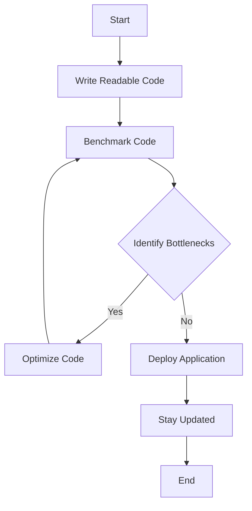

## 22.12. Best Practices for High-Performance Elixir Code

In today's fast-paced digital world, performance is a critical factor that can make or break an application. As expert developers, we must ensure that our Elixir applications are not only correct but also efficient and scalable. This section will guide you through the best practices for writing high-performance Elixir code, focusing on code readability, benchmarking, avoiding premature optimization, and staying updated with the latest advancements.

### Code Readability and Maintainability

Writing clear and maintainable code is the foundation of any high-performance application. While it may seem counterintuitive, readable code often leads to better performance because it is easier to understand, debug, and optimize.

#### Key Practices for Readable Code

1. **Use Descriptive Variable Names**: Choose names that convey the purpose of the variable.
2. **Keep Functions Small and Focused**: Each function should do one thing and do it well.
3. **Use Pattern Matching**: Leverage Elixir's powerful pattern matching to make your code more expressive and concise.
4. **Document Your Code**: Use comments and documentation to explain complex logic.

#### Example

```elixir
defmodule Calculator do
  @moduledoc """
  A simple calculator module for basic arithmetic operations.
  """

  @doc """
  Adds two numbers.
  """
  def add(a, b) do
    a + b
  end

  @doc """
  Subtracts the second number from the first.
  """
  def subtract(a, b) do
    a - b
  end
end
```

### Benchmarking Before Optimizing

Before diving into optimization, it's crucial to identify the actual bottlenecks in your application. Benchmarking allows you to gather data and make informed decisions about where to focus your optimization efforts.

#### Tools for Benchmarking

- **Benchee**: A powerful benchmarking library for Elixir that provides detailed reports.
- **ExProf**: A simple profiler for Elixir to measure function execution time.

#### Example: Using Benchee

```elixir
defmodule MyBenchmark do
  def run do
    Benchee.run(%{
      "map" => fn -> Enum.map(1..1000, &(&1 * 2)) end,
      "comprehension" => fn -> for n <- 1..1000, do: n * 2 end
    })
  end
end
```

### Avoiding Premature Optimization

Premature optimization can lead to complex, hard-to-maintain code. Focus on writing correct and clear code first, then optimize based on actual performance data.

#### Strategies to Avoid Premature Optimization

1. **Profile First**: Use profiling tools to identify slow parts of your code.
2. **Optimize the Right Parts**: Focus on optimizing the parts of your code that have the most significant impact on performance.
3. **Iterate**: Make small, incremental changes and measure their impact.

### Keeping Updated

The Elixir and Erlang ecosystems are constantly evolving, with regular updates that bring performance improvements. Staying informed about these changes can help you leverage new features and optimizations.

#### How to Stay Updated

- **Follow Official Blogs and Forums**: Keep an eye on announcements from the Elixir and Erlang teams.
- **Participate in the Community**: Engage with the Elixir community through forums, conferences, and meetups.
- **Experiment with New Features**: Try out new language features and libraries in your projects.

### Advanced Performance Techniques

#### Efficient Data Structures

Choosing the right data structure can have a significant impact on performance. Elixir provides several efficient data structures, such as lists, tuples, and maps, each with its own strengths and weaknesses.

#### Example: Choosing the Right Data Structure

- **Lists**: Great for sequential access and pattern matching.
- **Tuples**: Ideal for fixed-size collections and fast access.
- **Maps**: Best for key-value pairs and fast lookups.

#### Code Example

```elixir
# Using a list for sequential access
list = [1, 2, 3, 4, 5]

# Using a tuple for fixed-size collection
tuple = {:ok, "Success"}

# Using a map for key-value pairs
map = %{"name" => "Alice", "age" => 30}
```

#### Parallel Processing

Elixir's concurrency model, based on the Actor Model, allows for efficient parallel processing. Use processes and tasks to distribute work across multiple cores.

#### Example: Using Tasks for Parallel Processing

```elixir
defmodule ParallelExample do
  def run do
    tasks = for i <- 1..10 do
      Task.async(fn -> perform_task(i) end)
    end

    results = Enum.map(tasks, &Task.await/1)
    IO.inspect(results)
  end

  defp perform_task(i) do
    # Simulate a time-consuming task
    :timer.sleep(1000)
    i * 2
  end
end
```

### Visualizing Performance Optimization

To better understand the flow of performance optimization, let's visualize the process using a flowchart.



**Caption**: This flowchart illustrates the iterative process of writing high-performance Elixir code, from writing readable code to benchmarking, identifying bottlenecks, optimizing, and staying updated.

### Knowledge Check

- **What are the benefits of writing readable code?**
- **Why is benchmarking important before optimization?**
- **What is premature optimization, and why should it be avoided?**
- **How can you stay updated with the latest Elixir performance improvements?**

### Try It Yourself

Experiment with the provided code examples by modifying them to suit your needs. For instance, try changing the range in the benchmarking example or adding more tasks in the parallel processing example. Observe how these changes impact performance.

### Summary

In this section, we've explored best practices for writing high-performance Elixir code. By focusing on code readability, benchmarking, avoiding premature optimization, and staying updated, you can ensure that your applications are both efficient and maintainable. Remember, performance optimization is an ongoing process that requires careful consideration and iteration.

## Quiz: Best Practices for High-Performance Elixir Code



### What is the primary benefit of writing readable code in Elixir?

- [x] It makes the code easier to understand and optimize.
- [ ] It automatically improves performance.
- [ ] It reduces the need for documentation.
- [ ] It eliminates the need for testing.

> **Explanation:** Readable code is easier to understand, debug, and optimize, leading to better performance.

### Which tool is commonly used for benchmarking in Elixir?

- [x] Benchee
- [ ] ExUnit
- [ ] Dialyzer
- [ ] Credo

> **Explanation:** Benchee is a popular benchmarking tool in Elixir that provides detailed performance reports.

### Why should premature optimization be avoided?

- [x] It can lead to complex and hard-to-maintain code.
- [ ] It always results in slower code.
- [ ] It is unnecessary if the code is already correct.
- [ ] It is only applicable to small projects.

> **Explanation:** Premature optimization can make code complex and difficult to maintain, which is why it should be avoided until necessary.

### How can you identify performance bottlenecks in your Elixir code?

- [x] By using profiling tools
- [ ] By guessing based on code complexity
- [ ] By rewriting the entire codebase
- [ ] By reducing the number of functions

> **Explanation:** Profiling tools help identify slow parts of the code, allowing for targeted optimization.

### What is the advantage of using tasks for parallel processing in Elixir?

- [x] It allows for efficient distribution of work across multiple cores.
- [ ] It simplifies code readability.
- [ ] It eliminates the need for processes.
- [ ] It automatically benchmarks the code.

> **Explanation:** Tasks enable efficient parallel processing by distributing work across multiple cores.

### What should be the first step in performance optimization?

- [x] Benchmarking the code
- [ ] Rewriting the codebase
- [ ] Adding more processes
- [ ] Reducing function size

> **Explanation:** Benchmarking helps identify the actual performance bottlenecks before optimization.

### How can you stay updated with the latest performance improvements in Elixir?

- [x] Follow official blogs and participate in the community.
- [ ] Only use the latest version of Elixir.
- [ ] Avoid using third-party libraries.
- [ ] Focus solely on Erlang updates.

> **Explanation:** Staying informed through official channels and community engagement helps leverage new features and optimizations.

### What is the role of pattern matching in Elixir code?

- [x] It makes the code more expressive and concise.
- [ ] It automatically optimizes performance.
- [ ] It replaces the need for functions.
- [ ] It is only used for error handling.

> **Explanation:** Pattern matching enhances code expressiveness and conciseness, contributing to readability and maintainability.

### Which data structure is best for key-value pairs in Elixir?

- [x] Maps
- [ ] Lists
- [ ] Tuples
- [ ] Strings

> **Explanation:** Maps are ideal for key-value pairs and provide fast lookups.

### True or False: Performance optimization is a one-time process.

- [ ] True
- [x] False

> **Explanation:** Performance optimization is an ongoing process that requires continuous monitoring and iteration.



Remember, this is just the beginning. As you progress, you'll build more complex and efficient Elixir applications. Keep experimenting, stay curious, and enjoy the journey!
