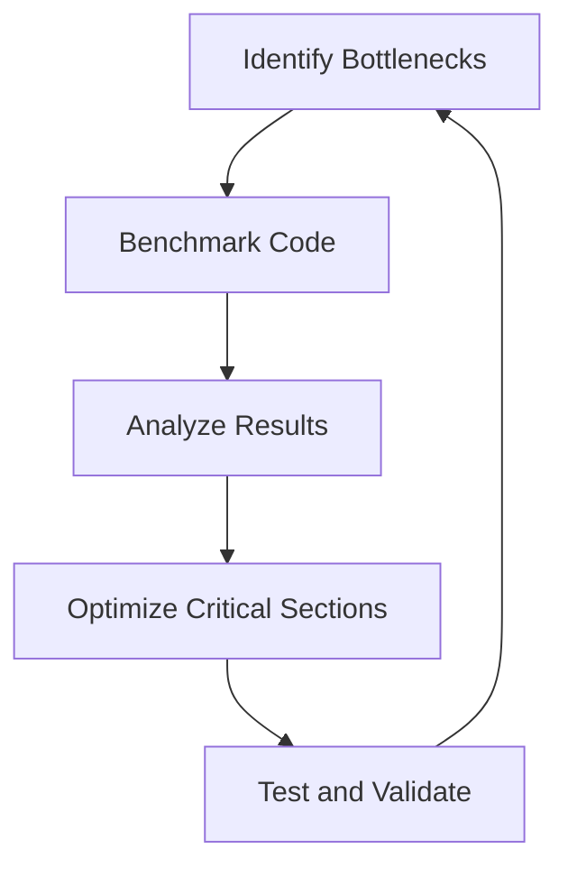

## 22.12. Best Practices for High-Performance Elixir Code

In this section, we will delve into the best practices for writing high-performance Elixir code. As expert software engineers and architects, our goal is to create systems that are not only correct but also efficient and scalable. Elixir, with its functional programming paradigm and powerful concurrency model, provides a robust foundation for building high-performance applications. However, achieving optimal performance requires careful consideration and adherence to best practices. Let's explore these practices in detail.

### Code Readability and Maintainability

**Explain the Importance of Readability:** Writing clear and maintainable code is crucial for long-term success. Readable code is easier to understand, debug, and optimize. It also facilitates collaboration among team members and reduces the risk of introducing bugs during future modifications.

**Demonstrate with Examples:**

```elixir
# Poorly written code
defmodule Example do
  def process(data) do
    Enum.map(data, fn x -> x * 2 end)
  end
end

# Improved readability
defmodule Example do
  def double_elements(data) do
    Enum.map(data, &double/1)
  end

  defp double(x), do: x * 2
end
```

**Highlight Key Points:** In the improved version, the function name `double_elements` clearly indicates its purpose, and the use of a private helper function `double/1` enhances readability.

**Provide Guidelines:**

- Use descriptive function and variable names.
- Break complex functions into smaller, focused functions.
- Adhere to consistent coding style and conventions.

### Benchmarking Before Optimizing

**Explain the Need for Benchmarking:** Before optimizing code, it's essential to identify performance bottlenecks. Benchmarking provides data-driven insights into which parts of the code require optimization.

**Demonstrate with Examples:**

```elixir
# Using Benchee for benchmarking
defmodule BenchmarkExample do
  def run do
    list = Enum.to_list(1..1_000_000)
    Benchee.run(%{
      "Enum.map" => fn -> Enum.map(list, &(&1 * 2)) end,
      "Stream.map" => fn -> Stream.map(list, &(&1 * 2)) |> Enum.to_list() end
    })
  end
end
```

**Highlight Key Points:** The example uses the Benchee library to compare the performance of `Enum.map` and `Stream.map`. Benchmarking helps make informed decisions about which approach to use.

**Provide Guidelines:**

- Use benchmarking tools like Benchee to measure performance.
- Focus on real-world scenarios and representative data sets.
- Analyze results to identify bottlenecks and prioritize optimizations.

### Avoiding Premature Optimization

**Explain the Risks of Premature Optimization:** Premature optimization can lead to complex, hard-to-maintain code. It's important to focus on correctness and clarity first, and optimize only when necessary.

**Provide Guidelines:**

- Prioritize code correctness and clarity.
- Optimize only after identifying performance bottlenecks.
- Use profiling tools to guide optimization efforts.

### Keeping Updated

**Explain the Importance of Staying Updated:** Elixir and Erlang are constantly evolving, with new versions bringing performance improvements and new features. Staying informed about these updates ensures that your code benefits from the latest advancements.

**Provide Guidelines:**

- Regularly check for updates to Elixir and Erlang.
- Review release notes for performance improvements and new features.
- Consider upgrading dependencies to leverage improvements.

### Practical Examples and Exercises

**Exercise 1: Refactor for Readability**

Refactor the following code to improve readability:

```elixir
defmodule MathOperations do
  def calculate(input) do
    input |> Enum.map(&(&1 * &1)) |> Enum.sum()
  end
end
```

**Exercise 2: Benchmarking Practice**

Use Benchee to benchmark the performance of the following functions:

```elixir
defmodule PerformanceTest do
  def square_list(list), do: Enum.map(list, &(&1 * &1))
  def cube_list(list), do: Enum.map(list, &(&1 * &1 * &1))
end
```

### Visualizing Performance Optimization


```mermaid
graph TD;
    A[Identify Bottlenecks] --> B[Benchmark Code];
    B --> C[Analyze Results];
    C --> D[Optimize Critical Sections];
    D --> E[Test and Validate];
    E --> A;
```

**Diagram Description:** This flowchart illustrates the iterative process of performance optimization: identifying bottlenecks, benchmarking code, analyzing results, optimizing critical sections, and testing the changes.

### Knowledge Check

**Pose Questions:**

- What are the benefits of writing readable code?
- Why is benchmarking important before optimizing code?
- How can premature optimization negatively impact a project?

### Embrace the Journey

Remember, achieving high performance is a continuous journey. As you implement these best practices, you'll create efficient, scalable, and maintainable Elixir applications. Keep experimenting, stay curious, and enjoy the process of optimization!

## Quiz Time!



### What is the primary benefit of writing readable code?

- [x] It makes code easier to understand and maintain.
- [ ] It improves the runtime performance of the code.
- [ ] It reduces the need for testing.
- [ ] It eliminates the need for comments.

> **Explanation:** Readable code is easier to understand, maintain, and modify, which is crucial for long-term project success.

### Why should you benchmark code before optimizing it?

- [x] To identify performance bottlenecks.
- [ ] To increase the complexity of the code.
- [ ] To ensure the code is free of syntax errors.
- [ ] To reduce the number of functions in the codebase.

> **Explanation:** Benchmarking helps identify which parts of the code are performance bottlenecks, allowing targeted optimization.

### What is a potential risk of premature optimization?

- [x] It can lead to complex, hard-to-maintain code.
- [ ] It always improves code performance.
- [ ] It simplifies the codebase.
- [ ] It eliminates the need for testing.

> **Explanation:** Premature optimization can make code unnecessarily complex and difficult to maintain.

### How can you stay updated with the latest Elixir and Erlang advancements?

- [x] Regularly check for updates and review release notes.
- [ ] Ignore new updates to maintain stability.
- [ ] Only update when a major version is released.
- [ ] Avoid upgrading dependencies.

> **Explanation:** Regularly checking for updates and reviewing release notes ensures you benefit from the latest performance improvements and features.

### What tool can be used for benchmarking Elixir code?

- [x] Benchee
- [ ] ExUnit
- [ ] Dialyzer
- [ ] IEx

> **Explanation:** Benchee is a popular tool for benchmarking Elixir code to measure performance.

### Which of the following is NOT a best practice for high-performance Elixir code?

- [ ] Writing readable code
- [ ] Benchmarking before optimizing
- [ ] Avoiding premature optimization
- [x] Ignoring performance bottlenecks

> **Explanation:** Ignoring performance bottlenecks is not a best practice; identifying and addressing them is crucial for optimization.

### What is the purpose of using the `Stream` module in Elixir?

- [x] To enable lazy evaluation for potentially large data sets.
- [ ] To immediately evaluate all elements in a list.
- [ ] To replace the `Enum` module.
- [ ] To handle concurrent processes.

> **Explanation:** The `Stream` module allows for lazy evaluation, which can be beneficial for handling large data sets efficiently.

### How can you improve the readability of Elixir code?

- [x] Use descriptive function names and break complex functions into smaller ones.
- [ ] Use single-letter variable names for brevity.
- [ ] Avoid using comments.
- [ ] Write all code in a single module.

> **Explanation:** Descriptive function names and breaking down complex functions improve code readability and maintainability.

### What is the benefit of using private helper functions in Elixir?

- [x] They encapsulate logic and improve code readability.
- [ ] They make code execution faster.
- [ ] They reduce the number of lines of code.
- [ ] They eliminate the need for public functions.

> **Explanation:** Private helper functions encapsulate specific logic, making the main function more readable and maintainable.

### True or False: Optimizing code should always be the first priority in software development.

- [ ] True
- [x] False

> **Explanation:** Correctness and clarity should be prioritized first. Optimization should be done after identifying performance bottlenecks.



By following these best practices, you'll be well-equipped to write high-performance Elixir code that is both efficient and maintainable. Keep exploring and refining your skills, and you'll continue to build robust and scalable applications.
