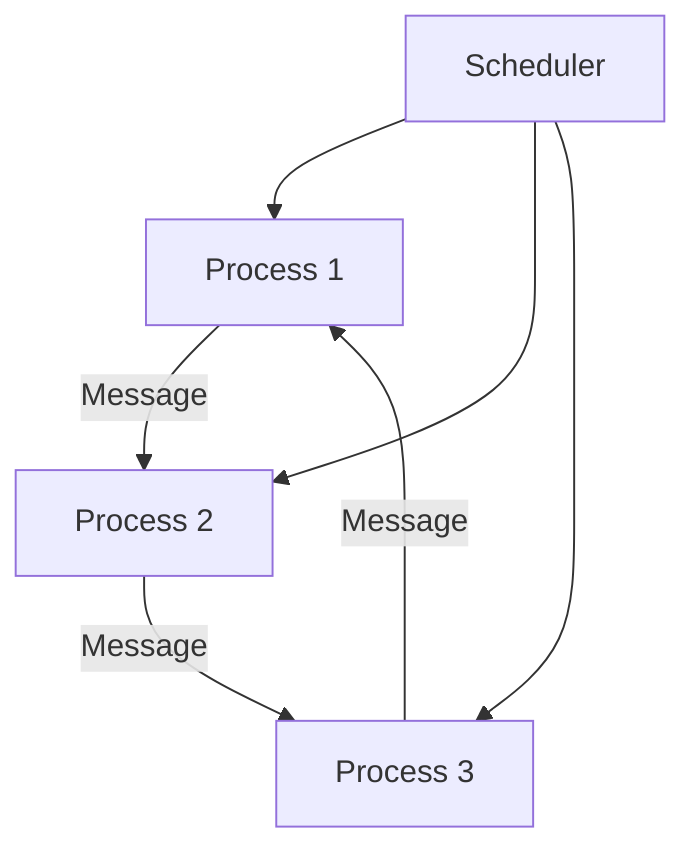

## 22.2. Optimizing Code for the BEAM VM

Optimizing code for the BEAM (Bogdan/Björn's Erlang Abstract Machine) VM is crucial for leveraging the full potential of Elixir applications. The BEAM VM is renowned for its ability to handle massive concurrency, fault tolerance, and distributed systems. In this section, we will delve into understanding BEAM internals, explore efficient code patterns, and identify common performance pitfalls to avoid.

### Understanding BEAM Internals

To optimize Elixir code effectively, it's essential to understand how the BEAM VM executes code and manages memory. The BEAM VM is designed to run Erlang and Elixir efficiently, with a focus on concurrency and fault tolerance. Let's explore some key aspects of the BEAM VM:

#### Process Model

The BEAM VM uses lightweight processes to achieve concurrency. Each process has its own memory space and runs independently. This model allows for millions of concurrent processes without significant overhead.

```elixir
# Example of spawning a process in Elixir
spawn(fn -> IO.puts("Hello from a process!") end)
```

#### Garbage Collection

The BEAM VM employs per-process garbage collection, which means each process has its own garbage collector. This approach minimizes pause times and ensures that garbage collection does not impact other processes.

#### Scheduling

The BEAM VM uses a preemptive scheduler to manage processes. It ensures fair scheduling by giving each process a small time slice to execute. This model is crucial for maintaining responsiveness in concurrent applications.

#### Memory Management

Memory management in the BEAM VM is optimized for immutability and message passing. Data is copied between processes to ensure isolation, which can impact performance if not managed carefully.

### Efficient Code Patterns

Writing efficient code for the BEAM VM involves aligning with its optimization strategies. Here are some patterns to consider:

#### Use Tail Call Optimization

Tail call optimization (TCO) is a technique where the last operation of a function is a call to another function. The BEAM VM optimizes tail-recursive functions to prevent stack overflow and reduce memory usage.

```elixir
# Tail-recursive function example
defmodule Factorial do
  def calculate(n), do: calculate(n, 1)

  defp calculate(0, acc), do: acc
  defp calculate(n, acc), do: calculate(n - 1, n * acc)
end
```

#### Leverage Pattern Matching

Pattern matching is a powerful feature in Elixir that can simplify code and improve performance. Use pattern matching to destructure data and handle different cases efficiently.

```elixir
# Pattern matching example
defmodule Example do
  def process({:ok, result}), do: IO.puts("Success: #{result}")
  def process({:error, reason}), do: IO.puts("Error: #{reason}")
end
```

#### Utilize the Pipe Operator

The pipe operator (`|>`) is a hallmark of Elixir's functional programming style. It allows for clear and concise function chaining, improving readability and maintainability.

```elixir
# Pipe operator example
"hello"
|> String.upcase()
|> String.reverse()
```

#### Optimize Data Structures

Choosing the right data structures can have a significant impact on performance. Use lists for sequential data and maps for key-value pairs. Consider using ETS (Erlang Term Storage) for large datasets that require fast access.

```elixir
# Using ETS for fast data access
:ets.new(:my_table, [:set, :public])
:ets.insert(:my_table, {:key, "value"})
```

### Avoiding Performance Pitfalls

Recognizing and avoiding common performance pitfalls is crucial for optimizing Elixir applications. Here are some anti-patterns to watch out for:

#### Avoid Blocking Operations

Blocking operations can hinder the performance of concurrent applications. Use asynchronous tasks and non-blocking I/O to prevent bottlenecks.

```elixir
# Asynchronous task example
Task.async(fn -> perform_heavy_computation() end)
```

#### Minimize Message Passing Overhead

While message passing is a core feature of the BEAM VM, excessive message passing can lead to performance degradation. Structure your application to minimize unnecessary communication between processes.

#### Be Cautious with Large Data Structures

Handling large data structures can lead to memory bloat and slow performance. Use streaming and lazy evaluation techniques to process data efficiently.

```elixir
# Stream example for lazy evaluation
File.stream!("large_file.txt")
|> Stream.map(&String.upcase/1)
|> Enum.to_list()
```

#### Optimize for Immutability

Immutability is a fundamental concept in Elixir, but it can lead to performance issues if not managed properly. Avoid excessive copying of large data structures and use efficient algorithms.

### Visualizing BEAM Execution

To better understand how the BEAM VM executes code, let's visualize the process model and scheduling using Mermaid.js diagrams.



**Caption:** This diagram illustrates the message passing between processes and the role of the scheduler in managing process execution.

### References and Links

For further reading on optimizing Elixir code for the BEAM VM, consider the following resources:

- [Erlang Efficiency Guide](https://erlang.org/doc/efficiency_guide/introduction.html)
- [Elixir Performance Tips](https://elixir-lang.org/getting-started/performance.html)
- [BEAM VM Internals](https://www.erlang-solutions.com/blog/beam-the-virtual-machine.html)

### Knowledge Check

To reinforce your understanding of optimizing code for the BEAM VM, consider the following questions:

1. What is the primary advantage of the BEAM VM's process model?
2. How does the BEAM VM handle garbage collection?
3. What is tail call optimization, and why is it important?
4. How can pattern matching improve code performance in Elixir?
5. Why should blocking operations be avoided in concurrent applications?

### Embrace the Journey

Optimizing code for the BEAM VM is a journey that requires a deep understanding of its internals and careful consideration of code patterns. Remember, this is just the beginning. As you progress, you'll build more efficient and scalable Elixir applications. Keep experimenting, stay curious, and enjoy the journey!

## Quiz: Optimizing Code for the BEAM VM



### What is the primary advantage of the BEAM VM's process model?

- [x] It allows for massive concurrency with lightweight processes.
- [ ] It uses a single-threaded execution model.
- [ ] It relies on shared memory for communication.
- [ ] It requires manual memory management.

> **Explanation:** The BEAM VM's process model allows for massive concurrency by using lightweight processes, each with its own memory space.

### How does the BEAM VM handle garbage collection?

- [x] It uses per-process garbage collection to minimize pause times.
- [ ] It uses a global garbage collector for all processes.
- [ ] It requires manual garbage collection.
- [ ] It does not perform garbage collection.

> **Explanation:** The BEAM VM employs per-process garbage collection, ensuring that garbage collection does not impact other processes.

### What is tail call optimization, and why is it important?

- [x] It optimizes tail-recursive functions to prevent stack overflow.
- [ ] It allows functions to call themselves indefinitely.
- [ ] It improves the readability of recursive functions.
- [ ] It eliminates the need for recursion.

> **Explanation:** Tail call optimization optimizes tail-recursive functions to prevent stack overflow and reduce memory usage.

### How can pattern matching improve code performance in Elixir?

- [x] By simplifying code and handling different cases efficiently.
- [ ] By allowing for dynamic typing.
- [ ] By reducing the need for function calls.
- [ ] By enabling mutable state.

> **Explanation:** Pattern matching simplifies code and improves performance by efficiently handling different cases.

### Why should blocking operations be avoided in concurrent applications?

- [x] They can hinder performance by creating bottlenecks.
- [ ] They improve the reliability of the application.
- [ ] They simplify the code structure.
- [ ] They enhance security.

> **Explanation:** Blocking operations can create bottlenecks in concurrent applications, hindering performance.

### What is the role of the BEAM VM's scheduler?

- [x] To manage process execution with a preemptive scheduling model.
- [ ] To allocate memory for processes.
- [ ] To handle garbage collection.
- [ ] To compile Elixir code.

> **Explanation:** The BEAM VM's scheduler manages process execution using a preemptive scheduling model to ensure fair scheduling.

### How can the pipe operator improve code readability?

- [x] By allowing for clear and concise function chaining.
- [ ] By enabling dynamic typing.
- [ ] By reducing the need for pattern matching.
- [ ] By allowing for mutable state.

> **Explanation:** The pipe operator allows for clear and concise function chaining, improving code readability.

### What is the impact of excessive message passing on performance?

- [x] It can lead to performance degradation.
- [ ] It improves the reliability of the application.
- [ ] It simplifies the code structure.
- [ ] It enhances security.

> **Explanation:** Excessive message passing can lead to performance degradation by increasing communication overhead.

### How can ETS be used to optimize data access?

- [x] By providing fast access to large datasets.
- [ ] By enabling dynamic typing.
- [ ] By reducing the need for pattern matching.
- [ ] By allowing for mutable state.

> **Explanation:** ETS (Erlang Term Storage) provides fast access to large datasets, optimizing data access.

### True or False: The BEAM VM requires manual memory management.

- [ ] True
- [x] False

> **Explanation:** The BEAM VM does not require manual memory management; it handles memory management automatically.


