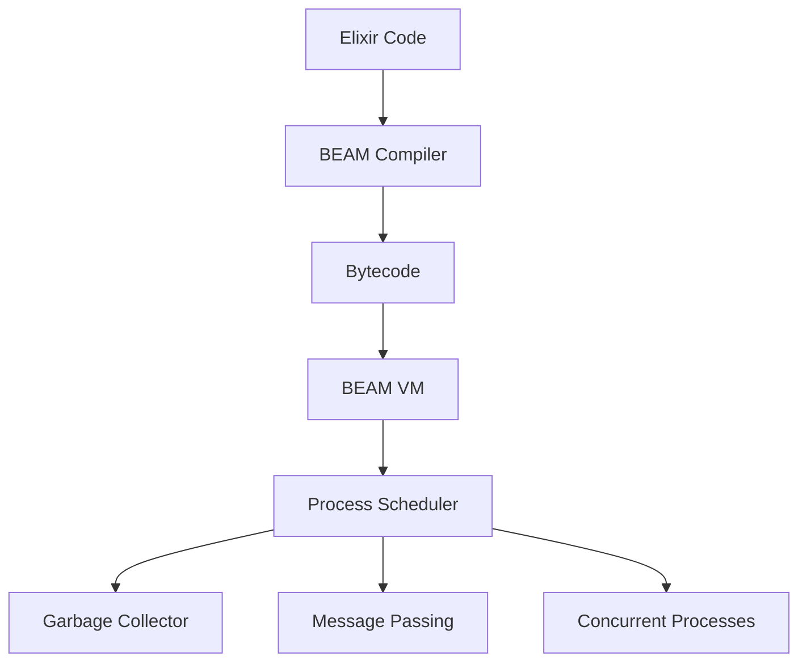

## 22.2. Optimizing Code for the BEAM VM

The BEAM VM (Bogdan/Björn's Erlang Abstract Machine) is the heart of Elixir's runtime environment, known for its ability to handle massive concurrency with ease. To harness its full potential, it's crucial to understand how the BEAM executes code, manages memory, and to write code that aligns with its optimization strategies. This section will guide you through these aspects, helping you to avoid common performance pitfalls and to write efficient Elixir code.

### Understanding BEAM Internals

Before diving into optimization techniques, let's explore the internals of the BEAM VM, which will provide a foundation for understanding how to write performant Elixir code.

#### How the VM Executes Code

The BEAM VM is a register-based virtual machine designed to efficiently execute Erlang and Elixir code. It translates high-level code into bytecode, which is then executed by the VM. Here's a brief overview of its execution model:

- **Concurrency Model**: The BEAM uses lightweight processes for concurrency. Each process has its own heap, which minimizes contention and allows for efficient garbage collection.
- **Preemptive Scheduling**: Processes are scheduled preemptively, meaning the VM can interrupt a running process to give time to others, ensuring fair CPU time distribution.
- **Garbage Collection**: Each process has its own garbage collector, allowing for quick and isolated memory cleanup without affecting other processes.
- **Message Passing**: Processes communicate via message passing, which is asynchronous and non-blocking, making it ideal for concurrent applications.

#### Memory Management

Memory management in the BEAM is designed to support its concurrency model:

- **Per-Process Heap**: Each process has its own heap, which is small and quickly collected. This design reduces pause times and improves responsiveness.
- **Binary Data Handling**: Large binaries are stored in a shared heap to avoid duplication and reduce memory usage.
- **Garbage Collection**: The BEAM uses a generational garbage collector, which is efficient for processes with short-lived data.

### Efficient Code Patterns

To write efficient Elixir code, it's essential to adopt patterns that align with the BEAM's strengths. Here are some key patterns to consider:

#### Pattern Matching

Pattern matching is a powerful feature in Elixir that can be used to write clear and efficient code. It allows you to destructure data and match against specific structures, reducing the need for complex conditional logic.

```elixir
defmodule Example do
  def process({:ok, data}) do
    # Handle success case
    IO.puts("Data processed: #{data}")
  end

  def process({:error, reason}) do
    # Handle error case
    IO.puts("Error: #{reason}")
  end
end
```

#### Tail Call Optimization

Tail call optimization (TCO) is a technique used to optimize recursive functions by reusing stack frames. The BEAM VM supports TCO, allowing you to write recursive functions without worrying about stack overflow.

```elixir
defmodule Factorial do
  def calculate(n), do: calculate(n, 1)

  defp calculate(0, acc), do: acc
  defp calculate(n, acc), do: calculate(n - 1, acc * n)
end
```

#### Using Binaries Efficiently

When working with binary data, it's important to use binaries efficiently to minimize memory usage and improve performance.

```elixir
defmodule BinaryExample do
  def join_binaries(bin1, bin2) do
    <<bin1::binary, bin2::binary>>
  end
end
```

#### Leveraging Concurrency

The BEAM's concurrency model is one of its greatest strengths. Use processes to handle concurrent tasks, and leverage libraries like `Task` and `GenServer` to manage them effectively.

```elixir
defmodule ConcurrentExample do
  def run_tasks do
    task1 = Task.async(fn -> perform_task1() end)
    task2 = Task.async(fn -> perform_task2() end)

    Task.await(task1)
    Task.await(task2)
  end

  defp perform_task1 do
    # Perform some task
  end

  defp perform_task2 do
    # Perform another task
  end
end
```

### Avoiding Performance Pitfalls

While writing efficient code is important, it's equally crucial to avoid common pitfalls that can degrade performance.

#### Recognizing Anti-Patterns

Certain anti-patterns can lead to inefficient code execution on the BEAM VM. Here are a few to watch out for:

- **Blocking Operations**: Avoid blocking operations in processes, as they can lead to bottlenecks and reduce concurrency.
- **Shared State**: Minimize shared state between processes to avoid contention and improve scalability.
- **Excessive Message Passing**: While message passing is efficient, excessive use can lead to increased memory usage and reduced performance.

#### Optimizing Data Structures

Choosing the right data structures can have a significant impact on performance. Use lists for sequential data and maps for key-value storage, and consider using ETS (Erlang Term Storage) for large datasets that need to be accessed concurrently.

```elixir
defmodule DataStructureExample do
  def process_list(list) do
    Enum.map(list, fn item -> item * 2 end)
  end

  def process_map(map) do
    Map.new(map, fn {key, value} -> {key, value * 2} end)
  end
end
```

### Visualizing BEAM's Execution Model

To better understand the BEAM's execution model, let's visualize it using a Mermaid.js diagram:


```mermaid
flowchart TD
    A[Elixir Code] --> B[BEAM Compiler]
    B --> C[Bytecode]
    C --> D[BEAM VM]
    D --> E[Process Scheduler]
    E --> F[Garbage Collector]
    E --> G[Message Passing]
    E --> H[Concurrent Processes]
```

This diagram illustrates how Elixir code is compiled into bytecode, which is then executed by the BEAM VM. The VM manages processes, schedules them, and handles garbage collection and message passing.

### Try It Yourself

To solidify your understanding of these concepts, try modifying the code examples provided. Experiment with different data structures, recursive functions, and concurrency models to see how they affect performance.

### References and Links

- [Elixir Official Documentation](https://elixir-lang.org/docs.html)
- [Erlang Efficiency Guide](https://erlang.org/doc/efficiency_guide/introduction.html)
- [Learn You Some Erlang for Great Good!](https://learnyousomeerlang.com/)

### Knowledge Check

1. What is the BEAM VM and how does it handle concurrency?
2. How does pattern matching improve code efficiency in Elixir?
3. What are the benefits of using tail call optimization?
4. Why is it important to avoid blocking operations in processes?
5. How can you optimize binary data handling in Elixir?

### Embrace the Journey

Remember, optimizing Elixir code for the BEAM VM is an ongoing journey. As you gain experience, you'll discover new techniques and strategies to improve performance. Keep experimenting, stay curious, and enjoy the process!

## Quiz Time!



### What is the primary advantage of the BEAM VM's concurrency model?

- [x] Lightweight processes with isolated heaps
- [ ] Shared memory for all processes
- [ ] Synchronous message passing
- [ ] Heavyweight threads

> **Explanation:** The BEAM VM uses lightweight processes with isolated heaps, allowing for efficient concurrency and minimal contention.

### How does tail call optimization benefit recursive functions?

- [x] It reuses stack frames to prevent stack overflow
- [ ] It increases the recursion depth
- [ ] It speeds up function execution
- [ ] It simplifies code readability

> **Explanation:** Tail call optimization reuses stack frames, preventing stack overflow in recursive functions.

### Why is pattern matching considered efficient in Elixir?

- [x] It allows for direct data destructuring
- [ ] It requires complex conditional logic
- [ ] It slows down code execution
- [ ] It increases memory usage

> **Explanation:** Pattern matching allows for direct data destructuring, making code more efficient and readable.

### What is a common pitfall when using message passing in Elixir?

- [x] Excessive message passing can increase memory usage
- [ ] Message passing is always synchronous
- [ ] Message passing blocks processes
- [ ] Message passing is inefficient

> **Explanation:** Excessive message passing can lead to increased memory usage, affecting performance.

### Which data structure is best for key-value storage in Elixir?

- [x] Maps
- [ ] Lists
- [ ] Tuples
- [ ] Binaries

> **Explanation:** Maps are ideal for key-value storage due to their efficient lookup and update operations.

### What should be avoided to prevent bottlenecks in Elixir processes?

- [x] Blocking operations
- [ ] Pattern matching
- [ ] Tail call optimization
- [ ] Using binaries

> **Explanation:** Blocking operations can lead to bottlenecks and reduce concurrency in Elixir processes.

### How does the BEAM VM handle garbage collection?

- [x] Each process has its own garbage collector
- [ ] A global garbage collector manages all processes
- [ ] Garbage collection is manual
- [ ] Garbage collection is not supported

> **Explanation:** Each process in the BEAM VM has its own garbage collector, allowing for efficient memory management.

### What is the benefit of using ETS for large datasets?

- [x] Concurrent access and efficient storage
- [ ] Reduced memory usage
- [ ] Simplified code structure
- [ ] Improved readability

> **Explanation:** ETS allows for concurrent access and efficient storage of large datasets.

### How does the BEAM VM ensure fair CPU time distribution?

- [x] Preemptive scheduling
- [ ] Cooperative scheduling
- [ ] Round-robin scheduling
- [ ] Priority-based scheduling

> **Explanation:** The BEAM VM uses preemptive scheduling to ensure fair CPU time distribution among processes.

### What is the purpose of the BEAM VM's generational garbage collector?

- [x] Efficiently collect short-lived data
- [ ] Collect all data at once
- [ ] Reduce memory usage
- [ ] Increase execution speed

> **Explanation:** The generational garbage collector efficiently collects short-lived data, improving performance.


