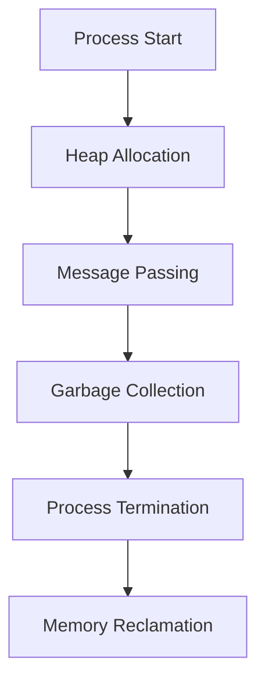

## 22.3. Reducing Memory Usage

In the world of high-performance applications, efficient memory usage is crucial. Elixir, running on the BEAM (Bogdan/Björn's Erlang Abstract Machine), offers unique memory management capabilities. In this section, we will explore how to optimize memory usage in Elixir applications by understanding BEAM's memory model, employing effective strategies, and leveraging garbage collection.

### Memory Management on the BEAM

The BEAM virtual machine is designed to handle concurrent processes efficiently. Each process in BEAM has its own heap, stack, and process dictionary, which means memory is isolated between processes. This isolation is a double-edged sword: it provides safety and fault tolerance but can lead to increased memory usage if not managed properly.

#### How Processes Consume and Release Memory

1. **Process Isolation**: Each process has its own memory space, which prevents memory corruption across processes but can lead to higher overall memory usage.
2. **Heap Management**: Processes allocate memory on their own heap. When a process terminates, its memory is reclaimed.
3. **Message Passing**: Data is copied between process heaps during message passing, which can increase memory usage if large data structures are frequently passed.

### Strategies for Reducing Memory Usage

#### Minimizing Large Data Structures in Process State

1. **Avoid Storing Large Data in Process State**: Keep process state minimal. Use external storage like ETS (Erlang Term Storage) for large data.
   
   ```elixir
   defmodule MyProcess do
     use GenServer

     def init(_) do
       # Initialize with minimal state
       {:ok, %{}}
     end

     def handle_call(:get_large_data, _from, state) do
       # Fetch large data from ETS instead of storing in state
       large_data = :ets.lookup(:my_table, :large_data)
       {:reply, large_data, state}
     end
   end
   ```

2. **Use References for Large Data**: Instead of copying large data structures, use references or identifiers to access them.

#### Using Binaries Wisely to Prevent Memory Leaks

1. **Binary Handling**: Large binaries (>64 bytes) are stored outside the process heap and are reference-counted. This can lead to memory leaks if binaries are not handled properly.

   - **Avoid Long-Lived Binaries**: Ensure binaries are not held in process state for long durations.
   - **Use `:binary.copy/1`**: To ensure a binary is not shared across processes, use `:binary.copy/1` to create a new binary.

   ```elixir
   def handle_call(:process_binary, _from, state) do
     # Copy binary to avoid sharing
     binary = :binary.copy(state[:large_binary])
     {:reply, process(binary), state}
   end
   ```

2. **Binary Matching**: Use binary pattern matching to process binaries efficiently without copying them.

   ```elixir
   def parse_binary(<<header::binary-size(4), body::binary>>) do
     # Process header and body separately
     {header, body}
   end
   ```

### Garbage Collection

Garbage collection in BEAM is process-level, meaning each process collects its own garbage independently. This approach minimizes pause times but requires understanding to optimize memory usage.

#### Understanding Process-Level Garbage Collection

1. **Generational Garbage Collection**: BEAM uses a generational garbage collector, which is efficient for short-lived processes but can lead to memory bloat in long-lived processes.
2. **Triggering Garbage Collection**: Garbage collection is triggered when a process heap grows beyond a certain threshold. You can manually trigger garbage collection using `:erlang.garbage_collect/1`.

   ```elixir
   def handle_info(:trigger_gc, state) do
     # Manually trigger garbage collection
     :erlang.garbage_collect(self())
     {:noreply, state}
   end
   ```

3. **Monitoring Memory Usage**: Use tools like `:observer.start()` and `:recon` to monitor memory usage and garbage collection activity.

### Examples of Refactoring Code for Memory Efficiency

1. **Refactor Recursive Functions**: Use tail recursion to optimize memory usage in recursive functions.

   ```elixir
   defmodule Factorial do
     def calculate(n), do: calculate(n, 1)

     defp calculate(0, acc), do: acc
     defp calculate(n, acc), do: calculate(n - 1, n * acc)
   end
   ```

2. **Optimize Data Structures**: Use appropriate data structures like tuples and maps to minimize memory footprint.

   ```elixir
   defmodule DataOptimizer do
     def optimize_data(data) do
       # Convert list to tuple for memory efficiency
       Enum.map(data, &Tuple.to_list/1)
     end
   end
   ```

3. **Leverage Streams for Lazy Evaluation**: Use streams to process large data sets lazily, reducing memory usage.

   ```elixir
   defmodule StreamProcessor do
     def process_large_data(data) do
       data
       |> Stream.map(&process_item/1)
       |> Enum.to_list()
     end
   end
   ```

### Visualizing Memory Management

To better understand memory management in BEAM, let's visualize the process memory model and garbage collection.



**Caption**: This diagram illustrates the lifecycle of memory management in a BEAM process, from heap allocation to memory reclamation upon process termination.

### References and Further Reading

- [Erlang Efficiency Guide](https://erlang.org/doc/efficiency_guide/introduction.html)
- [Elixir's Memory Management](https://elixir-lang.org/getting-started/memory-management.html)
- [BEAM Garbage Collection](https://erlang.org/doc/efficiency_guide/garbage_collection.html)

### Knowledge Check

1. **What is the primary benefit of process isolation in BEAM?**
2. **How can you prevent memory leaks when handling binaries in Elixir?**
3. **What is the role of garbage collection in memory management?**

### Exercises

1. **Refactor a recursive function to use tail recursion and measure memory usage improvements.**
2. **Implement a GenServer that uses ETS for large data storage and compare memory usage with storing data in process state.**

### Embrace the Journey

Remember, optimizing memory usage is an ongoing process. As you continue to develop in Elixir, keep experimenting with different strategies, stay curious, and enjoy the journey of building efficient and high-performance applications.

## Quiz: Reducing Memory Usage



### What is the primary benefit of process isolation in BEAM?

- [x] It prevents memory corruption across processes.
- [ ] It increases overall memory usage.
- [ ] It simplifies message passing.
- [ ] It eliminates the need for garbage collection.

> **Explanation:** Process isolation ensures that each process has its own memory space, preventing memory corruption across processes.

### How can you prevent memory leaks when handling binaries in Elixir?

- [x] Use `:binary.copy/1` to avoid sharing binaries across processes.
- [ ] Store binaries in process state for long durations.
- [ ] Avoid using binaries altogether.
- [ ] Use large binaries in message passing.

> **Explanation:** Using `:binary.copy/1` ensures that a binary is not shared across processes, preventing memory leaks.

### What triggers garbage collection in a BEAM process?

- [x] When the process heap grows beyond a certain threshold.
- [ ] When a message is passed between processes.
- [ ] When a process is terminated.
- [ ] When a binary is created.

> **Explanation:** Garbage collection is triggered when a process heap grows beyond a certain threshold.

### What is a strategy for minimizing large data structures in process state?

- [x] Use ETS for large data storage.
- [ ] Store all data in process state.
- [ ] Use large binaries in process state.
- [ ] Avoid using external storage.

> **Explanation:** Using ETS for large data storage helps minimize large data structures in process state.

### How can you optimize recursive functions for memory efficiency?

- [x] Use tail recursion.
- [ ] Use non-recursive functions.
- [x] Avoid recursion altogether.
- [ ] Use deep recursion.

> **Explanation:** Tail recursion optimizes memory usage by reusing the same stack frame for recursive calls.

### What is the role of garbage collection in memory management?

- [x] It reclaims memory used by terminated processes.
- [ ] It increases memory usage.
- [ ] It prevents message passing.
- [ ] It eliminates the need for process isolation.

> **Explanation:** Garbage collection reclaims memory used by terminated processes, freeing up resources.

### How can you leverage streams for memory efficiency?

- [x] Use streams for lazy evaluation of large data sets.
- [ ] Use streams to store large data in process state.
- [x] Avoid using streams for large data processing.
- [ ] Use streams for eager evaluation.

> **Explanation:** Streams allow for lazy evaluation, processing large data sets without loading them entirely into memory.

### What is a benefit of using tuples over lists for memory efficiency?

- [x] Tuples have a fixed size and are more memory efficient.
- [ ] Tuples are mutable and can be resized.
- [ ] Tuples are slower to access than lists.
- [ ] Tuples consume more memory than lists.

> **Explanation:** Tuples have a fixed size, making them more memory efficient compared to lists.

### How can you monitor memory usage in an Elixir application?

- [x] Use `:observer.start()` and `:recon`.
- [ ] Use `:binary.copy/1`.
- [ ] Use `:erlang.garbage_collect/1`.
- [ ] Use `Enum.map/2`.

> **Explanation:** Tools like `:observer.start()` and `:recon` help monitor memory usage and garbage collection activity.

### True or False: Process-level garbage collection in BEAM minimizes pause times.

- [x] True
- [ ] False

> **Explanation:** Process-level garbage collection minimizes pause times by collecting garbage independently for each process.




