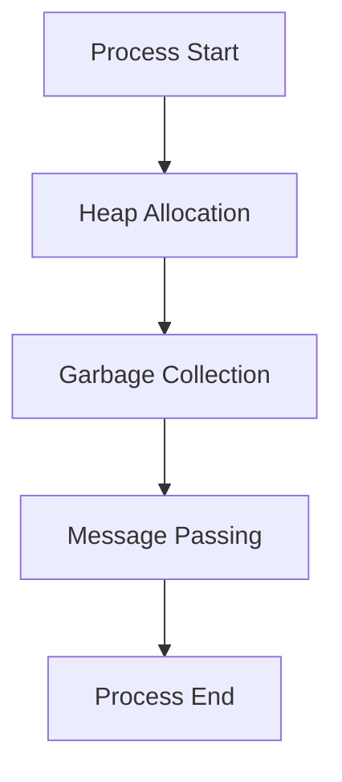

## 22.3. Reducing Memory Usage

As expert software engineers and architects, understanding how to efficiently manage memory in Elixir applications is crucial for building scalable and performant systems. In this section, we will delve into memory management on the BEAM (Bogdan/Björn's Erlang Abstract Machine), explore strategies for minimizing memory usage, and examine Elixir's garbage collection mechanisms. Along the way, we'll provide practical examples and encourage experimentation to solidify your understanding.

### Memory Management on the BEAM

The BEAM, the virtual machine that runs Elixir, is designed with concurrency and fault tolerance in mind. It handles memory management differently compared to traditional virtual machines, such as the JVM. Let's explore how processes consume and release memory on the BEAM.

#### Process Memory Model

In the BEAM, each process has its own heap, which isolates it from other processes. This isolation is a key feature that enhances fault tolerance and simplifies garbage collection. However, it also means that memory usage can grow rapidly if not managed carefully.

- **Heap Allocation**: Each process starts with a small heap, which grows as needed. When a process's heap becomes full, it triggers garbage collection.
- **Garbage Collection**: The BEAM uses a per-process garbage collection strategy, which means that each process collects its own garbage independently. This approach minimizes pauses and keeps the system responsive.
- **Message Passing**: When processes communicate, data is copied between them. This copying can lead to increased memory usage if large data structures are frequently passed.

### Strategies for Reducing Memory Usage

To optimize memory usage in Elixir applications, we need to adopt strategies that minimize unnecessary memory consumption and leverage the BEAM's strengths.

#### Minimizing Large Data Structures in Process State

One common source of excessive memory usage is storing large data structures in process state. Consider the following strategies to mitigate this:

1. **Use ETS for Shared Data**: Erlang Term Storage (ETS) is a powerful in-memory storage system that allows processes to share data without copying. Use ETS for large, read-heavy data structures that need to be accessed by multiple processes.

   ```elixir
   :ets.new(:my_table, [:set, :public, :named_table])
   :ets.insert(:my_table, {:key, "value"})
   ```

2. **Avoid Storing Unnecessary Data**: Regularly review and refactor process state to ensure that only essential data is stored. Use pattern matching to extract and discard irrelevant parts of data structures.

3. **Leverage Streams for Lazy Evaluation**: Use Elixir's `Stream` module to process data lazily, reducing the need to load entire data structures into memory at once.

   ```elixir
   File.stream!("large_file.txt")
   |> Stream.map(&String.upcase/1)
   |> Enum.to_list()
   ```

#### Using Binaries Wisely to Prevent Memory Leaks

Binaries in Elixir can be a double-edged sword. While they are efficient for handling large chunks of data, improper use can lead to memory leaks.

1. **Use Reference Binaries for Large Data**: Elixir uses two types of binaries: heap binaries (up to 64 bytes) and reference binaries (over 64 bytes). Reference binaries are stored outside the process heap and shared across processes, reducing memory consumption.

2. **Avoid Fragmentation**: When manipulating binaries, be mindful of fragmentation. Use functions like `:binary.copy/1` to ensure binaries are contiguous and avoid unnecessary memory usage.

   ```elixir
   binary = :binary.copy("large binary data")
   ```

3. **Release Unused Binaries**: Explicitly release unused binaries by setting them to `nil` or allowing them to go out of scope, prompting garbage collection.

### Understanding Process-Level Garbage Collection

Elixir's garbage collection is process-level, meaning each process collects its own garbage independently. This design minimizes pauses and ensures system responsiveness.

#### Key Concepts

- **Generational Garbage Collection**: The BEAM uses a generational garbage collection strategy, which divides the heap into young and old generations. Young generations are collected more frequently, while old generations are collected less often.
- **Incremental Collection**: Garbage collection is incremental, allowing processes to continue executing while collection occurs. This reduces latency and improves throughput.

#### Tuning Garbage Collection

While the BEAM's garbage collection is efficient, tuning parameters can optimize performance for specific workloads.

- **Heap Size**: Adjust the initial heap size and growth factor to balance memory usage and garbage collection frequency.
- **Fullsweep After**: Control how often full-sweep collections occur by setting the `fullsweep_after` parameter. This can be useful for long-lived processes with stable memory usage.

### Examples of Refactoring for Memory Efficiency

Let's explore some examples of how to refactor Elixir code to be more memory-efficient.

#### Example 1: Optimizing Process State

Consider a process that stores a large list of data. We can refactor it to use ETS for shared storage.

```elixir
defmodule DataProcess do
  def start_link(_) do
    :ets.new(:data_table, [:set, :public, :named_table])
    {:ok, spawn_link(__MODULE__, :loop, [])}
  end

  def loop do
    receive do
      {:store, key, value} ->
        :ets.insert(:data_table, {key, value})
        loop()
      {:fetch, key, caller} ->
        value = :ets.lookup(:data_table, key)
        send(caller, {:ok, value})
        loop()
    end
  end
end
```

#### Example 2: Efficient Binary Handling

Let's refactor a function that processes large binaries to avoid fragmentation.

```elixir
defmodule BinaryProcessor do
  def process(binary) do
    binary
    |> :binary.copy()
    |> String.split("\n")
    |> Enum.each(&process_line/1)
  end

  defp process_line(line) do
    # Process each line
  end
end
```

### Visualizing Memory Management

To better understand memory management on the BEAM, let's visualize the process memory model and garbage collection using Mermaid.js diagrams.


```mermaid
graph TD;
    A[Process Start] --> B[Heap Allocation];
    B --> C[Garbage Collection];
    C --> D[Message Passing];
    D --> E[Process End];
```

**Diagram Description**: This diagram illustrates the lifecycle of a process on the BEAM, from heap allocation to garbage collection and message passing.

### Try It Yourself

To reinforce your understanding, try modifying the code examples provided. Experiment with different data structures, ETS configurations, and binary manipulations to observe their impact on memory usage.

### Knowledge Check

- **Question**: What are the benefits of using ETS for shared data storage in Elixir?
- **Exercise**: Refactor a process that stores a large map in its state to use ETS instead.

### Summary

In this section, we've explored techniques for reducing memory usage in Elixir applications. By understanding the BEAM's memory model, adopting efficient data structures, and leveraging garbage collection, we can build systems that are both performant and scalable. Remember, this is just the beginning. As you continue your journey, keep experimenting, stay curious, and enjoy the process of optimizing your Elixir applications.

## Quiz Time!



### What is a key advantage of process-level garbage collection on the BEAM?

- [x] It minimizes pauses and keeps the system responsive.
- [ ] It allows for global garbage collection across all processes.
- [ ] It reduces the need for manual memory management.
- [ ] It enables processes to share memory directly.

> **Explanation:** Process-level garbage collection minimizes pauses and keeps the system responsive by allowing each process to collect its own garbage independently.

### How can ETS help reduce memory usage in Elixir applications?

- [x] By allowing processes to share data without copying.
- [ ] By storing data on disk instead of in memory.
- [ ] By automatically compressing large data structures.
- [ ] By replacing the need for garbage collection.

> **Explanation:** ETS allows processes to share data without copying, which can significantly reduce memory usage when dealing with large data structures.

### What is a potential downside of frequently passing large data structures between processes?

- [x] Increased memory usage due to data copying.
- [ ] Slower garbage collection cycles.
- [ ] Reduced process isolation.
- [ ] Increased risk of data corruption.

> **Explanation:** Passing large data structures between processes increases memory usage because the data is copied, not shared.

### When should you use reference binaries in Elixir?

- [x] For handling large chunks of data efficiently.
- [ ] For storing small strings in process state.
- [ ] For optimizing integer arithmetic.
- [ ] For reducing the frequency of garbage collection.

> **Explanation:** Reference binaries are efficient for handling large chunks of data because they are stored outside the process heap and can be shared across processes.

### What is a benefit of using the `Stream` module in Elixir?

- [x] It allows for lazy evaluation, reducing memory usage.
- [ ] It automatically parallelizes data processing.
- [ ] It provides built-in error handling.
- [ ] It simplifies data serialization.

> **Explanation:** The `Stream` module allows for lazy evaluation, which means data is processed as needed rather than loading entire data structures into memory at once.

### How can you explicitly release unused binaries in Elixir?

- [x] By setting them to `nil` or allowing them to go out of scope.
- [ ] By calling a garbage collection function.
- [ ] By using the `:binary.release/1` function.
- [ ] By storing them in ETS.

> **Explanation:** You can release unused binaries by setting them to `nil` or allowing them to go out of scope, prompting garbage collection.

### What is the role of the `fullsweep_after` parameter in garbage collection?

- [x] It controls how often full-sweep collections occur.
- [ ] It sets the initial heap size for processes.
- [ ] It determines the maximum size of binaries.
- [ ] It configures the message passing buffer.

> **Explanation:** The `fullsweep_after` parameter controls how often full-sweep collections occur, which can be useful for long-lived processes with stable memory usage.

### Why should you avoid storing unnecessary data in process state?

- [x] To minimize memory usage and improve performance.
- [ ] To simplify debugging and error handling.
- [ ] To enhance process isolation.
- [ ] To reduce the complexity of the codebase.

> **Explanation:** Avoiding unnecessary data in process state minimizes memory usage and can improve performance by reducing the amount of data that needs to be managed.

### What is a characteristic of generational garbage collection on the BEAM?

- [x] It divides the heap into young and old generations.
- [ ] It performs a single global collection cycle.
- [ ] It requires manual intervention to trigger collection.
- [ ] It only collects garbage at process termination.

> **Explanation:** Generational garbage collection divides the heap into young and old generations, allowing for more frequent collection of young generations and less frequent collection of old generations.

### True or False: The BEAM's garbage collection strategy is designed to minimize system pauses and improve responsiveness.

- [x] True
- [ ] False

> **Explanation:** True. The BEAM's garbage collection strategy is designed to minimize system pauses and improve responsiveness by using process-level, incremental garbage collection.


