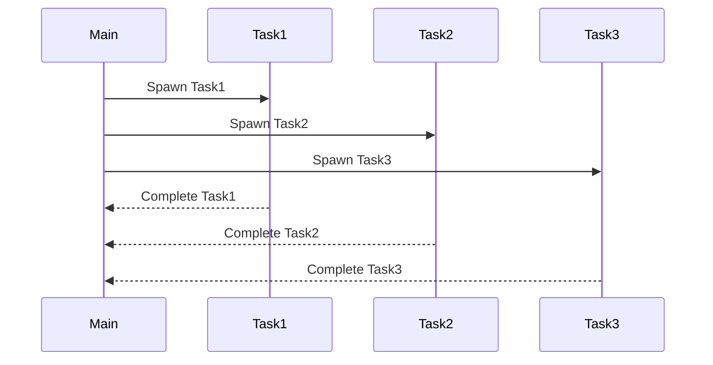

## 22.5. Parallel Processing and Load Distribution

In the world of high-performance computing, parallel processing and load distribution are crucial techniques for optimizing the performance of applications. Elixir, with its robust concurrency model and the power of the BEAM virtual machine, provides a rich set of tools and patterns to efficiently handle parallel processing and distribute loads across multiple processes or nodes. In this section, we will explore how to leverage these capabilities to build scalable and efficient systems.

### Leveraging Concurrency

Concurrency in Elixir is achieved through the use of lightweight processes. These processes are isolated, run concurrently, and communicate via message passing, making them ideal for parallel processing tasks.

#### Using Multiple Processes for Parallel Tasks

To perform tasks in parallel, we can spawn multiple processes that execute independently. This is particularly useful for tasks that are CPU-bound or involve I/O operations that can be performed concurrently.

```elixir
defmodule ParallelTasks do
  def perform_tasks(tasks) do
    tasks
    |> Enum.map(&Task.async(fn -> execute_task(&1) end))
    |> Enum.map(&Task.await/1)
  end

  defp execute_task(task) do
    # Simulate a task execution
    :timer.sleep(1000)
    IO.puts("Task #{task} completed")
    task
  end
end

# Example usage
tasks = 1..5
ParallelTasks.perform_tasks(tasks)
```

In this example, we use `Task.async/1` to spawn a new process for each task. The `Task.await/1` function is then used to wait for each task to complete. This pattern allows us to execute multiple tasks concurrently, significantly reducing the total execution time compared to sequential execution.

#### Visualizing Concurrency with Mermaid.js

To better understand how concurrency works in Elixir, let's visualize the process flow using a Mermaid.js sequence diagram:



This diagram illustrates how the main process spawns multiple tasks, each running concurrently and independently. Once a task is completed, it sends a message back to the main process.

### Load Balancing

Load balancing is the process of distributing work evenly across multiple processes or nodes to ensure optimal resource utilization and prevent any single process from becoming a bottleneck.

#### Distributing Work Across Processes

In Elixir, we can use various strategies to distribute work across processes. One common approach is to use a pool of worker processes that can handle tasks concurrently.

```elixir
defmodule WorkerPool do
  def start_link(worker_count) do
    Enum.map(1..worker_count, fn _ -> Task.start_link(fn -> worker_loop() end) end)
  end

  defp worker_loop do
    receive do
      {:task, task} ->
        execute_task(task)
        worker_loop()
    end
  end

  defp execute_task(task) do
    # Simulate task execution
    :timer.sleep(1000)
    IO.puts("Task #{task} executed")
  end
end

# Example usage
{:ok, workers} = WorkerPool.start_link(3)
Enum.each(1..5, fn task ->
  Enum.random(workers) |> send({:task, task})
end)
```

In this example, we create a pool of worker processes using `Task.start_link/1`. Each worker listens for incoming tasks and executes them. Tasks are distributed randomly among the available workers, ensuring that the load is balanced.

#### Load Balancing Across Nodes

For distributed systems, load balancing can also be achieved across multiple nodes. Elixir's built-in distribution capabilities allow processes to communicate seamlessly across nodes, making it possible to distribute tasks across a cluster.

```elixir
defmodule DistributedTasks do
  def distribute_tasks(nodes, tasks) do
    Enum.each(tasks, fn task ->
      node = Enum.random(nodes)
      :rpc.call(node, __MODULE__, :execute_task, [task])
    end)
  end

  def execute_task(task) do
    # Simulate task execution
    :timer.sleep(1000)
    IO.puts("Task #{task} executed on #{Node.self()}")
  end
end

# Example usage
nodes = [:node1@localhost, :node2@localhost]
tasks = 1..5
DistributedTasks.distribute_tasks(nodes, tasks)
```

In this example, we use `:rpc.call/4` to remotely execute tasks on different nodes. This approach allows us to leverage the computational power of multiple machines, further enhancing the scalability of our system.

### Tools for Parallel Processing

Elixir provides several tools to facilitate parallel processing and load distribution. One of the most powerful tools is `Task.async_stream/3`, which allows for parallel enumeration of collections.

#### Using `Task.async_stream/3`

`Task.async_stream/3` is a convenient way to process collections in parallel. It automatically manages the spawning of processes and collection of results.

```elixir
defmodule ParallelStream do
  def process_collection(collection) do
    collection
    |> Task.async_stream(&process_item/1, max_concurrency: 4)
    |> Enum.to_list()
  end

  defp process_item(item) do
    # Simulate item processing
    :timer.sleep(1000)
    IO.puts("Processed item #{item}")
    item
  end
end

# Example usage
collection = 1..10
ParallelStream.process_collection(collection)
```

In this example, `Task.async_stream/3` is used to process each item in the collection concurrently. The `max_concurrency` option limits the number of concurrent processes, allowing us to control resource usage.

### Avoiding Bottlenecks

Bottlenecks can severely impact the performance of parallel systems. Identifying and removing single points of contention is essential for achieving optimal performance.

#### Identifying Bottlenecks

To identify bottlenecks, we can use profiling tools to analyze the performance of our application. Tools like `:observer` and `:fprof` can provide insights into process execution times and resource usage.

#### Removing Bottlenecks

Once bottlenecks are identified, we can take steps to remove them. This may involve optimizing code, increasing parallelism, or re-architecting parts of the system to eliminate contention.

### Try It Yourself

To gain a deeper understanding of parallel processing and load distribution in Elixir, try modifying the code examples provided. Experiment with different numbers of tasks, workers, and nodes to see how they affect performance. Consider implementing your own load balancing strategy or using different tools for parallel processing.

### Key Takeaways

- **Concurrency**: Elixir's lightweight processes make it easy to perform tasks in parallel.
- **Load Balancing**: Distributing work evenly across processes or nodes ensures optimal resource utilization.
- **Tools**: `Task.async_stream/3` is a powerful tool for parallel enumeration.
- **Avoiding Bottlenecks**: Identifying and removing single points of contention is crucial for performance optimization.

### References and Further Reading

- [Elixir Documentation](https://elixir-lang.org/docs.html)
- [BEAM VM](https://erlang.org/doc/apps/erts/BEAM.html)
- [Task Module](https://hexdocs.pm/elixir/Task.html)
- [Observer](https://erlang.org/doc/man/observer.html)
- [Fprof](https://erlang.org/doc/man/fprof.html)

## Quiz: Parallel Processing and Load Distribution



### What is the primary advantage of using Elixir's lightweight processes for parallel processing?

- [x] They are isolated and communicate via message passing.
- [ ] They share memory and state.
- [ ] They are heavyweight and resource-intensive.
- [ ] They require complex synchronization mechanisms.

> **Explanation:** Elixir's lightweight processes are isolated and communicate via message passing, making them ideal for parallel processing.

### Which Elixir function is used to spawn a new process for executing a task asynchronously?

- [ ] Task.await/1
- [x] Task.async/1
- [ ] Task.start_link/1
- [ ] Task.yield/1

> **Explanation:** Task.async/1 is used to spawn a new process for executing a task asynchronously.

### How does `Task.async_stream/3` help in parallel processing?

- [x] It allows for parallel enumeration of collections.
- [ ] It serializes tasks for sequential execution.
- [ ] It limits the number of concurrent processes to one.
- [ ] It requires manual process management.

> **Explanation:** Task.async_stream/3 allows for parallel enumeration of collections, automatically managing process spawning and result collection.

### What is a common strategy for distributing work across processes in Elixir?

- [ ] Using a single process for all tasks.
- [x] Using a pool of worker processes.
- [ ] Using shared memory for communication.
- [ ] Using global variables for task distribution.

> **Explanation:** A common strategy is to use a pool of worker processes that can handle tasks concurrently.

### How can tasks be distributed across multiple nodes in a distributed Elixir system?

- [x] Using :rpc.call/4 to execute tasks remotely.
- [ ] Using shared memory across nodes.
- [ ] Using a single node for all tasks.
- [ ] Using global variables for task distribution.

> **Explanation:** Tasks can be distributed across nodes using :rpc.call/4 to execute tasks remotely.

### What is the purpose of load balancing in parallel processing?

- [x] To distribute work evenly across processes or nodes.
- [ ] To execute all tasks on a single process.
- [ ] To increase the number of bottlenecks.
- [ ] To reduce the number of processes used.

> **Explanation:** Load balancing distributes work evenly across processes or nodes to ensure optimal resource utilization.

### Which tool can be used to identify bottlenecks in an Elixir application?

- [x] :observer
- [ ] Task.async_stream/3
- [ ] :rpc.call/4
- [ ] Enum.map/2

> **Explanation:** :observer is a tool that can be used to identify bottlenecks by analyzing process execution times and resource usage.

### What is a potential consequence of not addressing bottlenecks in a parallel system?

- [x] Reduced performance and efficiency.
- [ ] Increased resource utilization.
- [ ] Improved load distribution.
- [ ] Enhanced scalability.

> **Explanation:** Not addressing bottlenecks can lead to reduced performance and efficiency in a parallel system.

### What option does `Task.async_stream/3` provide to control resource usage?

- [x] max_concurrency
- [ ] max_tasks
- [ ] min_concurrency
- [ ] task_limit

> **Explanation:** The max_concurrency option in Task.async_stream/3 allows control over the number of concurrent processes.

### True or False: Elixir's processes share memory and state.

- [ ] True
- [x] False

> **Explanation:** False. Elixir's processes are isolated and do not share memory or state, communicating instead via message passing.



Remember, this is just the beginning. As you progress, you'll build more complex and interactive systems. Keep experimenting, stay curious, and enjoy the journey!
