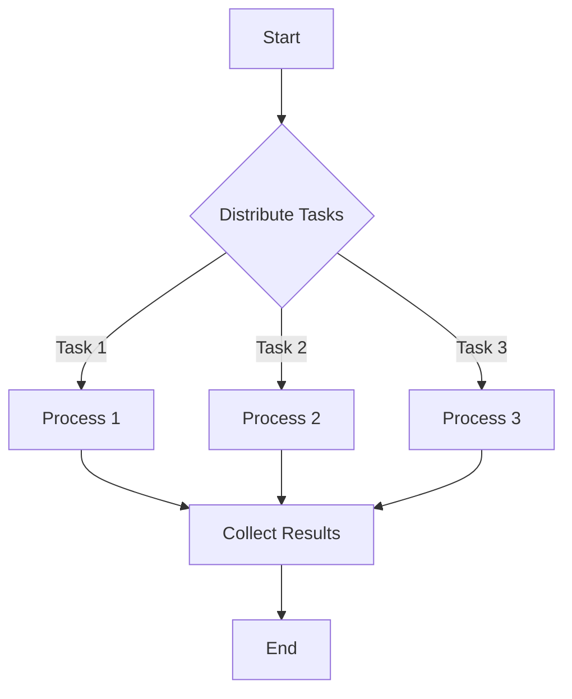

## 22.5. Parallel Processing and Load Distribution

In the world of modern software development, efficiently utilizing system resources is crucial for building high-performance applications. Elixir, with its robust concurrency model and the power of the BEAM virtual machine, provides excellent tools for parallel processing and load distribution. In this section, we will delve into these advanced topics, exploring how to leverage Elixir's capabilities to build scalable and efficient systems.

### Leveraging Concurrency

Concurrency is the ability of a system to handle multiple tasks simultaneously. In Elixir, this is achieved through processes, which are lightweight and isolated units of computation. Let's explore how to use multiple processes to perform tasks in parallel.

#### Understanding Elixir Processes

Elixir processes are not operating system processes; they are much more lightweight and are managed by the BEAM VM. This allows Elixir applications to spawn thousands of processes without significant overhead. Each process has its own memory space, ensuring isolation and fault tolerance.

**Creating Processes:**

To create a new process in Elixir, we use the `spawn/1` function. Here's a simple example:

```elixir
defmodule ParallelExample do
  def say_hello do
    IO.puts("Hello from process #{inspect self()}")
  end

  def start_processes do
    Enum.each(1..5, fn _ ->
      spawn(ParallelExample, :say_hello, [])
    end)
  end
end

ParallelExample.start_processes()
```

**Explanation:**

- We define a module `ParallelExample` with a function `say_hello` that prints a message.
- The `start_processes` function spawns five processes, each calling the `say_hello` function.

#### Using `Task` for Concurrent Execution

While `spawn/1` is useful for simple tasks, Elixir's `Task` module provides a more convenient way to handle concurrent execution, especially when dealing with tasks that return a result.

**Using `Task.async/1` and `Task.await/1`:**

```elixir
defmodule TaskExample do
  def compute_square(number) do
    :timer.sleep(1000) # Simulate a time-consuming task
    number * number
  end

  def parallel_computation do
    tasks = Enum.map(1..5, fn n ->
      Task.async(fn -> compute_square(n) end)
    end)

    results = Enum.map(tasks, fn task ->
      Task.await(task)
    end)

    IO.inspect(results)
  end
end

TaskExample.parallel_computation()
```

**Explanation:**

- We define a `compute_square` function that simulates a time-consuming task.
- We use `Task.async/1` to start tasks concurrently and `Task.await/1` to retrieve their results.
- The results are collected and printed.

### Load Balancing

Load balancing involves distributing work evenly across processes or nodes to ensure optimal resource utilization. In Elixir, this can be achieved through various strategies and tools.

#### Distributing Work with `Task.async_stream/3`

`Task.async_stream/3` is a powerful tool for parallel enumeration, allowing you to process collections concurrently while controlling the level of concurrency.

**Example of `Task.async_stream/3`:**

```elixir
defmodule LoadBalancer do
  def process_items(items) do
    items
    |> Task.async_stream(&expensive_operation/1, max_concurrency: 3)
    |> Enum.to_list()
  end

  defp expensive_operation(item) do
    :timer.sleep(500) # Simulate a time-consuming operation
    item * 2
  end
end

items = 1..10 |> Enum.to_list()
LoadBalancer.process_items(items)
```

**Explanation:**

- We define a function `process_items` that uses `Task.async_stream/3` to process a list of items.
- The `max_concurrency` option limits the number of concurrent tasks to 3.
- The results are collected into a list.

#### Load Balancing Across Nodes

For distributed systems, load balancing can also involve distributing work across multiple nodes. Elixir's distributed capabilities allow processes to communicate seamlessly across nodes.

**Setting Up a Distributed System:**

1. **Start Nodes:**

   Use `iex --sname node1` and `iex --sname node2` to start nodes with short names.

2. **Connect Nodes:**

   ```elixir
   Node.connect(:node2@hostname)
   ```

3. **Distribute Work:**

   Use `Node.spawn/4` to execute functions on remote nodes.

**Example:**

```elixir
defmodule DistributedExample do
  def remote_task(node, fun) do
    Node.spawn(node, fn -> fun.() end)
  end
end

DistributedExample.remote_task(:node2@hostname, fn ->
  IO.puts("Running on node2")
end)
```

### Tools for Parallel Processing

Elixir provides several tools for parallel processing, allowing developers to choose the best fit for their use case.

#### Using `GenServer` for Stateful Processes

`GenServer` is a generic server implementation that can be used to manage stateful processes. It provides a framework for building concurrent applications with well-defined interfaces.

**Basic `GenServer` Example:**

```elixir
defmodule Counter do
  use GenServer

  # Client API
  def start_link(initial_value) do
    GenServer.start_link(__MODULE__, initial_value, name: __MODULE__)
  end

  def increment do
    GenServer.call(__MODULE__, :increment)
  end

  # Server Callbacks
  def init(initial_value) do
    {:ok, initial_value}
  end

  def handle_call(:increment, _from, state) do
    {:reply, state + 1, state + 1}
  end
end

{:ok, _pid} = Counter.start_link(0)
Counter.increment()
```

**Explanation:**

- We define a `Counter` module using `GenServer`.
- The `start_link` function starts the server with an initial value.
- The `increment` function sends a synchronous call to increment the counter.

#### Avoiding Bottlenecks

Bottlenecks can severely impact the performance of a system. Identifying and removing single points of contention is crucial for achieving optimal performance.

**Strategies to Avoid Bottlenecks:**

1. **Identify Hotspots:**

   Use profiling tools to identify parts of the system that are causing delays.

2. **Optimize Critical Paths:**

   Focus on optimizing the most frequently executed paths in the application.

3. **Reduce Lock Contention:**

   Minimize the use of shared resources to avoid contention.

4. **Use Asynchronous Operations:**

   Replace blocking operations with asynchronous ones to improve throughput.

### Visualizing Parallel Processing and Load Distribution

To better understand the concepts of parallel processing and load distribution, let's visualize the flow of tasks in a concurrent system.


```mermaid
graph TD;
    A[Start] --> B{Distribute Tasks};
    B -->|Task 1| C[Process 1];
    B -->|Task 2| D[Process 2];
    B -->|Task 3| E[Process 3];
    C --> F[Collect Results];
    D --> F;
    E --> F;
    F --> G[End];
```

**Diagram Explanation:**

- The diagram illustrates the distribution of tasks across multiple processes.
- Tasks are processed concurrently, and results are collected at the end.

### References and Links

- [Elixir Documentation](https://elixir-lang.org/docs.html)
- [BEAM VM](https://erlang.org/doc/apps/erts/BEAM.html)
- [Task Module](https://hexdocs.pm/elixir/Task.html)
- [GenServer](https://hexdocs.pm/elixir/GenServer.html)

### Knowledge Check

- What are the benefits of using `Task.async_stream/3` for parallel processing?
- How can you distribute work across multiple nodes in a distributed system?
- What strategies can be used to avoid bottlenecks in a concurrent application?

### Embrace the Journey

Remember, mastering parallel processing and load distribution in Elixir is a journey. As you experiment and build more complex systems, you'll gain a deeper understanding of these powerful concepts. Stay curious, keep learning, and enjoy the process!

### Try It Yourself

Experiment with the code examples provided. Try modifying the number of concurrent tasks or distributing tasks across different nodes. Observe how these changes impact performance and resource utilization.

## Quiz Time!



### What is the primary benefit of using Elixir processes for concurrency?

- [x] Lightweight and isolated units of computation
- [ ] They are operating system processes
- [ ] They share memory space
- [ ] They are heavyweight and resource-intensive

> **Explanation:** Elixir processes are lightweight and isolated, allowing for efficient concurrency.

### How do you create a new process in Elixir?

- [x] Using the `spawn/1` function
- [ ] Using the `Task.start/1` function
- [ ] Using the `GenServer.start/1` function
- [ ] Using the `Node.spawn/1` function

> **Explanation:** The `spawn/1` function is used to create new processes in Elixir.

### What is the purpose of `Task.async_stream/3`?

- [x] To process collections concurrently with controlled concurrency
- [ ] To create a new GenServer
- [ ] To start a distributed node
- [ ] To handle synchronous operations

> **Explanation:** `Task.async_stream/3` is used for parallel enumeration with controlled concurrency.

### Which tool can be used for stateful processes in Elixir?

- [x] GenServer
- [ ] Task
- [ ] Node
- [ ] Supervisor

> **Explanation:** `GenServer` is used for managing stateful processes in Elixir.

### What is a common strategy to avoid bottlenecks in concurrent applications?

- [x] Use asynchronous operations
- [ ] Increase lock contention
- [ ] Use shared resources
- [ ] Focus on non-critical paths

> **Explanation:** Using asynchronous operations helps improve throughput and avoid bottlenecks.

### How can you distribute work across nodes in a distributed Elixir system?

- [x] Using `Node.spawn/4`
- [ ] Using `Task.async/1`
- [ ] Using `GenServer.start/1`
- [ ] Using `Supervisor.start_link/1`

> **Explanation:** `Node.spawn/4` allows you to execute functions on remote nodes.

### What is the benefit of using `Task.async/1` and `Task.await/1`?

- [x] They allow concurrent execution and result retrieval
- [ ] They are used for synchronous operations
- [ ] They are used for starting GenServers
- [ ] They are used for node communication

> **Explanation:** `Task.async/1` and `Task.await/1` facilitate concurrent execution and result retrieval.

### What does the `max_concurrency` option in `Task.async_stream/3` control?

- [x] The number of concurrent tasks
- [ ] The number of nodes
- [ ] The number of GenServers
- [ ] The number of processes

> **Explanation:** `max_concurrency` controls the number of concurrent tasks in `Task.async_stream/3`.

### What is a key feature of Elixir processes?

- [x] They are lightweight and isolated
- [ ] They share memory space
- [ ] They are heavyweight
- [ ] They are operating system processes

> **Explanation:** Elixir processes are lightweight and isolated, making them efficient for concurrency.

### True or False: Elixir processes are operating system processes.

- [ ] True
- [x] False

> **Explanation:** Elixir processes are not operating system processes; they are managed by the BEAM VM.


