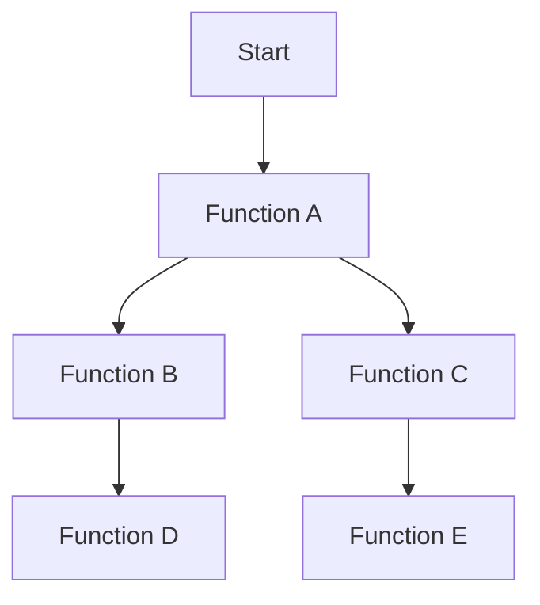

## 22.6. Dealing with Bottlenecks

In the realm of software development, performance bottlenecks can significantly hinder the efficiency and scalability of applications. As expert software engineers and architects, it is crucial to master the art of identifying, analyzing, and resolving these bottlenecks, especially in a language like Elixir, which is designed for building scalable and fault-tolerant systems. In this section, we will delve into the process of dealing with bottlenecks in Elixir applications, covering everything from identifying hotspots to implementing effective solutions and monitoring performance improvements.

### Identifying Hotspots

The first step in dealing with bottlenecks is to identify the hotspots in your application. These are the parts of your code that consume the most resources or take the longest time to execute. Profiling tools are invaluable in this process, as they provide detailed insights into the performance characteristics of your application.

#### Using Profiling Data

Profiling involves collecting data about the execution of your program to identify where time and resources are being spent. In Elixir, several tools can help you profile your application:

- **Erlang's `:fprof`**: A built-in profiler that provides detailed information about function calls and execution times.
- **`:eprof`**: Another Erlang profiler that is useful for identifying time-consuming processes.
- **`exprof`**: An Elixir wrapper around `:fprof` that simplifies profiling in Elixir applications.

Here's an example of how you might use `exprof` to profile a function:

```elixir
defmodule MyApp.Profiler do
  import ExProf.Macro

  def profile_function do
    profile do
      MyApp.SomeModule.some_function()
    end
  end
end
```

In this example, `profile_function` will execute `some_function` and provide a detailed report of its execution time and resource usage.

#### Visualizing Hotspots

To better understand the hotspots in your application, you can visualize the profiling data using tools like Flamegraphs. Flamegraphs provide a graphical representation of where time is being spent in your application, making it easier to identify bottlenecks.



*Flamegraph representation of function call hierarchy and execution time.*

### Analyzing Causes

Once you have identified the hotspots, the next step is to analyze the causes of these bottlenecks. Common causes include inefficient I/O operations, slow database queries, and computational bottlenecks.

#### I/O Operations

I/O operations, such as reading from or writing to files and network communication, can be a significant source of bottlenecks. In Elixir, you can use asynchronous I/O operations to mitigate these bottlenecks. The `Task` module allows you to perform I/O operations concurrently, reducing the time spent waiting for I/O to complete.

```elixir
defmodule MyApp.IO do
  def read_files(file_paths) do
    file_paths
    |> Enum.map(&Task.async(fn -> File.read!(&1) end))
    |> Enum.map(&Task.await/1)
  end
end
```

In this example, `read_files` reads multiple files concurrently, improving performance by leveraging Elixir's concurrency model.

#### Database Queries

Inefficient database queries can also lead to performance bottlenecks. Use tools like `Ecto` to optimize your queries and ensure they are executed efficiently. Consider using indexes, optimizing joins, and reducing the number of queries where possible.

```elixir
defmodule MyApp.Repo do
  import Ecto.Query

  def get_users_with_posts do
    from(u in User,
      join: p in assoc(u, :posts),
      preload: [posts: p]
    )
    |> Repo.all()
  end
end
```

This query efficiently retrieves users and their associated posts using a join and preloading, minimizing the number of database queries.

#### Computational Bottlenecks

Computational bottlenecks occur when certain parts of your code require excessive CPU time. Profiling can help identify these areas, and you can optimize them by refactoring code, using more efficient algorithms, or parallelizing computations.

### Implementing Solutions

After identifying and analyzing the causes of bottlenecks, the next step is to implement solutions to address them. This may involve caching results, optimizing queries, or refactoring code.

#### Caching Results

Caching is an effective way to reduce the load on your application by storing the results of expensive computations or database queries. In Elixir, you can use libraries like `Cachex` to implement caching.

```elixir
defmodule MyApp.Cache do
  use Cachex

  def get_user(id) do
    Cachex.fetch(:user_cache, id, fn ->
      MyApp.Repo.get(User, id)
    end)
  end
end
```

In this example, `get_user` caches the result of fetching a user from the database, reducing the need for repeated queries.

#### Optimizing Queries

As mentioned earlier, optimizing database queries can significantly improve performance. Use tools like `Ecto` to analyze and optimize your queries, and consider using database-specific features like indexes and materialized views.

#### Code Refactoring

Refactoring your code can also help eliminate bottlenecks. Look for opportunities to simplify complex logic, reduce the number of function calls, and eliminate unnecessary computations.

### Monitoring After Optimization

Once you have implemented solutions to address bottlenecks, it is essential to monitor your application's performance to ensure that the optimizations have the desired effect. Continuous monitoring allows you to detect new bottlenecks and make further improvements as needed.

#### Continuous Monitoring

Use tools like `Prometheus` and `Grafana` to monitor your application's performance metrics in real-time. These tools provide dashboards and alerts that help you track key performance indicators and respond to issues promptly.


*Diagram showing the flow of performance data from the application to a monitoring dashboard.*

#### Performance Regression Testing

Implement performance regression tests to ensure that new changes do not introduce new bottlenecks. Use tools like `Benchee` to benchmark your code and compare performance across different versions.

```elixir
defmodule MyApp.Benchmark do
  use Benchee

  def run do
    Benchee.run(%{
      "function_a" => fn -> MyApp.SomeModule.function_a() end,
      "function_b" => fn -> MyApp.SomeModule.function_b() end
    })
  end
end
```

In this example, `Benchee` benchmarks two functions, allowing you to compare their performance and identify any regressions.

### Try It Yourself

Now that we've covered the theory and examples, it's time to put your knowledge into practice. Try modifying the code examples provided to see how different changes impact performance. Experiment with different caching strategies, query optimizations, and refactoring techniques to see how they affect your application's performance.

### Key Takeaways

- **Identify hotspots** using profiling tools to understand where your application spends the most time and resources.
- **Analyze the causes** of bottlenecks, focusing on I/O operations, database queries, and computational bottlenecks.
- **Implement solutions** such as caching, query optimization, and code refactoring to address bottlenecks.
- **Monitor performance** continuously after optimization to ensure improvements are effective and to detect new bottlenecks.

Remember, dealing with bottlenecks is an ongoing process. As your application evolves, new bottlenecks may emerge, requiring continuous attention and optimization. Keep experimenting, stay curious, and enjoy the journey of making your Elixir applications more efficient and scalable!

## Quiz: Dealing with Bottlenecks



### What is the first step in dealing with bottlenecks in Elixir applications?

- [x] Identifying hotspots
- [ ] Implementing solutions
- [ ] Analyzing causes
- [ ] Monitoring after optimization

> **Explanation:** Identifying hotspots is the first step in dealing with bottlenecks, as it helps you understand where your application is spending the most time and resources.

### Which tool can be used to visualize profiling data in Elixir?

- [ ] `:eprof`
- [ ] `exprof`
- [x] Flamegraphs
- [ ] `:fprof`

> **Explanation:** Flamegraphs provide a graphical representation of profiling data, making it easier to identify bottlenecks.

### What is a common cause of bottlenecks related to database operations?

- [ ] Inefficient caching
- [x] Slow database queries
- [ ] Excessive function calls
- [ ] Poor error handling

> **Explanation:** Slow database queries are a common cause of bottlenecks related to database operations.

### How can you mitigate I/O operation bottlenecks in Elixir?

- [ ] By using synchronous I/O operations
- [x] By using asynchronous I/O operations
- [ ] By increasing the number of database queries
- [ ] By reducing function calls

> **Explanation:** Asynchronous I/O operations can mitigate bottlenecks by allowing other tasks to proceed while waiting for I/O to complete.

### Which Elixir library can be used for caching results?

- [ ] `Benchee`
- [ ] `Prometheus`
- [x] `Cachex`
- [ ] `Ecto`

> **Explanation:** `Cachex` is an Elixir library used for caching results to reduce the load on your application.

### What should you do after implementing solutions to bottlenecks?

- [ ] Stop monitoring performance
- [ ] Introduce new features
- [x] Monitor performance continuously
- [ ] Remove all optimizations

> **Explanation:** After implementing solutions, it's essential to monitor performance continuously to ensure optimizations are effective and to detect new bottlenecks.

### Which tool can be used for performance regression testing in Elixir?

- [x] `Benchee`
- [ ] `Cachex`
- [ ] `Prometheus`
- [ ] `Grafana`

> **Explanation:** `Benchee` is a benchmarking tool that can be used for performance regression testing in Elixir.

### What is a key benefit of using the `Task` module for I/O operations?

- [ ] It simplifies code refactoring
- [x] It allows for concurrent execution
- [ ] It reduces memory usage
- [ ] It improves error handling

> **Explanation:** The `Task` module allows for concurrent execution of I/O operations, reducing the time spent waiting for I/O to complete.

### Which of the following is NOT a common cause of bottlenecks?

- [ ] Inefficient I/O operations
- [ ] Slow database queries
- [ ] Computational bottlenecks
- [x] Effective caching strategies

> **Explanation:** Effective caching strategies are not a cause of bottlenecks; they are a solution to reduce bottlenecks.

### True or False: Continuous monitoring is unnecessary after optimizing performance.

- [ ] True
- [x] False

> **Explanation:** Continuous monitoring is necessary after optimizing performance to ensure that improvements are effective and to detect new bottlenecks.


