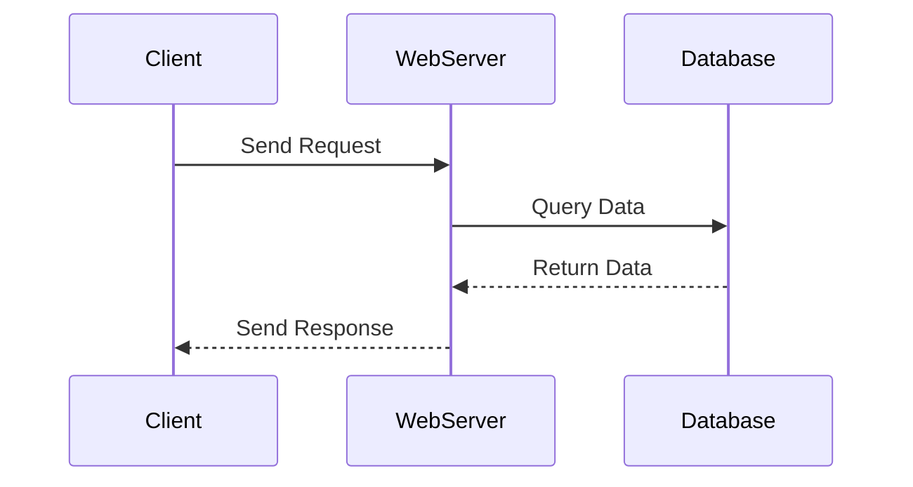

## 22.6. Dealing with Bottlenecks

In the realm of software development, bottlenecks can significantly impact the performance of an application, leading to slow response times and a poor user experience. In Elixir, with its concurrent and functional nature, identifying and resolving bottlenecks requires a unique approach. This guide will explore strategies to effectively deal with bottlenecks in Elixir applications, focusing on identifying hotspots, analyzing causes, implementing solutions, and monitoring improvements.

### Identifying Hotspots

The first step in dealing with bottlenecks is identifying the parts of your code that are causing slowdowns. This involves using profiling tools to collect data on your application's performance. Profiling provides insights into which functions or processes are consuming the most resources, allowing you to focus your optimization efforts where they are needed most.

#### Using Profiling Tools

Elixir provides several tools for profiling applications, each with its own strengths. Here are some common tools and techniques:

- **Erlang's `:fprof`**: A built-in profiler that provides detailed information about function calls and execution time. It's useful for identifying CPU-bound bottlenecks.
  
  ```elixir
  :fprof.start()
  :fprof.apply(&YourModule.your_function/0, [])
  :fprof.stop()
  :fprof.analyse()
  ```

- **`:eprof`**: Another Erlang profiler, more suited for profiling processes and understanding where time is spent across concurrent operations.

- **`:exprof`**: A wrapper around `:fprof` that provides a more user-friendly interface for Elixir developers.

- **`:observer`**: A graphical tool that provides real-time insights into the Erlang VM, including process information, memory usage, and more.

  ```elixir
  :observer.start()
  ```

- **`:recon`**: A library that offers advanced diagnostics for Erlang and Elixir applications, useful for identifying bottlenecks in production systems.

#### Profiling Example

Consider an Elixir application where a particular function is suspected of causing performance issues. Using `:fprof`, you can profile the function to gather detailed execution data:

```elixir
defmodule MyApp do
  def slow_function do
    Enum.reduce(1..1_000_000, 0, fn x, acc -> x + acc end)
  end
end

:fprof.start()
:fprof.apply(&MyApp.slow_function/0, [])
:fprof.stop()
:fprof.analyse()
```

The output will provide a breakdown of the time spent in each function, helping you pinpoint the bottleneck.

### Analyzing Causes

Once hotspots are identified, the next step is to analyze the underlying causes. Bottlenecks can arise from various sources, including I/O operations, database queries, and computational inefficiencies.

#### I/O Operations

I/O operations, such as reading from or writing to files, network communication, or interacting with external APIs, can be a significant source of bottlenecks. These operations are often blocking and can delay the execution of other processes.

- **Asynchronous I/O**: Elixir's concurrency model allows for asynchronous I/O operations, which can help mitigate bottlenecks by allowing other processes to continue executing while waiting for I/O operations to complete.

#### Database Queries

Inefficient database queries can also lead to performance issues. Common problems include:

- **N+1 Query Problem**: Occurs when an application makes a separate database query for each item in a collection, leading to a large number of queries.
- **Lack of Indexing**: Without proper indexing, database lookups can become slow, especially as data grows.

#### Computational Bottlenecks

Intensive computations can also slow down an application. This is often due to inefficient algorithms or data structures.

- **Algorithmic Complexity**: Ensure that algorithms are optimized for performance. Consider the time complexity and choose more efficient algorithms when possible.
- **Data Structures**: Use appropriate data structures that provide efficient access and manipulation of data.

### Implementing Solutions

After identifying the causes of bottlenecks, the next step is to implement solutions to address them. This may involve caching results, optimizing queries, or refactoring code.

#### Caching Results

Caching is a powerful technique for improving performance by storing the results of expensive computations or database queries, allowing subsequent requests to retrieve the data quickly without re-executing the computation or query.

- **ETS (Erlang Term Storage)**: A built-in Elixir feature that provides in-memory storage for caching data. It's highly efficient and can be used to store large amounts of data.

  ```elixir
  :ets.new(:cache, [:named_table, :public, read_concurrency: true])
  :ets.insert(:cache, {:key, "value"})
  ```

- **Cachex**: An Elixir library that provides a more feature-rich caching solution, including support for expiration, persistence, and more.

#### Optimizing Queries

Optimizing database queries can lead to significant performance improvements. This involves:

- **Using Ecto's Preloading**: To avoid the N+1 query problem, use Ecto's preloading feature to load associated data in a single query.

  ```elixir
  Repo.all(from p in Post, preload: [:comments])
  ```

- **Adding Indexes**: Ensure that the database has appropriate indexes for the queries being executed.

#### Code Refactoring

Refactoring code to improve its structure and efficiency can also help eliminate bottlenecks. This includes:

- **Removing Redundant Code**: Identify and remove any unnecessary computations or logic.
- **Using Tail-Call Optimization**: For recursive functions, ensure they are tail-recursive to take advantage of Elixir's tail-call optimization.

### Monitoring After Optimization

After implementing optimizations, it's crucial to continuously monitor the application's performance to ensure that the changes have had the desired effect and to catch any new bottlenecks that may arise.

#### Continuous Monitoring

- **Telemetry**: Use Elixir's Telemetry library to instrument your application and collect performance metrics.

  ```elixir
  :telemetry.attach("my-app-handler", [:my_app, :request, :stop], fn _event, measurements, _metadata ->
    IO.inspect(measurements)
  end)
  ```

- **Prometheus and Grafana**: Integrate with Prometheus for metrics collection and Grafana for visualization to gain insights into application performance over time.

#### Performance Regression Testing

Implement performance regression tests to ensure that future changes do not introduce new bottlenecks. These tests should be part of your continuous integration pipeline to automatically detect performance issues.

### Visualizing Bottlenecks

To better understand the flow of data and identify potential bottlenecks, visualizing the architecture and data flow can be beneficial. Below is a simple sequence diagram illustrating a typical request-response cycle in a web application:


```mermaid
sequenceDiagram
    participant Client
    participant WebServer
    participant Database
    Client->>WebServer: Send Request
    WebServer->>Database: Query Data
    Database-->>WebServer: Return Data
    WebServer-->>Client: Send Response
```

This diagram helps identify where delays might occur, such as in database queries or during data processing.

### Knowledge Check

Before we move on, let's consider some questions to test our understanding:

- What are the common tools used for profiling Elixir applications?
- How can asynchronous I/O operations help mitigate bottlenecks?
- What is the N+1 query problem, and how can it be resolved?
- Why is caching an effective strategy for dealing with bottlenecks?
- How can continuous monitoring help maintain application performance?

### Embrace the Journey

Remember, dealing with bottlenecks is an ongoing process that requires vigilance and a proactive approach. As you enhance your skills in identifying and resolving performance issues, you'll become more adept at building efficient and responsive applications. Keep experimenting, stay curious, and enjoy the journey!

## Quiz Time!



### Which tool is used for profiling function calls and execution time in Elixir?

- [x] :fprof
- [ ] :eprof
- [ ] :observer
- [ ] :recon

> **Explanation:** `:fprof` is used for profiling function calls and execution time in Elixir.

### What is a common cause of bottlenecks related to database operations?

- [ ] Asynchronous I/O
- [ ] Tail-call optimization
- [x] N+1 query problem
- [ ] ETS caching

> **Explanation:** The N+1 query problem is a common cause of bottlenecks in database operations.

### Which Elixir feature is used for in-memory caching?

- [ ] Cachex
- [ ] Ecto
- [x] ETS
- [ ] Telemetry

> **Explanation:** ETS (Erlang Term Storage) is used for in-memory caching in Elixir.

### How does preloading in Ecto help with database performance?

- [x] It loads associated data in a single query.
- [ ] It caches query results.
- [ ] It indexes database tables.
- [ ] It performs asynchronous I/O.

> **Explanation:** Preloading in Ecto helps by loading associated data in a single query, reducing the number of queries.

### What is the purpose of continuous monitoring after optimization?

- [x] To ensure changes have the desired effect and catch new bottlenecks.
- [ ] To remove redundant code.
- [ ] To implement caching.
- [ ] To perform asynchronous I/O.

> **Explanation:** Continuous monitoring helps ensure that optimizations have the desired effect and catch any new bottlenecks.

### What is a benefit of using Telemetry in Elixir?

- [ ] It provides in-memory caching.
- [ ] It preloads associated data.
- [x] It collects performance metrics.
- [ ] It performs function profiling.

> **Explanation:** Telemetry is used to collect performance metrics in Elixir applications.

### Which tool can be used to visualize performance metrics collected by Prometheus?

- [ ] :fprof
- [ ] :eprof
- [x] Grafana
- [ ] Cachex

> **Explanation:** Grafana is used to visualize performance metrics collected by Prometheus.

### What is a key advantage of using Cachex over ETS?

- [x] Feature-rich caching solution with expiration and persistence.
- [ ] Faster in-memory storage.
- [ ] Better function profiling.
- [ ] Easier database integration.

> **Explanation:** Cachex provides a feature-rich caching solution with support for expiration and persistence, offering more features than ETS.

### Which of the following is NOT a common cause of bottlenecks?

- [ ] I/O operations
- [ ] Database queries
- [ ] Computational inefficiencies
- [x] Telemetry collection

> **Explanation:** Telemetry collection is not a common cause of bottlenecks; it is used for monitoring.

### True or False: Tail-call optimization is crucial for optimizing recursive functions in Elixir.

- [x] True
- [ ] False

> **Explanation:** Tail-call optimization is crucial for optimizing recursive functions in Elixir to prevent stack overflow and improve performance.



By following these guidelines, you can effectively identify and resolve bottlenecks in your Elixir applications, leading to improved performance and a better user experience.
