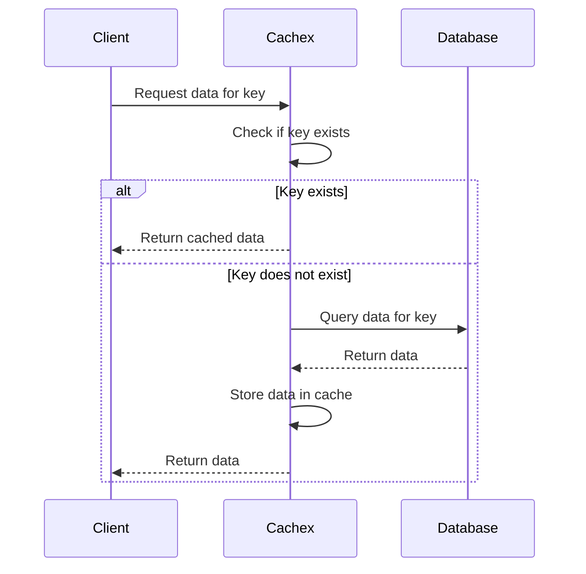

## 22.7. Caching Strategies with Cachex

In this section, we delve into the world of caching strategies using Cachex, a powerful caching library for Elixir. Caching is a crucial technique for optimizing performance, reducing the load on databases or external services, and ensuring efficient data retrieval. Let's explore how Cachex can be leveraged to implement effective caching strategies in Elixir applications.

### Benefits of Caching

Caching offers several benefits that can significantly enhance the performance and scalability of your applications:

- **Reducing Load on Databases or External Services**: By storing frequently accessed data in memory, caching reduces the need to repeatedly query databases or external services, thereby decreasing latency and improving response times.
- **Improving Application Performance**: Cached data can be retrieved much faster than data fetched from a database or an external service, leading to quicker response times for end-users.
- **Enhancing Scalability**: Caching helps distribute the load more evenly across your system, allowing it to handle more concurrent requests without degrading performance.
- **Cost Efficiency**: By reducing the number of database queries or API calls, caching can lower operational costs, especially in cloud environments where such operations are billed.

### Using Cachex

Cachex is a versatile caching library for Elixir that provides a wide range of features, including in-memory caching, time-to-live (TTL) settings, and support for distributed caching. Let's explore how to set up and use Cachex in your Elixir applications.

#### Setting Up Cachex

To start using Cachex, you need to add it to your project's dependencies. Open your `mix.exs` file and add Cachex to the list of dependencies:

```elixir
defp deps do
  [
    {:cachex, "~> 3.3"}
  ]
end
```

Run `mix deps.get` to fetch the dependency. Once Cachex is added, you can create a cache by defining it in your application's supervision tree:

```elixir
defmodule MyApp.Application do
  use Application

  def start(_type, _args) do
    children = [
      {Cachex, name: :my_cache}
    ]

    opts = [strategy: :one_for_one, name: MyApp.Supervisor]
    Supervisor.start_link(children, opts)
  end
end
```

In this example, we create a cache named `:my_cache` and add it to the supervision tree, ensuring that it is started and managed by the Elixir runtime.

#### Basic Cache Operations

Cachex provides a simple API for performing basic cache operations such as fetching, inserting, and deleting cache entries. Here's a quick overview:

- **Inserting Data into the Cache**: Use `Cachex.put/3` to store data in the cache.

  ```elixir
  Cachex.put(:my_cache, "key", "value")
  ```

- **Fetching Data from the Cache**: Use `Cachex.get/2` to retrieve data from the cache.

  ```elixir
  {:ok, value} = Cachex.get(:my_cache, "key")
  ```

- **Deleting Data from the Cache**: Use `Cachex.del/2` to remove data from the cache.

  ```elixir
  Cachex.del(:my_cache, "key")
  ```

#### Time-to-Live (TTL) Settings

Cachex allows you to specify a TTL for cache entries, ensuring that stale data is automatically removed after a certain period. You can set a TTL when inserting data:

```elixir
Cachex.put(:my_cache, "key", "value", ttl: :timer.minutes(5))
```

In this example, the cache entry will expire after 5 minutes. You can also set a default TTL for the entire cache when initializing it:

```elixir
{Cachex, name: :my_cache, default_ttl: :timer.minutes(10)}
```

### Cache Invalidation

Cache invalidation is a critical aspect of caching strategies, as it ensures that the cache remains fresh and consistent with the underlying data source. There are several strategies for cache invalidation:

- **Time-Based Invalidation**: Use TTL settings to automatically expire cache entries after a certain period.
- **Event-Based Invalidation**: Invalidate cache entries in response to specific events, such as data updates or deletions.
- **Manual Invalidation**: Explicitly remove or update cache entries when the underlying data changes.

#### Implementing Event-Based Invalidation

To implement event-based invalidation, you can use Elixir's PubSub system to broadcast events when data changes. Here's an example:

```elixir
defmodule MyApp.Data do
  def update_data(key, new_value) do
    # Update the data in the database
    :ok = Database.update(key, new_value)

    # Broadcast an event to invalidate the cache
    MyApp.PubSub.broadcast(:data_updated, key)
  end
end

defmodule MyApp.CacheListener do
  use GenServer

  def start_link(_) do
    GenServer.start_link(__MODULE__, nil, name: __MODULE__)
  end

  def init(_) do
    MyApp.PubSub.subscribe(:data_updated)
    {:ok, nil}
  end

  def handle_info({:data_updated, key}, state) do
    Cachex.del(:my_cache, key)
    {:noreply, state}
  end
end
```

In this example, the `MyApp.Data` module updates the data and broadcasts an event. The `MyApp.CacheListener` module listens for these events and invalidates the cache accordingly.

### Distributed Caching

In distributed systems, sharing cache across nodes is essential for maintaining consistency and reducing redundant data storage. Cachex supports distributed caching through the use of distributed Erlang.

#### Setting Up Distributed Caching

To enable distributed caching, you need to configure your Elixir nodes to communicate with each other. This involves setting up a distributed Erlang cluster and ensuring that Cachex is configured to use it.

```elixir
# In your config/config.exs
config :my_app, :cachex,
  nodes: [:"node1@hostname", :"node2@hostname"]
```

Ensure that your nodes are started with the `-name` flag to enable distributed communication:

```bash
iex --sname node1 -S mix
iex --sname node2 -S mix
```

With this setup, Cachex can share cache entries across nodes, ensuring consistency and reducing duplication.

### Visualizing Caching Strategies

To better understand the flow of caching strategies, let's visualize the process using a sequence diagram.



This diagram illustrates the typical flow of a caching strategy, where the cache is checked first, and the database is queried only if the data is not found in the cache.

### Design Considerations

When implementing caching strategies with Cachex, consider the following:

- **Cache Size**: Determine the appropriate cache size based on your application's memory constraints and data access patterns.
- **TTL Settings**: Choose TTL settings that balance data freshness with performance.
- **Cache Invalidation**: Implement robust invalidation strategies to ensure data consistency.
- **Distributed Caching**: Consider the network overhead and complexity of maintaining a distributed cache.

### Elixir Unique Features

Elixir's concurrency model and lightweight processes make it well-suited for implementing efficient caching strategies. Cachex leverages these features to provide a high-performance caching solution that integrates seamlessly with Elixir's ecosystem.

### Differences and Similarities

Cachex is similar to other caching libraries in its basic functionality but stands out with its support for distributed caching and flexible TTL settings. Unlike some libraries, Cachex is designed specifically for Elixir, taking advantage of its concurrency model and process architecture.

### Try It Yourself

To experiment with Cachex, try modifying the TTL settings and observe how it affects cache expiration. You can also implement event-based invalidation for different types of data changes and see how it impacts cache consistency.

### Knowledge Check

- What are the benefits of using caching in Elixir applications?
- How does Cachex support distributed caching?
- What are some strategies for cache invalidation?
- How can you set a default TTL for a Cachex cache?
- What are the design considerations when implementing caching strategies with Cachex?

### Embrace the Journey

Remember, mastering caching strategies is just one part of optimizing your Elixir applications. As you continue to explore and experiment, you'll discover new ways to enhance performance and scalability. Keep learning, stay curious, and enjoy the journey!

## Quiz: Caching Strategies with Cachex



### What is one of the primary benefits of caching in Elixir applications?

- [x] Reducing load on databases or external services
- [ ] Increasing database query complexity
- [ ] Slowing down response times
- [ ] Increasing operational costs

> **Explanation:** Caching reduces the need to repeatedly query databases or external services, thereby decreasing latency and improving response times.

### How do you set a TTL for a cache entry in Cachex?

- [x] By using the `ttl` option in `Cachex.put/4`
- [ ] By modifying the database schema
- [ ] By changing the application's configuration file
- [ ] By using the `Cachex.get/2` function

> **Explanation:** You can set a TTL for a cache entry by using the `ttl` option in the `Cachex.put/4` function.

### What is a common strategy for cache invalidation?

- [x] Event-based invalidation
- [ ] Ignoring data changes
- [ ] Increasing cache size indefinitely
- [ ] Using only manual invalidation

> **Explanation:** Event-based invalidation involves invalidating cache entries in response to specific events, such as data updates or deletions.

### How can Cachex support distributed caching?

- [x] By configuring nodes in a distributed Erlang cluster
- [ ] By using a single node for all caching operations
- [ ] By storing cache entries in a local file system
- [ ] By disabling TTL settings

> **Explanation:** Cachex supports distributed caching by configuring nodes in a distributed Erlang cluster, allowing cache entries to be shared across nodes.

### What is a key consideration when implementing caching strategies?

- [x] Cache size and memory constraints
- [ ] Ignoring data freshness
- [ ] Using only manual invalidation
- [ ] Disabling distributed caching

> **Explanation:** Cache size and memory constraints are important considerations to ensure efficient caching without exhausting system resources.

### Which Elixir feature enhances Cachex's performance?

- [x] Concurrency model and lightweight processes
- [ ] Lack of process architecture
- [ ] Single-threaded execution
- [ ] Absence of distributed capabilities

> **Explanation:** Elixir's concurrency model and lightweight processes enhance Cachex's performance by allowing efficient handling of cache operations.

### What is a unique feature of Cachex compared to other caching libraries?

- [x] Support for distributed caching
- [ ] Lack of TTL settings
- [ ] Inability to handle concurrent requests
- [ ] Requirement for manual cache management

> **Explanation:** Cachex stands out with its support for distributed caching, allowing cache entries to be shared across nodes in a cluster.

### How can you experiment with Cachex?

- [x] By modifying TTL settings and implementing event-based invalidation
- [ ] By ignoring cache invalidation strategies
- [ ] By disabling cache expiration
- [ ] By using only manual cache management

> **Explanation:** Experimenting with TTL settings and implementing event-based invalidation allows you to observe their impact on cache consistency and performance.

### What is the purpose of the sequence diagram in the article?

- [x] To illustrate the typical flow of a caching strategy
- [ ] To demonstrate database schema design
- [ ] To show network configuration
- [ ] To explain Elixir's concurrency model

> **Explanation:** The sequence diagram illustrates the typical flow of a caching strategy, showing how the cache is checked first and the database is queried only if necessary.

### True or False: Cachex is designed specifically for Elixir, leveraging its concurrency model and process architecture.

- [x] True
- [ ] False

> **Explanation:** Cachex is designed specifically for Elixir, taking advantage of its concurrency model and process architecture to provide a high-performance caching solution.


