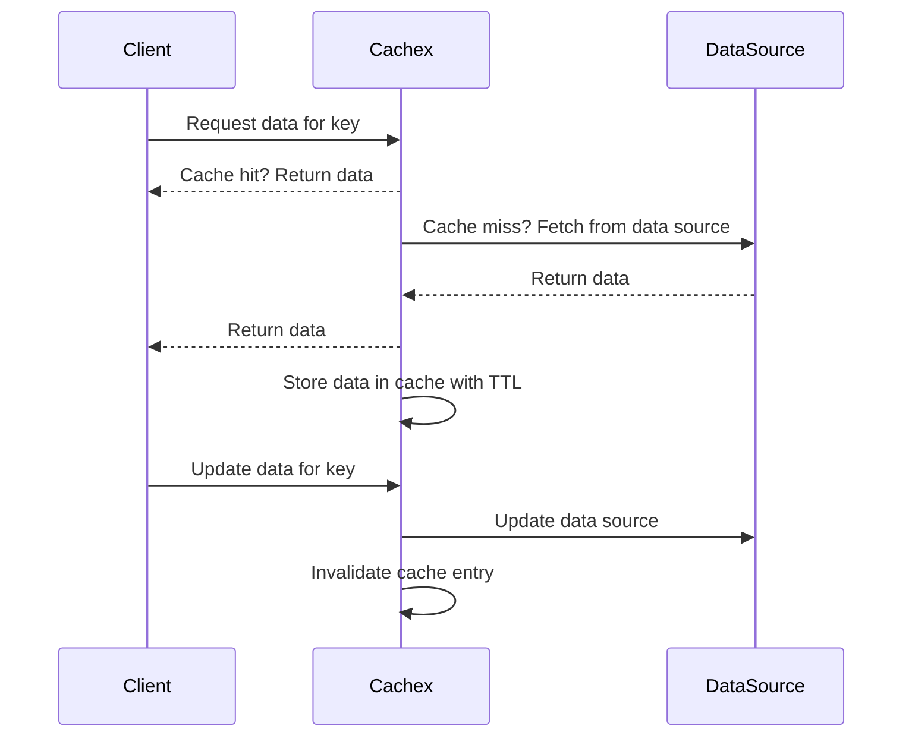

## 22.7. Caching Strategies with Cachex

In the realm of high-performance applications, caching is a critical strategy to enhance speed and efficiency. By storing frequently accessed data in memory, we can significantly reduce the load on databases or external services, leading to faster response times and improved user experience. In Elixir, Cachex is a powerful library designed to provide a flexible and efficient caching solution. In this section, we will delve into the benefits of caching, explore the features of Cachex, discuss cache invalidation strategies, and examine distributed caching across nodes.

### Benefits of Caching

Caching offers several advantages that are crucial for building scalable and responsive applications:

- **Reduced Latency**: By storing data in memory, caching minimizes the time required to retrieve data, leading to faster response times.
- **Decreased Load on Databases**: Caching reduces the number of requests to databases or external services, which can alleviate bottlenecks and improve overall system performance.
- **Improved Throughput**: With less load on backend services, the system can handle more requests concurrently, enhancing throughput.
- **Cost Efficiency**: By reducing the need for frequent database queries or external API calls, caching can lead to cost savings, especially in cloud-based environments where such operations incur charges.

### Using Cachex

Cachex is a versatile caching library for Elixir that provides a range of features to implement in-memory caching with ease. Let's explore how to set up and use Cachex in your Elixir applications.

#### Setting Up Cachex

To begin using Cachex, add it to your project's dependencies in `mix.exs`:

```elixir
defp deps do
  [
    {:cachex, "~> 3.0"}
  ]
end
```

Run `mix deps.get` to fetch the dependency. Next, start Cachex in your application by adding it to your supervision tree:

```elixir
defmodule MyApp.Application do
  use Application

  def start(_type, _args) do
    children = [
      {Cachex, name: :my_cache}
    ]

    opts = [strategy: :one_for_one, name: MyApp.Supervisor]
    Supervisor.start_link(children, opts)
  end
end
```

#### Basic Cache Operations

Once Cachex is set up, you can perform basic cache operations such as storing, retrieving, and deleting data:

```elixir
# Storing data in the cache
Cachex.put(:my_cache, "key", "value")

# Retrieving data from the cache
{:ok, value} = Cachex.get(:my_cache, "key")

# Deleting data from the cache
Cachex.del(:my_cache, "key")
```

#### Flexible Time-to-Live (TTL)

Cachex allows setting a time-to-live (TTL) for cache entries, ensuring that stale data is automatically purged:

```elixir
# Storing data with a TTL of 60 seconds
Cachex.put(:my_cache, "key", "value", ttl: :timer.seconds(60))
```

### Cache Invalidation

One of the challenges of caching is ensuring that the cache remains fresh and consistent with the underlying data source. Cache invalidation strategies are essential to address this challenge.

#### Strategies for Cache Invalidation

1. **Time-Based Invalidation**: Use TTL to automatically remove entries after a certain period.
2. **Event-Driven Invalidation**: Invalidate cache entries in response to specific events, such as data updates or deletions.
3. **Manual Invalidation**: Explicitly remove or update cache entries when changes occur in the data source.

#### Implementing Cache Invalidation

Here's an example of manual cache invalidation in response to data changes:

```elixir
def update_data(key, new_value) do
  # Update the data source
  :ok = update_data_source(key, new_value)

  # Invalidate the cache entry
  Cachex.del(:my_cache, key)
end
```

### Distributed Caching

In a distributed system, sharing cache across multiple nodes can enhance performance and consistency. Cachex supports distributed caching using Erlang's distributed capabilities.

#### Setting Up Distributed Cachex

To enable distributed caching, configure your nodes to connect with each other:

```elixir
# In your config/config.exs
config :cachex, :nodes, [:node1@hostname, :node2@hostname]
```

#### Sharing Cache Across Nodes

Cachex automatically synchronizes cache entries across connected nodes, allowing data to be shared seamlessly. This setup is particularly useful in clustered environments where consistency and availability are critical.

### Visualizing Cachex Workflow

To better understand how Cachex operates, let's visualize the workflow of caching, retrieval, and invalidation using a sequence diagram.


```mermaid
sequenceDiagram
    participant Client
    participant Cachex
    participant DataSource

    Client->>Cachex: Request data for key
    Cachex-->>Client: Cache hit? Return data
    Cachex->>DataSource: Cache miss? Fetch from data source
    DataSource-->>Cachex: Return data
    Cachex-->>Client: Return data
    Cachex->>Cachex: Store data in cache with TTL
    Client->>Cachex: Update data for key
    Cachex->>DataSource: Update data source
    Cachex->>Cachex: Invalidate cache entry
```

### Key Considerations

When implementing caching strategies with Cachex, consider the following:

- **Consistency**: Ensure that cache entries are consistent with the data source, especially in distributed environments.
- **TTL Configuration**: Choose appropriate TTL values based on data volatility and access patterns.
- **Cache Size**: Monitor and manage cache size to prevent memory exhaustion.
- **Concurrency**: Handle concurrent access to cache entries to avoid race conditions.

### Elixir Unique Features

Elixir's concurrency model and actor-based architecture make it well-suited for caching. Cachex leverages these features to provide efficient and scalable caching solutions. Additionally, Elixir's pattern matching and functional programming paradigms facilitate the implementation of complex caching logic.

### Differences and Similarities

Cachex shares similarities with other caching libraries in terms of basic operations and TTL management. However, its integration with Elixir's ecosystem and support for distributed caching set it apart. Unlike some libraries that require external services, Cachex operates entirely within the BEAM VM, providing a lightweight and efficient solution.

### Try It Yourself

To deepen your understanding of Cachex, try modifying the code examples to experiment with different TTL values, cache invalidation strategies, and distributed configurations. Observe how these changes affect cache behavior and performance.

### Knowledge Check

- How does Cachex handle cache invalidation?
- What are the benefits of using distributed caching with Cachex?
- How can you configure Cachex to share cache across multiple nodes?

### Embrace the Journey

Remember, caching is a powerful tool to optimize performance, but it requires careful consideration of consistency and invalidation strategies. As you explore Cachex, keep experimenting, stay curious, and enjoy the journey of building high-performance Elixir applications.

## Quiz Time!



### What is one primary benefit of caching in applications?

- [x] Reducing load on databases or external services.
- [ ] Increasing the complexity of data retrieval.
- [ ] Slowing down response times.
- [ ] Consuming more memory than necessary.

> **Explanation:** Caching reduces the load on databases or external services by storing frequently accessed data in memory, leading to faster response times.

### How can you set a time-to-live (TTL) for a cache entry in Cachex?

- [x] By using the `ttl` option in the `Cachex.put/4` function.
- [ ] By setting a global configuration for all cache entries.
- [ ] By manually deleting cache entries after a period.
- [ ] By using a separate library for TTL management.

> **Explanation:** Cachex allows setting a TTL for individual cache entries using the `ttl` option in the `Cachex.put/4` function.

### What is a common strategy for cache invalidation?

- [x] Time-based invalidation using TTL.
- [ ] Never invalidating cache entries.
- [ ] Storing cache entries indefinitely.
- [ ] Using cache entries only once.

> **Explanation:** Time-based invalidation using TTL is a common strategy to ensure that cache entries are automatically removed after a certain period.

### How does Cachex support distributed caching?

- [x] By using Erlang's distributed capabilities to synchronize cache entries across nodes.
- [ ] By requiring an external distributed caching service.
- [ ] By storing cache entries in a centralized database.
- [ ] By using a separate library for distributed caching.

> **Explanation:** Cachex supports distributed caching by leveraging Erlang's distributed capabilities, allowing cache entries to be synchronized across nodes.

### What is a key consideration when implementing caching strategies?

- [x] Ensuring consistency between cache entries and the data source.
- [ ] Ignoring cache size and memory usage.
- [ ] Using the same TTL for all cache entries.
- [ ] Avoiding cache invalidation.

> **Explanation:** Ensuring consistency between cache entries and the data source is crucial to prevent stale or incorrect data from being served.

### Which Elixir feature enhances Cachex's efficiency?

- [x] Elixir's concurrency model and actor-based architecture.
- [ ] Elixir's lack of support for distributed systems.
- [ ] Elixir's requirement for external caching services.
- [ ] Elixir's limited pattern matching capabilities.

> **Explanation:** Elixir's concurrency model and actor-based architecture enhance Cachex's efficiency by providing a scalable and responsive environment for caching.

### What is a similarity between Cachex and other caching libraries?

- [x] Basic operations and TTL management.
- [ ] Requirement for external services.
- [ ] Lack of support for distributed caching.
- [ ] Inability to handle concurrent access.

> **Explanation:** Cachex shares similarities with other caching libraries in terms of basic operations and TTL management, but it stands out with its integration with Elixir's ecosystem.

### How can you experiment with Cachex?

- [x] By modifying code examples to try different TTL values and invalidation strategies.
- [ ] By using Cachex without any configuration.
- [ ] By avoiding any changes to the default settings.
- [ ] By using Cachex only in single-node environments.

> **Explanation:** Experimenting with different TTL values, invalidation strategies, and distributed configurations can deepen your understanding of Cachex.

### What is a risk of improper cache size management?

- [x] Memory exhaustion.
- [ ] Faster response times.
- [ ] Reduced latency.
- [ ] Improved throughput.

> **Explanation:** Improper cache size management can lead to memory exhaustion, which can negatively impact application performance and stability.

### True or False: Cachex requires external services to operate.

- [x] False
- [ ] True

> **Explanation:** Cachex operates entirely within the BEAM VM and does not require external services, providing a lightweight and efficient caching solution.


