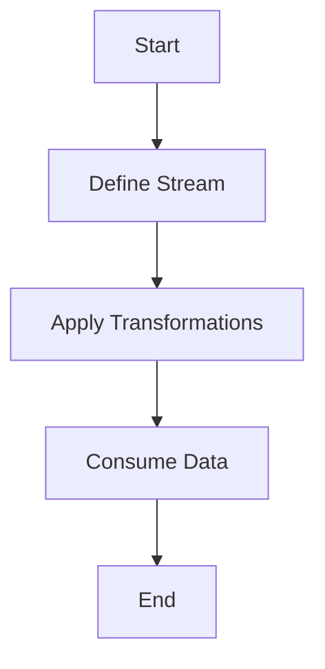

## 22.8. Lazy Evaluation and Streams

In the realm of functional programming, lazy evaluation and streams are powerful concepts that can significantly enhance the performance and efficiency of your applications. Elixir, with its functional nature and robust concurrency model, provides excellent support for these paradigms. In this section, we will delve into the intricacies of lazy evaluation and streams, exploring their benefits, use cases, and best practices.

### Deferring Computations

Lazy evaluation is a technique where computations are deferred until their results are actually needed. This can lead to significant performance improvements, especially when dealing with large datasets or complex computations. In Elixir, streams are the primary mechanism for implementing lazy evaluation.

#### Using Streams to Process Data Only When Needed

Streams in Elixir allow you to work with potentially infinite data sequences without loading the entire dataset into memory. This is achieved by creating a series of computations that are executed only when the data is consumed. Let's explore how streams work in Elixir with a simple example:

```elixir
# Define a stream that generates an infinite sequence of numbers
stream = Stream.iterate(0, &(&1 + 1))

# Take the first 10 numbers from the stream
first_ten_numbers = Enum.take(stream, 10)

IO.inspect(first_ten_numbers)
# Output: [0, 1, 2, 3, 4, 5, 6, 7, 8, 9]
```

In this example, `Stream.iterate/2` creates an infinite stream of numbers starting from 0. The numbers are generated lazily, meaning they are only computed when `Enum.take/2` requests them.

### Advantages of Lazy Evaluation

Lazy evaluation offers several advantages, particularly in terms of performance and resource management:

- **Memory Efficiency**: By processing data only when needed, lazy evaluation reduces memory consumption. This is especially beneficial when working with large datasets or streams of data.
- **Improved Startup Times**: Applications can start faster because computations are deferred until necessary.
- **Handling Infinite Data Sequences**: Lazy evaluation allows you to work with infinite data sequences, such as streams of events or sensor data, without running out of memory.

### Examples of Lazy Evaluation

#### Processing Large Files

Consider a scenario where you need to process a large CSV file. Loading the entire file into memory can be inefficient and may lead to performance bottlenecks. Instead, you can use streams to process the file line by line:

```elixir
# Open a file stream
file_stream = File.stream!("large_file.csv")

# Process each line lazily
processed_lines = file_stream
|> Stream.map(&String.trim/1)
|> Stream.filter(&String.contains?(&1, "keyword"))
|> Enum.take(10)

IO.inspect(processed_lines)
```

In this example, `File.stream!/1` creates a stream that reads the file line by line. The `Stream.map/2` and `Stream.filter/2` functions process each line lazily, ensuring that only the necessary lines are read and processed.

#### Handling Infinite Data Sequences

Streams are ideal for handling infinite data sequences, such as generating Fibonacci numbers:

```elixir
# Define a stream for Fibonacci numbers
fibonacci_stream = Stream.unfold({0, 1}, fn {a, b} -> {a, {b, a + b}} end)

# Take the first 10 Fibonacci numbers
first_ten_fibonacci = Enum.take(fibonacci_stream, 10)

IO.inspect(first_ten_fibonacci)
# Output: [0, 1, 1, 2, 3, 5, 8, 13, 21, 34]
```

The `Stream.unfold/2` function generates an infinite sequence of Fibonacci numbers. The sequence is computed lazily, allowing you to take only the numbers you need.

### Best Practices for Using Streams

While streams offer powerful capabilities, it's important to use them judiciously to avoid potential pitfalls. Here are some best practices for working with streams in Elixir:

- **Combine Streams with Enum Functions Carefully**: When combining streams with `Enum` functions, be mindful of the order of operations. Ensure that operations that require the entire dataset, such as `Enum.sort/1`, are performed after the stream has been fully realized.
- **Avoid Side Effects**: Streams are designed for pure functional transformations. Avoid introducing side effects within stream operations, as this can lead to unexpected behavior.
- **Use Streams for Large or Infinite Data**: Streams are most beneficial when working with large datasets or infinite sequences. For small datasets, the overhead of setting up a stream may outweigh the benefits.
- **Profile and Benchmark**: Always profile and benchmark your code to ensure that streams are providing the desired performance improvements. Use tools like `Benchee` for benchmarking.

### Visualizing Lazy Evaluation and Streams

To better understand how lazy evaluation and streams work, let's visualize the process using a flowchart:



In this flowchart, we start by defining a stream, apply transformations lazily, and finally consume the data, triggering the computations.

### Elixir Unique Features

Elixir's streams are built on top of the Erlang VM's capabilities, providing seamless integration with Elixir's concurrency model. This allows streams to be used effectively in concurrent and distributed systems, leveraging Elixir's strengths in these areas.

### Differences and Similarities with Other Languages

In contrast to languages like Python or JavaScript, where lazy evaluation is not a native feature, Elixir provides built-in support for streams and lazy evaluation. This makes Elixir particularly well-suited for applications that require efficient data processing and concurrency.

### Try It Yourself

To get hands-on experience with streams, try modifying the examples provided. For instance, experiment with different transformations, such as filtering or mapping, and observe how they affect the performance and output of the stream.

### Knowledge Check

- What are the benefits of using lazy evaluation in Elixir?
- How do streams help in processing large datasets efficiently?
- What are some best practices for using streams in Elixir?

### Summary

Lazy evaluation and streams are powerful tools in Elixir that allow you to optimize performance by deferring computations. By processing data only when needed, you can handle large datasets and infinite sequences efficiently. Remember to combine streams with `Enum` functions carefully, avoid side effects, and profile your code to ensure optimal performance.

## Quiz: Lazy Evaluation and Streams



### What is lazy evaluation?

- [x] A technique where computations are deferred until their results are needed
- [ ] A method of eagerly loading all data into memory
- [ ] A way to optimize code by removing unused variables
- [ ] A process of compiling code at runtime

> **Explanation:** Lazy evaluation defers computations until their results are actually needed, improving performance and memory usage.

### How do streams in Elixir help with memory efficiency?

- [x] By processing data only when needed
- [ ] By loading all data into memory at once
- [ ] By caching data in memory
- [ ] By using parallel processing

> **Explanation:** Streams process data lazily, which means they only compute values when they are needed, reducing memory usage.

### What is a key advantage of using streams for large datasets?

- [x] They allow processing without loading the entire dataset into memory
- [ ] They automatically sort data
- [ ] They increase the speed of data retrieval
- [ ] They simplify data encryption

> **Explanation:** Streams enable processing of large datasets without loading the entire dataset into memory, improving efficiency.

### Which function creates an infinite stream of numbers in Elixir?

- [x] Stream.iterate/2
- [ ] Enum.map/2
- [ ] List.flatten/1
- [ ] File.stream!/1

> **Explanation:** Stream.iterate/2 creates an infinite stream by applying a function repeatedly.

### What is a common use case for lazy evaluation?

- [x] Handling infinite data sequences
- [ ] Sorting small lists
- [ ] Compiling code at runtime
- [ ] Encrypting data

> **Explanation:** Lazy evaluation is particularly useful for handling infinite data sequences, as it processes data only when needed.

### What should you avoid when using streams in Elixir?

- [x] Introducing side effects
- [ ] Using pure functions
- [ ] Combining with Enum functions
- [ ] Processing large datasets

> **Explanation:** Streams are designed for pure functional transformations, and introducing side effects can lead to unexpected behavior.

### How can you visualize the process of lazy evaluation?

- [x] Using a flowchart
- [ ] By writing pseudocode
- [ ] By creating a UML diagram
- [ ] By drawing a pie chart

> **Explanation:** A flowchart can effectively visualize the process of lazy evaluation, showing the sequence of operations.

### What tool can you use to benchmark Elixir code?

- [x] Benchee
- [ ] Dialyzer
- [ ] Credo
- [ ] ExUnit

> **Explanation:** Benchee is a tool for benchmarking Elixir code, helping you measure performance improvements.

### In Elixir, what function is used to take elements from a stream?

- [x] Enum.take/2
- [ ] Stream.map/2
- [ ] List.first/1
- [ ] Enum.sort/1

> **Explanation:** Enum.take/2 is used to take a specified number of elements from a stream.

### True or False: Lazy evaluation can improve application startup times.

- [x] True
- [ ] False

> **Explanation:** Lazy evaluation can improve startup times by deferring computations until they are needed, reducing initial processing.



Remember, this is just the beginning. As you progress, you'll build more complex and efficient applications using lazy evaluation and streams. Keep experimenting, stay curious, and enjoy the journey!
