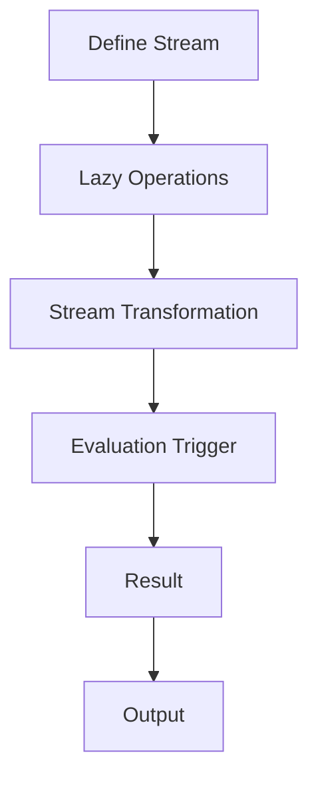

## 22.8. Lazy Evaluation and Streams

In the world of functional programming, lazy evaluation and streams are powerful concepts that allow developers to optimize performance and memory usage by deferring computations until they are absolutely necessary. Elixir, with its functional roots, provides robust support for lazy evaluation through its `Stream` module, enabling efficient data processing, especially when dealing with large datasets or infinite sequences.

### Deferring Computations

Lazy evaluation is a technique where expressions are not evaluated until their values are needed. This approach can lead to significant performance improvements, particularly in scenarios involving large or complex computations. In Elixir, lazy evaluation is achieved through the use of streams, which are essentially lazy enumerables that allow you to work with potentially infinite data in a memory-efficient manner.

#### Using Streams to Process Data Only When Needed

Streams in Elixir provide a way to handle collections lazily. Instead of computing all elements of a collection at once, streams compute elements on-the-fly as they are accessed. This deferred computation can be particularly beneficial when working with large data sets or when performing expensive operations.

Here's a simple example to illustrate lazy evaluation with streams:

```elixir
# Define a stream that generates an infinite sequence of numbers starting from 0
stream = Stream.iterate(0, &(&1 + 1))

# Take the first 10 numbers from the stream
result = stream |> Enum.take(10)

IO.inspect(result)
# Output: [0, 1, 2, 3, 4, 5, 6, 7, 8, 9]
```

In this example, the stream is defined to generate an infinite sequence of numbers. However, only the first 10 numbers are computed and printed, thanks to the lazy nature of streams.

### Advantages of Lazy Evaluation and Streams

Lazy evaluation and streams offer several advantages, particularly in terms of performance and resource management:

#### Saving Memory

By deferring computations, streams help in reducing memory usage. Instead of loading entire datasets into memory, streams allow you to process data incrementally, which can be a lifesaver when dealing with large files or datasets.

#### Improving Startup Times

Lazy evaluation can also lead to faster startup times for applications. Since computations are deferred until necessary, the initial load time is reduced, allowing applications to start up more quickly.

#### Efficient Handling of Infinite Data Sequences

Streams are particularly useful for handling infinite data sequences, such as generating numbers or reading continuous data streams from sensors or network sources. They allow you to work with such data in a controlled and efficient manner.

### Examples of Lazy Evaluation and Streams

Let's explore some practical examples where lazy evaluation and streams can be effectively utilized in Elixir.

#### Processing Large Files

Consider a scenario where you need to process a large CSV file. Loading the entire file into memory might not be feasible due to its size. Streams provide a way to process the file line-by-line, reducing memory consumption:

```elixir
# Stream the file line-by-line
file_stream = File.stream!("large_file.csv")

# Process each line lazily
processed_data = file_stream
|> Stream.map(&String.split(&1, ","))
|> Stream.filter(fn line -> Enum.at(line, 0) == "important" end)
|> Enum.to_list()

IO.inspect(processed_data)
```

In this example, the file is read line-by-line, and each line is processed only when needed, thanks to the lazy nature of streams.

#### Handling Infinite Data Sequences

Streams are ideal for generating and processing infinite sequences. For instance, you can generate an infinite sequence of Fibonacci numbers using streams:

```elixir
# Define a stream to generate Fibonacci numbers
fibonacci_stream = Stream.unfold({0, 1}, fn {a, b} -> {a, {b, a + b}} end)

# Take the first 10 Fibonacci numbers
fibonacci_numbers = fibonacci_stream |> Enum.take(10)

IO.inspect(fibonacci_numbers)
# Output: [0, 1, 1, 2, 3, 5, 8, 13, 21, 34]
```

This example demonstrates how streams can be used to generate an infinite sequence of Fibonacci numbers, computing each number only when needed.

### Best Practices for Using Lazy Evaluation and Streams

While streams and lazy evaluation offer significant benefits, it's important to use them wisely to avoid potential pitfalls. Here are some best practices to consider:

#### Combining Streams with Enum Functions Carefully

When working with streams, it's crucial to understand the difference between lazy and eager operations. Functions in the `Enum` module are eager, meaning they will evaluate the entire collection immediately. In contrast, functions in the `Stream` module are lazy.

To maintain laziness, chain stream operations together and use `Enum` functions only when you need to force evaluation:

```elixir
# Lazy operations
stream = 1..1000
|> Stream.map(&(&1 * 2))
|> Stream.filter(&rem(&1, 3) == 0)

# Force evaluation with Enum
result = Enum.to_list(stream)

IO.inspect(result)
```

In this example, the `Stream.map` and `Stream.filter` operations are lazy, and the computation is deferred until `Enum.to_list` is called.

#### Avoiding Unnecessary Evaluations

Be mindful of operations that force evaluation of the entire stream. Functions like `Enum.to_list`, `Enum.count`, or `Enum.sum` will evaluate the entire stream, potentially negating the benefits of laziness.

#### Handling Side Effects

Streams are best suited for pure functions without side effects. If your stream processing involves side effects (e.g., writing to a file or updating a database), ensure that these operations are handled appropriately to avoid unintended consequences.

### Visualizing Lazy Evaluation and Streams

To better understand the flow of lazy evaluation and streams in Elixir, let's visualize the process using a flowchart:


```mermaid
graph TD;
    A[Define Stream] --> B[Lazy Operations]
    B --> C[Stream Transformation]
    C --> D[Evaluation Trigger]
    D --> E[Result]
    E --> F[Output]
```

**Figure 1: Lazy Evaluation and Streams Flowchart**

This flowchart illustrates the typical flow when working with streams in Elixir. You start by defining a stream, apply lazy operations, and then trigger evaluation to obtain the result.

### Knowledge Check

Before we move on, let's take a moment to reflect on what we've learned. Consider the following questions:

1. What are the main benefits of using lazy evaluation in Elixir?
2. How do streams differ from regular enumerables in Elixir?
3. Why is it important to distinguish between lazy and eager operations when working with streams?

### Embrace the Journey

Remember, mastering lazy evaluation and streams in Elixir is a journey. As you continue to explore these concepts, you'll discover new ways to optimize your code and handle data more efficiently. Keep experimenting, stay curious, and enjoy the process!

### References and Links

For further reading and exploration, consider the following resources:

- [Elixir's Stream Module Documentation](https://hexdocs.pm/elixir/Stream.html)
- [Functional Programming with Elixir](https://pragprog.com/titles/elixir14/programming-elixir-1-6/)
- [Understanding Lazy Evaluation](https://en.wikipedia.org/wiki/Lazy_evaluation)

### Quiz Time!



### What is lazy evaluation?

- [x] A technique where expressions are not evaluated until their values are needed
- [ ] A method of evaluating all expressions immediately
- [ ] A way to increase memory usage by evaluating everything at once
- [ ] A process of parallel computation

> **Explanation:** Lazy evaluation defers the computation of expressions until their values are actually needed, optimizing performance and memory usage.

### What is a key advantage of using streams in Elixir?

- [x] Reducing memory usage by processing data incrementally
- [ ] Increasing memory usage by loading all data at once
- [ ] Forcing immediate computation of all data
- [ ] Making data processing slower

> **Explanation:** Streams allow for incremental data processing, reducing memory usage by not loading all data into memory at once.

### How do streams handle infinite data sequences?

- [x] By computing elements on-the-fly as they are accessed
- [ ] By loading all elements into memory
- [ ] By evaluating all elements immediately
- [ ] By ignoring elements beyond a certain point

> **Explanation:** Streams compute elements on-the-fly, making them ideal for handling infinite data sequences efficiently.

### Which module in Elixir provides support for lazy evaluation?

- [x] Stream
- [ ] Enum
- [ ] List
- [ ] Tuple

> **Explanation:** The `Stream` module in Elixir provides support for lazy evaluation, allowing for deferred computation.

### What happens when you use an `Enum` function on a stream?

- [x] The entire stream is evaluated eagerly
- [ ] The stream remains lazy
- [ ] Only the first element is evaluated
- [ ] The stream is ignored

> **Explanation:** Using an `Enum` function on a stream forces eager evaluation, computing the entire stream.

### What is a potential pitfall of using streams with side effects?

- [x] Unintended consequences due to deferred execution
- [ ] Immediate execution of all side effects
- [ ] No impact on side effects
- [ ] Increased memory usage

> **Explanation:** Deferred execution can lead to unintended consequences if streams are used with side effects, as the timing of execution may not be as expected.

### What is the difference between `Stream.map` and `Enum.map`?

- [x] `Stream.map` is lazy, `Enum.map` is eager
- [ ] `Stream.map` is eager, `Enum.map` is lazy
- [ ] Both are lazy
- [ ] Both are eager

> **Explanation:** `Stream.map` applies transformations lazily, while `Enum.map` applies them eagerly, evaluating the entire collection.

### How can you force evaluation of a stream?

- [x] By using an `Enum` function like `Enum.to_list`
- [ ] By using another `Stream` function
- [ ] By defining the stream
- [ ] By ignoring the stream

> **Explanation:** Using an `Enum` function like `Enum.to_list` forces evaluation of the entire stream, converting it into a list.

### What should you be cautious of when combining streams with `Enum` functions?

- [x] Losing the benefits of laziness due to eager evaluation
- [ ] Increasing laziness
- [ ] Reducing memory usage
- [ ] Ignoring data

> **Explanation:** Combining streams with `Enum` functions can lead to eager evaluation, potentially losing the benefits of laziness.

### True or False: Streams in Elixir can be used to handle infinite data sequences efficiently.

- [x] True
- [ ] False

> **Explanation:** True. Streams are designed to handle infinite data sequences efficiently by computing elements on-the-fly.



By embracing lazy evaluation and streams, you can unlock new levels of performance and efficiency in your Elixir applications. Keep exploring, keep learning, and continue to push the boundaries of what's possible with Elixir!
