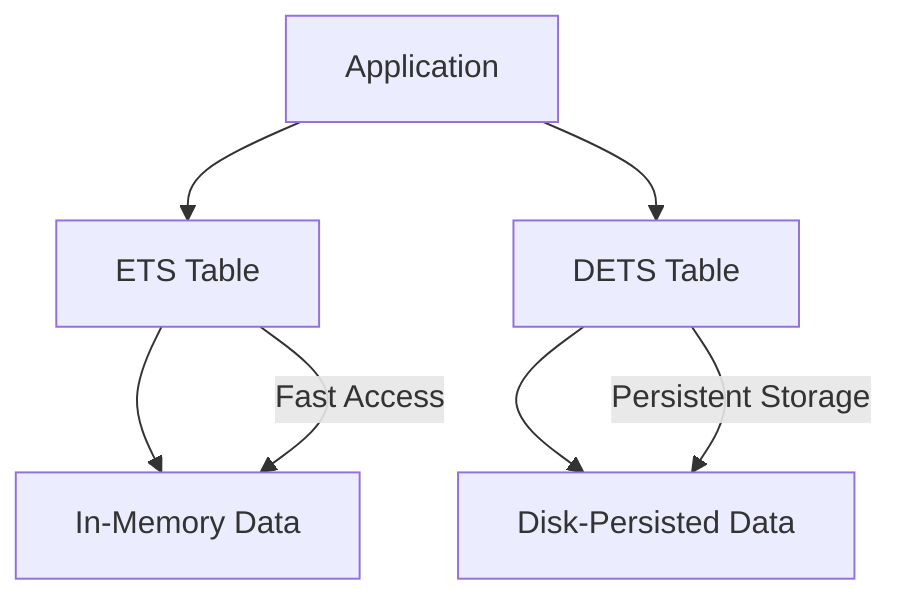

## 22.9. Utilizing ETS and DETS for Performance

In the realm of Elixir and Erlang, efficient data storage and retrieval are paramount for building high-performance applications. Two powerful tools at your disposal are Erlang Term Storage (ETS) and Disk-Based Erlang Term Storage (DETS). These storage mechanisms allow for fast data access and persistence, respectively, making them invaluable for various use cases such as caching and data sharing between processes. In this section, we will delve into the intricacies of ETS and DETS, exploring their features, use cases, and best practices for optimizing performance in Elixir applications.

### Erlang Term Storage (ETS)

ETS is an in-memory storage system that provides fast data access. It is a built-in feature of the Erlang runtime system and is accessible from Elixir. ETS tables can store large amounts of data and are highly efficient for read and write operations, making them ideal for caching and sharing data between processes.

#### Key Features of ETS

- **In-Memory Storage**: ETS tables reside in memory, allowing for rapid data access.
- **Concurrency**: ETS supports concurrent reads and writes, making it suitable for multi-process environments.
- **Table Types**: ETS offers different table types, including `set`, `ordered_set`, `bag`, and `duplicate_bag`, each with unique characteristics.
- **Data Size**: ETS can handle large volumes of data, limited only by the available memory.

#### Creating and Using ETS Tables

To create an ETS table, you can use the `:ets.new/2` function. Here's a simple example:

```elixir
# Create a new ETS table named :my_table of type :set
table = :ets.new(:my_table, [:set, :public])

# Insert data into the table
:ets.insert(table, {:key1, "value1"})
:ets.insert(table, {:key2, "value2"})

# Retrieve data from the table
case :ets.lookup(table, :key1) do
  [{_key, value}] -> IO.puts("Found: #{value}")
  [] -> IO.puts("Not found")
end

# Delete data from the table
:ets.delete(table, :key1)
```

In this example, we create a `:set` table, insert key-value pairs, retrieve a value, and delete an entry. The `:public` option allows any process to access the table.

#### Table Types and Their Use Cases

- **Set**: Stores unique keys. Ideal for scenarios where each key maps to a single value.
- **Ordered Set**: Similar to `set`, but maintains keys in order. Useful for ordered data retrieval.
- **Bag**: Allows multiple entries with the same key. Suitable for storing lists of items under a single key.
- **Duplicate Bag**: Similar to `bag`, but allows duplicate entries. Useful for logging or tracking events.

#### Concurrency and Performance

ETS tables support concurrent access, but it's important to consider the type of operations being performed. While reads are generally fast and can be done concurrently, writes may require synchronization to ensure data integrity. It's crucial to design your application to minimize contention and maximize parallelism.

### Disk-Based DETS

While ETS provides fast in-memory storage, it does not persist data across application restarts. This is where DETS comes into play. DETS is a disk-based storage system that allows you to persist data to disk, ensuring data durability.

#### Key Features of DETS

- **Persistence**: DETS tables store data on disk, making them suitable for long-term storage.
- **Compatibility**: DETS tables can be used in conjunction with ETS for hybrid storage solutions.
- **Data Size Limitations**: DETS tables have a size limit of 2GB per table, which is an important consideration for large datasets.

#### Creating and Using DETS Tables

To create a DETS table, you can use the `:dets.open_file/2` function. Here's an example:

```elixir
# Open a DETS table named :my_dets_table
{:ok, table} = :dets.open_file(:my_dets_table, [type: :set])

# Insert data into the table
:dets.insert(table, {:key1, "value1"})
:dets.insert(table, {:key2, "value2"})

# Retrieve data from the table
case :dets.lookup(table, :key1) do
  [{_key, value}] -> IO.puts("Found: #{value}")
  [] -> IO.puts("Not found")
end

# Close the table when done
:dets.close(table)
```

In this example, we open a DETS table, insert key-value pairs, retrieve a value, and close the table. It's important to close DETS tables properly to ensure data integrity.

#### Use Cases for DETS

- **Data Persistence**: Use DETS when you need to persist data across application restarts.
- **Hybrid Storage**: Combine ETS and DETS for scenarios where you need both fast access and persistence.
- **Data Backup**: DETS can be used to periodically back up in-memory ETS data to disk.

### Use Cases for ETS and DETS

ETS and DETS are versatile tools that can be used in a variety of scenarios:

- **Caching**: Use ETS for caching frequently accessed data to improve performance.
- **Session Management**: Store session data in ETS for fast access and DETS for persistence.
- **Data Sharing**: Share data between processes using ETS tables.
- **Logging**: Use DETS to store logs that need to be persisted.

### Considerations and Best Practices

When using ETS and DETS, it's important to consider the following:

- **Concurrency**: Design your application to minimize contention and maximize parallelism.
- **Data Size**: Be mindful of the data size limitations of DETS and the memory usage of ETS.
- **Table Types**: Choose the appropriate table type for your use case to optimize performance.
- **Data Integrity**: Ensure proper synchronization and error handling to maintain data integrity.

### Visualizing ETS and DETS

To better understand the relationship between ETS and DETS, let's visualize their interaction:



**Diagram Description**: This diagram illustrates how an application interacts with ETS and DETS tables. ETS provides fast in-memory data access, while DETS offers persistent storage on disk.

### Try It Yourself

To gain hands-on experience with ETS and DETS, try modifying the code examples provided. Experiment with different table types, data sizes, and concurrency patterns. Consider implementing a caching mechanism using ETS and persisting the cache to disk with DETS.

### Knowledge Check

- What are the key differences between ETS and DETS?
- How can you use ETS and DETS together for hybrid storage solutions?
- What are the limitations of DETS in terms of data size?

### Summary

In this section, we've explored the powerful capabilities of ETS and DETS for optimizing performance in Elixir applications. By leveraging these storage mechanisms, you can achieve fast data access, persistence, and efficient data sharing between processes. Remember to consider concurrency, data size, and table types when designing your application to maximize performance.

## Quiz: Utilizing ETS and DETS for Performance



### What is the primary advantage of using ETS in Elixir?

- [x] Fast in-memory data access
- [ ] Disk-based persistence
- [ ] Limited data size
- [ ] Complex data structures

> **Explanation:** ETS provides fast in-memory data access, making it ideal for caching and sharing data between processes.

### Which of the following is a limitation of DETS?

- [ ] In-memory storage
- [x] 2GB size limit per table
- [ ] Lack of concurrency support
- [ ] No support for key-value pairs

> **Explanation:** DETS tables have a size limit of 2GB per table, which is a key consideration for large datasets.

### How can ETS and DETS be used together?

- [x] For hybrid storage solutions
- [ ] Only for in-memory caching
- [ ] Only for disk-based persistence
- [ ] They cannot be used together

> **Explanation:** ETS and DETS can be used together for hybrid storage solutions, combining fast access with persistence.

### What is a suitable use case for ETS?

- [x] Caching frequently accessed data
- [ ] Long-term data storage
- [ ] Storing large datasets
- [ ] Complex data transformations

> **Explanation:** ETS is ideal for caching frequently accessed data due to its fast in-memory access.

### Which table type allows multiple entries with the same key in ETS?

- [ ] Set
- [ ] Ordered Set
- [x] Bag
- [ ] Duplicate Bag

> **Explanation:** The `bag` table type allows multiple entries with the same key, making it suitable for storing lists of items.

### What should you consider when using ETS for concurrent access?

- [x] Minimizing contention
- [ ] Disk space usage
- [ ] Data encryption
- [ ] Network latency

> **Explanation:** When using ETS for concurrent access, it's important to minimize contention to ensure efficient data handling.

### What is the purpose of closing a DETS table?

- [x] To ensure data integrity
- [ ] To free up memory
- [ ] To delete the table
- [ ] To reset the table

> **Explanation:** Closing a DETS table ensures data integrity by properly finalizing any pending operations.

### What is a key feature of the `ordered_set` table type in ETS?

- [x] Maintains keys in order
- [ ] Allows duplicate keys
- [ ] Stores data on disk
- [ ] Supports complex queries

> **Explanation:** The `ordered_set` table type maintains keys in order, which is useful for ordered data retrieval.

### How can DETS be used for data backup?

- [x] By periodically saving ETS data to disk
- [ ] By storing data in memory
- [ ] By encrypting data
- [ ] By compressing data

> **Explanation:** DETS can be used for data backup by periodically saving ETS data to disk, ensuring data persistence.

### True or False: ETS tables can only be accessed by the process that created them.

- [ ] True
- [x] False

> **Explanation:** ETS tables can be accessed by multiple processes, depending on the access permissions set during table creation.



Remember, this is just the beginning. As you progress, you'll build more complex and interactive applications using ETS and DETS. Keep experimenting, stay curious, and enjoy the journey!
