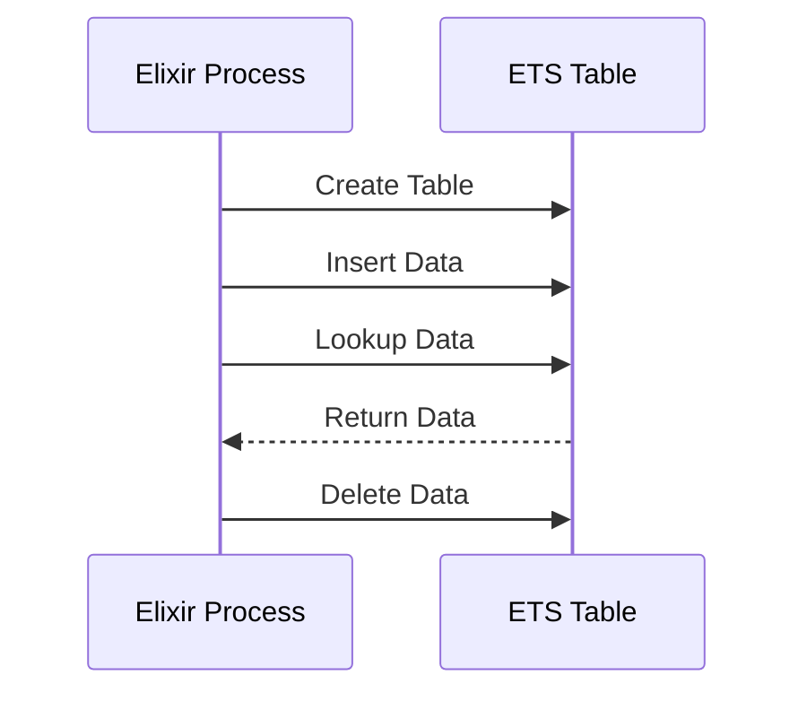

## 22.9. Utilizing ETS and DETS for Performance

In the realm of Elixir, performance optimization is a critical aspect of building scalable and efficient applications. Two powerful tools at your disposal are Erlang Term Storage (ETS) and Disk-Based Erlang Term Storage (DETS). These systems provide robust solutions for managing data in-memory and on disk, respectively, offering a blend of speed and persistence that can significantly enhance application performance. In this section, we will delve into the intricacies of ETS and DETS, exploring their use cases, implementation strategies, and key considerations.

### Understanding ETS: Erlang Term Storage

ETS is a powerful in-memory storage system that allows you to store large amounts of data in a format optimized for fast access. It is part of the Erlang runtime system, which Elixir builds upon, making it a natural choice for Elixir developers seeking high-performance data storage.

#### Key Features of ETS

- **In-Memory Storage**: ETS stores data in memory, allowing for rapid access and manipulation. This makes it ideal for caching and other scenarios where speed is paramount.
- **Concurrent Access**: ETS tables can be accessed by multiple processes concurrently, a crucial feature for applications that require high throughput.
- **Variety of Table Types**: ETS supports different table types, including set, ordered_set, bag, and duplicate_bag, each suited for different use cases.
- **Large Capacity**: ETS can handle large volumes of data, limited only by the available memory.

#### Creating and Using ETS Tables

To create an ETS table, use the `:ets.new/2` function, specifying the table name and options. Here's a simple example:

```elixir
# Create a new ETS table named :my_table with set type
table = :ets.new(:my_table, [:set, :public])

# Insert data into the table
:ets.insert(table, {:key1, "value1"})
:ets.insert(table, {:key2, "value2"})

# Retrieve data from the table
case :ets.lookup(table, :key1) do
  [{_key, value}] -> IO.puts("Found: #{value}")
  [] -> IO.puts("Key not found")
end
```

**Explanation**:
- **Table Creation**: We create a table named `:my_table` with a `:set` type, allowing unique keys.
- **Data Insertion**: We insert key-value pairs into the table.
- **Data Retrieval**: We use `:ets.lookup/2` to retrieve data, handling the case where the key might not exist.

#### Use Cases for ETS

ETS is particularly well-suited for scenarios requiring fast, concurrent access to data. Some common use cases include:

- **Caching**: Store frequently accessed data to reduce database load and improve response times.
- **Session Management**: Maintain user session data in web applications for quick retrieval.
- **Shared State**: Share state between processes without the overhead of message passing.

### Visualizing ETS Operations

To better understand how ETS operates, let's visualize the process using a sequence diagram:


```mermaid
sequenceDiagram
    participant Process as Elixir Process
    participant ETS as ETS Table
    Process->>ETS: Create Table
    Process->>ETS: Insert Data
    Process->>ETS: Lookup Data
    ETS-->>Process: Return Data
    Process->>ETS: Delete Data
```

**Diagram Explanation**:
- **Create Table**: The process initializes an ETS table.
- **Insert Data**: Data is inserted into the table.
- **Lookup Data**: The process queries the table for specific data.
- **Return Data**: The table returns the requested data.
- **Delete Data**: The process removes data from the table.

### Disk-Based DETS: Persistent Storage

While ETS excels in speed, it lacks persistence. This is where DETS comes into play. DETS provides a disk-based storage solution, allowing data to persist across application restarts.

#### Key Features of DETS

- **Disk-Based Storage**: Unlike ETS, DETS stores data on disk, making it suitable for applications requiring data persistence.
- **Table Types**: DETS supports set and bag table types, similar to ETS.
- **Atomic Operations**: DETS ensures atomicity in operations, maintaining data integrity.

#### Creating and Using DETS Tables

To create a DETS table, use the `:dets.open_file/2` function. Here's how you can work with DETS:

```elixir
# Open a DETS table named :my_dets_table
{:ok, table} = :dets.open_file(:my_dets_table, [type: :set])

# Insert data into the table
:ok = :dets.insert(table, {:key1, "value1"})
:ok = :dets.insert(table, {:key2, "value2"})

# Retrieve data from the table
case :dets.lookup(table, :key1) do
  [{_key, value}] -> IO.puts("Found: #{value}")
  [] -> IO.puts("Key not found")
end

# Close the table when done
:ok = :dets.close(table)
```

**Explanation**:
- **Table Creation**: We open a DETS table named `:my_dets_table` with a `:set` type.
- **Data Insertion**: We insert key-value pairs into the table.
- **Data Retrieval**: We use `:dets.lookup/2` to retrieve data.
- **Table Closure**: We close the table to ensure data is written to disk.

#### Use Cases for DETS

DETS is ideal for applications requiring data persistence without the complexity of a full-fledged database. Common use cases include:

- **Configuration Storage**: Persist application configuration settings.
- **Logging**: Store logs that need to be retained across restarts.
- **Simple Databases**: Implement lightweight databases for small applications.

### Considerations for Using ETS and DETS

When utilizing ETS and DETS, consider the following factors to ensure optimal performance and reliability:

#### Concurrency

- **ETS**: Supports concurrent reads and writes, making it suitable for high-concurrency applications.
- **DETS**: Limited to a single writer at a time, which can be a bottleneck in write-heavy applications.

#### Data Size Limitations

- **ETS**: Limited by available memory. Large datasets can lead to memory exhaustion.
- **DETS**: Limited by file size, with a maximum size of 2 GB per table.

#### Table Types

- **ETS**: Offers flexibility with multiple table types, allowing you to choose based on your data access patterns.
- **DETS**: Limited to set and bag types, which may not be suitable for all use cases.

### Best Practices for ETS and DETS

To maximize the benefits of ETS and DETS, follow these best practices:

- **Choose the Right Table Type**: Select the table type that aligns with your data access patterns. For example, use `:set` for unique keys and `:bag` for non-unique keys.
- **Manage Table Lifecycles**: Ensure tables are properly created and closed to avoid resource leaks.
- **Monitor Resource Usage**: Keep an eye on memory and disk usage to prevent exhaustion.
- **Handle Errors Gracefully**: Implement error handling to manage scenarios where data retrieval fails.

### Try It Yourself: Experimenting with ETS and DETS

To deepen your understanding of ETS and DETS, try modifying the code examples provided. Here are a few suggestions:

- **Experiment with Table Types**: Create tables with different types (`:set`, `:ordered_set`, `:bag`) and observe how they handle data differently.
- **Implement a Simple Cache**: Use ETS to implement a basic caching mechanism, storing and retrieving data based on keys.
- **Persist Data with DETS**: Modify the DETS example to persist user settings across application restarts.

### Summary of Key Takeaways

- **ETS**: Provides fast, in-memory storage for concurrent data access, ideal for caching and shared state.
- **DETS**: Offers disk-based storage for data persistence, suitable for lightweight databases and configuration storage.
- **Considerations**: Be mindful of concurrency, data size limitations, and table types when using ETS and DETS.

Remember, mastering ETS and DETS is just the beginning of optimizing performance in Elixir applications. Keep experimenting, stay curious, and enjoy the journey!

## Quiz Time!



### What is ETS best suited for in Elixir applications?

- [x] In-memory data storage
- [ ] Disk-based data storage
- [ ] Network communication
- [ ] User interface design

> **Explanation:** ETS is an in-memory storage system optimized for fast data access, making it ideal for caching and shared state.

### How does DETS differ from ETS?

- [x] DETS is disk-based, while ETS is in-memory
- [ ] DETS supports concurrent writes, while ETS does not
- [ ] DETS is faster than ETS
- [ ] DETS supports more table types than ETS

> **Explanation:** DETS provides disk-based storage, allowing data to persist across application restarts, unlike ETS, which is in-memory.

### What is a common use case for DETS?

- [x] Configuration storage
- [ ] Real-time data processing
- [ ] User interface design
- [ ] Network communication

> **Explanation:** DETS is suitable for persisting configuration settings and logs across application restarts.

### Which table type does ETS support?

- [x] Set
- [x] Ordered_set
- [x] Bag
- [x] Duplicate_bag

> **Explanation:** ETS supports multiple table types, including set, ordered_set, bag, and duplicate_bag, each suited for different use cases.

### What is a limitation of DETS?

- [x] Limited to a single writer at a time
- [ ] Limited to in-memory storage
- [ ] Limited to network communication
- [ ] Limited to user interface design

> **Explanation:** DETS allows only one writer at a time, which can be a bottleneck in write-heavy applications.

### How can you retrieve data from an ETS table?

- [x] Using the `:ets.lookup/2` function
- [ ] Using the `:ets.fetch/2` function
- [ ] Using the `:ets.get/2` function
- [ ] Using the `:ets.query/2` function

> **Explanation:** The `:ets.lookup/2` function is used to retrieve data from an ETS table by key.

### What should you monitor when using ETS?

- [x] Memory usage
- [ ] Disk space
- [ ] Network bandwidth
- [ ] User interface responsiveness

> **Explanation:** Since ETS is in-memory, it's important to monitor memory usage to prevent exhaustion.

### Which operation is atomic in DETS?

- [x] Insert
- [x] Lookup
- [x] Delete
- [x] Update

> **Explanation:** DETS ensures atomicity for operations like insert, lookup, delete, and update, maintaining data integrity.

### What is a best practice when using ETS and DETS?

- [x] Choose the right table type for your use case
- [ ] Use only one table type for simplicity
- [ ] Avoid error handling for performance
- [ ] Ignore resource usage

> **Explanation:** Choosing the right table type based on data access patterns is crucial for optimal performance.

### True or False: ETS and DETS are part of the Elixir runtime system.

- [ ] True
- [x] False

> **Explanation:** ETS and DETS are part of the Erlang runtime system, which Elixir builds upon.


