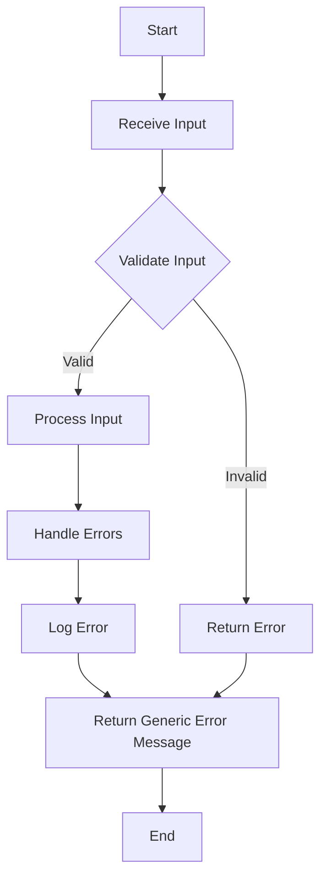

## 23.1. Secure Coding Practices in Elixir

In the realm of software development, security is paramount. As Elixir developers, we must ensure that our applications are robust against potential threats. This section delves into secure coding practices in Elixir, focusing on defending against common vulnerabilities, input validation, the principle of least privilege, and secure error handling.

### Principles of Secure Coding in Elixir

Secure coding is about writing code that anticipates and defends against potential vulnerabilities. In Elixir, this involves leveraging the language's functional nature and robust concurrency model to build secure applications. Let's explore some fundamental principles:

#### Writing Code that Defends Against Common Vulnerabilities

1. **Understand Common Vulnerabilities**: Familiarize yourself with common vulnerabilities such as SQL injection, cross-site scripting (XSS), and cross-site request forgery (CSRF). The [OWASP Top Ten](https://owasp.org/www-project-top-ten/) is a great resource for understanding these threats.

2. **Use Elixir's Immutable Data Structures**: Elixir's immutable data structures help prevent unintended side effects, reducing the risk of vulnerabilities related to mutable state.

3. **Leverage Pattern Matching**: Use pattern matching to ensure that only valid data is processed. This can prevent unexpected behavior and potential security issues.

4. **Adopt a Defensive Programming Mindset**: Always assume that inputs can be malicious and code defensively to handle unexpected scenarios.

### Input Validation

Input validation is crucial in preventing injection attacks and ensuring that only valid data is processed by your application.

#### Sanitizing Inputs to Prevent Injections

1. **Validate All Inputs**: Ensure that all inputs, whether from users, APIs, or other sources, are validated before processing. Use Elixir's pattern matching and guards to enforce constraints.

2. **Use Libraries for Input Validation**: Libraries like [Ecto](https://hexdocs.pm/ecto/Ecto.Changeset.html) provide powerful tools for validating and casting data. Ecto changesets allow you to define validations and constraints on data structures.

3. **Sanitize Inputs**: Remove or escape potentially harmful characters from inputs. For example, when dealing with HTML inputs, use libraries like [Phoenix.HTML](https://hexdocs.pm/phoenix_html/Phoenix.HTML.html) to escape user-generated content.

4. **Example: Validating User Input with Ecto Changeset**

```elixir
defmodule MyApp.User do
  use Ecto.Schema
  import Ecto.Changeset

  schema "users" do
    field :name, :string
    field :email, :string
  end

  def changeset(user, params \\ %{}) do
    user
    |> cast(params, [:name, :email])
    |> validate_required([:name, :email])
    |> validate_format(:email, ~r/@/)
  end
end
```

In this example, we define a changeset for a `User` schema, ensuring that the `name` and `email` fields are present and that the `email` field contains a valid format.

### Least Privilege

The principle of least privilege involves granting only the necessary permissions to users and processes, minimizing the potential impact of a security breach.

#### Limiting Access Rights for Users and Processes

1. **Define Roles and Permissions**: Clearly define roles and permissions within your application. Use libraries like [Bodyguard](https://hexdocs.pm/bodyguard/Bodyguard.html) to enforce authorization rules.

2. **Use Elixir's Process Isolation**: Elixir's lightweight processes can be used to isolate different parts of your application, limiting the impact of a compromised process.

3. **Restrict Database Access**: Ensure that database users have only the permissions they need. For example, a read-only user should not have write access to the database.

4. **Example: Implementing Role-Based Access Control with Bodyguard**

```elixir
defmodule MyApp.Policy do
  use Bodyguard.Policy

  def authorize(:view_dashboard, user, _params) do
    user.role in ["admin", "manager"]
  end

  def authorize(:edit_user, user, _params) do
    user.role == "admin"
  end
end
```

In this example, we define a policy using Bodyguard to control access to different actions based on user roles.

### Error Handling

Secure error handling involves ensuring that error messages do not reveal sensitive information that could be exploited by attackers.

#### Not Revealing Sensitive Information in Error Messages

1. **Use Generic Error Messages**: Avoid exposing detailed error messages to users. Instead, log detailed errors internally and provide generic messages to users.

2. **Leverage Elixir's `Logger` Module**: Use the `Logger` module to log errors and other important events. Ensure that logs are stored securely and access is restricted.

3. **Handle Exceptions Gracefully**: Use Elixir's `try` and `rescue` constructs to handle exceptions and ensure that your application remains stable.

4. **Example: Secure Error Handling with Logger**

```elixir
defmodule MyApp.ErrorHandler do
  require Logger

  def handle_error(error) do
    Logger.error("An error occurred: #{inspect(error)}")
    {:error, "An unexpected error occurred. Please try again later."}
  end
end
```

In this example, we log the error details using `Logger.error` and return a generic error message to the user.

### Visualizing Secure Coding Practices

To better understand the flow of secure coding practices, let's visualize the process of input validation and error handling in Elixir applications.



**Diagram Description**: This flowchart illustrates the process of receiving input, validating it, processing valid input, handling errors, logging errors, and returning generic error messages.

### References and Links

- [OWASP Top Ten](https://owasp.org/www-project-top-ten/)
- [Ecto Changeset Documentation](https://hexdocs.pm/ecto/Ecto.Changeset.html)
- [Phoenix.HTML Documentation](https://hexdocs.pm/phoenix_html/Phoenix.HTML.html)
- [Bodyguard Documentation](https://hexdocs.pm/bodyguard/Bodyguard.html)

### Knowledge Check

- **Question**: What is the principle of least privilege, and why is it important in secure coding?
- **Exercise**: Implement a changeset in Elixir that validates a user's age, ensuring it is a positive integer.

### Embrace the Journey

Remember, secure coding is an ongoing journey. As you continue to develop your skills in Elixir, keep security at the forefront of your mind. Stay curious, experiment with different security patterns, and enjoy the process of building secure applications.

### Formatting and Structure

- **Organize content with clear headings and subheadings**.
- **Use bullet points** to break down complex information.
- **Highlight important terms or concepts** using bold or italic text sparingly.

### Writing Style

- **Use first-person plural (we, let's)** to create a collaborative feel.
- **Avoid gender-specific pronouns**; use they/them or rewrite sentences to be inclusive.
- **Define acronyms and abbreviations** upon first use.

## Quiz: Secure Coding Practices in Elixir



### What is the primary goal of secure coding practices?

- [x] To defend against common vulnerabilities
- [ ] To improve code readability
- [ ] To enhance application performance
- [ ] To reduce development time

> **Explanation:** Secure coding practices aim to defend against common vulnerabilities and ensure the security of applications.

### Which Elixir feature helps prevent unintended side effects?

- [x] Immutable data structures
- [ ] Dynamic typing
- [ ] Macros
- [ ] Pattern matching

> **Explanation:** Elixir's immutable data structures help prevent unintended side effects, reducing the risk of vulnerabilities.

### What is the purpose of input validation?

- [x] To ensure only valid data is processed
- [ ] To improve application performance
- [ ] To enhance user experience
- [ ] To reduce code complexity

> **Explanation:** Input validation ensures that only valid data is processed, preventing injection attacks and other vulnerabilities.

### Which library is commonly used for input validation in Elixir?

- [x] Ecto
- [ ] Phoenix
- [ ] Plug
- [ ] Logger

> **Explanation:** Ecto provides powerful tools for input validation and data casting in Elixir applications.

### What is the principle of least privilege?

- [x] Limiting access rights for users and processes
- [ ] Granting all permissions to users
- [ ] Allowing unrestricted access to resources
- [ ] Providing detailed error messages

> **Explanation:** The principle of least privilege involves limiting access rights for users and processes to minimize security risks.

### How should error messages be handled in secure coding?

- [x] Use generic error messages for users
- [ ] Provide detailed error messages to users
- [ ] Ignore error messages
- [ ] Log errors without handling them

> **Explanation:** Secure coding practices recommend using generic error messages for users to avoid revealing sensitive information.

### Which Elixir module is used for logging errors?

- [x] Logger
- [ ] Ecto
- [ ] Phoenix
- [ ] Plug

> **Explanation:** The `Logger` module is used for logging errors and other important events in Elixir applications.

### What is the benefit of using Elixir's process isolation?

- [x] It limits the impact of a compromised process
- [ ] It improves code readability
- [ ] It enhances application performance
- [ ] It reduces development time

> **Explanation:** Elixir's process isolation limits the impact of a compromised process, enhancing application security.

### What should be done with potentially harmful characters in inputs?

- [x] Sanitize or escape them
- [ ] Ignore them
- [ ] Log them
- [ ] Allow them without modification

> **Explanation:** Potentially harmful characters in inputs should be sanitized or escaped to prevent injection attacks.

### True or False: Secure coding is a one-time task.

- [ ] True
- [x] False

> **Explanation:** Secure coding is an ongoing process that requires continuous attention and adaptation to new threats.



By following these secure coding practices, you can build robust Elixir applications that are resilient to common vulnerabilities. Keep experimenting, stay curious, and enjoy the journey of creating secure software!
