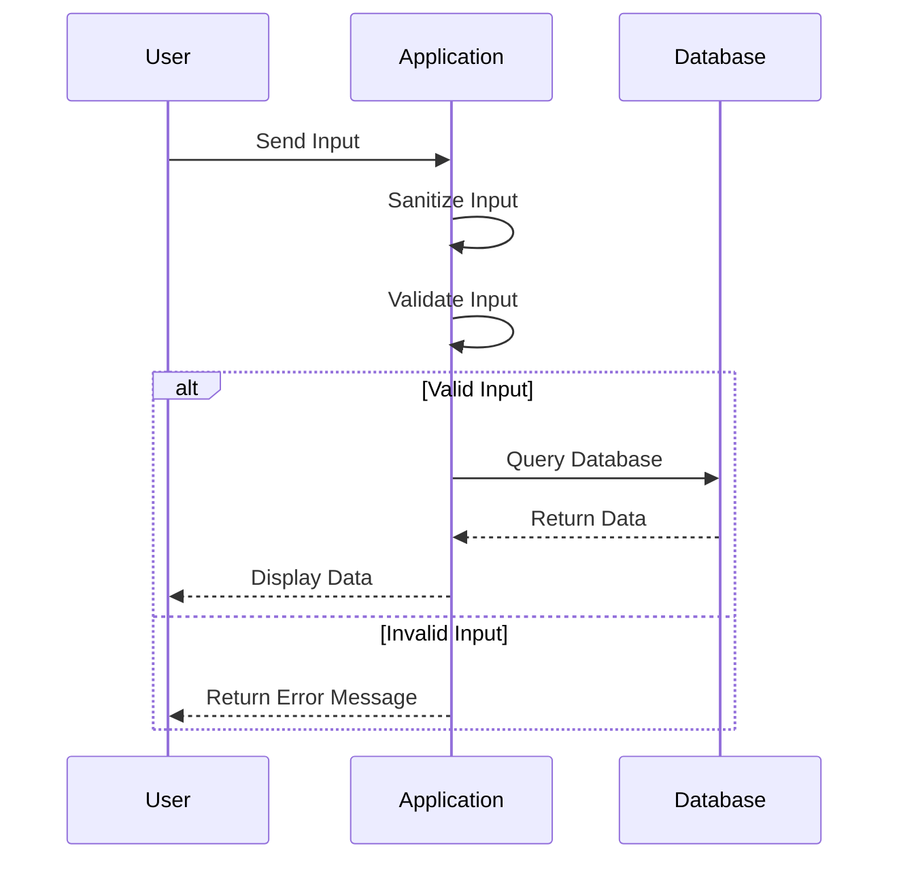

## 23.1. Secure Coding Practices in Elixir

In today's digital landscape, security is a paramount concern for software engineers and architects. Elixir, known for its robust concurrency and fault-tolerant capabilities, provides a solid foundation for building secure applications. However, leveraging Elixir's features effectively requires an understanding of secure coding practices. In this section, we will delve into key principles of secure coding, focusing on defending against common vulnerabilities, input validation, applying the principle of least privilege, and handling errors securely.

### Principles of Secure Coding

Secure coding is the practice of writing software that is resilient against attacks and vulnerabilities. This involves anticipating potential threats and integrating security measures throughout the development process. Let's explore some foundational principles:

#### 1. Writing Code that Defends Against Common Vulnerabilities

To write secure Elixir code, it's essential to understand and mitigate common vulnerabilities such as:

- **Injection Attacks**: These occur when untrusted data is sent to an interpreter as part of a command or query. The most common are SQL, NoSQL, and command injections.
- **Cross-Site Scripting (XSS)**: This vulnerability allows attackers to inject malicious scripts into web pages viewed by other users.
- **Cross-Site Request Forgery (CSRF)**: This attack forces an end user to execute unwanted actions on a web application in which they are currently authenticated.

#### 2. Input Validation

Input validation is crucial for preventing injection attacks and other vulnerabilities. It involves verifying that inputs are well-formed before processing.

- **Sanitizing Inputs**: Always sanitize inputs to remove or neutralize any potentially harmful data.

```elixir
defmodule InputSanitizer do
  @doc """
  Sanitize user input to prevent injection attacks.
  """
  def sanitize(input) do
    input
    |> String.replace(~r/[<>]/, "")
    |> String.trim()
  end
end

# Usage
user_input = "<script>alert('XSS');</script>"
sanitized_input = InputSanitizer.sanitize(user_input)
IO.puts sanitized_input  # Output: alert('XSS');
```

- **Using Pattern Matching**: Elixir's pattern matching can be leveraged to validate input structures.

```elixir
defmodule InputValidator do
  @doc """
  Validate input using pattern matching.
  """
  def validate_input(%{name: name, age: age}) when is_binary(name) and is_integer(age) do
    {:ok, %{name: name, age: age}}
  end

  def validate_input(_), do: {:error, "Invalid input"}
end

# Usage
input = %{name: "Alice", age: 30}
case InputValidator.validate_input(input) do
  {:ok, valid_input} -> IO.inspect(valid_input)
  {:error, message} -> IO.puts(message)
end
```

#### 3. Least Privilege

The principle of least privilege involves limiting access rights for users and processes to the bare minimum necessary to perform their functions.

- **Role-Based Access Control (RBAC)**: Implement RBAC to ensure that users have only the permissions they need.

```elixir
defmodule AccessControl do
  @roles %{admin: [:read, :write, :delete], user: [:read]}

  @doc """
  Check if a role has a specific permission.
  """
  def has_permission?(role, permission) do
    Enum.member?(@roles[role], permission)
  end
end

# Usage
IO.puts AccessControl.has_permission?(:admin, :delete)  # Output: true
IO.puts AccessControl.has_permission?(:user, :delete)   # Output: false
```

- **Process Isolation**: Use Elixir's lightweight processes to isolate tasks, reducing the risk of privilege escalation.

#### 4. Error Handling

Proper error handling is essential to prevent information leakage and ensure application stability.

- **Avoid Revealing Sensitive Information**: Error messages should not expose sensitive data or system details.

```elixir
defmodule ErrorHandler do
  @doc """
  Handle errors without exposing sensitive information.
  """
  def handle_error(:not_found), do: {:error, "Resource not found"}
  def handle_error(:unauthorized), do: {:error, "Unauthorized access"}
  def handle_error(_), do: {:error, "An unexpected error occurred"}
end
```

- **Logging**: Log errors for auditing and debugging purposes, but ensure logs do not contain sensitive information.

```elixir
defmodule Logger do
  require Logger

  @doc """
  Log an error message.
  """
  def log_error(message) do
    Logger.error("Error: #{message}")
  end
end

# Usage
Logger.log_error("Unauthorized access attempt")
```

### Visualizing Secure Coding Practices

To better understand these principles, let's visualize the flow of secure coding practices in Elixir using a sequence diagram.


```mermaid
sequenceDiagram
    participant User
    participant Application
    participant Database

    User->>Application: Send Input
    Application->>Application: Sanitize Input
    Application->>Application: Validate Input
    alt Valid Input
        Application->>Database: Query Database
        Database-->>Application: Return Data
        Application-->>User: Display Data
    else Invalid Input
        Application-->>User: Return Error Message
    end
```

**Diagram Description**: This sequence diagram illustrates the process of handling user input securely. The application sanitizes and validates the input before querying the database. If the input is invalid, an error message is returned to the user without revealing sensitive information.

### References and Further Reading

- [OWASP Secure Coding Practices](https://owasp.org/www-project-secure-coding-practices-quick-reference-guide/)
- [Elixir Security Best Practices](https://elixir-lang.org/getting-started/mix-otp/introduction-to-mix.html)
- [Common Vulnerabilities and Exposures (CVE)](https://cve.mitre.org/)

### Knowledge Check

To ensure you've grasped the key concepts, consider the following questions:

1. What are the most common types of injection attacks?
2. How does input validation help prevent security vulnerabilities?
3. Why is it important to apply the principle of least privilege in software development?
4. What are some best practices for error handling in Elixir?

### Try It Yourself

Experiment with the code examples provided. Try modifying the input validation logic to handle additional data types or structures. Implement a new role in the RBAC example and test its permissions.

### Embrace the Journey

Remember, secure coding is an ongoing journey. As you continue to develop applications in Elixir, keep security at the forefront of your design and implementation processes. Stay curious, keep learning, and enjoy the journey of building secure, resilient software.

## Quiz Time!



### What is the primary purpose of input validation in secure coding?

- [x] To ensure inputs are well-formed and safe to process
- [ ] To enhance application performance
- [ ] To improve user experience
- [ ] To increase code readability

> **Explanation:** Input validation ensures that inputs are well-formed and safe to process, preventing security vulnerabilities like injection attacks.

### Which principle involves limiting access rights for users and processes?

- [x] Least Privilege
- [ ] Input Validation
- [ ] Error Handling
- [ ] Role-Based Access Control

> **Explanation:** The principle of least privilege involves limiting access rights for users and processes to the minimum necessary.

### Why is it important to avoid revealing sensitive information in error messages?

- [x] To prevent attackers from gaining insights into the system
- [ ] To reduce application size
- [ ] To improve application speed
- [ ] To enhance user experience

> **Explanation:** Avoiding sensitive information in error messages prevents attackers from gaining insights into the system, which could be exploited.

### What is a common vulnerability that input validation can help prevent?

- [x] Injection Attacks
- [ ] Data Redundancy
- [ ] Network Latency
- [ ] Memory Leaks

> **Explanation:** Input validation helps prevent injection attacks by ensuring that inputs are sanitized and validated before processing.

### What is the role of logging in secure coding practices?

- [x] To audit and debug errors without exposing sensitive information
- [ ] To increase application speed
- [ ] To enhance user experience
- [ ] To reduce code complexity

> **Explanation:** Logging is used to audit and debug errors without exposing sensitive information, aiding in security and troubleshooting.

### Which Elixir feature can be used to isolate tasks and reduce privilege escalation risks?

- [x] Lightweight Processes
- [ ] Pattern Matching
- [ ] Pipe Operator
- [ ] GenServer

> **Explanation:** Elixir's lightweight processes can be used to isolate tasks, reducing the risk of privilege escalation.

### What is the benefit of using pattern matching for input validation?

- [x] It allows for clear and concise validation logic
- [ ] It improves application speed
- [ ] It enhances user experience
- [ ] It reduces code size

> **Explanation:** Pattern matching allows for clear and concise validation logic, making it easier to validate input structures.

### How can role-based access control (RBAC) be implemented in Elixir?

- [x] By defining roles and their associated permissions
- [ ] By using the pipe operator
- [ ] By leveraging GenServer
- [ ] By applying pattern matching

> **Explanation:** RBAC can be implemented by defining roles and their associated permissions, ensuring that users have only the necessary access rights.

### What is a key consideration when logging errors in a secure application?

- [x] Ensuring logs do not contain sensitive information
- [ ] Increasing log verbosity
- [ ] Reducing log file size
- [ ] Enhancing log readability

> **Explanation:** Ensuring logs do not contain sensitive information is crucial to maintaining security and preventing information leakage.

### True or False: Secure coding practices are only necessary for web applications.

- [ ] True
- [x] False

> **Explanation:** Secure coding practices are necessary for all types of applications, not just web applications, to ensure resilience against attacks.


