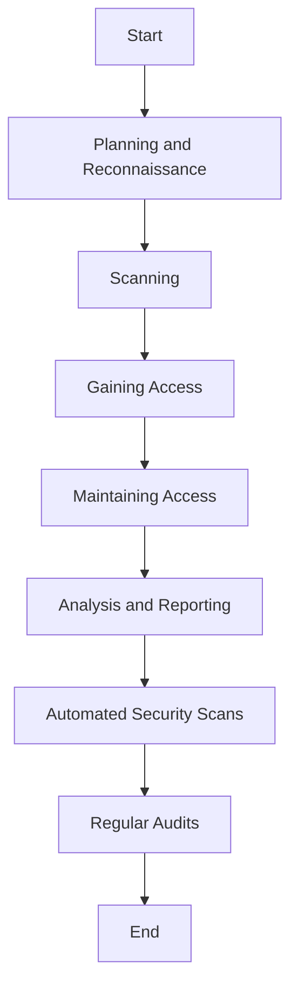

## 23.10. Security Testing and Auditing

In the realm of software development, security is paramount. As expert software engineers and architects, it is crucial to ensure that our Elixir applications are not only functional but also secure against potential threats. This section delves into the essential practices of security testing and auditing, focusing on penetration testing, automated security scans, and regular audits. By the end of this guide, you'll have a comprehensive understanding of how to fortify your Elixir applications against vulnerabilities.

### Introduction to Security Testing and Auditing

Security testing and auditing are integral components of the software development lifecycle. They help identify vulnerabilities, ensure compliance with security standards, and protect sensitive data. In Elixir, leveraging its robust features and the BEAM VM's inherent fault tolerance, we can build secure applications. However, no system is impervious to attacks, making security testing and auditing indispensable.

### Penetration Testing

Penetration testing, often referred to as ethical hacking, involves simulating attacks on a system to identify vulnerabilities before malicious actors can exploit them. This proactive approach helps in understanding the security posture of an application.

#### Steps in Penetration Testing

1. **Planning and Reconnaissance**: Define the scope and objectives of the test. Gather intelligence to understand potential vulnerabilities.
2. **Scanning**: Use tools to identify open ports, services, and potential entry points.
3. **Gaining Access**: Attempt to exploit vulnerabilities to gain unauthorized access.
4. **Maintaining Access**: Simulate advanced persistent threats by maintaining access to the system.
5. **Analysis and Reporting**: Document findings, including vulnerabilities discovered, data accessed, and the duration of the test.

#### Tools for Penetration Testing

- **Metasploit**: A powerful framework for developing and executing exploit code.
- **Nmap**: A network scanning tool to discover hosts and services.
- **Burp Suite**: A web vulnerability scanner for identifying security issues in web applications.

#### Code Example: Simulating a Simple Attack

```elixir
defmodule PenTest do
  @moduledoc """
  A simple module to simulate an attack by attempting to access a restricted function.
  """

  def simulate_attack do
    try do
      restricted_function()
    rescue
      e in RuntimeError -> IO.puts("Access Denied: #{e.message}")
    end
  end

  defp restricted_function do
    raise "Unauthorized access attempt detected!"
  end
end

# Simulate the attack
PenTest.simulate_attack()
```

### Automated Security Scans

Automated security scans are essential for continuously monitoring and identifying vulnerabilities in your codebase. Tools like Sobelow are specifically designed for Elixir applications, providing a comprehensive analysis of security issues.

#### Using Sobelow for Security Analysis

Sobelow is an open-source security-focused static analysis tool for the Phoenix framework. It scans your application for common vulnerabilities such as SQL injection, XSS, and configuration issues.

#### Setting Up Sobelow

1. **Installation**: Add Sobelow to your `mix.exs` file.

   ```elixir
   defp deps do
     [
       {:sobelow, "~> 0.11", only: :dev}
     ]
   end
   ```

2. **Running Sobelow**: Execute the following command to scan your application.

   ```bash
   mix sobelow
   ```

3. **Interpreting Results**: Sobelow provides a detailed report of potential vulnerabilities, categorized by severity.

#### Code Example: Configuring Sobelow

```elixir
# mix.exs
defp deps do
  [
    {:sobelow, "~> 0.11", only: :dev}
  ]
end

# Run Sobelow
# In the terminal, execute:
# mix sobelow
```

### Regular Audits

Regular audits involve a systematic review of your application's code and configurations to ensure compliance with security standards and best practices. Audits help in identifying overlooked vulnerabilities and maintaining a secure codebase.

#### Conducting a Security Audit

1. **Define Audit Scope**: Determine the areas of the application to be audited, including code, configurations, and third-party dependencies.
2. **Review Code**: Analyze the code for security vulnerabilities, focusing on authentication, authorization, and data handling.
3. **Check Configurations**: Ensure that configurations adhere to security best practices, such as using HTTPS and secure cookie settings.
4. **Evaluate Dependencies**: Assess third-party libraries for known vulnerabilities and ensure they are up-to-date.
5. **Document Findings**: Provide a detailed report of the audit, including recommendations for remediation.

#### Code Example: Simple Configuration Audit

```elixir
defmodule ConfigAudit do
  @moduledoc """
  A module to audit application configurations for security best practices.
  """

  def check_https_config do
    config = Application.get_env(:my_app, MyApp.Endpoint)
    if config[:url][:scheme] != "https" do
      IO.puts("Warning: HTTPS is not enabled!")
    else
      IO.puts("HTTPS is enabled.")
    end
  end
end

# Perform the audit
ConfigAudit.check_https_config()
```

### Visualizing Security Testing and Auditing Workflow

To better understand the workflow of security testing and auditing, let's visualize the process using a flowchart.



**Figure 1:** Security Testing and Auditing Workflow

### Best Practices for Security Testing and Auditing

- **Integrate Security Early**: Incorporate security testing and auditing into the development lifecycle from the beginning.
- **Use a Combination of Tools**: Employ multiple tools and techniques for comprehensive security coverage.
- **Regularly Update Tools**: Ensure that security tools are up-to-date to detect the latest vulnerabilities.
- **Educate Your Team**: Provide training on security best practices and the importance of security testing and auditing.
- **Document and Review**: Maintain detailed documentation of security tests and audits for future reference and compliance.

### Knowledge Check

- **What is the primary goal of penetration testing?**
- **How does Sobelow help in securing Elixir applications?**
- **Why are regular audits important in maintaining application security?**

### Try It Yourself

Experiment with the provided code examples by modifying them to simulate different security scenarios. For instance, try adding new vulnerabilities to the `PenTest` module and see how they can be detected and mitigated.

### Conclusion

Security testing and auditing are critical components of building robust Elixir applications. By understanding and implementing penetration testing, automated security scans, and regular audits, you can significantly enhance your application's security posture. Remember, security is an ongoing process, and staying vigilant is key to protecting your systems.

## Quiz: Security Testing and Auditing



### What is the primary goal of penetration testing?

- [x] To identify vulnerabilities before malicious actors can exploit them
- [ ] To deploy new features
- [ ] To improve application performance
- [ ] To increase user engagement

> **Explanation:** Penetration testing aims to identify vulnerabilities in a system by simulating attacks, allowing developers to address these issues before they can be exploited by malicious actors.

### Which tool is specifically designed for security analysis in Elixir applications?

- [ ] Metasploit
- [ ] Nmap
- [x] Sobelow
- [ ] Burp Suite

> **Explanation:** Sobelow is an open-source security-focused static analysis tool specifically designed for the Phoenix framework in Elixir applications.

### What is the first step in the penetration testing process?

- [ ] Gaining Access
- [x] Planning and Reconnaissance
- [ ] Scanning
- [ ] Analysis and Reporting

> **Explanation:** The first step in penetration testing is Planning and Reconnaissance, where the scope and objectives of the test are defined, and intelligence is gathered to understand potential vulnerabilities.

### How can automated security scans benefit your application?

- [x] By continuously monitoring and identifying vulnerabilities
- [ ] By improving code readability
- [ ] By increasing application speed
- [ ] By reducing server costs

> **Explanation:** Automated security scans continuously monitor and identify vulnerabilities in your codebase, helping to maintain a secure application.

### Why are regular audits important?

- [x] They help identify overlooked vulnerabilities and maintain a secure codebase
- [ ] They increase application speed
- [ ] They reduce development costs
- [ ] They improve user interface design

> **Explanation:** Regular audits are important because they help identify overlooked vulnerabilities and ensure compliance with security standards, maintaining a secure codebase.

### Which of the following is NOT a step in penetration testing?

- [ ] Scanning
- [ ] Gaining Access
- [ ] Maintaining Access
- [x] Deploying New Features

> **Explanation:** Deploying new features is not a step in penetration testing. The process involves scanning, gaining access, maintaining access, and analyzing and reporting findings.

### What should be included in a security audit?

- [x] Code review, configuration checks, and dependency evaluation
- [ ] Only code review
- [ ] Only configuration checks
- [ ] Only dependency evaluation

> **Explanation:** A comprehensive security audit should include code review, configuration checks, and dependency evaluation to ensure all aspects of the application are secure.

### How does Sobelow categorize vulnerabilities?

- [x] By severity
- [ ] By file size
- [ ] By code length
- [ ] By developer name

> **Explanation:** Sobelow categorizes vulnerabilities by severity, helping developers prioritize which issues to address first.

### What is a key benefit of using multiple security tools?

- [x] Comprehensive security coverage
- [ ] Faster application deployment
- [ ] Reduced server costs
- [ ] Improved user interface design

> **Explanation:** Using multiple security tools provides comprehensive security coverage, ensuring that various types of vulnerabilities are detected and addressed.

### True or False: Security testing and auditing should be integrated early in the development lifecycle.

- [x] True
- [ ] False

> **Explanation:** Integrating security testing and auditing early in the development lifecycle helps identify and address vulnerabilities before they become critical issues, ensuring a more secure application.



Remember, this is just the beginning. As you progress, you'll build more secure and robust Elixir applications. Keep experimenting, stay curious, and enjoy the journey!
