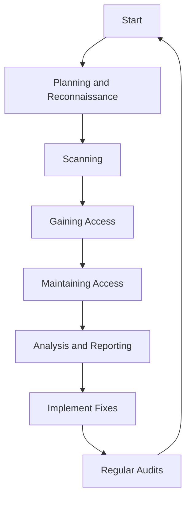

## 23.10. Security Testing and Auditing

In today's digital landscape, security is paramount. As software engineers and architects, we must ensure that our Elixir applications are robust against potential threats. This section delves into the critical aspects of security testing and auditing, focusing on penetration testing, automated security scans, and regular audits. By the end of this guide, you'll be equipped with the knowledge to fortify your Elixir applications against vulnerabilities.

### Introduction to Security Testing and Auditing

Security testing and auditing are essential components of the software development lifecycle. They help identify vulnerabilities, ensure compliance with security standards, and maintain the integrity, confidentiality, and availability of your applications.

- **Security Testing**: Involves evaluating a system to identify vulnerabilities that could be exploited by attackers.
- **Auditing**: Entails reviewing and assessing the security measures and practices in place to ensure they meet the required standards and are effectively implemented.

Let's explore the different facets of security testing and auditing in Elixir.

### Penetration Testing

Penetration testing, or pen testing, simulates cyberattacks to identify vulnerabilities within your application. It is a proactive approach to security, allowing you to discover and fix issues before malicious actors can exploit them.

#### Steps in Penetration Testing

1. **Planning and Reconnaissance**: Define the scope and objectives of the test. Gather information about the target system to understand its structure and potential vulnerabilities.

2. **Scanning**: Use tools to identify open ports, services, and other potential entry points. This step helps in understanding how the target application responds to various intrusion attempts.

3. **Gaining Access**: Attempt to exploit identified vulnerabilities to gain unauthorized access. This could involve SQL injection, cross-site scripting (XSS), or other attack vectors.

4. **Maintaining Access**: Once access is gained, attempt to maintain it for extended periods to simulate advanced persistent threats.

5. **Analysis and Reporting**: Document the findings, including vulnerabilities discovered, data accessed, and the time taken to breach the system. Provide recommendations for remediation.

#### Tools for Penetration Testing

- **Metasploit**: A powerful framework for developing and executing exploit code against a remote target machine.
- **OWASP ZAP**: An open-source web application security scanner.
- **Burp Suite**: A comprehensive platform for performing security testing of web applications.

#### Code Example: Simulating a SQL Injection

```elixir
# A vulnerable Elixir function susceptible to SQL injection
defmodule VulnerableApp do
  def get_user_data(username) do
    query = "SELECT * FROM users WHERE username = '#{username}'"
    # Execute the query against the database
    # This is vulnerable to SQL injection if `username` is not sanitized
    execute_query(query)
  end
end

# Secure version using parameterized queries
defmodule SecureApp do
  def get_user_data(username) do
    query = "SELECT * FROM users WHERE username = $1"
    # Use parameterized queries to prevent SQL injection
    execute_query(query, [username])
  end
end
```

### Automated Security Scans

Automated security scans are essential for identifying vulnerabilities in your codebase without manual intervention. These tools can quickly analyze your application and provide insights into potential security issues.

#### Using Sobelow for Security Analysis

Sobelow is a security-focused static analysis tool for Elixir applications. It scans your Phoenix application for common vulnerabilities and provides actionable insights.

#### Setting Up Sobelow

1. **Installation**: Add Sobelow to your `mix.exs` file.

```elixir
defp deps do
  [
    {:sobelow, "~> 0.11", only: :dev}
  ]
end
```

2. **Running Sobelow**: Execute the following command to scan your application.

```bash
mix sobelow
```

#### Interpreting Sobelow Results

Sobelow categorizes findings into different types, such as:

- **XSS (Cross-Site Scripting)**: Detects potential XSS vulnerabilities.
- **SQL Injection**: Identifies areas where SQL injection could occur.
- **CSRF (Cross-Site Request Forgery)**: Highlights potential CSRF vulnerabilities.

Each finding is accompanied by a description and remediation suggestions.

#### Code Example: Fixing an XSS Vulnerability

```elixir
# Vulnerable code with potential XSS
defmodule VulnerableAppWeb.PageController do
  use VulnerableAppWeb, :controller

  def show(conn, %{"name" => name}) do
    # Directly rendering user input, which is vulnerable to XSS
    render(conn, "show.html", name: name)
  end
end

# Secure version with input sanitization
defmodule SecureAppWeb.PageController do
  use SecureAppWeb, :controller

  def show(conn, %{"name" => name}) do
    # Sanitize user input before rendering
    safe_name = Plug.HTML.html_escape(name)
    render(conn, "show.html", name: safe_name)
  end
end
```

### Regular Audits

Regular audits are crucial for maintaining the security posture of your applications. They involve periodic reviews of your code, configurations, and security practices to ensure compliance with security standards.

#### Conducting Regular Audits

1. **Define Audit Scope**: Determine the areas to be audited, such as code, configurations, or third-party dependencies.

2. **Review Code and Configurations**: Analyze your codebase and configuration files for security vulnerabilities and misconfigurations.

3. **Assess Third-Party Dependencies**: Ensure that all third-party libraries and dependencies are up-to-date and free from known vulnerabilities.

4. **Evaluate Security Practices**: Review your security policies and procedures to ensure they are effectively implemented and adhered to.

#### Code Example: Configuration Audit

```elixir
# Example of a configuration file with potential security risks
config :my_app, MyApp.Repo,
  username: "admin",
  password: "password123", # Weak password
  database: "my_app_db",
  hostname: "localhost"

# Secure configuration with environment variables
config :my_app, MyApp.Repo,
  username: System.get_env("DB_USERNAME"),
  password: System.get_env("DB_PASSWORD"),
  database: System.get_env("DB_NAME"),
  hostname: System.get_env("DB_HOST")
```

### Visualizing Security Testing and Auditing

To better understand the flow of security testing and auditing, let's visualize the process using a Mermaid.js flowchart.


```mermaid
flowchart TD
    A[Start] --> B[Planning and Reconnaissance]
    B --> C[Scanning]
    C --> D[Gaining Access]
    D --> E[Maintaining Access]
    E --> F[Analysis and Reporting]
    F --> G[Implement Fixes]
    G --> H[Regular Audits]
    H --> A
```

**Figure 1**: Security Testing and Auditing Process Flow

### Best Practices for Security Testing and Auditing

- **Integrate Security Early**: Incorporate security testing and auditing into your development lifecycle from the start.
- **Automate Where Possible**: Use automated tools to continuously monitor and test your applications for vulnerabilities.
- **Stay Informed**: Keep up-to-date with the latest security threats and best practices.
- **Educate Your Team**: Ensure that all team members are aware of security best practices and understand their role in maintaining security.

### Try It Yourself

Experiment with the code examples provided in this guide. Modify the vulnerable code to introduce new vulnerabilities and use tools like Sobelow to detect them. This hands-on approach will deepen your understanding of security testing and auditing in Elixir.

### Conclusion

Security testing and auditing are vital to ensuring the safety and reliability of your Elixir applications. By understanding and implementing penetration testing, automated security scans, and regular audits, you can protect your systems from potential threats. Remember, security is an ongoing process, and staying vigilant is key to maintaining a robust security posture.

## Quiz Time!



### What is the primary goal of penetration testing?

- [x] To identify vulnerabilities by simulating cyberattacks.
- [ ] To automate security scans.
- [ ] To review code for compliance.
- [ ] To perform regular audits.

> **Explanation:** Penetration testing involves simulating cyberattacks to identify vulnerabilities within an application.

### Which tool is commonly used for automated security scans in Elixir applications?

- [x] Sobelow
- [ ] Metasploit
- [ ] Burp Suite
- [ ] OWASP ZAP

> **Explanation:** Sobelow is a security-focused static analysis tool specifically for Elixir applications.

### What is the purpose of regular audits in security testing?

- [x] To periodically review code and configurations for vulnerabilities.
- [ ] To simulate cyberattacks.
- [ ] To automate security scans.
- [ ] To maintain access to a system.

> **Explanation:** Regular audits involve reviewing code and configurations periodically to ensure security standards are met.

### How does Sobelow categorize its findings?

- [x] By vulnerability type, such as XSS and SQL Injection.
- [ ] By severity level.
- [ ] By affected modules.
- [ ] By code complexity.

> **Explanation:** Sobelow categorizes its findings by vulnerability type, providing insights into specific security issues.

### What is a key benefit of using parameterized queries?

- [x] They prevent SQL injection attacks.
- [ ] They improve query performance.
- [ ] They simplify code syntax.
- [ ] They enhance data retrieval speed.

> **Explanation:** Parameterized queries prevent SQL injection by separating SQL code from data inputs.

### In security testing, what does "maintaining access" refer to?

- [x] Simulating advanced persistent threats by keeping unauthorized access.
- [ ] Reviewing code for vulnerabilities.
- [ ] Automating security scans.
- [ ] Performing regular audits.

> **Explanation:** Maintaining access involves simulating advanced persistent threats by keeping unauthorized access to a system.

### What should be included in the scope of a security audit?

- [x] Code, configurations, and third-party dependencies.
- [ ] Only code and configurations.
- [ ] Only third-party dependencies.
- [ ] Only security policies.

> **Explanation:** A comprehensive security audit should include code, configurations, and third-party dependencies.

### How can you secure configuration files in Elixir applications?

- [x] Use environment variables for sensitive information.
- [ ] Hardcode passwords and usernames.
- [ ] Store configurations in plain text.
- [ ] Use default settings.

> **Explanation:** Using environment variables for sensitive information helps secure configuration files.

### What is the role of automated security scans?

- [x] To quickly analyze applications for potential vulnerabilities.
- [ ] To simulate cyberattacks.
- [ ] To maintain access to a system.
- [ ] To perform regular audits.

> **Explanation:** Automated security scans quickly analyze applications for potential vulnerabilities without manual intervention.

### True or False: Security testing and auditing should be a one-time process.

- [ ] True
- [x] False

> **Explanation:** Security testing and auditing should be an ongoing process to continuously protect applications from emerging threats.



### Embrace the Journey

Remember, mastering security testing and auditing in Elixir is a continuous journey. As you progress, you'll gain deeper insights into securing your applications against evolving threats. Keep experimenting, stay informed, and enjoy the process of building secure and resilient systems!
