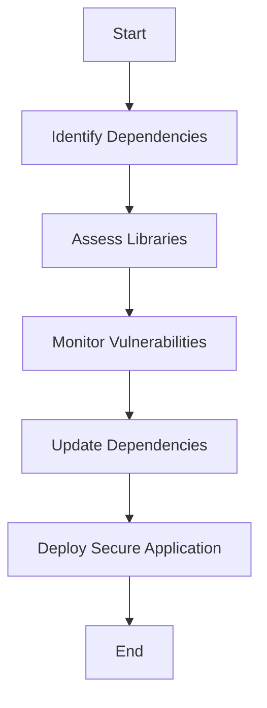

## 23.11. Using Secure Third-Party Dependencies

In the realm of software development, leveraging third-party libraries can significantly accelerate development and enhance functionality. However, these dependencies can also introduce security vulnerabilities if not managed properly. In this section, we will delve into the best practices for using secure third-party dependencies in Elixir, focusing on dependency management, assessing libraries, and monitoring for vulnerabilities.

### Dependency Management

Effective dependency management is crucial for maintaining the security and stability of your Elixir applications. Let's explore some key strategies for managing dependencies securely.

#### Keeping Dependencies Up to Date

Keeping your dependencies up to date is one of the most effective ways to mitigate security risks. Here's how you can achieve this:

1. **Regular Updates**: Regularly update your dependencies to incorporate the latest security patches and improvements. Use tools like `mix deps.update` to update your dependencies.

2. **Semantic Versioning**: Understand and leverage semantic versioning to ensure compatibility and stability. Semantic versioning uses a three-part version number: MAJOR.MINOR.PATCH. Updates to the PATCH version are typically safe and include bug fixes, while MINOR updates may introduce new features. MAJOR updates can introduce breaking changes.

3. **Automated Tools**: Use automated tools like Dependabot or Renovate to automatically check for and apply updates to your dependencies. These tools can help you stay on top of updates without manual intervention.

4. **Changelogs and Release Notes**: Always review the changelogs and release notes of updated dependencies to understand the changes and assess their impact on your application.

5. **Lock Files**: Use lock files (`mix.lock`) to ensure consistent dependency versions across different environments. Lock files capture the exact versions of dependencies used in your project, preventing unexpected changes.

#### Code Example: Updating Dependencies

Here's a simple example of how you can update your dependencies using Mix, Elixir's build tool:

```elixir
# Run the following command to update all dependencies
mix deps.update --all

# Alternatively, update a specific dependency
mix deps.update <dependency_name>
```

### Assessing Libraries

Before incorporating a third-party library into your project, it's essential to evaluate its security posture. Here are some factors to consider:

#### Evaluating the Security Posture of External Packages

1. **Community and Maintenance**: Assess the community and maintenance status of the library. A well-maintained library with an active community is more likely to receive timely security updates.

2. **Code Quality**: Review the code quality and structure of the library. Well-written and organized code is easier to audit and less likely to contain vulnerabilities.

3. **Security History**: Investigate the library's security history. Check for any past vulnerabilities and how they were addressed. A library with a history of unresolved vulnerabilities may not be a safe choice.

4. **Licensing**: Ensure that the library's license is compatible with your project's licensing requirements. Some licenses may impose restrictions on usage or distribution.

5. **Dependencies of Dependencies**: Evaluate the dependencies of the library itself. A library with many dependencies may introduce additional security risks.

#### Code Example: Assessing a Library

While there's no direct code example for assessing a library, you can use tools like `mix hex.info` to gather information about a package from Hex, Elixir's package manager:

```elixir
# Get information about a package
mix hex.info <package_name>
```

### Vulnerability Alerts

Monitoring for reported vulnerabilities is crucial for maintaining the security of your application. Here's how you can stay informed:

#### Monitoring for Reported Vulnerabilities

1. **Security Bulletins**: Subscribe to security bulletins and mailing lists related to Elixir and its ecosystem. These sources provide timely information about vulnerabilities and patches.

2. **Vulnerability Databases**: Regularly check vulnerability databases like the National Vulnerability Database (NVD) or CVE Details for reported vulnerabilities in your dependencies.

3. **Automated Scanning Tools**: Use automated scanning tools like Snyk or OWASP Dependency-Check to scan your dependencies for known vulnerabilities. These tools can integrate with your CI/CD pipeline to provide continuous monitoring.

4. **Community Forums**: Participate in community forums and discussions to stay informed about potential security issues and best practices.

#### Code Example: Using Snyk for Vulnerability Scanning

Here's an example of how you can use Snyk to scan your Elixir project for vulnerabilities:

```bash
# Install Snyk CLI
npm install -g snyk

# Authenticate with Snyk
snyk auth

# Test your project for vulnerabilities
snyk test
```

### Visualizing Dependency Management

To better understand the flow of dependency management and vulnerability monitoring, let's visualize the process using a Mermaid.js diagram:



**Diagram Description**: This flowchart illustrates the process of managing secure third-party dependencies, starting from identifying dependencies, assessing libraries, monitoring vulnerabilities, updating dependencies, and finally deploying a secure application.

### References and Links

- [Hex Package Manager](https://hex.pm/)
- [Dependabot](https://dependabot.com/)
- [Renovate](https://renovatebot.com/)
- [Snyk](https://snyk.io/)
- [OWASP Dependency-Check](https://owasp.org/www-project-dependency-check/)

### Knowledge Check

To reinforce your understanding of secure third-party dependencies, consider the following questions:

1. Why is it important to keep dependencies up to date?
2. What factors should you consider when assessing a third-party library?
3. How can automated tools help in managing dependencies?
4. What are some sources for monitoring reported vulnerabilities?

### Embrace the Journey

Remember, managing secure third-party dependencies is an ongoing process. By staying informed and proactive, you can significantly reduce the security risks associated with external libraries. Keep experimenting, stay curious, and enjoy the journey of building secure and robust Elixir applications!

### Quiz: Using Secure Third-Party Dependencies



### Why is it important to keep dependencies up to date?

- [x] To incorporate the latest security patches and improvements
- [ ] To reduce the size of the application
- [ ] To increase the number of features
- [ ] To make the application run faster

> **Explanation:** Keeping dependencies up to date ensures that you have the latest security patches and improvements, reducing the risk of vulnerabilities.

### What is semantic versioning?

- [x] A versioning system that uses a three-part version number: MAJOR.MINOR.PATCH
- [ ] A method for encrypting version numbers
- [ ] A way to track the number of downloads for a package
- [ ] A system for organizing code files

> **Explanation:** Semantic versioning uses a three-part version number to indicate changes in a package, helping developers understand the impact of updates.

### Which tool can be used to automatically check for and apply updates to dependencies?

- [x] Dependabot
- [ ] GitHub Actions
- [ ] Docker
- [ ] Jenkins

> **Explanation:** Dependabot is a tool that automatically checks for and applies updates to dependencies, helping maintain security and stability.

### What should you review before updating a dependency?

- [x] Changelogs and release notes
- [ ] The number of stars on GitHub
- [ ] The developer's Twitter account
- [ ] The package's logo

> **Explanation:** Reviewing changelogs and release notes helps you understand the changes in a dependency and assess their impact on your application.

### What is the purpose of a lock file in dependency management?

- [x] To ensure consistent dependency versions across different environments
- [ ] To encrypt the dependencies
- [ ] To reduce the size of the application
- [ ] To make the application run faster

> **Explanation:** A lock file captures the exact versions of dependencies used in a project, ensuring consistency across different environments.

### What is a key factor to consider when assessing a third-party library?

- [x] Community and maintenance status
- [ ] The color scheme of the documentation
- [ ] The number of lines of code
- [ ] The developer's favorite programming language

> **Explanation:** The community and maintenance status of a library indicate how actively it is maintained and how quickly security issues are addressed.

### Which tool can be used to scan Elixir projects for vulnerabilities?

- [x] Snyk
- [ ] Docker
- [ ] GitHub Actions
- [ ] Jenkins

> **Explanation:** Snyk is a tool that can scan projects for vulnerabilities, helping developers identify and address security issues.

### What is the role of vulnerability databases?

- [x] To provide information about reported vulnerabilities in dependencies
- [ ] To store encrypted versions of dependencies
- [ ] To track the number of downloads for a package
- [ ] To organize code files

> **Explanation:** Vulnerability databases provide information about reported vulnerabilities, helping developers stay informed about potential security risks.

### What is the benefit of using automated scanning tools?

- [x] Continuous monitoring for vulnerabilities
- [ ] Reducing the size of the application
- [ ] Increasing the number of features
- [ ] Making the application run faster

> **Explanation:** Automated scanning tools provide continuous monitoring for vulnerabilities, helping developers maintain the security of their applications.

### True or False: A library with many dependencies is always a safe choice.

- [ ] True
- [x] False

> **Explanation:** A library with many dependencies may introduce additional security risks, as each dependency could potentially have vulnerabilities.


