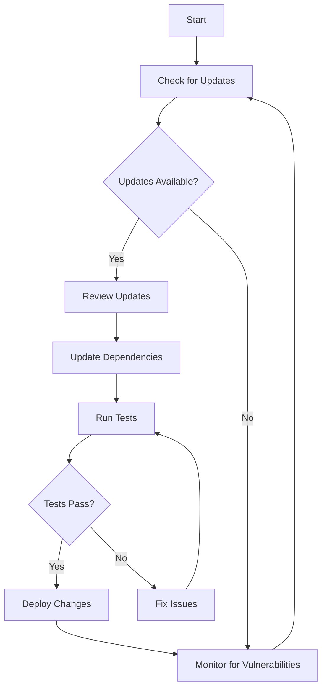

## 23.11. Using Secure Third-Party Dependencies

In the world of software development, third-party dependencies are indispensable. They allow us to leverage existing solutions, accelerate development, and focus on building unique features. However, with great power comes great responsibility. Using third-party dependencies introduces potential security risks, making it crucial to manage them wisely. In this section, we will explore how to use secure third-party dependencies in Elixir, focusing on dependency management, assessing libraries, and monitoring for vulnerabilities.

### Dependency Management

Dependency management is the process of handling external libraries that your project depends on. In Elixir, this is primarily done through Mix, the build tool that comes with Elixir. Effective dependency management involves keeping dependencies up to date, understanding their impact on your project, and ensuring they do not introduce security vulnerabilities.

#### Keeping Dependencies Up to Date

Keeping your dependencies up to date is crucial for maintaining security. New versions of libraries often include patches for security vulnerabilities, performance improvements, and new features. Here's how you can manage your dependencies effectively:

1. **Regular Updates**: Make it a routine to check for updates to your dependencies. You can use the `mix hex.outdated` command to see which dependencies have newer versions available.

   ```elixir
   # Run this command in your project directory
   mix hex.outdated
   ```

2. **Automated Tools**: Use tools like Dependabot or Renovate to automate the process of checking for updates and creating pull requests for them.

3. **Semantic Versioning**: Understand semantic versioning (semver) to assess the impact of updates. Semantic versioning uses a version number format of `MAJOR.MINOR.PATCH`, where:
   - **MAJOR**: Introduces incompatible API changes.
   - **MINOR**: Adds functionality in a backward-compatible manner.
   - **PATCH**: Makes backward-compatible bug fixes.

4. **Lock Files**: Use lock files (e.g., `mix.lock`) to ensure consistent dependency versions across different environments. This file records the exact versions of dependencies used in your project.

#### Assessing Libraries

Before adding a new dependency, it's essential to evaluate its security posture. Here are some steps to assess libraries:

1. **Reputation and Community**: Check the library's reputation and community support. A well-maintained library with an active community is more likely to be secure and reliable.

2. **Source Code Review**: Review the library's source code for any obvious security issues. Look for common vulnerabilities such as SQL injection, cross-site scripting, and buffer overflows.

3. **Documentation and Updates**: Ensure the library has comprehensive documentation and a history of regular updates. This indicates active maintenance and responsiveness to security issues.

4. **License Compliance**: Verify the library's license to ensure it is compatible with your project's licensing requirements.

5. **Security Audits**: Check if the library has undergone any security audits. Some libraries may provide audit reports or have been reviewed by security experts.

#### Vulnerability Alerts

Monitoring for reported vulnerabilities in your dependencies is crucial for maintaining a secure application. Here's how you can stay informed:

1. **Security Bulletins**: Subscribe to security bulletins and mailing lists related to your dependencies. This will keep you informed about any reported vulnerabilities.

2. **Vulnerability Databases**: Use vulnerability databases like the National Vulnerability Database (NVD) or CVE Details to check for known vulnerabilities in your dependencies.

3. **Automated Scanning Tools**: Implement automated scanning tools like Snyk or OWASP Dependency-Check to regularly scan your project for vulnerabilities.

4. **Hex.pm Security Reports**: Hex.pm, the package manager for Elixir, provides security reports for packages. Check these reports to see if any of your dependencies have known vulnerabilities.

### Code Examples

Let's look at some code examples to illustrate how to manage dependencies securely in Elixir.

#### Example 1: Checking for Outdated Dependencies

Here's how you can use the `mix hex.outdated` command to check for outdated dependencies:

```elixir
# Open your terminal and navigate to your project directory
cd my_elixir_project

# Run the command to check for outdated dependencies
mix hex.outdated
```

This command will list all dependencies that have newer versions available, along with their current and latest versions.

#### Example 2: Using Dependabot for Automated Updates

Dependabot is a tool that automatically checks for dependency updates and creates pull requests for them. Here's how you can configure Dependabot for your Elixir project:

1. **Create a `dependabot.yml` file** in the `.github` directory of your repository.

   ```yaml
   version: 2
   updates:
     - package-ecosystem: "mix"
       directory: "/"
       schedule:
         interval: "weekly"
   ```

2. **Enable Dependabot** in your GitHub repository settings.

Dependabot will now automatically check for updates to your Elixir dependencies and create pull requests for them.

### Visualizing Dependency Management

To better understand the process of managing dependencies, let's visualize it using a flowchart.


```mermaid
flowchart TD
    A[Start] --> B[Check for Updates]
    B --> C{Updates Available?}
    C -->|Yes| D[Review Updates]
    D --> E[Update Dependencies]
    E --> F[Run Tests]
    F --> G{Tests Pass?}
    G -->|Yes| H[Deploy Changes]
    G -->|No| I[Fix Issues]
    I --> F
    C -->|No| J[Monitor for Vulnerabilities]
    J --> B
    H --> J
```

**Figure 1: Dependency Management Process**

This flowchart illustrates the cycle of checking for updates, reviewing and updating dependencies, testing changes, and monitoring for vulnerabilities.

### Knowledge Check

To reinforce your understanding of secure dependency management, consider the following questions:

- Why is it important to keep dependencies up to date?
- How can you assess the security posture of a library before using it?
- What tools can you use to monitor for vulnerabilities in your dependencies?

### Try It Yourself

Experiment with managing dependencies in your Elixir project:

1. Run `mix hex.outdated` to check for outdated dependencies.
2. Review the dependencies and decide which ones to update.
3. Use Dependabot or a similar tool to automate updates.
4. Implement a vulnerability scanning tool to monitor your project.

### References and Links

For further reading, consider the following resources:

- [Hex.pm Security Reports](https://hex.pm/security)
- [OWASP Dependency-Check](https://owasp.org/www-project-dependency-check/)
- [Snyk Vulnerability Database](https://snyk.io/vuln)
- [Dependabot Documentation](https://docs.github.com/en/code-security/supply-chain-security/keeping-your-dependencies-updated-automatically)

### Embrace the Journey

Remember, managing third-party dependencies is an ongoing process. As you continue to develop your Elixir applications, stay vigilant and proactive in ensuring the security of your dependencies. Keep experimenting, stay curious, and enjoy the journey of building secure and robust applications!

## Quiz Time!



### What command can you use to check for outdated dependencies in an Elixir project?

- [x] mix hex.outdated
- [ ] mix deps.get
- [ ] mix hex.info
- [ ] mix deps.compile

> **Explanation:** The `mix hex.outdated` command lists all dependencies with newer versions available.

### Which of the following tools can automate dependency updates in a GitHub repository?

- [x] Dependabot
- [ ] Hex.pm
- [ ] Dialyzer
- [ ] ExUnit

> **Explanation:** Dependabot automatically checks for dependency updates and creates pull requests for them.

### What is the purpose of a lock file in dependency management?

- [x] To ensure consistent dependency versions across environments
- [ ] To store the source code of dependencies
- [ ] To provide documentation for dependencies
- [ ] To automate dependency updates

> **Explanation:** A lock file records the exact versions of dependencies used, ensuring consistency across environments.

### What is semantic versioning?

- [x] A versioning system that uses MAJOR.MINOR.PATCH format
- [ ] A method for encrypting version numbers
- [ ] A tool for automating version updates
- [ ] A type of license for open-source projects

> **Explanation:** Semantic versioning uses a MAJOR.MINOR.PATCH format to indicate the nature of changes in a new version.

### Which of the following is a vulnerability database?

- [x] National Vulnerability Database (NVD)
- [ ] Hex.pm
- [ ] ExDoc
- [ ] Mix

> **Explanation:** The National Vulnerability Database (NVD) is a repository of known software vulnerabilities.

### What should you check when assessing the security posture of a library?

- [x] Reputation and community support
- [x] Source code for security issues
- [x] License compliance
- [ ] The number of downloads

> **Explanation:** Assessing a library's security involves checking its reputation, source code, and license compliance.

### Why is it important to monitor for vulnerabilities in your dependencies?

- [x] To ensure your application remains secure
- [x] To identify and address potential security risks
- [ ] To increase the number of dependencies
- [ ] To reduce the size of your application

> **Explanation:** Monitoring for vulnerabilities helps maintain the security of your application by identifying potential risks.

### What is the role of Hex.pm in Elixir dependency management?

- [x] It serves as a package manager for Elixir
- [ ] It provides a vulnerability database
- [ ] It automates dependency updates
- [ ] It compiles Elixir code

> **Explanation:** Hex.pm is the package manager for Elixir, used for managing dependencies.

### True or False: Using third-party dependencies always increases the security of your application.

- [ ] True
- [x] False

> **Explanation:** While third-party dependencies can provide useful functionality, they can also introduce security risks if not managed properly.

### What is the benefit of using automated scanning tools for dependencies?

- [x] They regularly scan for vulnerabilities
- [ ] They increase the number of dependencies
- [ ] They provide documentation for dependencies
- [ ] They compile Elixir code

> **Explanation:** Automated scanning tools help maintain security by regularly scanning dependencies for vulnerabilities.



By following these guidelines and practices, you can effectively manage third-party dependencies in your Elixir projects, ensuring they remain secure and reliable.
