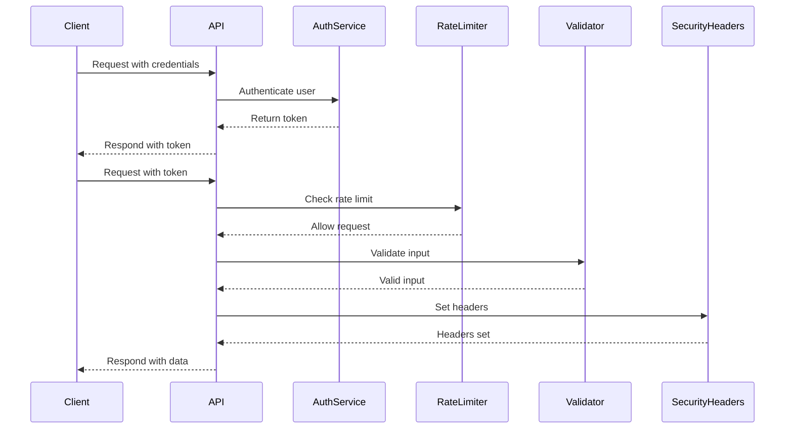

## 23.12. Patterns for Building Secure APIs

In today's interconnected world, APIs are the backbone of modern applications, enabling communication between different software systems. However, with great power comes great responsibility. Ensuring the security of your APIs is crucial to protect sensitive data and maintain the integrity of your application. In this section, we will explore advanced patterns for building secure APIs in Elixir, focusing on key aspects such as authentication, rate limiting, input filtering, and response headers. 

### API Authentication

Authentication is the first line of defense in securing your API. It ensures that only authorized users can access your resources. Let's delve into implementing token-based authentication in Elixir.

#### Implementing Token-Based Authentication

Token-based authentication is a popular method for securing APIs. It involves issuing a token to a user upon successful authentication, which is then used to access protected resources.

**Key Steps:**

1. **User Authentication:** Verify the user's credentials (e.g., username and password).
2. **Token Generation:** Generate a token (e.g., JWT) upon successful authentication.
3. **Token Storage:** Store the token securely on the client-side.
4. **Token Validation:** Validate the token on each API request.

**Code Example:**

```elixir
defmodule MyAppWeb.AuthController do
  use MyAppWeb, :controller

  alias MyApp.Accounts
  alias MyApp.Guardian

  def login(conn, %{"username" => username, "password" => password}) do
    case Accounts.authenticate_user(username, password) do
      {:ok, user} ->
        {:ok, token, _claims} = Guardian.encode_and_sign(user)
        json(conn, %{token: token})
      {:error, reason} ->
        conn
        |> put_status(:unauthorized)
        |> json(%{error: reason})
    end
  end
end
```

**Explanation:**

- **User Authentication:** The `Accounts.authenticate_user/2` function verifies the user's credentials.
- **Token Generation:** The `Guardian.encode_and_sign/1` function generates a JWT token for the authenticated user.
- **Response:** The token is returned in the JSON response.

**Try It Yourself:**

- Modify the code to include additional claims in the JWT.
- Implement token expiration and refresh mechanisms.

### Rate Limiting

Rate limiting is essential to prevent abuse and ensure fair usage of your API. It involves restricting the number of requests a client can make in a given time period.

#### Preventing Abuse with Throttling

Throttling helps protect your API from being overwhelmed by too many requests, which can lead to denial of service.

**Key Steps:**

1. **Identify Rate Limits:** Determine the appropriate rate limits for your API.
2. **Implement Throttling Logic:** Use a library or custom logic to enforce rate limits.
3. **Monitor and Adjust:** Continuously monitor usage patterns and adjust limits as needed.

**Code Example:**

```elixir
defmodule MyAppWeb.Plugs.RateLimiter do
  import Plug.Conn

  @rate_limit 100
  @time_window :timer.minutes(1)

  def init(default), do: default

  def call(conn, _opts) do
    client_ip = get_peer_data(conn).address |> Tuple.to_list() |> Enum.join(".")
    key = "rate_limit:#{client_ip}"

    case MyApp.Cache.get(key) do
      nil ->
        MyApp.Cache.put(key, 1, @time_window)
        conn
      count when count < @rate_limit ->
        MyApp.Cache.increment(key)
        conn
      _ ->
        conn
        |> put_status(:too_many_requests)
        |> json(%{error: "Rate limit exceeded"})
        |> halt()
    end
  end
end
```

**Explanation:**

- **Rate Limit:** The `@rate_limit` variable defines the maximum number of requests allowed.
- **Time Window:** The `@time_window` variable specifies the time period for the rate limit.
- **Throttling Logic:** The `call/2` function checks the request count for the client's IP and enforces the rate limit.

**Try It Yourself:**

- Experiment with different rate limits and time windows.
- Implement user-specific rate limits based on authentication tokens.

### Input Filtering

Input filtering is crucial to prevent malicious data from entering your system. It involves validating and sanitizing API inputs to ensure they meet expected criteria.

#### Validating and Sanitizing API Inputs

Proper input validation and sanitization can protect your API from common vulnerabilities such as SQL injection and cross-site scripting (XSS).

**Key Steps:**

1. **Define Validation Rules:** Specify the expected format and constraints for each input parameter.
2. **Implement Validation Logic:** Use a validation library or custom logic to enforce rules.
3. **Sanitize Inputs:** Remove or escape any potentially harmful characters.

**Code Example:**

```elixir
defmodule MyAppWeb.UserController do
  use MyAppWeb, :controller

  alias MyApp.Accounts
  alias MyAppWeb.UserView

  def create(conn, %{"user" => user_params}) do
    changeset = Accounts.change_user(%User{}, user_params)

    if changeset.valid? do
      {:ok, user} = Accounts.create_user(user_params)
      conn
      |> put_status(:created)
      |> render(UserView, "show.json", user: user)
    else
      conn
      |> put_status(:unprocessable_entity)
      |> render(MyAppWeb.ChangesetView, "error.json", changeset: changeset)
    end
  end
end
```

**Explanation:**

- **Validation Rules:** The `Accounts.change_user/2` function applies validation rules to the input parameters.
- **Sanitization:** The `changeset.valid?` check ensures that only valid data is processed.

**Try It Yourself:**

- Add custom validation rules for specific fields.
- Implement input sanitization for HTML content.

### Response Headers

Setting security-related response headers can enhance the security of your API by controlling how browsers handle your content.

#### Setting Security-Related Headers

Security headers such as CORS (Cross-Origin Resource Sharing) and CSP (Content Security Policy) can protect your API from various attacks.

**Key Steps:**

1. **Identify Required Headers:** Determine which security headers are necessary for your API.
2. **Implement Header Logic:** Use a plug or middleware to set headers on each response.
3. **Test and Monitor:** Ensure headers are correctly set and monitor for any issues.

**Code Example:**

```elixir
defmodule MyAppWeb.Plugs.SecurityHeaders do
  import Plug.Conn

  def init(default), do: default

  def call(conn, _opts) do
    conn
    |> put_resp_header("x-content-type-options", "nosniff")
    |> put_resp_header("x-frame-options", "DENY")
    |> put_resp_header("x-xss-protection", "1; mode=block")
    |> put_resp_header("content-security-policy", "default-src 'self'")
  end
end
```

**Explanation:**

- **Security Headers:** The `put_resp_header/3` function sets various security headers on the response.
- **CSP:** The `content-security-policy` header restricts the sources from which content can be loaded.

**Try It Yourself:**

- Experiment with different CSP policies.
- Add additional security headers as needed.

### Visualizing API Security Patterns

To better understand the flow of securing an API, let's visualize the process using a sequence diagram.



**Diagram Explanation:**

- **Authentication:** The client sends credentials to the API, which authenticates the user and returns a token.
- **Rate Limiting:** The API checks the rate limit before processing the request.
- **Input Validation:** The API validates the input to ensure it meets the expected criteria.
- **Security Headers:** The API sets security-related headers before responding to the client.

### References and Links

- [OWASP API Security Top 10](https://owasp.org/www-project-api-security/)
- [Elixir Guardian Library](https://hexdocs.pm/guardian/readme.html)
- [Plug Documentation](https://hexdocs.pm/plug/readme.html)

### Knowledge Check

- What are the key components of token-based authentication?
- How can rate limiting protect your API from abuse?
- Why is input validation important for API security?
- What role do security headers play in protecting your API?

### Embrace the Journey

Remember, building secure APIs is an ongoing process. As you implement these patterns, continue to monitor and adapt your security measures to address new threats. Keep experimenting, stay curious, and enjoy the journey of creating robust and secure APIs!

### Quiz: Patterns for Building Secure APIs



### What is the primary purpose of token-based authentication?

- [x] To verify the identity of a user and grant access to resources
- [ ] To encrypt data in transit
- [ ] To limit the number of API requests
- [ ] To sanitize user inputs

> **Explanation:** Token-based authentication is used to verify a user's identity and grant access to resources.

### Which of the following is a benefit of rate limiting?

- [x] Preventing abuse and ensuring fair usage
- [ ] Encrypting API responses
- [ ] Validating user inputs
- [ ] Setting security headers

> **Explanation:** Rate limiting helps prevent abuse by restricting the number of requests a client can make in a given time period.

### What is the role of input validation in API security?

- [x] To ensure inputs meet expected criteria and prevent malicious data
- [ ] To encrypt data at rest
- [ ] To limit the number of API requests
- [ ] To set security headers

> **Explanation:** Input validation ensures that inputs meet expected criteria and helps prevent malicious data from entering the system.

### Which security header can help prevent cross-site scripting (XSS) attacks?

- [x] Content Security Policy (CSP)
- [ ] Rate Limiting
- [ ] Token Authentication
- [ ] Input Validation

> **Explanation:** The Content Security Policy (CSP) header helps prevent cross-site scripting (XSS) attacks by restricting the sources from which content can be loaded.

### What is the purpose of the `x-frame-options` header?

- [x] To prevent clickjacking attacks by controlling whether a page can be framed
- [ ] To encrypt data in transit
- [ ] To limit the number of API requests
- [ ] To validate user inputs

> **Explanation:** The `x-frame-options` header helps prevent clickjacking attacks by controlling whether a page can be framed.

### How does token-based authentication differ from session-based authentication?

- [x] Tokens are stateless and stored client-side, while sessions are stateful and stored server-side
- [ ] Tokens are encrypted, while sessions are not
- [ ] Tokens are used for input validation, while sessions are not
- [ ] Tokens limit API requests, while sessions do not

> **Explanation:** Token-based authentication is stateless and stores tokens client-side, whereas session-based authentication is stateful and stores session data server-side.

### What is a common method for implementing rate limiting in Elixir?

- [x] Using a cache or database to track request counts
- [ ] Encrypting API responses
- [ ] Validating user inputs
- [ ] Setting security headers

> **Explanation:** Rate limiting can be implemented by using a cache or database to track the number of requests made by a client.

### Why is it important to set security-related response headers?

- [x] To control how browsers handle your content and protect against attacks
- [ ] To encrypt data at rest
- [ ] To limit the number of API requests
- [ ] To validate user inputs

> **Explanation:** Security-related response headers control how browsers handle your content and help protect against various attacks.

### What is the purpose of the `x-content-type-options` header?

- [x] To prevent MIME type sniffing
- [ ] To encrypt data in transit
- [ ] To limit the number of API requests
- [ ] To validate user inputs

> **Explanation:** The `x-content-type-options` header prevents MIME type sniffing by instructing the browser to follow the declared content type.

### True or False: Input sanitization is only necessary for user-generated content.

- [ ] True
- [x] False

> **Explanation:** Input sanitization is necessary for all inputs, not just user-generated content, to ensure they do not contain harmful data.


