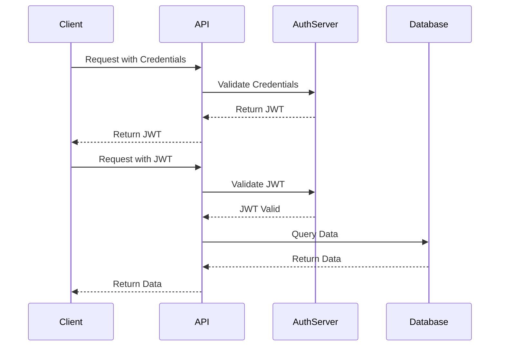

## 23.12. Patterns for Building Secure APIs

As software engineers and architects, ensuring the security of APIs is paramount. APIs are the backbone of modern applications, enabling communication between different services and systems. In Elixir, a language known for its robustness and scalability, building secure APIs involves leveraging its unique features and design patterns. This section will delve into key patterns and practices for building secure APIs in Elixir, focusing on authentication, rate limiting, input filtering, and response headers.

### API Authentication

Authentication is the first line of defense for any API. It ensures that only authorized users can access specific resources. In Elixir, token-based authentication is a popular choice due to its simplicity and effectiveness.

#### Implementing Token-Based Authentication

Token-based authentication involves generating a token upon successful login, which the client uses in subsequent requests. This token is typically a JSON Web Token (JWT), which is compact, URL-safe, and can carry claims about the user.

**Steps to Implement Token-Based Authentication:**

1. **User Login:**
   - Validate user credentials.
   - Generate a JWT containing user information and expiration time.

2. **Token Storage:**
   - Store the token securely on the client side (e.g., in local storage or cookies).

3. **Token Validation:**
   - For each API request, validate the token's signature and claims.

4. **Token Refresh:**
   - Implement a mechanism to refresh tokens before they expire.

**Code Example:**

Here's a simple implementation of JWT authentication in Elixir using the `joken` library:

```elixir
defmodule MyAppWeb.AuthController do
  use MyAppWeb, :controller

  alias MyApp.Accounts
  alias Joken.Signer

  @signer Signer.create("HS256", "secret")

  def login(conn, %{"username" => username, "password" => password}) do
    case Accounts.authenticate_user(username, password) do
      {:ok, user} ->
        token = Joken.generate_and_sign(%{"user_id" => user.id}, @signer)
        json(conn, %{token: token})

      {:error, reason} ->
        conn
        |> put_status(:unauthorized)
        |> json(%{error: reason})
    end
  end

  defp authenticate_token(conn, _opts) do
    token = get_req_header(conn, "authorization") |> List.first() |> String.replace("Bearer ", "")

    case Joken.verify_and_validate(token, @signer) do
      {:ok, claims} ->
        assign(conn, :current_user, claims["user_id"])

      {:error, _reason} ->
        conn
        |> put_status(:unauthorized)
        |> json(%{error: "Invalid token"})
        |> halt()
    end
  end
end
```

**Key Points:**
- **Security:** Use a strong secret key and consider rotating it regularly.
- **Expiration:** Set a reasonable expiration time for tokens to limit exposure.
- **Refresh Tokens:** Implement refresh tokens to allow users to obtain a new token without re-authenticating.

### Rate Limiting

Rate limiting is crucial to prevent abuse and ensure fair usage of your API. It involves restricting the number of requests a client can make in a given time frame.

#### Preventing Abuse with Throttling

Throttling can be implemented using various strategies, such as fixed window, sliding window, or token bucket. In Elixir, we can leverage the `plug_attack` library to implement rate limiting.

**Code Example:**

```elixir
defmodule MyAppWeb.Plugs.RateLimiter do
  use PlugAttack

  rule "limit by IP", conn do
    ip = Tuple.to_list(conn.remote_ip) |> Enum.join(".")
    {:allow, 10, 60_000, ip}
  end

  def call(conn, _opts) do
    case PlugAttack.call(conn, __MODULE__) do
      {:allow, _} -> conn
      {:deny, _} ->
        conn
        |> put_status(:too_many_requests)
        |> json(%{error: "Rate limit exceeded"})
        |> halt()
    end
  end
end
```

**Key Points:**
- **Granularity:** Choose the right level of granularity (e.g., per IP, per user).
- **Feedback:** Provide clear feedback to clients when they hit the rate limit.
- **Monitoring:** Monitor rate limits to detect unusual patterns that might indicate abuse.

### Input Filtering

Input validation and sanitization are essential to protect your API from malicious inputs, such as SQL injection or cross-site scripting (XSS).

#### Validating and Sanitizing API Inputs

Elixir provides powerful tools for input validation, such as `Ecto.Changeset` for data validation and `Plug` for request handling.

**Code Example:**

```elixir
defmodule MyAppWeb.UserController do
  use MyAppWeb, :controller

  alias MyApp.Accounts
  alias MyApp.Accounts.User

  def create(conn, %{"user" => user_params}) do
    changeset = User.changeset(%User{}, user_params)

    case Accounts.create_user(changeset) do
      {:ok, user} ->
        conn
        |> put_status(:created)
        |> json(%{id: user.id})

      {:error, changeset} ->
        conn
        |> put_status(:unprocessable_entity)
        |> json(%{errors: changeset.errors})
    end
  end
end

defmodule MyApp.Accounts.User do
  use Ecto.Schema
  import Ecto.Changeset

  schema "users" do
    field :name, :string
    field :email, :string
    field :password, :string, virtual: true
    field :password_hash, :string

    timestamps()
  end

  def changeset(user, attrs) do
    user
    |> cast(attrs, [:name, :email, :password])
    |> validate_required([:name, :email, :password])
    |> validate_format(:email, ~r/@/)
    |> validate_length(:password, min: 6)
    |> hash_password()
  end

  defp hash_password(changeset) do
    if password = get_change(changeset, :password) do
      put_change(changeset, :password_hash, Bcrypt.hash_pwd_salt(password))
    else
      changeset
    end
  end
end
```

**Key Points:**
- **Validation:** Use strong validation rules to ensure data integrity.
- **Sanitization:** Remove or escape potentially harmful characters.
- **Feedback:** Provide meaningful error messages to guide users in correcting inputs.

### Response Headers

Setting appropriate response headers can enhance the security of your API by controlling how browsers and clients interact with it.

#### Setting Security-Related Headers

Common security headers include Cross-Origin Resource Sharing (CORS), Content Security Policy (CSP), and others. Elixir's `Plug` library can be used to set these headers.

**Code Example:**

```elixir
defmodule MyAppWeb.Plugs.SecurityHeaders do
  import Plug.Conn

  def init(default), do: default

  def call(conn, _opts) do
    conn
    |> put_resp_header("x-content-type-options", "nosniff")
    |> put_resp_header("x-frame-options", "DENY")
    |> put_resp_header("x-xss-protection", "1; mode=block")
    |> put_resp_header("strict-transport-security", "max-age=31536000; includeSubDomains")
  end
end
```

**Key Points:**
- **CORS:** Control which domains can access your API.
- **CSP:** Prevent XSS by specifying allowed content sources.
- **HSTS:** Enforce HTTPS to protect data in transit.

### Visualizing Secure API Architecture

To better understand the flow and interaction of secure API components, let's visualize the architecture using a sequence diagram.


```mermaid
sequenceDiagram
    participant Client
    participant API
    participant AuthServer
    participant Database

    Client->>API: Request with Credentials
    API->>AuthServer: Validate Credentials
    AuthServer-->>API: Return JWT
    API-->>Client: Return JWT

    Client->>API: Request with JWT
    API->>AuthServer: Validate JWT
    AuthServer-->>API: JWT Valid
    API->>Database: Query Data
    Database-->>API: Return Data
    API-->>Client: Return Data
```

**Diagram Description:**
- **Client:** Initiates requests and uses JWT for authentication.
- **API:** Validates requests and interacts with the AuthServer and Database.
- **AuthServer:** Handles authentication and JWT validation.
- **Database:** Stores and retrieves data for authenticated requests.

### Elixir Unique Features

Elixir's concurrency model, based on the Actor model, provides inherent advantages for building secure APIs. Processes in Elixir are isolated, reducing the risk of shared mutable state vulnerabilities. Additionally, Elixir's pattern matching and immutable data structures enhance the robustness of input validation and processing.

### Design Considerations

- **Scalability:** Design your API to handle increased load by leveraging Elixir's concurrency features.
- **Fault Tolerance:** Use OTP patterns like Supervisors to ensure your API remains resilient to failures.
- **Monitoring:** Implement logging and monitoring to detect and respond to security incidents promptly.

### Differences and Similarities

While token-based authentication and rate limiting are common across many languages, Elixir's approach benefits from its functional paradigm and concurrency model. This allows for more efficient handling of concurrent requests and robust error handling.

### Try It Yourself

Experiment with the provided code examples by modifying the token expiration time, changing validation rules, or adding custom security headers. Observe how these changes affect the behavior and security of your API.

### Knowledge Check

- **What are the key components of token-based authentication?**
- **How does rate limiting prevent API abuse?**
- **Why is input validation important for API security?**
- **What role do response headers play in securing an API?**

### Summary

Building secure APIs in Elixir involves implementing robust authentication, rate limiting, input validation, and setting security-related response headers. By leveraging Elixir's unique features and adhering to best practices, you can create APIs that are both secure and performant.

### References and Links

- [Joken Library Documentation](https://hexdocs.pm/joken/readme.html)
- [PlugAttack Documentation](https://hexdocs.pm/plug_attack/readme.html)
- [Ecto Changeset Documentation](https://hexdocs.pm/ecto/Ecto.Changeset.html)
- [OWASP API Security Top 10](https://owasp.org/www-project-api-security/)

## Quiz Time!



### What is the primary purpose of token-based authentication in APIs?

- [x] To ensure only authorized users can access resources
- [ ] To increase the speed of API requests
- [ ] To reduce the size of the API payload
- [ ] To enhance the visual appearance of the API

> **Explanation:** Token-based authentication ensures that only users with valid tokens can access specific resources, providing a layer of security.

### Which Elixir library is commonly used for implementing JWT authentication?

- [x] Joken
- [ ] Plug
- [ ] Ecto
- [ ] Phoenix

> **Explanation:** Joken is a library used in Elixir for generating and verifying JSON Web Tokens (JWT).

### What is the main benefit of rate limiting in APIs?

- [x] To prevent abuse by limiting the number of requests a client can make
- [ ] To increase the complexity of the API
- [ ] To allow unlimited access to all users
- [ ] To make the API more visually appealing

> **Explanation:** Rate limiting helps prevent abuse by restricting the number of requests a client can make in a given time frame.

### Why is input validation crucial for API security?

- [x] To protect against malicious inputs and ensure data integrity
- [ ] To make the API faster
- [ ] To simplify the API's codebase
- [ ] To enhance the user interface

> **Explanation:** Input validation is crucial for protecting against malicious inputs and ensuring the integrity and correctness of the data processed by the API.

### Which security header helps prevent cross-site scripting (XSS) attacks?

- [x] Content Security Policy (CSP)
- [ ] Access-Control-Allow-Origin
- [ ] X-Content-Type-Options
- [ ] Strict-Transport-Security

> **Explanation:** Content Security Policy (CSP) helps prevent XSS attacks by specifying which content sources are allowed.

### What does HSTS stand for in the context of API security?

- [x] HTTP Strict Transport Security
- [ ] Hypertext Secure Transfer System
- [ ] High Security Transport System
- [ ] Host Security Transfer Service

> **Explanation:** HSTS stands for HTTP Strict Transport Security, which enforces the use of HTTPS for secure communication.

### In the provided JWT authentication example, what is the purpose of the `@signer` variable?

- [x] To define the algorithm and secret for signing tokens
- [ ] To store user credentials
- [ ] To configure the database connection
- [ ] To manage API routes

> **Explanation:** The `@signer` variable defines the algorithm and secret used for signing and verifying JWTs.

### What is the role of the `PlugAttack` library in Elixir?

- [x] To implement rate limiting and throttling
- [ ] To manage database connections
- [ ] To handle HTTP requests and responses
- [ ] To create HTML templates

> **Explanation:** `PlugAttack` is used in Elixir to implement rate limiting and throttling for APIs.

### Which Elixir feature enhances the robustness of input validation?

- [x] Pattern matching and immutable data structures
- [ ] Dynamic typing
- [ ] Object-oriented programming
- [ ] Global variables

> **Explanation:** Elixir's pattern matching and immutable data structures enhance the robustness of input validation by ensuring data consistency and correctness.

### True or False: Elixir's concurrency model provides inherent advantages for building secure APIs.

- [x] True
- [ ] False

> **Explanation:** True. Elixir's concurrency model, based on the Actor model, provides advantages for building secure APIs by isolating processes and reducing the risk of shared mutable state vulnerabilities.



Remember, building secure APIs is an ongoing process. Continuously monitor, test, and update your security measures to protect against emerging threats. Keep experimenting, stay curious, and enjoy the journey!
