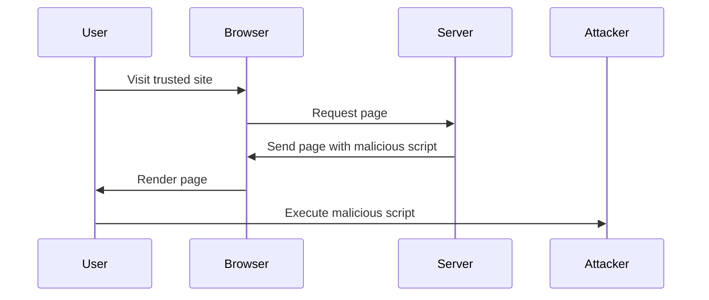
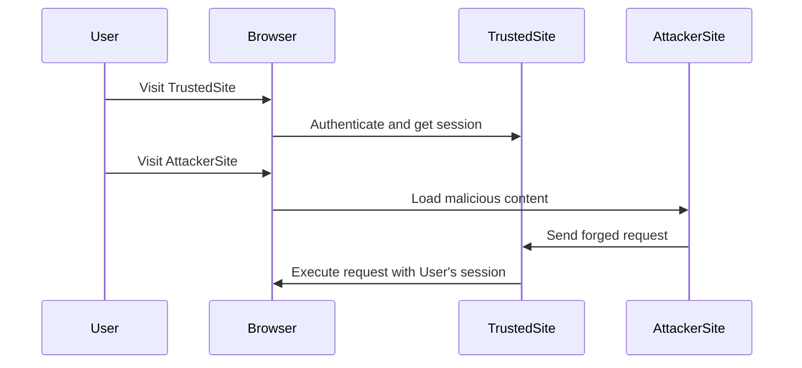

## 23.13. Dealing with Cross-Site Scripting (XSS) and CSRF

In the world of web development, security is paramount. Two of the most common vulnerabilities that web applications face are Cross-Site Scripting (XSS) and Cross-Site Request Forgery (CSRF). As expert software engineers and architects, understanding and implementing effective strategies to mitigate these threats is crucial. In this section, we will delve into the intricacies of XSS and CSRF, explore how they can be exploited, and provide comprehensive strategies to prevent them in Elixir applications.

### Understanding Cross-Site Scripting (XSS)

Cross-Site Scripting (XSS) is a security vulnerability that allows attackers to inject malicious scripts into web pages viewed by other users. These scripts can steal cookies, session tokens, or other sensitive information, and even rewrite the content of the HTML page.

#### Types of XSS

1. **Stored XSS**: Malicious scripts are stored on the server and executed when a user accesses the affected page.
2. **Reflected XSS**: Malicious scripts are reflected off a web server, typically via a URL or a form submission.
3. **DOM-based XSS**: The vulnerability exists in the client-side code rather than the server-side code.

#### Preventing XSS

To prevent XSS attacks, it is essential to sanitize and escape user input before rendering it on a web page. Elixir, with its Phoenix framework, provides several tools and best practices to mitigate XSS vulnerabilities.

##### Escaping Output in Templates

Escaping output is a fundamental technique to prevent XSS. In Phoenix, the default templating engine, EEx, automatically escapes output to prevent XSS attacks. However, developers must remain vigilant when using raw HTML or JavaScript.

```elixir
# Example of escaping output in a Phoenix template
<%= @user_input %> <!-- This will be automatically escaped -->
```

For cases where you need to render raw HTML, use the `raw/1` function cautiously:

```elixir
# Rendering raw HTML (use with caution)
<%= raw @safe_html_content %>
```

##### Using Content Security Policy (CSP)

A Content Security Policy (CSP) is a powerful tool to mitigate XSS attacks by specifying which sources of content are allowed to be loaded and executed. Implementing a CSP can significantly reduce the risk of XSS.

```elixir
# Example of setting a Content Security Policy in a Phoenix application
plug :put_secure_browser_headers, %{
  "content-security-policy" => "default-src 'self'; script-src 'self' https://trusted.cdn.com"
}
```

### Understanding Cross-Site Request Forgery (CSRF)

Cross-Site Request Forgery (CSRF) is an attack that tricks a user into executing unwanted actions on a web application in which they are authenticated. This can lead to unauthorized actions such as changing account settings or making transactions.

#### Defending Against CSRF

The primary defense against CSRF attacks is the use of CSRF tokens. These tokens are unique to each session and are included in forms and requests to verify the legitimacy of the request.

##### Using CSRF Tokens in Forms and Requests

Phoenix provides built-in support for CSRF protection. When using forms, Phoenix automatically includes a CSRF token.

```elixir
# Example of a form with a CSRF token in a Phoenix template
<%= form_for @changeset, @action, fn f -> %>
  <%= hidden_input f, :csrf_token, value: get_csrf_token() %>
  <%= submit "Submit" %>
<% end %>
```

For AJAX requests, include the CSRF token in the request headers:

```javascript
// Example of including a CSRF token in an AJAX request
let csrfToken = document.querySelector("meta[name='csrf-token']").getAttribute("content");

fetch("/some_endpoint", {
  method: "POST",
  headers: {
    "Content-Type": "application/json",
    "X-CSRF-Token": csrfToken
  },
  body: JSON.stringify({ data: "example" })
});
```

### Securing Cookies

Cookies are often used to store session data and other sensitive information. Securing cookies is crucial to prevent them from being accessed by malicious scripts.

#### Setting HTTP-only and Secure Flags

1. **HTTP-only Flag**: Prevents JavaScript from accessing the cookie, mitigating the risk of XSS attacks.
2. **Secure Flag**: Ensures that cookies are only sent over HTTPS, protecting them from being intercepted.

```elixir
# Example of setting secure cookie options in a Phoenix application
plug Plug.Session,
  store: :cookie,
  key: "_my_app_key",
  signing_salt: "random_salt",
  secure: true, # Only send cookies over HTTPS
  http_only: true # Prevent JavaScript access
```

### Visualizing XSS and CSRF Attacks

To better understand how XSS and CSRF attacks work, let's visualize the process using Mermaid.js diagrams.

#### XSS Attack Flow



#### CSRF Attack Flow



### References and Further Reading

- [OWASP XSS Prevention Cheat Sheet](https://owasp.org/www-project-cheat-sheets/cheatsheets/Cross_Site_Scripting_Prevention_Cheat_Sheet.html)
- [OWASP CSRF Prevention Cheat Sheet](https://owasp.org/www-project-cheat-sheets/cheatsheets/Cross-Site_Request_Forgery_Prevention_Cheat_Sheet.html)
- [Phoenix Framework Security Guide](https://hexdocs.pm/phoenix/security.html)

### Knowledge Check

1. **What is the primary purpose of escaping output in templates?**
2. **How does a Content Security Policy help prevent XSS attacks?**
3. **What is the role of a CSRF token in form submissions?**
4. **Why is it important to set the HTTP-only flag on cookies?**

### Exercises

1. **Implement a CSP in your Phoenix application and test its effectiveness against XSS attacks.**
2. **Create a form in a Phoenix application and ensure it includes a CSRF token. Test the form's behavior with and without the token.**
3. **Configure your Phoenix application to use secure cookies and verify that they are only sent over HTTPS.**

### Embrace the Journey

Remember, securing your web applications is an ongoing process. As you implement these strategies, you'll gain a deeper understanding of web security and how to protect your applications from common vulnerabilities. Keep experimenting, stay curious, and enjoy the journey!

## Quiz: Dealing with Cross-Site Scripting (XSS) and CSRF



### What is the primary purpose of escaping output in templates?

- [x] To prevent XSS attacks by ensuring that user input is not executed as code
- [ ] To improve the performance of the application
- [ ] To make the code more readable
- [ ] To ensure compatibility with all browsers

> **Explanation:** Escaping output in templates is crucial to prevent XSS attacks by ensuring that user input is not executed as code.

### How does a Content Security Policy (CSP) help prevent XSS attacks?

- [x] By specifying which sources of content are allowed to be loaded and executed
- [ ] By encrypting all data sent to the server
- [ ] By blocking all external scripts
- [ ] By ensuring that only authenticated users can access the site

> **Explanation:** A Content Security Policy (CSP) helps prevent XSS attacks by specifying which sources of content are allowed to be loaded and executed, thus reducing the risk of executing malicious scripts.

### What is the role of a CSRF token in form submissions?

- [x] To verify the legitimacy of the request and prevent CSRF attacks
- [ ] To encrypt the form data before submission
- [ ] To ensure that the form is submitted over HTTPS
- [ ] To improve the performance of form submissions

> **Explanation:** A CSRF token is used to verify the legitimacy of the request and prevent CSRF attacks by ensuring that the request originates from the authenticated user.

### Why is it important to set the HTTP-only flag on cookies?

- [x] To prevent JavaScript from accessing the cookie and mitigate XSS attacks
- [ ] To ensure that cookies are only sent over HTTPS
- [ ] To improve the performance of the application
- [ ] To make the cookies more readable

> **Explanation:** Setting the HTTP-only flag on cookies is important to prevent JavaScript from accessing the cookie, thus mitigating the risk of XSS attacks.

### Which type of XSS involves malicious scripts stored on the server?

- [x] Stored XSS
- [ ] Reflected XSS
- [ ] DOM-based XSS
- [ ] None of the above

> **Explanation:** Stored XSS involves malicious scripts that are stored on the server and executed when a user accesses the affected page.

### What is a common method to include a CSRF token in AJAX requests?

- [x] Include the CSRF token in the request headers
- [ ] Include the CSRF token in the URL
- [ ] Include the CSRF token in the request body
- [ ] Include the CSRF token in a cookie

> **Explanation:** A common method to include a CSRF token in AJAX requests is to include it in the request headers, ensuring that the request is legitimate.

### What does the Secure flag on cookies ensure?

- [x] That cookies are only sent over HTTPS
- [ ] That cookies are encrypted
- [ ] That cookies are only accessible by the server
- [ ] That cookies are only sent over HTTP

> **Explanation:** The Secure flag on cookies ensures that cookies are only sent over HTTPS, protecting them from being intercepted.

### What is a potential risk of using raw HTML in templates?

- [x] It can lead to XSS vulnerabilities if not handled carefully
- [ ] It can improve the performance of the application
- [ ] It can make the code more readable
- [ ] It can ensure compatibility with all browsers

> **Explanation:** Using raw HTML in templates can lead to XSS vulnerabilities if not handled carefully, as it may allow malicious scripts to be executed.

### How can you test the effectiveness of a CSP in a Phoenix application?

- [x] By attempting to load and execute external scripts and observing if they are blocked
- [ ] By checking the performance of the application
- [ ] By ensuring that all forms include a CSRF token
- [ ] By verifying that cookies are only sent over HTTPS

> **Explanation:** You can test the effectiveness of a CSP in a Phoenix application by attempting to load and execute external scripts and observing if they are blocked, ensuring that the policy is correctly implemented.

### True or False: CSRF attacks can occur even if the user is not authenticated.

- [ ] True
- [x] False

> **Explanation:** CSRF attacks typically occur when a user is authenticated, as the attack relies on the user's session to execute unauthorized actions.


