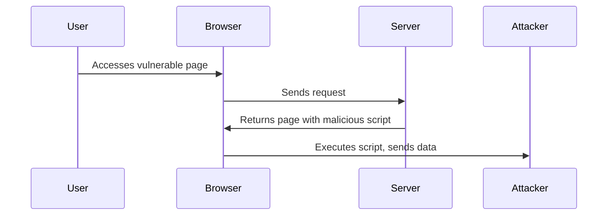
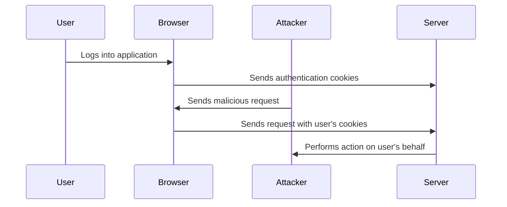

## 23.13. Dealing with Cross-Site Scripting (XSS) and CSRF

As we delve into the realm of web security, two prominent threats stand out: Cross-Site Scripting (XSS) and Cross-Site Request Forgery (CSRF). These vulnerabilities can compromise the integrity and confidentiality of web applications, making it crucial for developers to understand and implement effective prevention strategies. In this section, we'll explore how to secure Elixir applications, particularly those using the Phoenix framework, against these threats.

### Understanding Cross-Site Scripting (XSS)

Cross-Site Scripting (XSS) is a security vulnerability that allows attackers to inject malicious scripts into web pages viewed by other users. These scripts can steal cookies, session tokens, or other sensitive information, and even perform actions on behalf of the user.

#### Types of XSS

1. **Stored XSS**: The malicious script is stored on the server, such as in a database, and executed when a user accesses the affected page.
2. **Reflected XSS**: The injected script is reflected off a web server, such as in an error message or search result, and executed immediately.
3. **DOM-based XSS**: The vulnerability exists in client-side code rather than server-side, manipulating the DOM to execute scripts.

### Preventing XSS

To prevent XSS, it's essential to sanitize and escape user input before rendering it in a web page. Let's explore how to achieve this in Elixir and Phoenix.

#### Escaping Output in Templates

In Phoenix, templates are rendered using EEx (Embedded Elixir), which automatically escapes HTML by default. However, developers must remain vigilant and ensure that all dynamic content is properly escaped.

```elixir
# Example of escaping output in a Phoenix template
<%= @user_input %>
```

In this example, `<%= @user_input %>` escapes any HTML tags in `@user_input`, preventing XSS attacks.

#### Using Safe HTML Libraries

For cases where you need to render HTML safely, consider using libraries like `Phoenix.HTML` to sanitize input:

```elixir
# Using Phoenix.HTML to sanitize input
import Phoenix.HTML

def render_safe_html(input) do
  safe_to_string(input)
end
```

### Defending Against CSRF

Cross-Site Request Forgery (CSRF) is an attack that tricks a user into performing actions on a web application without their consent. This is typically achieved by exploiting the user's authenticated session.

#### Using CSRF Tokens

Phoenix provides built-in protection against CSRF through tokens, which are automatically included in forms and checked on submission.

```elixir
# Example of including CSRF token in a Phoenix form
<%= form_for @changeset, @action, [method: :post], fn f -> %>
  <%= csrf_meta_tag() %>
  <%= text_input f, :name %>
  <%= submit "Submit" %>
<% end %>
```

The `csrf_meta_tag()` function generates a hidden input field containing the CSRF token, ensuring that only forms generated by your application can be submitted.

#### Implementing CSRF Protection in APIs

For APIs, CSRF protection can be implemented by requiring a custom header with each request, ensuring that requests originate from trusted sources.

```elixir
# Example of CSRF protection in a Phoenix API controller
plug :protect_from_forgery, with: :null_session
```

This plug ensures that requests without the correct CSRF token are rejected.

### Securing Cookies

Cookies are often used to store session data, making them a target for attackers. To enhance security, it's crucial to set the appropriate flags on cookies.

#### Setting HTTP-only and Secure Flags

- **HTTP-only**: Prevents client-side scripts from accessing cookies, mitigating the risk of XSS attacks.
- **Secure**: Ensures cookies are only sent over HTTPS, protecting them from being intercepted.

```elixir
# Setting secure and HTTP-only flags in Phoenix
plug Plug.Session,
  store: :cookie,
  key: "_my_app_key",
  signing_salt: "random_salt",
  secure: true,
  http_only: true
```

### Visualizing XSS and CSRF Attacks

To better understand how XSS and CSRF attacks work, let's visualize the process using Mermaid.js diagrams.

#### XSS Attack Flow


```mermaid
sequenceDiagram
    participant User
    participant Browser
    participant Server
    participant Attacker

    User->>Browser: Accesses vulnerable page
    Browser->>Server: Sends request
    Server->>Browser: Returns page with malicious script
    Browser->>Attacker: Executes script, sends data
```

#### CSRF Attack Flow


```mermaid
sequenceDiagram
    participant User
    participant Browser
    participant Attacker
    participant Server

    User->>Browser: Logs into application
    Browser->>Server: Sends authentication cookies
    Attacker->>Browser: Sends malicious request
    Browser->>Server: Sends request with user's cookies
    Server->>Attacker: Performs action on user's behalf
```

### Try It Yourself

To reinforce your understanding, try modifying the following code examples to see how different configurations affect security:

1. **Experiment with Escaping**: Change the `<%= @user_input %>` to `<%= raw @user_input %>` and observe the security implications.
2. **CSRF Token Manipulation**: Remove the `csrf_meta_tag()` from a form and attempt to submit it, noting the server's response.

### References and Links

- [OWASP XSS Prevention Cheat Sheet](https://owasp.org/www-project-cheat-sheets/cheatsheets/Cross_Site_Scripting_Prevention_Cheat_Sheet.html)
- [Phoenix Framework Security Guide](https://hexdocs.pm/phoenix/security.html)
- [MDN Web Docs: Cross-Site Scripting (XSS)](https://developer.mozilla.org/en-US/docs/Glossary/Cross-site_scripting)

### Knowledge Check

1. **What are the three types of XSS?**
2. **How does Phoenix help prevent CSRF attacks by default?**
3. **Why is it important to set the HTTP-only flag on cookies?**

### Embrace the Journey

Remember, securing your application is an ongoing process. As you continue to build and maintain your Elixir applications, keep exploring new security practices and stay updated with the latest threats. The journey to mastering web security is continuous, but with each step, you build more robust and secure systems. Keep experimenting, stay curious, and enjoy the journey!

## Quiz Time!



### What is Cross-Site Scripting (XSS)?

- [x] A vulnerability that allows attackers to inject malicious scripts into web pages
- [ ] A method for securely transmitting data between servers
- [ ] A technique for optimizing database queries
- [ ] A tool for debugging web applications

> **Explanation:** XSS is a vulnerability that allows attackers to inject malicious scripts into web pages viewed by other users.

### Which of the following is NOT a type of XSS?

- [ ] Stored XSS
- [ ] Reflected XSS
- [x] Encrypted XSS
- [ ] DOM-based XSS

> **Explanation:** Encrypted XSS is not a recognized type of XSS attack.

### How does Phoenix automatically protect against XSS?

- [x] By escaping HTML in templates
- [ ] By encrypting all user input
- [ ] By blocking all scripts
- [ ] By requiring user authentication

> **Explanation:** Phoenix automatically escapes HTML in templates to prevent XSS attacks.

### What is the purpose of a CSRF token?

- [x] To ensure that requests originate from trusted sources
- [ ] To encrypt user passwords
- [ ] To optimize server performance
- [ ] To manage user sessions

> **Explanation:** CSRF tokens ensure that requests originate from trusted sources, preventing CSRF attacks.

### How can you secure cookies in a web application?

- [x] By setting HTTP-only and Secure flags
- [ ] By storing them in a database
- [ ] By encrypting them with a public key
- [ ] By using them only in API requests

> **Explanation:** Setting HTTP-only and Secure flags helps protect cookies from XSS and interception.

### What does the `csrf_meta_tag()` function do in Phoenix?

- [x] Generates a hidden input field containing the CSRF token
- [ ] Encrypts form data
- [ ] Validates user credentials
- [ ] Optimizes form submission speed

> **Explanation:** The `csrf_meta_tag()` function generates a hidden input field containing the CSRF token.

### Why is it important to sanitize user input?

- [x] To prevent injection attacks like XSS
- [ ] To improve application performance
- [ ] To enhance user experience
- [ ] To reduce server load

> **Explanation:** Sanitizing user input prevents injection attacks like XSS, enhancing security.

### What is a common method for defending against CSRF in APIs?

- [x] Requiring a custom header with each request
- [ ] Encrypting all API responses
- [ ] Using a single API key for all users
- [ ] Disabling cookies

> **Explanation:** Requiring a custom header with each request helps ensure that requests originate from trusted sources.

### What is the role of the Secure flag in cookies?

- [x] Ensures cookies are only sent over HTTPS
- [ ] Encrypts the cookie data
- [ ] Prevents the cookie from being accessed by JavaScript
- [ ] Increases the cookie's expiration time

> **Explanation:** The Secure flag ensures cookies are only sent over HTTPS, protecting them from interception.

### True or False: CSRF attacks exploit the user's authenticated session to perform actions without their consent.

- [x] True
- [ ] False

> **Explanation:** CSRF attacks exploit the user's authenticated session to perform actions without their consent.


