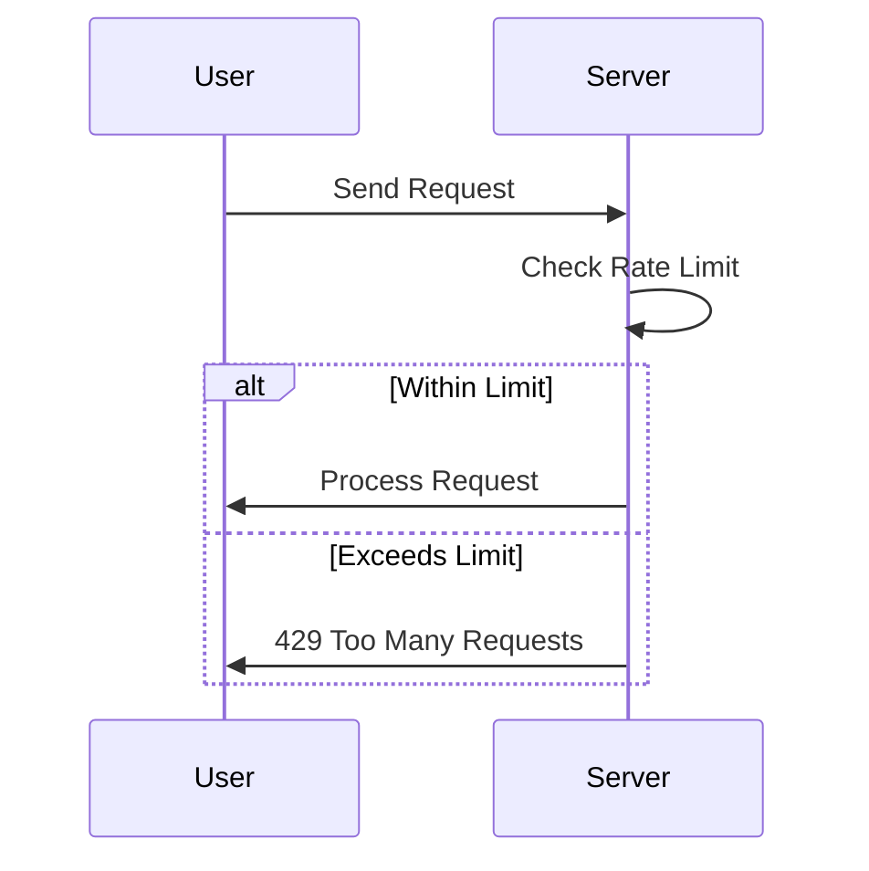

## 23.14. Rate Limiting and Throttling

In today's digital landscape, protecting resources from abuse and ensuring a smooth user experience are paramount. Rate limiting and throttling are crucial techniques employed to manage the flow of requests to a system, preventing potential overloads and safeguarding against Denial of Service (DoS) attacks. In this section, we will delve into the concepts of rate limiting and throttling, explore their implementation in Elixir using libraries like `Hammer`, and discuss how to maintain a positive user experience even when limits are exceeded.

### Understanding Rate Limiting and Throttling

**Rate Limiting** is a technique used to control the number of requests a user can make to a server within a given timeframe. It helps prevent abuse by limiting the frequency of requests, thereby protecting the server from being overwhelmed.

**Throttling** is a related concept that involves controlling the rate at which requests are processed. While rate limiting restricts the number of requests, throttling manages the speed at which requests are handled, ensuring that the system remains responsive.

#### Key Concepts

- **Request Quotas**: Define the maximum number of requests allowed per user or IP address within a specific period.
- **Time Windows**: Specify the duration for which the request quota is applicable (e.g., per minute, per hour).
- **Backoff Strategies**: Implement strategies to handle requests that exceed the limit, such as delaying or rejecting them.
- **User Feedback**: Provide informative responses to users when their requests are throttled or limited.

### Why Rate Limiting and Throttling Matter

Implementing rate limiting and throttling is essential for several reasons:

1. **Security**: Protects against DoS attacks by preventing malicious users from overwhelming the server with requests.
2. **Resource Management**: Ensures that server resources are used efficiently and are available for legitimate users.
3. **Fair Usage**: Guarantees that all users have equal access to resources, preventing any single user from monopolizing the system.
4. **User Experience**: Maintains a responsive system, providing users with timely feedback when limits are exceeded.

### Implementing Rate Limiting in Elixir

Elixir, with its concurrency model and robust ecosystem, provides several tools and libraries for implementing rate limiting. One popular library is `Hammer`, which offers a flexible and efficient way to manage rate limits.

#### Using Hammer for Rate Limiting

`Hammer` is an Elixir library designed for rate limiting. It provides a simple API for defining and enforcing rate limits, making it easy to integrate into your application.

**Installation**

To use `Hammer`, add it to your `mix.exs` dependencies:

```elixir
defp deps do
  [
    {:hammer, "~> 6.0"}
  ]
end
```

Run `mix deps.get` to fetch the library.

**Basic Usage**

Here's a basic example of how to use `Hammer` to implement rate limiting:

```elixir
defmodule MyApp.RateLimiter do
  alias Hammer.Plug

  def call(conn, _opts) do
    case Plug.check_rate("user:#{conn.remote_ip}", 60_000, 100) do
      {:allow, _count} ->
        conn
      {:deny, _limit} ->
        conn
        |> send_resp(429, "Too Many Requests")
        |> halt()
    end
  end
end
```

**Explanation**:

- **`Plug.check_rate/3`**: Checks if the request should be allowed based on the defined rate limit. The parameters are the key (e.g., user IP), the time window in milliseconds (e.g., 60,000 for one minute), and the maximum number of requests allowed.
- **`{:allow, _count}`**: If the request is within the limit, it proceeds.
- **`{:deny, _limit}`**: If the request exceeds the limit, a 429 status code is returned, indicating "Too Many Requests".

**Try It Yourself**

Experiment with different time windows and request limits to see how they affect the behavior of your application. Consider implementing rate limits based on user roles or API keys for more granular control.

### Advanced Rate Limiting Techniques

Beyond basic rate limiting, there are advanced techniques that can be employed to enhance the flexibility and effectiveness of your rate limiting strategy.

#### Sliding Window Algorithm

The sliding window algorithm provides a more accurate representation of request rates by considering a moving time window. This approach smooths out request spikes and provides a fairer distribution of requests over time.

**Implementation Example**

```elixir
defmodule MyApp.SlidingWindowRateLimiter do
  alias Hammer.Plug

  def call(conn, _opts) do
    case Plug.check_rate("user:#{conn.remote_ip}", 60_000, 100, sliding: true) do
      {:allow, _count} ->
        conn
      {:deny, _limit} ->
        conn
        |> send_resp(429, "Too Many Requests")
        |> halt()
    end
  end
end
```

**Explanation**:

- **`sliding: true`**: Enables the sliding window algorithm, providing a more dynamic rate limiting approach.

#### Token Bucket Algorithm

The token bucket algorithm is another popular method for rate limiting. It allows for bursty traffic by accumulating tokens over time, which can be spent when requests are made.

**Implementation Example**

```elixir
defmodule MyApp.TokenBucketRateLimiter do
  alias Hammer.Plug

  def call(conn, _opts) do
    case Plug.check_rate("user:#{conn.remote_ip}", 60_000, 100, algorithm: :token_bucket) do
      {:allow, _count} ->
        conn
      {:deny, _limit} ->
        conn
        |> send_resp(429, "Too Many Requests")
        |> halt()
    end
  end
end
```

**Explanation**:

- **`algorithm: :token_bucket`**: Specifies the use of the token bucket algorithm, allowing for more flexible rate limiting.

### Throttling in Elixir

Throttling involves controlling the rate at which requests are processed, ensuring that the system remains responsive even under heavy load.

#### Implementing Throttling with GenServer

Elixir's `GenServer` can be used to implement throttling by managing the flow of requests and processing them at a controlled rate.

**Example Implementation**

```elixir
defmodule MyApp.Throttler do
  use GenServer

  def start_link(_) do
    GenServer.start_link(__MODULE__, %{}, name: __MODULE__)
  end

  def init(state) do
    {:ok, state}
  end

  def handle_call(:process_request, _from, state) do
    # Simulate processing delay
    :timer.sleep(100)
    {:reply, :ok, state}
  end

  def process_request do
    GenServer.call(__MODULE__, :process_request)
  end
end
```

**Explanation**:

- **`GenServer`**: Manages the state and processing of requests.
- **`handle_call/3`**: Processes requests with a simulated delay, controlling the rate of processing.

**Try It Yourself**

Experiment with different processing delays to see how they affect the responsiveness of your application. Consider implementing dynamic throttling based on system load or user roles.

### User Experience Considerations

While rate limiting and throttling are essential for protecting resources, it's important to maintain a positive user experience. Here are some strategies to achieve this:

1. **Informative Responses**: Provide clear and informative responses when limits are exceeded. Use status codes like 429 (Too Many Requests) and include details about when the user can retry.
2. **Graceful Degradation**: Implement fallback mechanisms to ensure that essential services remain available even when limits are reached.
3. **User Feedback**: Offer feedback mechanisms for users to understand their usage patterns and adjust their behavior accordingly.

### Visualizing Rate Limiting and Throttling

To better understand the flow of rate limiting and throttling, let's visualize the process using a sequence diagram.



**Diagram Explanation**:

- **User**: Initiates a request to the server.
- **Server**: Checks the rate limit for the user.
- **Within Limit**: If the request is within the limit, it is processed.
- **Exceeds Limit**: If the request exceeds the limit, a 429 response is returned.

### References and Further Reading

- [Hammer GitHub Repository](https://github.com/ExHammer/hammer)
- [Elixir Documentation](https://elixir-lang.org/docs.html)
- [Rate Limiting Strategies](https://www.cloudflare.com/learning/bots/what-is-rate-limiting/)

### Knowledge Check

- Explain the difference between rate limiting and throttling.
- Demonstrate how to implement rate limiting using the `Hammer` library.
- Provide an example of how to use the sliding window algorithm for rate limiting.
- Discuss the importance of user experience when implementing rate limiting and throttling.

### Embrace the Journey

Remember, implementing rate limiting and throttling is just one step in building robust and secure applications. As you continue to explore Elixir's capabilities, you'll discover new ways to enhance your systems and provide a seamless user experience. Keep experimenting, stay curious, and enjoy the journey!

## Quiz: Rate Limiting and Throttling



### What is the primary purpose of rate limiting?

- [x] To control the number of requests a user can make to a server within a given timeframe.
- [ ] To increase the speed of request processing.
- [ ] To enhance the user interface design.
- [ ] To manage database connections.

> **Explanation:** Rate limiting is used to control the number of requests a user can make to a server within a given timeframe, preventing abuse and protecting resources.

### Which Elixir library is commonly used for implementing rate limiting?

- [x] Hammer
- [ ] Phoenix
- [ ] Ecto
- [ ] Plug

> **Explanation:** Hammer is a popular Elixir library used for implementing rate limiting.

### What status code is typically returned when a request exceeds the rate limit?

- [x] 429
- [ ] 404
- [ ] 500
- [ ] 200

> **Explanation:** A 429 status code, "Too Many Requests," is typically returned when a request exceeds the rate limit.

### What algorithm allows for bursty traffic by accumulating tokens over time?

- [x] Token Bucket
- [ ] Sliding Window
- [ ] Fixed Window
- [ ] Leaky Bucket

> **Explanation:** The token bucket algorithm allows for bursty traffic by accumulating tokens over time, which can be spent when requests are made.

### How can user experience be maintained when rate limits are exceeded?

- [x] By providing informative responses and implementing fallback mechanisms.
- [ ] By ignoring the rate limits.
- [ ] By increasing the rate limits indefinitely.
- [ ] By shutting down the server.

> **Explanation:** User experience can be maintained by providing informative responses and implementing fallback mechanisms when rate limits are exceeded.

### What is the difference between rate limiting and throttling?

- [x] Rate limiting controls the number of requests, while throttling controls the rate of processing.
- [ ] Rate limiting enhances user interface design, while throttling manages database connections.
- [ ] Rate limiting increases processing speed, while throttling decreases it.
- [ ] Rate limiting and throttling are the same.

> **Explanation:** Rate limiting controls the number of requests a user can make, while throttling controls the rate at which requests are processed.

### Which algorithm provides a more accurate representation of request rates by considering a moving time window?

- [x] Sliding Window
- [ ] Token Bucket
- [ ] Fixed Window
- [ ] Leaky Bucket

> **Explanation:** The sliding window algorithm provides a more accurate representation of request rates by considering a moving time window.

### What is the purpose of the `GenServer` in implementing throttling?

- [x] To manage the flow of requests and process them at a controlled rate.
- [ ] To increase the speed of request processing.
- [ ] To enhance the user interface design.
- [ ] To manage database connections.

> **Explanation:** `GenServer` is used to manage the flow of requests and process them at a controlled rate, implementing throttling.

### What is a key benefit of implementing rate limiting and throttling?

- [x] Protecting against DoS attacks and ensuring fair resource usage.
- [ ] Enhancing the user interface design.
- [ ] Increasing the speed of request processing.
- [ ] Managing database connections.

> **Explanation:** A key benefit of implementing rate limiting and throttling is protecting against DoS attacks and ensuring fair resource usage.

### True or False: Rate limiting and throttling are only necessary for large-scale applications.

- [ ] True
- [x] False

> **Explanation:** Rate limiting and throttling are important for applications of all sizes to protect resources and ensure a smooth user experience.


