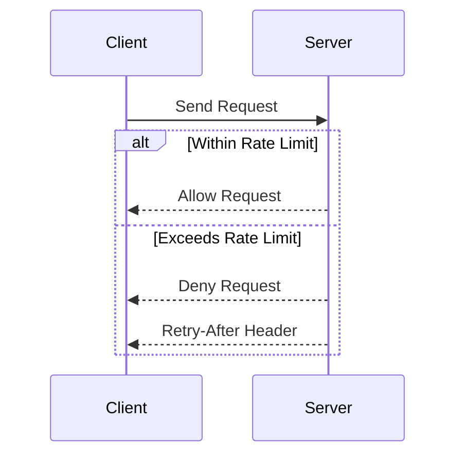

## 23.14. Rate Limiting and Throttling

In today's digital landscape, where applications are accessed by a multitude of users simultaneously, safeguarding resources against misuse and abuse is crucial. Rate limiting and throttling are essential security patterns that help protect your Elixir applications from excessive requests, ensuring stability and availability. This section delves into the concepts, implementation strategies, and best practices for rate limiting and throttling in Elixir, providing you with the tools to enhance both security and user experience.

### Understanding Rate Limiting and Throttling

**Rate Limiting** is a technique used to control the number of requests a user or system can make to a service within a given timeframe. It acts as a gatekeeper, ensuring that resources are not overwhelmed by excessive demand, which could lead to Denial of Service (DoS) attacks or degraded performance.

**Throttling**, on the other hand, refers to the process of regulating the rate at which requests are processed. While rate limiting restricts the number of requests, throttling manages the flow of requests to prevent spikes in demand from affecting system performance.

#### Key Concepts

- **Request Quota**: The maximum number of requests allowed within a specific time period.
- **Time Window**: The duration over which the request quota is measured.
- **Burst Capacity**: The ability to handle a sudden spike in requests beyond the normal rate limit.
- **Backoff Strategy**: The approach used to delay or deny requests when limits are exceeded.

### Why Rate Limiting and Throttling Matter

Rate limiting and throttling are critical for:

- **Preventing Abuse**: Protecting against malicious users or bots that attempt to overwhelm your system.
- **Ensuring Fair Usage**: Distributing resources equitably among users.
- **Maintaining Performance**: Avoiding server overloads that can degrade user experience.
- **Enhancing Security**: Mitigating risks associated with DoS attacks and other threats.

### Implementing Rate Limiting in Elixir

Elixir, with its robust concurrency model and process-based architecture, provides a solid foundation for implementing rate limiting. One popular library for this purpose is `Hammer`, which offers flexible and efficient rate limiting capabilities.

#### Using Hammer for Rate Limiting

`Hammer` is an Elixir library designed to handle rate limiting efficiently. It supports distributed systems and provides various backends for storing rate limit data.

**Installation**

To use `Hammer`, add it to your `mix.exs` dependencies:

```elixir
defp deps do
  [
    {:hammer, "~> 6.0"}
  ]
end
```

**Configuration**

Configure `Hammer` with a backend of your choice. For example, using `Hammer.Backend.ETS`:

```elixir
config :hammer,
  backend: {Hammer.Backend.ETS, []}
```

**Basic Usage**

Here's a simple example of how to use `Hammer` to rate limit requests:

```elixir
defmodule MyApp.RateLimiter do
  alias Hammer

  @bucket "user_requests"
  @limit 100
  @time_window 60_000  # 1 minute in milliseconds

  def check_rate_limit(user_id) do
    case Hammer.check_rate(@bucket, user_id, @limit, @time_window) do
      {:allow, _count} ->
        :ok
      {:deny, _limit} ->
        {:error, :rate_limit_exceeded}
    end
  end
end
```

In this example, we define a rate limit of 100 requests per minute for each user. The `check_rate_limit/1` function checks if the user is within the allowed limit.

### Advanced Rate Limiting Strategies

While basic rate limiting is effective, advanced strategies can provide more nuanced control:

#### Sliding Window Algorithm

The sliding window algorithm smooths out request spikes by continuously updating the count of requests over a moving time window. This approach provides more flexibility compared to fixed windows.

#### Token Bucket Algorithm

The token bucket algorithm allows bursty traffic by maintaining a bucket of tokens. Each request consumes a token, and tokens are replenished at a fixed rate. This method is particularly useful for handling variable traffic patterns.

#### Leaky Bucket Algorithm

The leaky bucket algorithm processes requests at a steady rate, queuing excess requests. It is effective for smoothing out traffic spikes and ensuring consistent request handling.

### Enhancing User Experience

When implementing rate limiting, it's essential to consider user experience. Here are some strategies to achieve this:

- **Informative Responses**: Provide clear messages when rate limits are exceeded, explaining the reason and suggesting next steps.
- **Graceful Degradation**: Implement fallback mechanisms to ensure partial functionality when limits are reached.
- **Retry-After Header**: Use the `Retry-After` HTTP header to inform clients when they can retry their requests.

### Visualizing Rate Limiting and Throttling

To better understand the flow of rate limiting and throttling, let's visualize these concepts using Mermaid.js diagrams.


```mermaid
sequenceDiagram
    participant Client
    participant Server
    Client->>Server: Send Request
    alt Within Rate Limit
        Server-->>Client: Allow Request
    else Exceeds Rate Limit
        Server-->>Client: Deny Request
        Server-->>Client: Retry-After Header
    end
```

**Diagram Description**: This sequence diagram illustrates the interaction between a client and a server with rate limiting in place. The server either allows or denies requests based on the rate limit, providing a `Retry-After` header when the limit is exceeded.

### Code Examples and Try It Yourself

Let's explore more code examples to solidify your understanding of rate limiting and throttling in Elixir.

**Example: Sliding Window Rate Limiting**

```elixir
defmodule MyApp.SlidingWindowRateLimiter do
  alias Hammer

  @bucket "sliding_window"
  @limit 50
  @time_window 60_000  # 1 minute in milliseconds

  def check_rate_limit(user_id) do
    case Hammer.check_rate(@bucket, user_id, @limit, @time_window) do
      {:allow, _count} ->
        :ok
      {:deny, _limit} ->
        {:error, :rate_limit_exceeded}
    end
  end
end
```

**Try It Yourself**

- Modify the `@limit` and `@time_window` values to experiment with different rate limits.
- Implement a token bucket algorithm using a similar approach.

### Best Practices for Rate Limiting and Throttling

- **Monitor and Adjust**: Continuously monitor request patterns and adjust rate limits as needed to balance security and user experience.
- **Use Distributed Backends**: For scalability, use distributed backends like Redis or Mnesia to store rate limit data across multiple nodes.
- **Implement Backoff Strategies**: Use exponential backoff or other strategies to handle retries gracefully.

### Elixir's Unique Features for Rate Limiting

Elixir's concurrency model and lightweight processes make it particularly well-suited for implementing rate limiting and throttling. The ability to spawn thousands of processes allows you to handle concurrent requests efficiently.

### Differences and Similarities with Other Patterns

Rate limiting and throttling are often confused with load balancing. While both aim to manage traffic, rate limiting focuses on restricting requests, whereas load balancing distributes requests across multiple servers.

### Knowledge Check

- What is the primary difference between rate limiting and throttling?
- How does the token bucket algorithm handle bursty traffic?
- Why is it important to provide informative responses when rate limits are exceeded?

### Summary and Key Takeaways

Rate limiting and throttling are essential patterns for protecting your Elixir applications from abuse and ensuring a smooth user experience. By implementing these techniques, you can safeguard resources, maintain performance, and enhance security.

Remember, this is just the beginning. As you progress, you'll build more resilient and scalable systems. Keep experimenting, stay curious, and enjoy the journey!

## Quiz Time!



### What is the primary purpose of rate limiting?

- [x] To control the number of requests a user can make to a service
- [ ] To distribute requests across multiple servers
- [ ] To encrypt user data
- [ ] To cache responses for faster access

> **Explanation:** Rate limiting is used to control the number of requests a user can make to a service within a given timeframe, preventing abuse and maintaining performance.


### Which algorithm allows bursty traffic by maintaining a bucket of tokens?

- [ ] Sliding Window
- [x] Token Bucket
- [ ] Leaky Bucket
- [ ] Exponential Backoff

> **Explanation:** The token bucket algorithm allows bursty traffic by maintaining a bucket of tokens, where each request consumes a token, and tokens are replenished at a fixed rate.


### What is the role of the `Retry-After` HTTP header in rate limiting?

- [x] To inform clients when they can retry their requests
- [ ] To encrypt the request payload
- [ ] To log the request details
- [ ] To authenticate the user

> **Explanation:** The `Retry-After` HTTP header is used to inform clients when they can retry their requests after exceeding the rate limit.


### Which Elixir library is commonly used for implementing rate limiting?

- [ ] Phoenix
- [x] Hammer
- [ ] Ecto
- [ ] Plug

> **Explanation:** `Hammer` is a popular Elixir library used for implementing rate limiting with various backends for storing rate limit data.


### What is a key benefit of using distributed backends for rate limiting?

- [x] Scalability
- [ ] Simplicity
- [ ] Faster compilation
- [ ] Code readability

> **Explanation:** Using distributed backends like Redis or Mnesia for rate limiting provides scalability by allowing rate limit data to be stored across multiple nodes.


### How does the sliding window algorithm differ from fixed window rate limiting?

- [x] It continuously updates the count of requests over a moving time window
- [ ] It maintains a bucket of tokens for bursty traffic
- [ ] It processes requests at a steady rate
- [ ] It uses exponential backoff for retries

> **Explanation:** The sliding window algorithm continuously updates the count of requests over a moving time window, providing more flexibility compared to fixed windows.


### What is the primary goal of throttling in an application?

- [x] To regulate the rate at which requests are processed
- [ ] To encrypt data in transit
- [ ] To log user activity
- [ ] To authenticate users

> **Explanation:** Throttling regulates the rate at which requests are processed, managing the flow of requests to prevent spikes from affecting performance.


### Why is it important to monitor request patterns when implementing rate limiting?

- [x] To adjust rate limits as needed for optimal balance
- [ ] To encrypt user data
- [ ] To log user activities
- [ ] To authenticate users

> **Explanation:** Monitoring request patterns allows you to adjust rate limits as needed to balance security and user experience effectively.


### What is the main advantage of Elixir's concurrency model for rate limiting?

- [x] Efficient handling of concurrent requests
- [ ] Faster compilation times
- [ ] Improved code readability
- [ ] Simplified syntax

> **Explanation:** Elixir's concurrency model and lightweight processes enable efficient handling of concurrent requests, making it well-suited for implementing rate limiting.


### Rate limiting and throttling are often confused with which other pattern?

- [x] Load balancing
- [ ] Caching
- [ ] Authentication
- [ ] Encryption

> **Explanation:** Rate limiting and throttling are often confused with load balancing, which focuses on distributing requests across multiple servers, unlike rate limiting which restricts requests.




