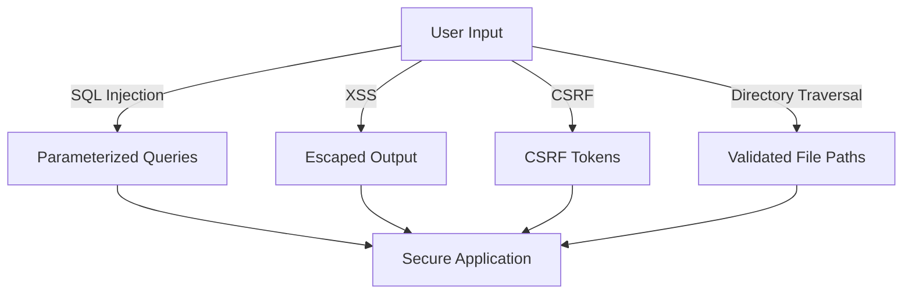

## 23.2. Protecting Against Common Vulnerabilities

In the world of software development, security is paramount. As expert software engineers and architects, it's crucial to understand and mitigate common vulnerabilities that can compromise your Elixir applications. This section will guide you through protecting against SQL Injection, Cross-Site Scripting (XSS), Cross-Site Request Forgery (CSRF), and Directory Traversal. We'll explore each vulnerability, demonstrate how they can be exploited, and provide practical solutions to safeguard your applications.

### SQL Injection

SQL Injection is a code injection technique that exploits vulnerabilities in an application's software by inserting malicious SQL statements into an entry field for execution. This can lead to unauthorized access to sensitive data, data corruption, or even complete control over the database.

#### Understanding SQL Injection

SQL Injection occurs when user input is directly included in SQL queries without proper validation or escaping. Consider the following example:

```elixir
def get_user_by_username(username) do
  query = "SELECT * FROM users WHERE username = '#{username}'"
  Ecto.Adapters.SQL.query!(Repo, query, [])
end
```

In this example, if a user enters `admin' OR '1'='1` as the username, the query becomes:

```sql
SELECT * FROM users WHERE username = 'admin' OR '1'='1'
```

This query will return all users because the condition `'1'='1'` is always true.

#### Preventing SQL Injection with Ecto

To prevent SQL Injection, always use parameterized queries. Ecto, Elixir's database wrapper and query generator, provides a safe way to construct queries using parameters:

```elixir
def get_user_by_username(username) do
  from(u in User, where: u.username == ^username)
  |> Repo.one()
end
```

In this example, the `^username` syntax ensures that the input is treated as a parameter, not as part of the SQL query, effectively preventing SQL Injection.

#### Try It Yourself

Experiment with the code by modifying the `username` input and observe how Ecto safely handles the input without executing malicious SQL.

### Cross-Site Scripting (XSS)

Cross-Site Scripting (XSS) is a vulnerability that allows attackers to inject malicious scripts into web pages viewed by other users. These scripts can steal cookies, session tokens, or other sensitive information.

#### Understanding XSS

XSS vulnerabilities occur when an application includes untrusted data in a web page without proper validation or escaping. Consider the following example:

```elixir
def render_user_profile(conn, %{"username" => username}) do
  html = "<h1>Welcome, #{username}!</h1>"
  send_resp(conn, 200, html)
end
```

If a user enters `<script>alert('XSS')</script>` as the username, the script will execute in the browser, leading to an XSS attack.

#### Preventing XSS by Escaping User Input

To prevent XSS, always escape user input before including it in HTML. Phoenix, Elixir's web framework, automatically escapes user input in templates:

```elixir
<%= @username %>
```

In this example, Phoenix will escape any HTML tags in `@username`, preventing XSS attacks.

#### Try It Yourself

Modify the `username` input with HTML tags and observe how Phoenix escapes the input, rendering it safe.

### Cross-Site Request Forgery (CSRF)

Cross-Site Request Forgery (CSRF) is an attack that tricks a user into performing actions they did not intend to perform. This can lead to unauthorized actions, such as changing account details or making purchases.

#### Understanding CSRF

CSRF attacks occur when an attacker tricks a user into submitting a request to a web application where the user is authenticated. For example, an attacker could create a form on their website that submits a request to change the user's email address on another site.

#### Preventing CSRF with Tokens

To prevent CSRF, use CSRF tokens in forms. Phoenix provides built-in support for CSRF protection:

```elixir
<%= form_for @changeset, @action, [csrf_token: true], fn f -> %>
  <%= text_input f, :email %>
  <%= submit "Change Email" %>
<% end %>
```

Phoenix automatically includes a CSRF token in the form, which is validated on submission to ensure the request is legitimate.

#### Try It Yourself

Create a form with and without CSRF tokens and observe how Phoenix handles requests, rejecting those without valid tokens.

### Directory Traversal

Directory Traversal is a vulnerability that allows attackers to access files and directories outside the intended scope. This can lead to unauthorized access to sensitive files, such as configuration files or source code.

#### Understanding Directory Traversal

Directory Traversal occurs when user input is used to construct file paths without proper validation. Consider the following example:

```elixir
def read_file(filename) do
  File.read!("uploads/#{filename}")
end
```

If a user enters `../../etc/passwd` as the filename, the application will read the `/etc/passwd` file, leading to a Directory Traversal attack.

#### Preventing Directory Traversal by Validating File Paths

To prevent Directory Traversal, validate and sanitize file paths. Use functions like `Path.expand/1` to ensure the path is within the allowed directory:

```elixir
def read_file(filename) do
  base_path = Path.expand("uploads")
  file_path = Path.expand("uploads/#{filename}")

  if String.starts_with?(file_path, base_path) do
    File.read!(file_path)
  else
    {:error, :invalid_path}
  end
end
```

In this example, the code ensures that the file path is within the `uploads` directory, preventing Directory Traversal.

#### Try It Yourself

Experiment with different file paths and observe how the application handles invalid paths, preventing unauthorized access.

### Visualizing Vulnerability Protection

To better understand how these protections work, let's visualize the process of securing an application against these vulnerabilities using a flowchart.



**Figure 1: Visualizing Protection Against Common Vulnerabilities**

This flowchart illustrates how different types of user input are processed securely to protect against common vulnerabilities.

### References and Further Reading

- [OWASP Top Ten](https://owasp.org/www-project-top-ten/)
- [Ecto Documentation](https://hexdocs.pm/ecto/Ecto.html)
- [Phoenix Framework Documentation](https://hexdocs.pm/phoenix/Phoenix.html)

### Knowledge Check

- What is SQL Injection, and how can it be prevented in Elixir applications?
- How does Phoenix automatically protect against XSS in templates?
- Why are CSRF tokens important, and how are they implemented in Phoenix?
- What is Directory Traversal, and how can it be mitigated in Elixir applications?

### Embrace the Journey

Remember, security is an ongoing process. As you build and maintain your Elixir applications, continue to stay informed about new vulnerabilities and best practices. Keep experimenting, stay curious, and enjoy the journey of creating secure and robust software!

## Quiz: Protecting Against Common Vulnerabilities



### What is the primary method to prevent SQL Injection in Elixir applications?

- [x] Using parameterized queries with Ecto
- [ ] Escaping user input manually
- [ ] Disabling user input
- [ ] Using raw SQL queries

> **Explanation:** Parameterized queries ensure that user input is treated as data, not executable code, preventing SQL Injection.

### How does Phoenix protect against XSS in templates?

- [x] By automatically escaping user input
- [ ] By disabling JavaScript
- [ ] By using raw HTML
- [ ] By filtering out all user input

> **Explanation:** Phoenix automatically escapes user input in templates, preventing malicious scripts from executing.

### What is the purpose of CSRF tokens in forms?

- [x] To validate that the request is legitimate
- [ ] To encrypt form data
- [ ] To speed up form submission
- [ ] To store user preferences

> **Explanation:** CSRF tokens ensure that the form submission is from an authenticated user and not a malicious source.

### How can Directory Traversal be prevented in Elixir applications?

- [x] By validating and sanitizing file paths
- [ ] By allowing all file paths
- [ ] By using absolute paths only
- [ ] By disabling file uploads

> **Explanation:** Validating and sanitizing file paths ensures that users cannot access files outside the intended directory.

### Which of the following is a common vulnerability in web applications?

- [x] SQL Injection
- [x] Cross-Site Scripting (XSS)
- [ ] Fast Loading
- [ ] Responsive Design

> **Explanation:** SQL Injection and XSS are common vulnerabilities that need to be addressed in web applications.

### What does the `^` symbol represent in Ecto queries?

- [x] A parameterized query
- [ ] A raw SQL query
- [ ] A comment
- [ ] A function call

> **Explanation:** The `^` symbol is used to indicate a parameterized query in Ecto, preventing SQL Injection.

### Why is it important to escape user input in web applications?

- [x] To prevent XSS attacks
- [ ] To improve performance
- [x] To ensure data integrity
- [ ] To reduce server load

> **Explanation:** Escaping user input prevents XSS attacks and ensures that data is displayed safely and correctly.

### What is a potential consequence of a successful CSRF attack?

- [x] Unauthorized actions performed by the user
- [ ] Faster page loading
- [ ] Improved user experience
- [ ] Enhanced security

> **Explanation:** CSRF attacks can lead to unauthorized actions being performed on behalf of the user.

### How does the `Path.expand/1` function help prevent Directory Traversal?

- [x] By ensuring the file path is within the allowed directory
- [ ] By encrypting file paths
- [ ] By deleting unauthorized files
- [ ] By creating new directories

> **Explanation:** `Path.expand/1` ensures that the file path is within the allowed directory, preventing unauthorized access.

### True or False: Security is a one-time process that does not require ongoing attention.

- [ ] True
- [x] False

> **Explanation:** Security is an ongoing process that requires continuous monitoring and updating to protect against new vulnerabilities.


