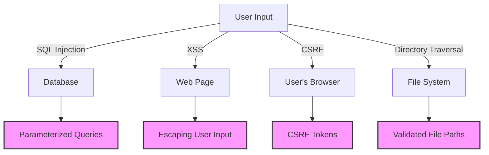

## 23.2. Protecting Against Common Vulnerabilities

In today's digital landscape, security is paramount. As expert software engineers and architects, it's crucial to be vigilant against common vulnerabilities that can compromise the integrity, confidentiality, and availability of your applications. In this section, we'll delve into protecting Elixir applications from common vulnerabilities such as SQL Injection, Cross-Site Scripting (XSS), Cross-Site Request Forgery (CSRF), and Directory Traversal. We'll explore the nature of these vulnerabilities, how they can affect your applications, and the best practices for mitigating them using Elixir's robust features.

### SQL Injection

SQL Injection is a critical vulnerability that occurs when an attacker is able to manipulate SQL queries by injecting malicious input. This can lead to unauthorized access to your database, data leakage, or even data loss. In Elixir, we primarily use Ecto, a database wrapper and query generator, to interact with databases. 

#### Using Parameterized Queries with Ecto

Ecto provides a safe way to construct SQL queries using parameterized queries, which automatically escape user input, preventing SQL injection attacks.

**Example of a Vulnerable Query:**

```elixir
def get_user_by_email(email) do
  query = "SELECT * FROM users WHERE email = '#{email}'"
  Ecto.Adapters.SQL.query!(Repo, query)
end
```

In this example, if `email` contains malicious SQL code, it could be executed on the database.

**Safe Query Using Ecto:**

```elixir
def get_user_by_email(email) do
  from(u in User, where: u.email == ^email)
  |> Repo.one()
end
```

Here, the `^` operator is used to interpolate the `email` variable safely into the query, preventing injection.

#### Try It Yourself

Experiment by modifying the `get_user_by_email/1` function to handle different user inputs and observe how Ecto prevents SQL injection.

### Cross-Site Scripting (XSS)

XSS vulnerabilities occur when an attacker injects malicious scripts into content that is then served to other users. These scripts can steal cookies, session tokens, or other sensitive data.

#### Escaping User Input in Templates

Phoenix, the web framework for Elixir, automatically escapes user input in templates. However, it's important to be aware of scenarios where manual escaping might be necessary.

**Example of Escaping User Input:**

```elixir
<%= @user_input %>
```

Phoenix automatically escapes `@user_input`, preventing XSS attacks.

**Manual Escaping:**

```elixir
<%= raw(@user_input) %>
```

Use `raw/1` cautiously, as it disables automatic escaping.

#### Try It Yourself

Create a Phoenix template and experiment with different user inputs to see how escaping works. Modify the template to use `raw/1` and observe the differences.

### Cross-Site Request Forgery (CSRF)

CSRF attacks occur when a malicious website tricks a user's browser into performing actions on another site where the user is authenticated.

#### Implementing CSRF Tokens in Forms

Phoenix provides built-in support for CSRF protection by automatically including CSRF tokens in forms.

**Example of a Form with CSRF Protection:**

```elixir
<%= form_for @changeset, user_path(@conn, :create), fn f -> %>
  <%= hidden_input f, :csrf_token, value: Plug.CSRFProtection.get_csrf_token() %>
  <%= text_input f, :name %>
  <%= submit "Submit" %>
<% end %>
```

The `form_for/4` helper automatically includes the CSRF token, ensuring requests are legitimate.

#### Try It Yourself

Create a form in a Phoenix application and inspect the HTML to see the CSRF token. Try submitting the form from another domain and observe how Phoenix handles it.

### Directory Traversal

Directory Traversal vulnerabilities occur when an attacker can access files outside the intended directory by manipulating file paths.

#### Validating File Paths and Inputs

Ensure that file paths are validated and sanitized before use. Avoid using user input directly in file paths.

**Example of Vulnerable Code:**

```elixir
def read_file(file_path) do
  File.read(file_path)
end
```

If `file_path` is manipulated, it could access unauthorized files.

**Safe File Access:**

```elixir
def read_file(file_name) do
  base_path = "/safe/directory/"
  File.read(Path.join(base_path, Path.basename(file_name)))
end
```

By using `Path.basename/1`, we ensure that only the file name is used, preventing directory traversal.

#### Try It Yourself

Implement a file reading function and test it with different inputs. Observe how using `Path.basename/1` prevents unauthorized access.

### Visualizing Vulnerabilities and Protections


```mermaid
flowchart TD
    A[User Input] -->|SQL Injection| B[Database]
    A -->|XSS| C[Web Page]
    A -->|CSRF| D[User's Browser]
    A -->|Directory Traversal| E[File System]

    B --> F[Parameterized Queries]
    C --> G[Escaping User Input]
    D --> H[CSRF Tokens]
    E --> I[Validated File Paths]

    style F fill:#f9f,stroke:#333,stroke-width:2px
    style G fill:#f9f,stroke:#333,stroke-width:2px
    style H fill:#f9f,stroke:#333,stroke-width:2px
    style I fill:#f9f,stroke:#333,stroke-width:2px
```

**Diagram Description:** This flowchart illustrates how user input can lead to different types of vulnerabilities and how each can be mitigated using specific protections.

### References and Links

- [OWASP SQL Injection](https://owasp.org/www-community/attacks/SQL_Injection)
- [OWASP XSS](https://owasp.org/www-community/attacks/xss/)
- [OWASP CSRF](https://owasp.org/www-community/attacks/csrf)
- [OWASP Directory Traversal](https://owasp.org/www-community/attacks/Path_Traversal)

### Knowledge Check

- What are the key differences between SQL Injection and XSS?
- How does Phoenix help in preventing CSRF attacks?
- Why is it important to validate file paths in Elixir applications?

### Embrace the Journey

Remember, security is an ongoing process. As you continue to develop applications, stay informed about new vulnerabilities and best practices. Keep experimenting, stay curious, and enjoy the journey of building secure applications!

### Quiz Time!



### What is the primary method to prevent SQL Injection in Elixir using Ecto?

- [x] Parameterized queries
- [ ] String concatenation
- [ ] Dynamic SQL
- [ ] Inline SQL queries

> **Explanation:** Parameterized queries ensure that user input is safely incorporated into SQL statements, preventing injection attacks.

### How does Phoenix automatically protect against XSS?

- [x] By escaping user input in templates
- [ ] By blocking all scripts
- [ ] By using a firewall
- [ ] By encrypting the data

> **Explanation:** Phoenix escapes user input in templates to prevent malicious scripts from being executed in the browser.

### What is the role of a CSRF token in web forms?

- [x] To verify the request's legitimacy
- [ ] To encrypt the form data
- [ ] To validate user credentials
- [ ] To log user actions

> **Explanation:** CSRF tokens are used to ensure that the request is coming from an authenticated user and not from a malicious source.

### Which function helps prevent directory traversal in Elixir?

- [x] Path.basename/1
- [ ] File.read/1
- [ ] String.trim/1
- [ ] Enum.map/2

> **Explanation:** `Path.basename/1` ensures that only the file name is used, preventing directory traversal attacks.

### What is a common vulnerability that occurs when an attacker can manipulate SQL queries?

- [x] SQL Injection
- [ ] XSS
- [ ] CSRF
- [ ] Directory Traversal

> **Explanation:** SQL Injection occurs when an attacker can manipulate SQL queries to gain unauthorized access or perform malicious actions.

### In which scenario might you need to manually escape user input in Phoenix?

- [x] When using raw/1 in templates
- [ ] When using form_for/4
- [ ] When using Repo.one/1
- [ ] When using Enum.map/2

> **Explanation:** Using `raw/1` disables automatic escaping, so manual escaping is necessary to prevent XSS.

### What is the main purpose of escaping user input in web applications?

- [x] To prevent XSS attacks
- [ ] To enhance performance
- [ ] To improve user experience
- [ ] To compress data

> **Explanation:** Escaping user input prevents malicious scripts from being executed, protecting against XSS attacks.

### Which vulnerability involves tricking a user's browser into performing actions on another site?

- [x] CSRF
- [ ] SQL Injection
- [ ] XSS
- [ ] Directory Traversal

> **Explanation:** CSRF attacks involve tricking a user's browser into performing actions on another site where the user is authenticated.

### How does Ecto help in preventing SQL Injection?

- [x] By using parameterized queries
- [ ] By encrypting all data
- [ ] By using dynamic SQL
- [ ] By blocking all user input

> **Explanation:** Ecto uses parameterized queries to safely incorporate user input into SQL statements, preventing injection attacks.

### True or False: Directory traversal vulnerabilities can be prevented by validating file paths.

- [x] True
- [ ] False

> **Explanation:** Validating file paths ensures that only authorized files are accessed, preventing directory traversal attacks.


