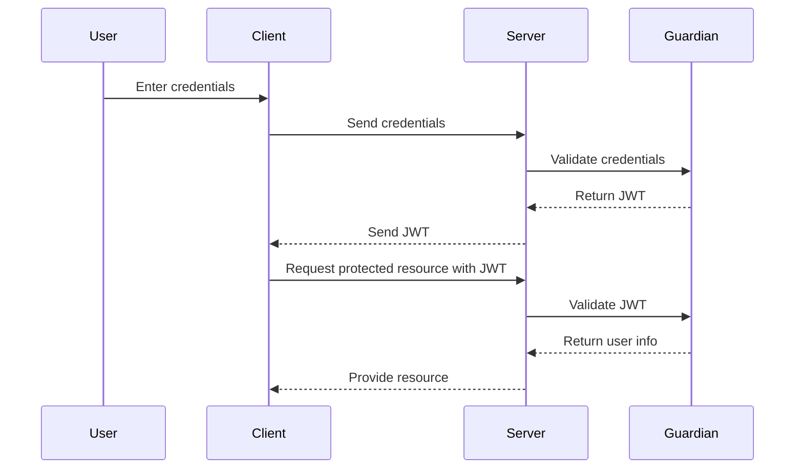

## 23.3. Authentication and Authorization with Guardian

In the world of web applications, ensuring secure access to resources is paramount. Elixir, with its robust ecosystem, offers Guardian—a library that simplifies authentication and authorization using JSON Web Tokens (JWT). In this guide, we'll delve into setting up JWT-based authentication with Guardian, defining permissions, managing sessions, and adhering to best practices for secure applications.

### User Authentication

Authentication is the process of verifying the identity of a user. In modern web applications, JWTs are a popular choice for implementing stateless authentication. Guardian is an Elixir library that facilitates JWT-based authentication, providing a flexible and secure way to manage user sessions.

#### Setting Up JWT-based Authentication with Guardian

To begin, let's set up Guardian in an Elixir project. We'll walk through the installation, configuration, and implementation of a basic authentication system.

##### Step 1: Install Guardian

Add Guardian to your `mix.exs` dependencies:

```elixir
defp deps do
  [
    {:guardian, "~> 2.0"}
  ]
end
```

Run `mix deps.get` to fetch the dependency.

##### Step 2: Configure Guardian

Create a Guardian module to define your authentication logic. This module will implement the `Guardian` behavior, which requires defining several callbacks.

```elixir
defmodule MyApp.Guardian do
  use Guardian, otp_app: :my_app

  def subject_for_token(resource, _claims) do
    # You can use any identifier for the subject
    {:ok, to_string(resource.id)}
  end

  def resource_from_claims(claims) do
    # Here you would fetch the resource from the database
    id = claims["sub"]
    resource = MyApp.Repo.get(MyApp.User, id)
    {:ok, resource}
  end
end
```

In your `config/config.exs`, add the Guardian configuration:

```elixir
config :my_app, MyApp.Guardian,
  issuer: "my_app",
  secret_key: "your_secret_key"
```

##### Step 3: Implement Authentication Logic

Create a controller to handle user login and token generation.

```elixir
defmodule MyAppWeb.SessionController do
  use MyAppWeb, :controller

  alias MyApp.{Repo, User}
  alias MyApp.Guardian

  def create(conn, %{"email" => email, "password" => password}) do
    user = Repo.get_by(User, email: email)

    case check_password(user, password) do
      true ->
        {:ok, token, _claims} = Guardian.encode_and_sign(user)
        json(conn, %{token: token})

      false ->
        conn
        |> put_status(:unauthorized)
        |> json(%{error: "Invalid credentials"})
    end
  end

  defp check_password(nil, _), do: false
  defp check_password(user, password), do: Bcrypt.check_pass(user, password)
end
```

##### Step 4: Protect Routes

Use Guardian's `Plug` to protect routes that require authentication.

```elixir
defmodule MyAppWeb.Router do
  use MyAppWeb, :router

  pipeline :api do
    plug :accepts, ["json"]
  end

  pipeline :auth do
    plug Guardian.Plug.Pipeline, module: MyApp.Guardian,
                                  error_handler: MyAppWeb.AuthErrorHandler
  end

  scope "/api", MyAppWeb do
    pipe_through [:api, :auth]

    get "/protected", ProtectedController, :index
  end
end
```

### Authorization

Authorization determines what an authenticated user can do. With Guardian, you can define permissions and access controls to ensure users have the appropriate access to resources.

#### Defining Permissions and Access Controls

Permissions can be managed using roles or specific claims within the JWT. Let's explore how to implement role-based access control (RBAC) with Guardian.

##### Step 1: Define Roles

Add a `role` field to your user schema to store user roles.

```elixir
defmodule MyApp.User do
  use Ecto.Schema
  import Ecto.Changeset

  schema "users" do
    field :email, :string
    field :password_hash, :string
    field :role, :string, default: "user"
    timestamps()
  end

  def changeset(user, attrs) do
    user
    |> cast(attrs, [:email, :password, :role])
    |> validate_required([:email, :password])
    |> unique_constraint(:email)
  end
end
```

##### Step 2: Implement Role-based Access Control

Modify the `Guardian` module to include roles in the token claims.

```elixir
defmodule MyApp.Guardian do
  use Guardian, otp_app: :my_app

  def subject_for_token(resource, _claims) do
    {:ok, to_string(resource.id)}
  end

  def resource_from_claims(claims) do
    id = claims["sub"]
    resource = MyApp.Repo.get(MyApp.User, id)
    {:ok, resource}
  end

  def build_claims(claims, resource, _opts) do
    claims
    |> Map.put("role", resource.role)
  end
end
```

##### Step 3: Authorize Requests

Create a plug to check user roles before processing requests.

```elixir
defmodule MyAppWeb.Plugs.Authorize do
  import Plug.Conn
  alias MyApp.Guardian

  def init(default), do: default

  def call(conn, required_role) do
    user = Guardian.Plug.current_resource(conn)

    if user.role == required_role do
      conn
    else
      conn
      |> put_status(:forbidden)
      |> json(%{error: "Forbidden"})
      |> halt()
    end
  end
end
```

Use the plug in your router to protect routes based on roles.

```elixir
scope "/admin", MyAppWeb do
  pipe_through [:api, :auth]

  get "/dashboard", AdminController, :index
  plug MyAppWeb.Plugs.Authorize, "admin"
end
```

### Session Management

Managing user sessions securely is crucial for maintaining the integrity of your application. With JWTs, sessions are stateless, meaning the server does not store session information. Instead, the token itself contains all the necessary data.

#### Securely Managing User Sessions

To manage sessions securely, consider the following best practices:

- **Use HTTPS**: Always transmit tokens over HTTPS to prevent interception.
- **Set Token Expiry**: Define a reasonable expiry time for tokens to limit the window of opportunity for misuse.
- **Implement Token Revocation**: Provide a mechanism to revoke tokens when necessary, such as when a user logs out or changes their password.
- **Use Refresh Tokens**: Issue refresh tokens to allow users to obtain new access tokens without re-authenticating.

### Best Practices

Implementing best practices ensures your authentication and authorization system is secure and robust.

#### Storing Passwords Securely with Hashing Algorithms

Never store passwords in plain text. Use a strong hashing algorithm like Bcrypt to hash passwords before storing them in the database.

```elixir
defmodule MyApp.User do
  use Ecto.Schema
  import Ecto.Changeset
  alias Bcrypt

  schema "users" do
    field :email, :string
    field :password_hash, :string
    field :role, :string, default: "user"
    timestamps()
  end

  def changeset(user, attrs) do
    user
    |> cast(attrs, [:email, :password, :role])
    |> validate_required([:email, :password])
    |> unique_constraint(:email)
    |> put_password_hash()
  end

  defp put_password_hash(changeset) do
    if password = get_change(changeset, :password) do
      put_change(changeset, :password_hash, Bcrypt.hash_pwd_salt(password))
    else
      changeset
    end
  end
end
```

### Visualizing Authentication and Authorization Flow

To better understand the flow of authentication and authorization, let's visualize the process using a sequence diagram.



This diagram illustrates the interaction between the user, client, server, and Guardian during the authentication and authorization process.

### Try It Yourself

To solidify your understanding, try modifying the code examples:

- **Add a new role**: Implement a new role, such as "editor", and create routes that only editors can access.
- **Implement token revocation**: Add functionality to revoke tokens when a user logs out.
- **Enhance security**: Experiment with different hashing algorithms and token expiry times.

### Knowledge Check

- What is the purpose of the `subject_for_token` function in the Guardian module?
- How can you implement role-based access control with Guardian?
- Why is it important to use HTTPS when transmitting JWTs?
- What are the benefits of using refresh tokens?

### Summary

In this guide, we've explored how to implement authentication and authorization in Elixir using Guardian. By setting up JWT-based authentication, defining permissions, managing sessions, and following best practices, you can build secure and robust applications. Remember, security is an ongoing process, and staying informed about the latest practices is crucial.

## Quiz: Authentication and Authorization with Guardian



### What is the primary purpose of Guardian in Elixir applications?

- [x] To facilitate JWT-based authentication and authorization
- [ ] To manage database connections
- [ ] To handle HTTP requests
- [ ] To perform data serialization

> **Explanation:** Guardian is a library used for implementing JWT-based authentication and authorization in Elixir applications.

### Which function in the Guardian module is responsible for generating the subject for a token?

- [x] `subject_for_token`
- [ ] `resource_from_claims`
- [ ] `build_claims`
- [ ] `encode_and_sign`

> **Explanation:** The `subject_for_token` function is used to generate the subject for a token, typically using a unique identifier for the resource.

### How can you protect routes in a Phoenix application using Guardian?

- [x] By using Guardian's Plug in the router
- [ ] By encrypting the routes
- [ ] By using a firewall
- [ ] By implementing custom middleware

> **Explanation:** Guardian's Plug can be used in the Phoenix router to protect routes that require authentication.

### What is a key benefit of using JWTs for authentication?

- [x] Statelessness
- [ ] Requires server-side session storage
- [ ] Increases server load
- [ ] Requires frequent database queries

> **Explanation:** JWTs are stateless, meaning the server does not need to store session information, reducing server load.

### What is the role of the `resource_from_claims` function in Guardian?

- [x] To retrieve the resource from the claims in the token
- [ ] To generate the token
- [ ] To validate the token
- [ ] To encrypt the claims

> **Explanation:** The `resource_from_claims` function retrieves the resource (e.g., user) from the claims present in the token.

### Why is it important to use a hashing algorithm like Bcrypt for passwords?

- [x] To securely store passwords by hashing them
- [ ] To encrypt passwords for transmission
- [ ] To compress passwords for storage
- [ ] To convert passwords to plain text

> **Explanation:** Bcrypt is used to hash passwords securely before storing them in the database, preventing plain text storage.

### What is a recommended practice for managing JWT expiry?

- [x] Set a reasonable expiry time for tokens
- [ ] Never expire tokens
- [ ] Use tokens without expiry
- [ ] Expire tokens every minute

> **Explanation:** Setting a reasonable expiry time for tokens limits the window of opportunity for misuse.

### How can you implement role-based access control with Guardian?

- [x] By including roles in the token claims
- [ ] By storing roles in the session
- [ ] By using a separate authorization server
- [ ] By encrypting role information

> **Explanation:** Roles can be included in the token claims, allowing for role-based access control.

### What is the purpose of using refresh tokens?

- [x] To allow users to obtain new access tokens without re-authenticating
- [ ] To store user passwords
- [ ] To encrypt user data
- [ ] To manage user sessions on the server

> **Explanation:** Refresh tokens allow users to obtain new access tokens without re-authenticating, extending session duration.

### True or False: JWTs should always be transmitted over HTTP.

- [ ] True
- [x] False

> **Explanation:** JWTs should always be transmitted over HTTPS to prevent interception and ensure secure communication.



Remember, this is just the beginning. As you progress, you'll build more complex and secure applications. Keep experimenting, stay curious, and enjoy the journey!
