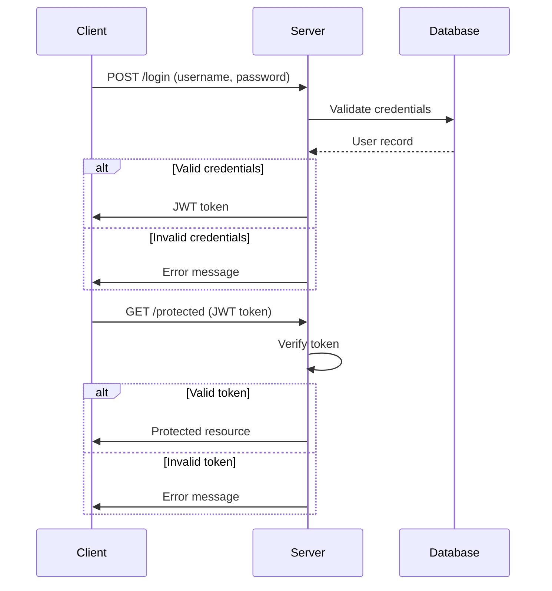

## 23.3. Authentication and Authorization with Guardian

In the world of web applications, ensuring secure access to resources is paramount. Elixir, with its robust ecosystem, provides powerful tools to manage authentication and authorization. One such tool is Guardian, a widely-used library for implementing JWT-based authentication. In this section, we'll explore how to effectively use Guardian to manage user authentication, define permissions, and securely handle user sessions.

### User Authentication

#### Setting up JWT-based Authentication with Guardian

JWT (JSON Web Tokens) is a compact, URL-safe means of representing claims to be transferred between two parties. Guardian leverages JWTs to authenticate users in an Elixir application. Let's walk through the process of setting up JWT-based authentication with Guardian.

##### Installation and Configuration

To get started with Guardian, you'll need to add it to your `mix.exs` file:

```elixir
defp deps do
  [
    {:guardian, "~> 2.0"}
  ]
end
```

Run `mix deps.get` to fetch the dependency.

Next, configure Guardian in your application. Create a module, typically named `MyApp.Guardian`, and implement the `Guardian` behavior:

```elixir
defmodule MyApp.Guardian do
  use Guardian, otp_app: :my_app

  def subject_for_token(user, _claims) do
    {:ok, to_string(user.id)}
  end

  def resource_from_claims(claims) do
    id = claims["sub"]
    case MyApp.Repo.get(MyApp.User, id) do
      nil -> {:error, :resource_not_found}
      user -> {:ok, user}
    end
  end
end
```

In your `config/config.exs`, add the Guardian configuration:

```elixir
config :my_app, MyApp.Guardian,
  issuer: "my_app",
  secret_key: "your_secret_key"
```

##### Generating and Validating Tokens

Guardian makes it easy to generate and validate JWTs. To generate a token for a user, use:

```elixir
{:ok, token, _claims} = MyApp.Guardian.encode_and_sign(user)
```

To decode and verify a token:

```elixir
case MyApp.Guardian.decode_and_verify(token) do
  {:ok, claims} -> # Token is valid
  {:error, reason} -> # Handle error
end
```

##### Protecting Routes

To protect routes in a Phoenix application, you can use Guardian's `Guardian.Plug` module. Add the following to your router:

```elixir
pipeline :authenticated do
  plug Guardian.Plug.Pipeline, module: MyApp.Guardian,
                               error_handler: MyApp.AuthErrorHandler
end

scope "/", MyAppWeb do
  pipe_through [:browser, :authenticated]

  get "/protected", ProtectedController, :index
end
```

Create an error handler to manage unauthorized access:

```elixir
defmodule MyApp.AuthErrorHandler do
  import Plug.Conn

  def auth_error(conn, {type, _reason}, _opts) do
    body = Jason.encode!(%{error: to_string(type)})
    send_resp(conn, 401, body)
  end
end
```

### Authorization

#### Defining Permissions and Access Controls

Once users are authenticated, you need to define what they can and cannot do within your application. This is where authorization comes into play. Guardian does not provide authorization out of the box, but you can implement it using roles and permissions.

##### Role-Based Access Control (RBAC)

In RBAC, permissions are associated with roles, and users are assigned roles. Here's a simple example of how you might implement RBAC:

1. Define roles and permissions in your database.
2. Assign roles to users.
3. Check permissions in your controllers or contexts.

```elixir
defmodule MyAppWeb.ProtectedController do
  use MyAppWeb, :controller

  alias MyApp.Accounts

  def index(conn, _params) do
    user = Guardian.Plug.current_resource(conn)

    if Accounts.has_permission?(user, :view_protected) do
      render(conn, "index.html")
    else
      conn
      |> put_status(:forbidden)
      |> render(MyAppWeb.ErrorView, "403.html")
    end
  end
end
```

In this example, `Accounts.has_permission?/2` would be a function that checks if the user has the necessary permission to view the protected resource.

##### Policy-Based Access Control

For more complex authorization logic, consider using policy-based access control. Define policies that encapsulate the rules for accessing resources.

```elixir
defmodule MyApp.Policy do
  def can?(%User{role: "admin"}, _action, _resource), do: true
  def can?(_user, :view, %Resource{public: true}), do: true
  def can?(_user, _action, _resource), do: false
end
```

Use this policy in your controllers:

```elixir
if MyApp.Policy.can?(user, :view, resource) do
  # Allow access
else
  # Deny access
end
```

### Session Management

#### Securely Managing User Sessions

JWTs are stateless, meaning the server does not store session information. This can simplify session management but also requires careful handling to ensure security.

##### Token Expiration and Refresh

Set token expiration to limit the lifespan of a JWT. Use Guardian's `ttl` option to configure this:

```elixir
config :my_app, MyApp.Guardian,
  ttl: {1, :hour}
```

For longer sessions, implement token refresh. When a token expires, the client can request a new token using a refresh token.

##### Revoking Tokens

To revoke a token, you can maintain a blacklist of invalidated tokens. This is useful if you need to immediately invalidate a token, such as when a user logs out.

```elixir
defmodule MyApp.TokenBlacklist do
  use GenServer

  def start_link(_) do
    GenServer.start_link(__MODULE__, %{}, name: __MODULE__)
  end

  def add(token) do
    GenServer.call(__MODULE__, {:add, token})
  end

  def handle_call({:add, token}, _from, state) do
    {:reply, :ok, Map.put(state, token, true)}
  end

  def is_blacklisted?(token) do
    GenServer.call(__MODULE__, {:is_blacklisted?, token})
  end

  def handle_call({:is_blacklisted?, token}, _from, state) do
    {:reply, Map.has_key?(state, token), state}
  end
end
```

### Best Practices

#### Storing Passwords Securely with Hashing Algorithms

Storing passwords securely is crucial for any application. Use hashing algorithms like bcrypt to hash passwords before storing them in your database.

##### Using Comeonin and Bcrypt

Add `bcrypt_elixir` to your dependencies:

```elixir
defp deps do
  [
    {:bcrypt_elixir, "~> 2.0"}
  ]
end
```

Hash passwords before saving:

```elixir
def create_user(attrs) do
  %User{}
  |> User.changeset(attrs)
  |> put_password_hash()
  |> Repo.insert()
end

defp put_password_hash(changeset) do
  if password = get_change(changeset, :password) do
    put_change(changeset, :password_hash, Bcrypt.hash_pwd_salt(password))
  else
    changeset
  end
end
```

When verifying a password, use:

```elixir
def verify_password(user, password) do
  Bcrypt.verify_pass(password, user.password_hash)
end
```

### Visualizing Authentication Flow

To better understand the authentication flow with Guardian, let's visualize the process using a sequence diagram.


```mermaid
sequenceDiagram
    participant Client
    participant Server
    participant Database

    Client->>Server: POST /login (username, password)
    Server->>Database: Validate credentials
    Database-->>Server: User record
    alt Valid credentials
        Server->>Client: JWT token
    else Invalid credentials
        Server->>Client: Error message
    end
    Client->>Server: GET /protected (JWT token)
    Server->>Server: Verify token
    alt Valid token
        Server->>Client: Protected resource
    else Invalid token
        Server->>Client: Error message
    end
```

This diagram illustrates the interaction between the client, server, and database during the authentication process.

### References and Links

- [Guardian Documentation](https://hexdocs.pm/guardian/readme.html)
- [JWT Introduction](https://jwt.io/introduction/)
- [Comeonin and Bcrypt](https://github.com/riverrun/bcrypt_elixir)

### Knowledge Check

- How does Guardian use JWTs for authentication?
- What is the difference between authentication and authorization?
- How can you implement role-based access control in Elixir?
- Why is it important to hash passwords before storing them?

### Embrace the Journey

Remember, mastering authentication and authorization is a journey. As you implement these patterns in your applications, you'll gain a deeper understanding of security principles. Keep experimenting, stay curious, and enjoy the journey!

### Quiz Time!



### What is the primary purpose of Guardian in Elixir applications?

- [x] To manage JWT-based authentication
- [ ] To handle database migrations
- [ ] To provide real-time communication
- [ ] To render templates

> **Explanation:** Guardian is primarily used for managing JWT-based authentication in Elixir applications.

### Which of the following is a benefit of using JWTs?

- [x] Stateless authentication
- [ ] Requires server-side session storage
- [ ] Increases server load
- [ ] Reduces security

> **Explanation:** JWTs provide stateless authentication, meaning the server does not need to store session information.

### What does RBAC stand for?

- [x] Role-Based Access Control
- [ ] Resource-Based Access Control
- [ ] Role-Based Authentication Control
- [ ] Resource-Based Authentication Control

> **Explanation:** RBAC stands for Role-Based Access Control, a method of restricting access based on roles.

### How can you revoke a JWT token in an Elixir application?

- [x] By maintaining a blacklist of invalidated tokens
- [ ] By deleting the token from the database
- [ ] By encoding the token with a different algorithm
- [ ] By changing the user's password

> **Explanation:** To revoke a JWT, you can maintain a blacklist of invalidated tokens to prevent their use.

### Which hashing algorithm is recommended for storing passwords securely?

- [x] bcrypt
- [ ] SHA-256
- [ ] MD5
- [ ] AES

> **Explanation:** bcrypt is recommended for securely hashing passwords due to its resistance to brute-force attacks.

### What is the role of the `subject_for_token` function in Guardian?

- [x] To define the subject claim for the JWT
- [ ] To decode the JWT
- [ ] To verify the JWT signature
- [ ] To encrypt the JWT

> **Explanation:** The `subject_for_token` function defines the subject claim for the JWT, typically the user's ID.

### How can you protect routes in a Phoenix application using Guardian?

- [x] By using `Guardian.Plug` in the router pipeline
- [ ] By adding JWTs to the database
- [ ] By encrypting all HTTP requests
- [ ] By using Phoenix channels

> **Explanation:** Guardian.Plug is used in the router pipeline to protect routes in a Phoenix application.

### What is a common use case for policy-based access control?

- [x] Implementing complex authorization logic
- [ ] Managing database migrations
- [ ] Rendering HTML templates
- [ ] Handling WebSocket connections

> **Explanation:** Policy-based access control is used for implementing complex authorization logic.

### Which library can be used for hashing passwords in Elixir?

- [x] bcrypt_elixir
- [ ] phoenix_html
- [ ] ecto_sql
- [ ] plug_cowboy

> **Explanation:** bcrypt_elixir is a library used for hashing passwords securely in Elixir.

### True or False: JWTs are always stored on the server.

- [ ] True
- [x] False

> **Explanation:** JWTs are not stored on the server; they are stateless and stored on the client-side.


