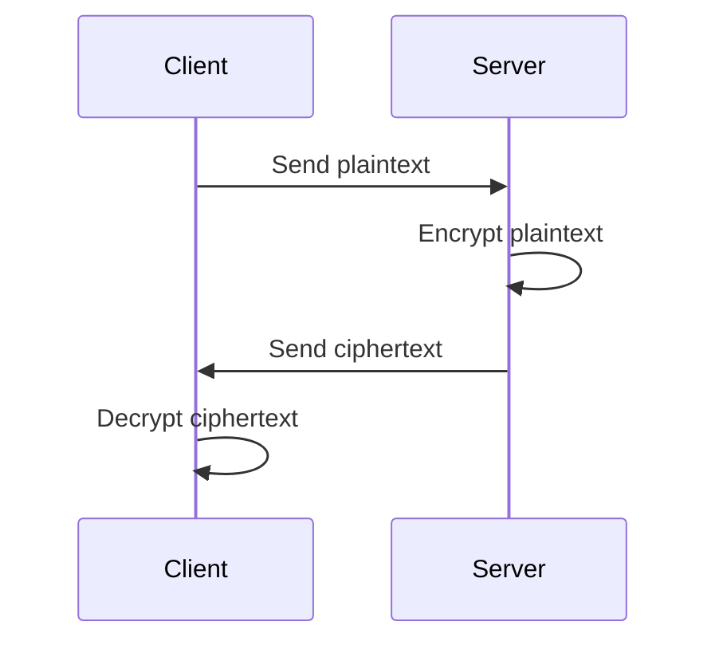

## 23.4. Data Encryption and Cryptography

In today's digital age, data encryption and cryptography are essential for securing sensitive information. As expert software engineers and architects, understanding how to implement these techniques in Elixir is crucial for building secure applications. This section will guide you through encrypting sensitive data, hashing and salting passwords, and ensuring secure communication using Elixir's powerful libraries.

### Encrypting Sensitive Data

Encryption is the process of converting plain text into a coded format, making it unreadable to unauthorized users. In Elixir, we can leverage the `:crypto` module and libraries like `Comeonin` to encrypt sensitive data effectively.

#### Using the `:crypto` Module

The `:crypto` module in Elixir provides a set of cryptographic functions that are part of the Erlang OpenSSL library. It allows us to perform encryption and decryption using various algorithms.

**Example: AES Encryption**

```elixir
defmodule Encryption do
  @moduledoc """
  A module for encrypting and decrypting data using AES.
  """

  @aes_key :crypto.strong_rand_bytes(32) # Generate a random 256-bit key
  @aes_iv :crypto.strong_rand_bytes(16)  # Generate a random 128-bit IV

  @doc """
  Encrypts the given plaintext using AES.
  """
  def encrypt(plaintext) do
    :crypto.block_encrypt(:aes_cbc256, @aes_key, @aes_iv, plaintext)
  end

  @doc """
  Decrypts the given ciphertext using AES.
  """
  def decrypt(ciphertext) do
    :crypto.block_decrypt(:aes_cbc256, @aes_key, @aes_iv, ciphertext)
  end
end
```

In this example, we use AES (Advanced Encryption Standard) with a 256-bit key and a 128-bit initialization vector (IV) for encryption. The `:crypto.block_encrypt/4` and `:crypto.block_decrypt/4` functions perform the encryption and decryption, respectively.

**Try It Yourself**

- Modify the key and IV lengths to experiment with different AES configurations.
- Test the encryption and decryption functions with various plaintext inputs.

#### Using the `Comeonin` Library

`Comeonin` is a popular Elixir library for password hashing and encryption. It provides a simple interface for securely handling passwords.

**Example: Password Hashing with `Comeonin.Bcrypt`**

```elixir
defmodule Password do
  @moduledoc """
  A module for hashing and verifying passwords using Bcrypt.
  """

  alias Comeonin.Bcrypt

  @doc """
  Hashes the given password.
  """
  def hash_password(password) do
    Bcrypt.hash_pwd_salt(password)
  end

  @doc """
  Verifies the given password against the stored hash.
  """
  def verify_password(password, stored_hash) do
    Bcrypt.check_pass(password, stored_hash)
  end
end
```

In this example, we use `Comeonin.Bcrypt` to hash passwords securely. The `hash_pwd_salt/1` function hashes the password with a salt, and `check_pass/2` verifies the password against the stored hash.

**Try It Yourself**

- Experiment with different passwords and observe the generated hashes.
- Test the verification function with correct and incorrect passwords.

### Hashing and Salting

Hashing is the process of converting data into a fixed-size string of characters, which is typically a hash code. Salting involves adding random data to the input of a hash function to ensure unique outputs.

#### Protecting Passwords and Personal Data

Hashing and salting are crucial for protecting passwords and personal data. By storing only the hashed and salted versions of passwords, we can prevent unauthorized access even if the database is compromised.

**Example: Hashing and Salting with `Comeonin.Argon2`**

```elixir
defmodule SecurePassword do
  @moduledoc """
  A module for hashing and verifying passwords using Argon2.
  """

  alias Comeonin.Argon2

  @doc """
  Hashes the given password with a salt.
  """
  def hash_password(password) do
    Argon2.hash_pwd_salt(password)
  end

  @doc """
  Verifies the given password against the stored hash.
  """
  def verify_password(password, stored_hash) do
    Argon2.check_pass(password, stored_hash)
  end
end
```

In this example, we use `Comeonin.Argon2` for hashing and salting passwords. Argon2 is a modern and secure hashing algorithm designed to resist brute-force attacks.

**Try It Yourself**

- Compare the performance and security of Argon2 with Bcrypt.
- Experiment with different hashing parameters to balance security and performance.

### Transport Layer Security

Transport Layer Security (TLS) is a protocol that ensures secure communication over networks. It encrypts data transmitted between clients and servers, protecting it from eavesdropping and tampering.

#### Ensuring Secure Communication

In Elixir, we can use the `:ssl` module to establish secure connections using TLS. This is particularly important for web applications and APIs that handle sensitive data.

**Example: Establishing a Secure Connection**

```elixir
defmodule SecureConnection do
  @moduledoc """
  A module for establishing secure connections using TLS.
  """

  @doc """
  Connects to a server securely using TLS.
  """
  def connect(host, port) do
    :ssl.start()
    {:ok, socket} = :ssl.connect(host, port, [])
    socket
  end
end
```

In this example, we use the `:ssl.connect/3` function to establish a secure connection to a server. The `:ssl.start/0` function initializes the SSL application.

**Try It Yourself**

- Test the secure connection function with different hosts and ports.
- Implement error handling for connection failures.

### Visualizing Cryptographic Processes

To better understand the cryptographic processes, let's visualize the flow of data encryption and decryption using a sequence diagram.



**Description:** This diagram illustrates the process of encrypting plaintext on the server side and decrypting it on the client side. The client sends plaintext to the server, which encrypts it and returns the ciphertext. The client then decrypts the ciphertext to retrieve the original plaintext.

### Key Takeaways

- **Encryption** is essential for protecting sensitive data from unauthorized access.
- **Hashing and salting** are crucial for securely storing passwords and personal data.
- **Transport Layer Security (TLS)** ensures secure communication over networks.
- Elixir provides powerful libraries like `:crypto` and `Comeonin` for implementing cryptographic techniques.

### References and Links

- [Elixir `:crypto` Module Documentation](https://hexdocs.pm/elixir/crypto.html)
- [Comeonin Library on HexDocs](https://hexdocs.pm/comeonin/readme.html)
- [Transport Layer Security (TLS) Overview](https://en.wikipedia.org/wiki/Transport_Layer_Security)

### Knowledge Check

- What is the purpose of encryption in data security?
- How does hashing differ from encryption?
- Why is salting important when hashing passwords?
- What role does TLS play in secure communication?

### Embrace the Journey

Remember, mastering data encryption and cryptography is a continuous journey. As you progress, you'll build more secure and robust applications. Keep experimenting, stay curious, and enjoy the journey!

## Quiz: Data Encryption and Cryptography



### What is the primary purpose of data encryption?

- [x] To convert plain text into a coded format
- [ ] To store data in a database
- [ ] To compress data for storage
- [ ] To format data for display

> **Explanation:** Data encryption converts plain text into a coded format to protect it from unauthorized access.

### Which Elixir module provides cryptographic functions?

- [x] `:crypto`
- [ ] `:ssl`
- [ ] `Comeonin`
- [ ] `Plug`

> **Explanation:** The `:crypto` module provides cryptographic functions in Elixir.

### What is the role of salting in hashing?

- [x] To add random data to the input of a hash function
- [ ] To compress the hash output
- [ ] To encrypt the hash
- [ ] To format the hash for storage

> **Explanation:** Salting adds random data to the input of a hash function to ensure unique outputs.

### Which library is commonly used for password hashing in Elixir?

- [x] `Comeonin`
- [ ] `Plug`
- [ ] `Phoenix`
- [ ] `Ecto`

> **Explanation:** `Comeonin` is a popular library for password hashing in Elixir.

### What does TLS stand for?

- [x] Transport Layer Security
- [ ] Transmission Line Security
- [ ] Text Layer Security
- [ ] Transfer Link Security

> **Explanation:** TLS stands for Transport Layer Security, a protocol for secure communication over networks.

### How does TLS ensure secure communication?

- [x] By encrypting data transmitted between clients and servers
- [ ] By compressing data for faster transmission
- [ ] By formatting data for display
- [ ] By storing data in a database

> **Explanation:** TLS encrypts data transmitted between clients and servers to ensure secure communication.

### What is the function of the `:ssl` module in Elixir?

- [x] To establish secure connections using TLS
- [ ] To hash passwords
- [ ] To store data in a database
- [ ] To format data for display

> **Explanation:** The `:ssl` module is used to establish secure connections using TLS in Elixir.

### Which algorithm is used in the example for encrypting data?

- [x] AES
- [ ] RSA
- [ ] SHA-256
- [ ] MD5

> **Explanation:** The example uses AES (Advanced Encryption Standard) for encrypting data.

### What is the purpose of the `Comeonin.Bcrypt` library?

- [x] To hash and verify passwords
- [ ] To encrypt data
- [ ] To establish secure connections
- [ ] To format data for display

> **Explanation:** `Comeonin.Bcrypt` is used to hash and verify passwords securely.

### True or False: Hashing is reversible.

- [ ] True
- [x] False

> **Explanation:** Hashing is a one-way process and is not reversible.


