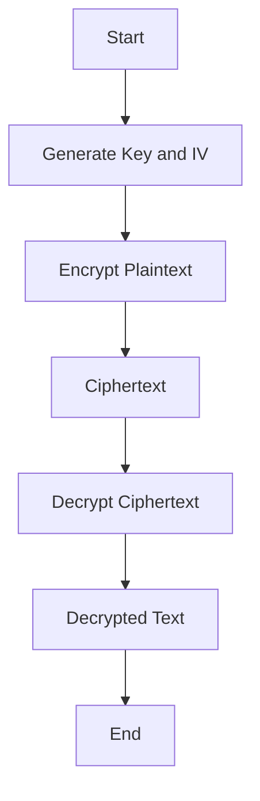

## 23.4. Data Encryption and Cryptography

In today's digital age, data encryption and cryptography are essential components of software development, especially when dealing with sensitive information. As expert software engineers and architects, understanding how to implement these concepts in Elixir is crucial for building secure and robust applications. In this section, we will explore various techniques and libraries available in Elixir to encrypt sensitive data, hash and salt passwords, and ensure secure communication over networks.

### Encrypting Sensitive Data

#### Introduction to Encryption

Encryption is the process of converting plaintext data into ciphertext, which is unreadable without the appropriate decryption key. This ensures that even if data is intercepted, it cannot be understood by unauthorized parties. In Elixir, we can leverage the `:crypto` module and libraries like `Comeonin` to perform encryption.

#### Using the `:crypto` Module

The `:crypto` module is part of Erlang's standard library and provides a wide range of cryptographic functions. Let's explore how to use it to encrypt and decrypt data.

```elixir
# Import the :crypto module
import :crypto

# Define a secret key and initialization vector (IV)
key = :crypto.strong_rand_bytes(32)
iv = :crypto.strong_rand_bytes(16)

# Define a plaintext message
plaintext = "Sensitive data that needs encryption"

# Encrypt the plaintext using AES-256-CBC
ciphertext = :crypto.crypto_one_time(:aes_256_cbc, key, iv, plaintext, true)

# Decrypt the ciphertext
decrypted_text = :crypto.crypto_one_time(:aes_256_cbc, key, iv, ciphertext, false)

# Verify that the decrypted text matches the original plaintext
IO.puts(decrypted_text == plaintext) # Output: true
```

In this example, we use the AES-256-CBC algorithm to encrypt and decrypt data. The `:crypto.crypto_one_time/5` function is used for both encryption and decryption, with the last argument indicating whether to encrypt (`true`) or decrypt (`false`).

#### Key Management

Proper key management is critical for maintaining the security of encrypted data. Keys should be stored securely, and access should be restricted to authorized personnel only. Consider using environment variables or secure vaults to manage encryption keys.

### Hashing and Salting

#### Protecting Passwords with Hashing

Hashing is a one-way cryptographic function that converts data into a fixed-length hash value. Unlike encryption, hashing is irreversible, making it ideal for storing passwords securely. In Elixir, we can use the `Comeonin` library to hash passwords.

```elixir
# Add comeonin to your mix.exs dependencies
defp deps do
  [
    {:comeonin, "~> 5.3"}
  ]
end

# Use the Argon2 hashing algorithm
{:ok, hash} = Comeonin.Argon2.add_hash("my_secure_password")

# Verify the password
is_valid = Comeonin.Argon2.check_pass("my_secure_password", hash)

IO.puts(is_valid) # Output: true
```

In this example, we use the Argon2 algorithm, which is recommended for its resistance to brute-force attacks. The `add_hash/1` function generates a hash, and `check_pass/2` verifies the password against the stored hash.

#### Salting for Enhanced Security

Salting involves adding a unique random value to each password before hashing. This ensures that even if two users have the same password, their hashes will be different. The `Comeonin` library automatically handles salting when hashing passwords.

### Transport Layer Security

#### Ensuring Secure Communication

Transport Layer Security (TLS) is a cryptographic protocol that ensures secure communication over networks. It is commonly used to secure HTTP traffic (HTTPS) and other protocols. In Elixir, we can use the `Mint` library to establish secure connections.

```elixir
# Add mint to your mix.exs dependencies
defp deps do
  [
    {:mint, "~> 1.0"}
  ]
end

# Establish a secure connection using Mint
{:ok, conn} = Mint.HTTP.connect(:https, "example.com", 443)

# Send a request over the secure connection
{:ok, conn, request_ref} = Mint.HTTP.request(conn, "GET", "/", [], "")

# Receive the response
receive do
  message ->
    {:ok, conn, responses} = Mint.HTTP.stream(conn, message)
    IO.inspect(responses)
end
```

In this example, we use the `Mint` library to establish a secure HTTPS connection to `example.com`. The connection is encrypted using TLS, ensuring that data transmitted over the network is secure.

### Visualizing Cryptographic Processes

To better understand the flow of cryptographic processes, let's visualize the encryption and decryption process using a flowchart.


```mermaid
flowchart TD
    A[Start] --> B[Generate Key and IV]
    B --> C[Encrypt Plaintext]
    C --> D[Ciphertext]
    D --> E[Decrypt Ciphertext]
    E --> F[Decrypted Text]
    F --> G[End]
```

**Caption:** This flowchart illustrates the process of encrypting and decrypting data using a symmetric key algorithm. The process begins with generating a key and initialization vector (IV), followed by encryption and decryption.

### Key Takeaways

- **Encryption** is essential for protecting sensitive data, and Elixir provides the `:crypto` module for this purpose.
- **Hashing** is a one-way function used to securely store passwords, and the `Comeonin` library offers robust hashing algorithms like Argon2.
- **TLS** ensures secure communication over networks, and the `Mint` library can be used to establish secure connections in Elixir.
- Proper **key management** and **salting** are critical for maintaining the security of encrypted and hashed data.

### Try It Yourself

Experiment with the provided code examples by modifying the encryption algorithm or hashing algorithm. Try using different key sizes or hash functions to see how they affect the security and performance of your application.

### References and Links

- [Erlang `:crypto` Module Documentation](https://erlang.org/doc/man/crypto.html)
- [Comeonin and Argon2 Documentation](https://hexdocs.pm/comeonin/readme.html)
- [Mint HTTP Client Documentation](https://hexdocs.pm/mint/readme.html)

### Knowledge Check

- Explain the difference between encryption and hashing.
- Describe how salting enhances password security.
- Demonstrate how to establish a secure connection using TLS in Elixir.

### Embrace the Journey

Remember, mastering data encryption and cryptography is a journey. As you progress, you'll build more secure and robust applications. Keep experimenting, stay curious, and enjoy the journey!

## Quiz Time!



### What is the primary purpose of encryption?

- [x] To convert plaintext data into unreadable ciphertext
- [ ] To convert ciphertext into plaintext
- [ ] To hash passwords securely
- [ ] To manage cryptographic keys

> **Explanation:** Encryption is used to convert plaintext data into ciphertext, making it unreadable without the appropriate decryption key.

### Which Elixir module provides cryptographic functions?

- [x] `:crypto`
- [ ] `:ssl`
- [ ] `:elixir`
- [ ] `:comeonin`

> **Explanation:** The `:crypto` module in Erlang's standard library provides cryptographic functions.

### What is the purpose of salting passwords?

- [x] To add a unique random value to each password before hashing
- [ ] To encrypt passwords
- [ ] To convert passwords into plaintext
- [ ] To verify passwords against stored hashes

> **Explanation:** Salting adds a unique random value to each password before hashing, ensuring that even identical passwords have different hashes.

### Which library is recommended for hashing passwords in Elixir?

- [x] `Comeonin`
- [ ] `Mint`
- [ ] `Plug`
- [ ] `Phoenix`

> **Explanation:** The `Comeonin` library is recommended for hashing passwords securely in Elixir.

### How does TLS ensure secure communication?

- [x] By encrypting data transmitted over the network
- [ ] By hashing data before transmission
- [ ] By converting data into plaintext
- [ ] By managing cryptographic keys

> **Explanation:** TLS encrypts data transmitted over the network, ensuring secure communication.

### What is the role of the `Mint` library in Elixir?

- [x] To establish secure HTTPS connections
- [ ] To hash passwords
- [ ] To encrypt data
- [ ] To manage cryptographic keys

> **Explanation:** The `Mint` library is used to establish secure HTTPS connections in Elixir.

### What is the difference between encryption and hashing?

- [x] Encryption is reversible, while hashing is not
- [ ] Hashing is reversible, while encryption is not
- [ ] Both are reversible
- [ ] Neither is reversible

> **Explanation:** Encryption is reversible with the appropriate key, while hashing is a one-way function and cannot be reversed.

### Why is key management important in encryption?

- [x] To ensure that encryption keys are stored securely and accessed only by authorized personnel
- [ ] To verify passwords against stored hashes
- [ ] To convert plaintext into ciphertext
- [ ] To hash passwords securely

> **Explanation:** Proper key management ensures that encryption keys are stored securely and accessed only by authorized personnel.

### What does the `:crypto.crypto_one_time/5` function do?

- [x] Encrypts or decrypts data using a specified algorithm
- [ ] Hashes passwords securely
- [ ] Establishes secure HTTPS connections
- [ ] Manages cryptographic keys

> **Explanation:** The `:crypto.crypto_one_time/5` function encrypts or decrypts data using a specified algorithm.

### True or False: Salting ensures that identical passwords have different hashes.

- [x] True
- [ ] False

> **Explanation:** Salting adds a unique random value to each password before hashing, ensuring that identical passwords have different hashes.


