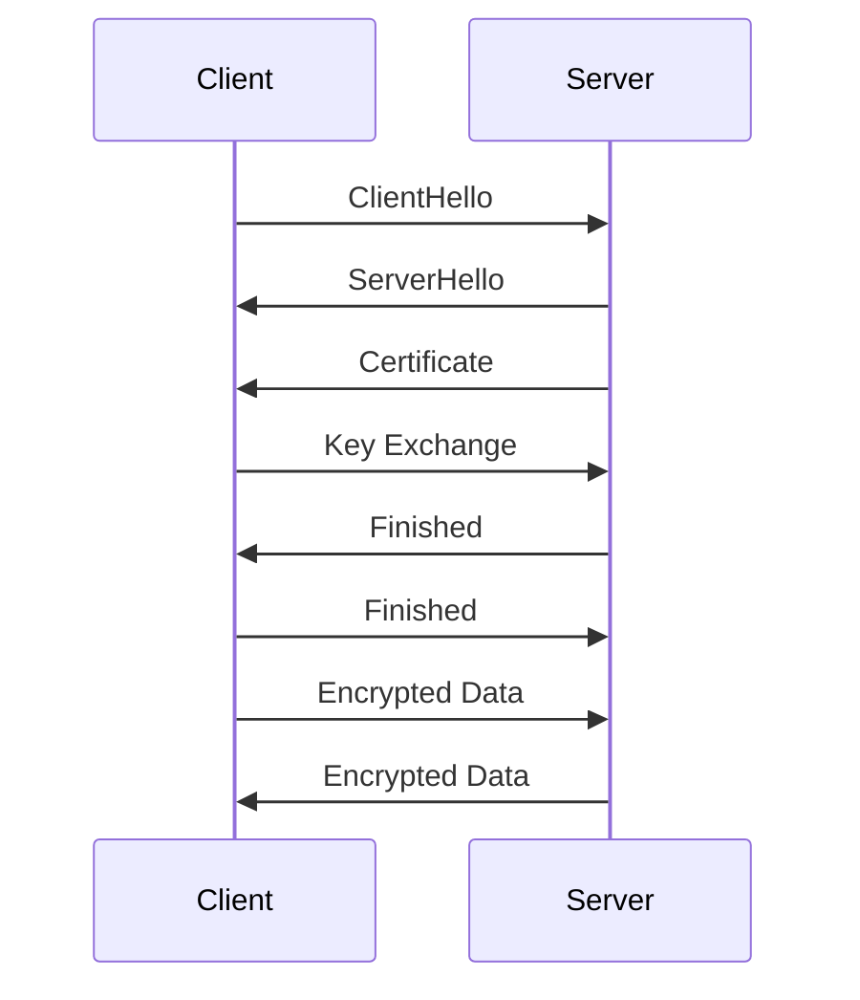

## 23.5. Secure Communication with SSL/TLS

In today's digital landscape, ensuring secure communication over the internet is paramount. SSL (Secure Sockets Layer) and its successor, TLS (Transport Layer Security), are protocols designed to provide secure communication over a computer network. In this section, we will delve into how to implement HTTPS in Elixir applications, configure SSL certificates in Phoenix, select strong cipher suites, and manage certificates using tools like Let's Encrypt.

### Understanding SSL/TLS

SSL/TLS protocols are essential for encrypting data transmitted over the internet, ensuring that sensitive information such as passwords, credit card numbers, and personal data remain confidential. They also provide authentication, ensuring that the server you are communicating with is indeed who it claims to be.

#### Key Concepts

- **Encryption**: Converts data into a secure format that can only be read by someone with the correct decryption key.
- **Authentication**: Verifies the identity of the parties involved in the communication.
- **Integrity**: Ensures that the data has not been altered during transmission.

### Implementing HTTPS in Elixir

To implement HTTPS in your Elixir application, you need to configure your Phoenix server to use SSL/TLS. This involves obtaining an SSL certificate, configuring your server to use it, and ensuring that your application is set up to handle secure connections.

#### Configuring SSL Certificates in Phoenix

Phoenix, a popular web framework for Elixir, provides built-in support for SSL/TLS. Here's how you can configure SSL certificates in a Phoenix application:

1. **Obtain an SSL Certificate**: You can purchase an SSL certificate from a trusted Certificate Authority (CA) or use a free service like Let's Encrypt.

2. **Configure Phoenix to Use SSL**: Update your Phoenix application's configuration to use the SSL certificate.

```elixir
# config/prod.exs

config :my_app, MyAppWeb.Endpoint,
  https: [
    port: 443,
    cipher_suite: :strong,
    keyfile: System.get_env("SSL_KEY_PATH"),
    certfile: System.get_env("SSL_CERT_PATH")
  ]
```

- **`port: 443`**: The standard port for HTTPS.
- **`cipher_suite: :strong`**: Ensures that only strong encryption algorithms are used.
- **`keyfile` and `certfile`**: Paths to your SSL certificate and private key files.

3. **Redirect HTTP to HTTPS**: Ensure that all HTTP traffic is redirected to HTTPS.

```elixir
# lib/my_app_web/router.ex

pipeline :browser do
  plug :accepts, ["html"]
  plug :fetch_session
  plug :fetch_flash
  plug :protect_from_forgery
  plug :put_secure_browser_headers
  plug :force_ssl
end
```

- **`plug :force_ssl`**: Redirects all HTTP requests to HTTPS.

### Cipher Suites

Cipher suites are a combination of encryption algorithms used to secure a network connection. Selecting strong cipher suites is crucial for maintaining the security of your application.

#### Selecting Strong Encryption Algorithms

When configuring SSL/TLS, it's important to choose cipher suites that provide strong encryption. Weak cipher suites can be vulnerable to attacks, compromising the security of your application.

- **AES (Advanced Encryption Standard)**: A widely used encryption standard that provides strong security.
- **ECDHE (Elliptic Curve Diffie-Hellman Ephemeral)**: Provides forward secrecy, ensuring that even if a session key is compromised, past communications remain secure.
- **SHA-256 (Secure Hash Algorithm 256-bit)**: A cryptographic hash function that provides data integrity.

In Phoenix, you can specify the cipher suites to use:

```elixir
# config/prod.exs

config :my_app, MyAppWeb.Endpoint,
  https: [
    port: 443,
    cipher_suite: :strong,
    keyfile: System.get_env("SSL_KEY_PATH"),
    certfile: System.get_env("SSL_CERT_PATH"),
    ciphers: [
      "ECDHE-ECDSA-AES256-GCM-SHA384",
      "ECDHE-RSA-AES256-GCM-SHA384",
      "ECDHE-ECDSA-CHACHA20-POLY1305",
      "ECDHE-RSA-CHACHA20-POLY1305"
    ]
  ]
```

### Certificate Management

Managing SSL certificates is an essential part of maintaining a secure application. Certificates need to be renewed periodically, and it's important to ensure that they are always up to date.

#### Using Let's Encrypt for SSL Certificates

Let's Encrypt is a free, automated, and open Certificate Authority that provides SSL certificates. It simplifies the process of obtaining and renewing certificates.

1. **Install Certbot**: Certbot is a tool that automates the process of obtaining and renewing Let's Encrypt certificates.

```bash
sudo apt-get update
sudo apt-get install certbot
```

2. **Obtain a Certificate**: Use Certbot to obtain a certificate for your domain.

```bash
sudo certbot certonly --standalone -d yourdomain.com
```

3. **Automate Renewal**: Set up a cron job to automatically renew your certificates.

```bash
0 0 * * * /usr/bin/certbot renew --quiet
```

### Visualizing SSL/TLS Communication

To better understand how SSL/TLS works, let's visualize the process of establishing a secure connection.



- **ClientHello**: The client sends a message to the server indicating the supported cipher suites and SSL/TLS version.
- **ServerHello**: The server responds with the chosen cipher suite and SSL/TLS version.
- **Certificate**: The server sends its SSL certificate to the client for authentication.
- **Key Exchange**: The client and server exchange keys to establish a secure session.
- **Finished**: Both parties confirm that the handshake is complete.
- **Encrypted Data**: Secure communication begins with encrypted data transmission.

### Knowledge Check

- **Question**: What is the purpose of SSL/TLS in network communication?
- **Question**: How do you configure SSL certificates in a Phoenix application?
- **Question**: Why is it important to select strong cipher suites?

### Try It Yourself

To deepen your understanding of SSL/TLS in Elixir, try modifying the code examples provided. Experiment with different cipher suites, or set up a Phoenix application with Let's Encrypt certificates. Remember, practice is key to mastering secure communication in Elixir.

### Summary

In this section, we've explored the importance of SSL/TLS in securing network communication, how to implement HTTPS in Elixir applications using Phoenix, the significance of selecting strong cipher suites, and managing SSL certificates with Let's Encrypt. By following these guidelines, you can ensure that your Elixir applications are secure and trustworthy.

### Further Reading

- [Mozilla's SSL Configuration Generator](https://ssl-config.mozilla.org/)
- [Let's Encrypt Documentation](https://letsencrypt.org/docs/)
- [Phoenix Framework Guides](https://hexdocs.pm/phoenix/overview.html)

## Quiz: Secure Communication with SSL/TLS



### What is the primary purpose of SSL/TLS?

- [x] To encrypt data transmitted over the internet
- [ ] To speed up data transmission
- [ ] To compress data
- [ ] To store data securely

> **Explanation:** SSL/TLS is used to encrypt data transmitted over the internet, ensuring confidentiality and integrity.

### Which port is typically used for HTTPS?

- [x] 443
- [ ] 80
- [ ] 8080
- [ ] 21

> **Explanation:** Port 443 is the standard port for HTTPS traffic.

### What is a cipher suite?

- [x] A combination of encryption algorithms used to secure a network connection
- [ ] A tool for managing SSL certificates
- [ ] A type of SSL certificate
- [ ] A method for compressing data

> **Explanation:** A cipher suite is a combination of encryption algorithms used to secure a network connection.

### What is the role of Let's Encrypt?

- [x] To provide free SSL certificates
- [ ] To compress data
- [ ] To speed up data transmission
- [ ] To store data securely

> **Explanation:** Let's Encrypt is a free, automated, and open Certificate Authority that provides SSL certificates.

### What does the `force_ssl` plug do in a Phoenix application?

- [x] Redirects all HTTP requests to HTTPS
- [ ] Compresses data
- [ ] Speeds up data transmission
- [ ] Stores data securely

> **Explanation:** The `force_ssl` plug redirects all HTTP requests to HTTPS, ensuring secure communication.

### Why is it important to select strong cipher suites?

- [x] To ensure strong encryption and prevent vulnerabilities
- [ ] To speed up data transmission
- [ ] To compress data
- [ ] To store data securely

> **Explanation:** Strong cipher suites ensure strong encryption and prevent vulnerabilities in the communication.

### How can you automate SSL certificate renewal with Let's Encrypt?

- [x] By setting up a cron job with Certbot
- [ ] By manually renewing every month
- [ ] By using a different Certificate Authority
- [ ] By compressing data

> **Explanation:** You can automate SSL certificate renewal with Let's Encrypt by setting up a cron job with Certbot.

### What is the purpose of the `ClientHello` message in SSL/TLS?

- [x] To indicate the supported cipher suites and SSL/TLS version
- [ ] To compress data
- [ ] To speed up data transmission
- [ ] To store data securely

> **Explanation:** The `ClientHello` message indicates the supported cipher suites and SSL/TLS version to the server.

### What does the `ServerHello` message contain?

- [x] The chosen cipher suite and SSL/TLS version
- [ ] The client's IP address
- [ ] The server's IP address
- [ ] The server's data

> **Explanation:** The `ServerHello` message contains the chosen cipher suite and SSL/TLS version.

### True or False: SSL/TLS provides both encryption and authentication.

- [x] True
- [ ] False

> **Explanation:** SSL/TLS provides both encryption and authentication, ensuring secure communication.



Remember, mastering secure communication with SSL/TLS is an ongoing journey. Keep exploring, experimenting, and enhancing your skills to build robust and secure Elixir applications.
