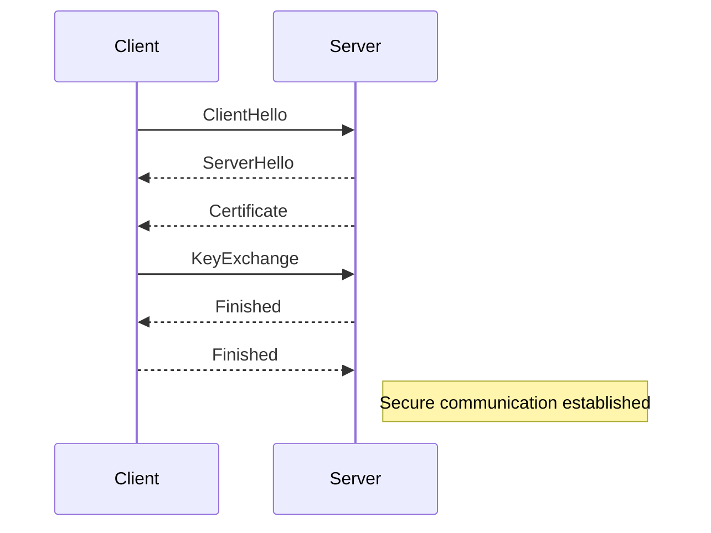

## 23.5. Secure Communication with SSL/TLS

In today's digital landscape, ensuring secure communication between clients and servers is paramount. SSL (Secure Sockets Layer) and its successor, TLS (Transport Layer Security), are cryptographic protocols designed to provide secure communication over a computer network. In this section, we will explore how to implement SSL/TLS in Elixir applications, focusing on configuring SSL certificates in the Phoenix framework, selecting strong cipher suites, and managing certificates with Let's Encrypt.

### Understanding SSL/TLS

SSL/TLS protocols are essential for encrypting data in transit, ensuring that information exchanged between the client and server remains confidential and tamper-proof. SSL/TLS provides:

- **Encryption**: Protects data from eavesdroppers.
- **Integrity**: Ensures data is not altered during transit.
- **Authentication**: Confirms the identity of the communicating parties.

#### Evolution from SSL to TLS

SSL has undergone several iterations, with TLS being the latest and most secure version. TLS 1.3, the most recent version, offers improved security and performance over its predecessors.

### Implementing HTTPS in Elixir

To implement HTTPS in Elixir applications, we typically use the Phoenix framework, which provides robust support for SSL/TLS. Let's walk through the steps to configure SSL certificates in a Phoenix application.

#### Configuring SSL Certificates in Phoenix

1. **Generate a Self-Signed Certificate**: For development purposes, you can generate a self-signed certificate using OpenSSL.

   ```bash
   openssl req -x509 -newkey rsa:4096 -keyout key.pem -out cert.pem -days 365 -nodes
   ```

   - `-x509`: Create a self-signed certificate.
   - `-newkey rsa:4096`: Generate a new RSA key.
   - `-keyout key.pem`: Output the private key to `key.pem`.
   - `-out cert.pem`: Output the certificate to `cert.pem`.
   - `-days 365`: Validity period of the certificate.
   - `-nodes`: Do not encrypt the private key.

2. **Configure Phoenix Endpoint**: Modify your Phoenix application's endpoint configuration to use the generated certificate.

   ```elixir
   config :my_app, MyAppWeb.Endpoint,
     https: [
       port: 443,
       cipher_suite: :strong,
       keyfile: "path/to/key.pem",
       certfile: "path/to/cert.pem"
     ]
   ```

   - `port: 443`: Standard port for HTTPS.
   - `cipher_suite: :strong`: Use a strong cipher suite for encryption.
   - `keyfile`: Path to the private key file.
   - `certfile`: Path to the certificate file.

3. **Test the Configuration**: Start your Phoenix server and test the HTTPS configuration by accessing `https://localhost`.

#### Using Let's Encrypt for SSL Certificates

For production environments, it is crucial to use a trusted Certificate Authority (CA) like Let's Encrypt, which provides free SSL certificates.

1. **Install Certbot**: Certbot is a tool for obtaining and renewing Let's Encrypt certificates.

   ```bash
   sudo apt-get install certbot
   ```

2. **Obtain a Certificate**: Use Certbot to obtain a certificate for your domain.

   ```bash
   sudo certbot certonly --standalone -d example.com
   ```

   - `certonly`: Obtain a certificate without installing it.
   - `--standalone`: Run a standalone web server for validation.
   - `-d example.com`: Domain for which to obtain the certificate.

3. **Automate Renewal**: Let's Encrypt certificates are valid for 90 days. Automate renewal using a cron job.

   ```bash
   0 0 * * * /usr/bin/certbot renew --quiet
   ```

4. **Update Phoenix Configuration**: Update your Phoenix configuration to use the Let's Encrypt certificate.

   ```elixir
   config :my_app, MyAppWeb.Endpoint,
     https: [
       port: 443,
       cipher_suite: :strong,
       keyfile: "/etc/letsencrypt/live/example.com/privkey.pem",
       certfile: "/etc/letsencrypt/live/example.com/fullchain.pem"
     ]
   ```

### Cipher Suites

Cipher suites determine the algorithms used for encryption, message authentication, and key exchange. Selecting strong cipher suites is crucial for maintaining secure communication.

#### Selecting Strong Cipher Suites

1. **Use Modern Protocols**: Prefer TLS 1.2 or TLS 1.3 for enhanced security.

2. **Configure Cipher Suites**: In Phoenix, you can specify the cipher suite using the `cipher_suite` option.

   ```elixir
   config :my_app, MyAppWeb.Endpoint,
     https: [
       cipher_suite: :strong
     ]
   ```

   The `:strong` option selects a predefined set of secure cipher suites.

3. **Disable Weak Ciphers**: Ensure that weak ciphers, such as those using RC4 or MD5, are disabled.

#### Example Cipher Suites

Here is an example of a strong cipher suite configuration:

```elixir
config :my_app, MyAppWeb.Endpoint,
  https: [
    port: 443,
    cipher_suite: :strong,
    keyfile: "path/to/key.pem",
    certfile: "path/to/cert.pem",
    otp_app: :my_app,
    ssl: [
      versions: [:'tlsv1.2', :'tlsv1.3'],
      ciphers: [
        'TLS_AES_256_GCM_SHA384',
        'TLS_CHACHA20_POLY1305_SHA256',
        'TLS_AES_128_GCM_SHA256'
      ]
    ]
  ]
```

### Certificate Management

Proper certificate management is essential for maintaining secure communication.

#### Using Let's Encrypt for Certificate Management

Let's Encrypt simplifies certificate management by providing free, automated, and open certificates.

1. **Automated Renewal**: As mentioned earlier, automate certificate renewal using Certbot and cron jobs.

2. **Monitor Expiry Dates**: Regularly monitor certificate expiry dates to prevent service disruptions.

3. **Backup Certificates**: Ensure that backups of certificates and private keys are securely stored.

### Visualizing SSL/TLS Communication

To better understand the SSL/TLS handshake process, let's visualize it using a sequence diagram.


```mermaid
sequenceDiagram
    participant Client
    participant Server
    Client->>Server: ClientHello
    Server-->>Client: ServerHello
    Server-->>Client: Certificate
    Client->>Server: KeyExchange
    Server-->>Client: Finished
    Client-->>Server: Finished
    Note right of Server: Secure communication established
```

**Diagram Explanation**: The SSL/TLS handshake involves several steps, including the exchange of "Hello" messages, certificate verification, and key exchange, leading to the establishment of a secure communication channel.

### Try It Yourself

Now that we've covered the basics of implementing SSL/TLS in Elixir, it's time to experiment with the code examples provided. Try generating your own self-signed certificate and configuring your Phoenix application to use HTTPS. Additionally, explore the use of Let's Encrypt for obtaining and managing SSL certificates.

### Knowledge Check

- **What are the primary benefits of using SSL/TLS?**
- **How can you generate a self-signed certificate for development purposes?**
- **What tool can you use to obtain free SSL certificates from Let's Encrypt?**
- **Why is it important to select strong cipher suites?**
- **What is the purpose of the SSL/TLS handshake process?**

### Summary

In this section, we explored the implementation of secure communication in Elixir applications using SSL/TLS. We covered the configuration of SSL certificates in Phoenix, the selection of strong cipher suites, and the management of certificates using Let's Encrypt. By following these best practices, you can ensure that your Elixir applications communicate securely over the internet.

Remember, mastering SSL/TLS is just one aspect of building secure applications. Continue to explore and experiment with different security patterns to enhance your skills and knowledge.

## Quiz Time!



### What is the primary purpose of SSL/TLS?

- [x] To encrypt data in transit
- [ ] To store data securely
- [ ] To compress data
- [ ] To authenticate users

> **Explanation:** SSL/TLS encrypts data in transit, ensuring secure communication between clients and servers.

### Which tool can be used to obtain free SSL certificates?

- [x] Certbot
- [ ] OpenSSL
- [ ] SSH
- [ ] GPG

> **Explanation:** Certbot is a tool used to obtain free SSL certificates from Let's Encrypt.

### What is the default port for HTTPS?

- [x] 443
- [ ] 80
- [ ] 22
- [ ] 8080

> **Explanation:** Port 443 is the default port for HTTPS communication.

### Which of the following is a strong cipher suite?

- [x] TLS_AES_256_GCM_SHA384
- [ ] RC4_MD5
- [ ] DES_CBC_SHA
- [ ] NULL_SHA

> **Explanation:** TLS_AES_256_GCM_SHA384 is a strong cipher suite, while the others are considered weak or insecure.

### What is the purpose of the SSL/TLS handshake?

- [x] To establish a secure communication channel
- [ ] To compress data
- [ ] To authenticate users
- [ ] To store data securely

> **Explanation:** The SSL/TLS handshake establishes a secure communication channel between the client and server.

### How often should Let's Encrypt certificates be renewed?

- [x] Every 90 days
- [ ] Every 30 days
- [ ] Every year
- [ ] Every 6 months

> **Explanation:** Let's Encrypt certificates are valid for 90 days and should be renewed before expiration.

### Which Elixir framework is commonly used for web development?

- [x] Phoenix
- [ ] Ecto
- [ ] Plug
- [ ] Nerves

> **Explanation:** Phoenix is a popular Elixir framework used for web development.

### What is the role of a Certificate Authority (CA)?

- [x] To issue and verify SSL certificates
- [ ] To encrypt data
- [ ] To compress data
- [ ] To authenticate users

> **Explanation:** A Certificate Authority (CA) issues and verifies SSL certificates, ensuring the authenticity of the parties involved.

### Which version of TLS is the most recent and secure?

- [x] TLS 1.3
- [ ] TLS 1.2
- [ ] TLS 1.1
- [ ] SSL 3.0

> **Explanation:** TLS 1.3 is the most recent and secure version of the TLS protocol.

### True or False: Self-signed certificates are suitable for production environments.

- [ ] True
- [x] False

> **Explanation:** Self-signed certificates are not suitable for production environments as they are not trusted by clients.


